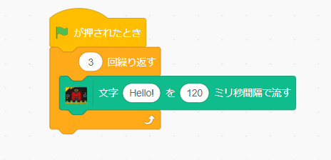
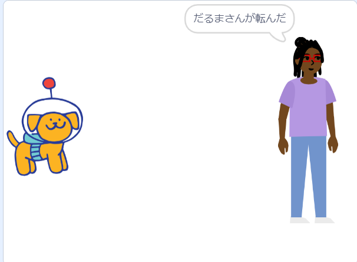

# 1 スモウルビー
## 目次

- [始めに](#始めに)
  - [スモウルビー(Smalruby)とは？](#スモウルビーsmalrubyとは)
  - [音楽](#音楽)
  - [幾何学模様](#幾何学模様)
  - [マイクロビット](#マイクロビット)

<br>

### 始めに
この項目は主に初めてプログラミングを学ぶ人を対象にプログラム作成を体験してもらう項目です。  
いきなり実際のプログラミング言語を触れる前に基本的な仕組みを理解し、操作に慣れてもらうことを目指しています。  
今回は後に学ぶ<strong>Ruby（ルビー）</strong>の文法をできるだけそのままに、初心者でも学びやすいよう工夫されている<strong>スモウルビー</strong>を使って作成していきます。

<br>

### スモウルビー(Smalruby)とは？
始める前にスモウルビーについて簡単に説明します。
スモウルビーは、プログラマーの高尾宏治氏がご子息に幼いころからプログラミングの学習環境を提供したいという思いから<strong>Scratch（スクラッチ）</strong>という初心者や子ども向けのプログラミング言語を基に開発されたものです。  
あらかじめ準備されているブロックを組み合わせることで、プログラムを作成することができます。  

#### スモウルビーの特徴
 
 - **プログラミング初心者でもすぐに作れる**  
   ブロックを繋ぐだけでプログラムを作ることができるため、ゲーム感覚でプログラムの基礎を学ぶことができます。  
 
    <br>

 - **作った動きをすぐに試せる**  
   繋いだブロックをすぐに動かして、結果を確認できます。

<br>

#### 用語の説明
各項目の説明に入る前にスプライトや抜粋したブロックの説明をします。  

 - **スプライト**
   スモウルビーでは動物や人等の物体をスプライトといいます。  
   初期状態では猫が選ばれていますが、右下の`犬アイコン`をクリックすれば別のスプライトを選択できます。  
　   
   
     

  <br>

 - **ブロック**
   - 10歩動かす
     スプライトを動かすことができます。  
     10を他の数値に変えれば、変えた歩数動きます。  
       

       <br>

   - 🏴が押されたとき
     画面右側にあるボタンを押した際にです。  
     主にプログラムのスタートをになっているものです。  
       

       <br>

   - 10回繰り返す
     このブロックの中にある処理を繰り返します。  
     最初の状態だと10回で設定されています。  
     

       <br>  
    
 


次の項目から大きな分類に分けて作成できるプログラムを説明していきます。

<br>

---

### 音楽

この項目は音楽プログラムの作り方を説明してきます。  
最初に音楽を作れるように用意をします。  

  1. 左下のアイコンをクリックしてください。
  

  1. 左上の音楽ををクリックしてください。そうするとブロック選択欄に音楽が追加されます。

#### パターン1：3・3・7拍子を作ってみよう
今回は簡単に作れる3・3・7を作っていきましょう。  

  1. 「🏴が押されたとき」を置いてください。  
  1. 「10回繰り返す」を繋げて、10を2に変更してください。  
  1. 「2回繰り返す」の中に「(1)スネアドラムのドラムを0.25拍鳴らす」を3つ、「0.25拍休む」を順に繋いでください。
  1. 「10回繰り返す」を繋げて、10を7に変更してください。  
  1. 「0.25拍休む」を繋いでください。

ブロックは下の図のようになっていると思います。  
   

実際に動かしてみましょう。  
実際に3・3・7拍子を鳴らしてくれます。  

また作成した処理をRubyで記述する際は下のコードになります。
```rb
when_flag_clicked do # 緑旗を押したら do ~ end の中にある処理を行う
  2.times do  # 2回繰り返す
    play_drum(drum: 1, beats: 0.25) # リズム楽器番号1番のドラムを0.25拍鳴らす
    play_drum(drum: 1, beats: 0.25) # リズム楽器番号1番のドラムを0.25拍鳴らす
    play_drum(drum: 1, beats: 0.25) # リズム楽器番号1番のドラムを0.25拍鳴らす
    rest(0.25) # 0.25拍休む
  end
  7.times do # 7回繰り返す
    play_drum(drum: 1, beats: 0.25) # リズム楽器番号1番のドラムを0.25拍鳴らす
  end
  rest(0.25) # 0.25拍休む
end
```

なお、Rubyでの書き方では`drum`横の番号を変更することでリズム楽器を変更することができます。
| リズム楽器の番号 |  |  |  |
|:---|:---|:---|:---|
| 1 | スネアドラム | 10 | ウッドブロック |
| 2 | バスドラム | 11 | カウベル |
| 3 | サイドスティック | 12 | トライアングル |
| 4 | クラッシュシンバル | 13 | ボンゴ |
| 5 | オープンハイハット | 14 | コンガ |
| 6 | クローズハイハット | 15 | カバサ |
| 7 | タンバリン | 16 | ギロ |
| 8 | 手拍子 | 17 | ギブラスラップ |
| 9 | クラーベ | 18 | クイーカ |

<br>

#### パターン2：電子オルガン
今度はレベルを上げて、鍵盤を押したらその音が出るプログラムを作ってみましょう。  
ドレミファソラシドのスプライトを作り、該当のスプライトを押したらピアノで押した音が出るようにしていきます。  
また、押したことが分かるように色を変える処理も付け足します。  

作り方はほぼ一緒のため、最初の**ド**の処理を記載していきます。  
他の音については、**ド**と同じことを繰り返しながら作ってください。  
  
  1. 左上の**🖋コスチューム**を押して、猫を消してから次のような図形を作成します。  
      

  1. **コード**を押してから「このスプライトが押されたとき」、「楽器をピアノにする」、「コスチュームをコスチューム2にする」を順に繋いでください。

  1. 「60の音符を0.25拍鳴らす」を繋いでください。  
     このブロックは他の音の時には60の部分を該当の番号に変えましょう。  
     変え方は60をクリックすると鍵盤が表示されるため、該当の部分を選択してください。  

  1. 「コスチュームをコスチューム2にする」を繋いで、コスチューム2をコスチューム1に変更してください。

これで最初の**ド**は完了です。  
ブロックは下のようになります。  


また、Rubyで作成した場合は以下のようになります。  
```rb
when_clicked do # このスプライトがクリックされた時
  self.instrument = 1 # メロディー楽器を番号1にする
  switch_costume("コスチューム2")
  play_note(note: 60, beats: 0.25)
  switch_costume("コスチューム1")
end
```

実際にクリックしてもらうと音がでます。  
他の音も同様に行ってみましょう。  
最終的に下の図のようにできれば完了です。


また、Rubyでの書き方では`drum`横の番号を変更することでメロディー楽器を変更することができます。
| メロディー楽器の番号 |  |  |  |
|:---|:---|:---|:---|
| 1 | ピアノ | 12 | フルート |
| 2 | 電子ピアノ | 13 | 木管フルート |
| 3 | オルガン | 14 | バスーン |
| 4 | ギター | 15 | 合唱団 |
| 5 | エレキギター | 16 | ビブラフォン |
| 6 | ベース | 17 | ミュージックボックス |
| 7 | ピチカート | 18 | スチールドラム |
| 8 | チェロ | 19 | マリンバ |
| 9 | トロンボーン | 20 | シンセリード |
| 10 | クラリネット |21| シンセパッド |
| 11 | サクソフォン ||
<br>

---

### 幾何学模様

この項目は幾何学模様を作るプログラムの作り方を説明してきます。  
幾何学模様自体は簡単に作ることができます。  
最初に用意をします。

  1. 左下のアイコンをクリックしてください。
  

  1. ペンをクリックしてください。そうするとブロック選択欄にペンが追加されます。

これで線を引いた図形をつくることができるようになります。

#### 三角形の幾何学模様を作ってみよう
今回は三角形を重ねて作る幾何学模様を作っていきましょう。  
まずは三角形を1つ作るプログラムからです。  

  1. 好きなスプライトで「🏴が押されたとき」、「ペンを下す」を置いてください。  

  1. 今度は変数を作るをクリックして、新たに「辺の数」を作成してください。これにより作り出す図形の辺を好きに設定することができます。    

  1. 「変数を0にする」を繋いで、変数を辺の数に、0を3に変更してください。  

  1. 「10回繰り返す」を繋いで、10の部分に「辺の数」を入れてください。  

  1. 「辺の数回繰り返す」の中に「10歩動かす」、「15度回す」を順に入れてください。入れた後、10を150に、15を120に変更してください。

これで三角形を作れるようになりましたので、動かしてみましょう。1つの三角形ができたと思います。  
  
続いて先ほど作った動きに一部を追加して幾何学模様を作れるようにしていきます。  

  1. 「辺の数を3にする」までと「辺の数回繰り返す」からで切り離してください。  

  1. 新たに「10回繰り返す」を「辺の数を3にする」に繋いでから10を24に変更してください。  

  1. 「24回繰り返す」の中に先ほど切り離したブロック塊、「15度回す」を順に入れてください。    

これで幾何学模様を作ることができますので、試してみましょう。  
  
ちなみに「ペンの色を10ずつ変える」を使うことで線の色を変えたりもできます。

また作成した処理をRubyで記述する際は下のコードになります。  
```rb
when_flag_clicked do  # 緑旗を押したら do ~ end の中にある処理を行う
  pen_down            # ペンを下ろす
  $辺の数 = 3         # 辺の数を3と定義
  24.times do         # 24回繰り返す
    $辺の数.times do  # 辺の数だけ繰り返す
      move(150)       # 150歩歩く
      turn_right(120) # 120度右に回る
    end
    turn_right(15)　　# 15度右に回る
  end
end
```

<br>

---

### マイクロビット

この項目はマイクロビットを使って、外部のものに対して影響させるプログラムを作成していきます。

- **マイクロビット（micro:bit）とは**  
  イギリスのBBC（英国放送協会）が開発した教育用のマイコンボードで、初心者でも簡単にプログラミングや電子工作を学べるように設計されています。  
  小さなコンピュータのようなもので、LEDディスプレイ、ボタン、センサー（加速度センサー、温度センサーなど）を備えています。また、無線通信機能も搭載しており、他のマイクロビットと通信したり、外部デバイスと連携したりできます。


#### マイクロビットを使う準備

**ステップ1：Scratch micro:bit HEXファイルをダウンロード**  
マイクロビットを使えるように`Scratch micro:bit HEXファイル`をダウンロードします。    
新しいタブを開いて以下のURLでページを開いてください。  
https://scratch.mit.edu/microbit/  

開いたページの真ん中に画像の項目があると思いますのでその順番にそって行います。  


  1. micro:bitをPCと接続します。  
  1. `scratch micro:bit HEXファイルをダウンロードします。`をクリックして、ファイルをダウンロードします。  
  1. ダウンロードしたファイルをPCのmicro:bitへドラッグします。

以上でステップ1は完了です。

<br>

**ステップ2：Scratch Linkをダウンロード**  
続いて`Scratch Link`をインストールします。  
このプログラムはスモウルビーとマイクロビットを繋げる役割を持ちます。  
今回はmicrosoftアカウントが無い想定のインストールです。  
先ほど開いていたページの少し上に戻ると次のような画面になると思います。  


<br>

ここからインストールを行っていきます。

  1. `黒背景のMicrosoft`または`直接ダウンロード`をクリックします。  
      

  1. ダウンロードされたファイルをダブルクリックすると画像のような画面がでますので、赤枠部分のファイルをダブルクリックします。  
      

      <br>

  1. 次の画面が開かれるため、右下の「Next」をクリックしてください。  
      

  1. インストールが行われたら画面が変わるため、右下に出た「Finish」をクリックして閉じてください。

以上でステップ2は完了です。

<br>

**ステップ3：Bluetoothをオンにする。**
最後にBluetoothをオンにしてください。

これでPCの設定は完了です。

<br>

---

#### スモウルビーでマイクロビットを使う

ここからは実際にスモウルビーでプログラムを作っていきます。  

まず先ほどダウンロードした`Scratch Link`を実行させます。  
左下の検索欄で`Scratch Link`と入力すると、`Scratch Link`が表示されるため、クリックして起動してください。

続いて、以下のURLからスモウルビーのページに遷移しましょう。  
https://smalruby.jp/smalruby3-gui/

画面が表示されたらスモウルビーとマイクロビットを繋ぎましょう。

<br>

**スモウルビーとマイクロビットの繋げ方**

  1. 下の画面が表示されたら今度は左下の紫アイコンをクリックしましょう。
    

      <br>

  1. 画面表示が変わりますので、下側までスクロールして赤カッコで囲んである`MicroBit More (v2-0.2.5)`をクリックしてください。  
    

      <br>

  1. クリックして少し経つと下の画面になるので出てきたmicrobitを選択して（①）`ペア設定`をクリック（②）してください。  
    

      <br>

  1. 接続できたら下の画面が表示されますので`エディターへ行く`をクリックしてください。  
    
  
       <br>

  1. 左側を見ると先ほどまで存在しなかったmicrobit が新たに追加されています。これでマイクロビットを使うことができる状態になりました。  
    

---

#### パターン1：マイクロビットに模様を表示させる
それでは始めにマイクロビットに模様を表示させてみましょう。  
マイクロビットはLEDが 5×5 の合計25個ついていて、これを光らせることで文字や記号等を表示させることができます。  
  

このLEDを光らせて模様を出せるようにブロックを繋いでいきます。  


  1. ブロックを次のように組んでから、画面右側の緑旗をクリックしてください。  
    

  1. 最初にハートが10秒表示された後、四角が10秒表示されて最後にすべて消灯します。  
    イメージ　ハート  
        

      <br>

     イメージ　四角  
        

      <br>

   1. この処理をRubyで記述する際は下のコードになります。
    
        ```rb
        
        # .はLEDが光らない、1はLEDが光る

        when_flag_clicked do              # 旗が押されたらdo～end内の動きを行う
          microbit_more.display_pattern(  # ハートを表示させる
            ".1.1.",                      # 1列目
            "1.1.1",                      # 2列目
            "1...1",                      # 3列目
            ".1.1.",                      # 4列目
            "..1.."                       # 5列目
          )
          sleep(10)                       # 10秒間待つ
          microbit_more.display_pattern(  # 四角を表示させる
            ".1.1.",                      # 1列目
            "1.1.1",                      # 2列目
            "1...1",                      # 3列目
            ".1.1.",                      # 4列目
            "..1.."                       # 5列目
          )
          sleep(10)                       # 10秒間待つ
          microbit_moer.clear_display     # マイクロビットのLEDを消す
        end
        ```

       模様を表示させるためには、どのLEDを光らせるか設定する必要があります。  
       `microbit_more.display_patern`というあらかじめ設定されている動き（<strong>メソッド</strong>）の中に光らせない場合は`.`を、光らせる場合は`1`を設定することで出したい模様を表示することができます。  
       （メソッドの説明は後の章で詳しく行っていますので、今はそんな用語があると覚えておくだけで大丈夫です。）

---

#### パターン2：マイクロビットに文字を表示させる
続いてはマイクロビットに文字を表示させてみましょう。  
模様と同じように一文字ずつではありますが、マイクロビットに文字を出すことができます。  

  1. ブロックを次のように組んでみてから、画面右側の緑旗をクリックしてください。LEDが光って`HELLO`と1文字ずつ少し間隔を空けて3回流れてくると思います。  
    
  
      <br>

  1. この処理をRubyで記述する際は下のコードになります。
        ```rb

        when_flag_clicked do  # 旗が押されたらdo～end内の動きを行う
          3.times do  # do~end内の動きを3回行う
            # Helloを1文字ずつ間隔(120ミリ秒)を開けて表示する
            microbit_more.display_text_delay("Hello!", 120)
          end
        end
        ```
  
        模様よりもコードが短くなりました。  
        これは`display_text_delay`という部分が事前にプログラムとしてスモウルビーの中にあり、()内の左側に出したい文字を、右側に出したい速さを入力するだけで動かせるように設定されているからです。

---

#### パターン3：マイクロビットを振った時に文字を表示させる
今度は文字を表示させるのに現実での動きも取り入れてみます。  
先ほどは緑旗を押して`Hello`と表示させていましたが、ブロックを変えてマイクロビット自体を振った時に表示させる処理を行ってみましょう。  

  1. ブロックを次のように組んでみてから、マイクロビットを振ってみましょう。  
     マイクロビットを見てみると`HELLO`と3回でてくると思います。  
     

       <br>

  1. この処理をRubyで記述する際は下のコードになります。  
     
        ```rb

        microbit_more.when("shake") do  # マイクロビットを振ったらdo～end内の動きを行う
          3.times do  # do~end内の動きを3回行う
            # Helloを1文字ずつ間隔(120ミリ秒)を開けて表示する
            microbit_more.display_text_delay("Hello!", 120)
          end
        end
        ```

      パターン１やパターン２と一行目が先ほどと変わっています。  
      文章と同じように行動が違うと始まりの書き方も変わってきます。  
      
--- 

#### 応用：だるまさんが転んだを作ってみよう
ここまではマイクロビットへの表示という基礎的なプログラムを作成してきました。  
ただ、マイクロビットは単体だけでなく、画面と連動させたプログラムを作成することもできます。  
今回は応用として動きが分かり易い「だるまさんが転んだ」を作っていきましょう。  
作成する動きを下に載せています。

<br>

  1. 操作側を左に、鬼側を右に配置します。  
     この時、鬼側は右を向いている状態にしてください。  
    

      <br>

  1. 鬼側が「だるまさんが転んだ」と言っている間にマイクロビットを振って操作側を鬼側に近づけていきます。
    

      <br>

  1. 鬼側が言い終わると左に振り返ります。  
     振り返っている間、操作側が動いていなければなにも言わず、右側に向き直ります。  
    

      <br>

  1. もし鬼側が左に振り向いている時に、操作側が動いていたら「動いた！」と鬼側が言い、プログラムを終了させます。  
     また、操作側が鬼側にたどりついた時もプログラムを終了させます。  
     

      <br>

  
最初は自身で調べながらやってみましょう。  
作成する際のヒントを以下に示しておきます。  

 1. 今回は2つの物体にそれぞれ必要な動きを用意する必要があります。  
    イメージ画像だと犬と人の2つです。  
    物体の追加方法は下の通りです。  
      

       <br>

        


 
 1. 今まではブロックを1つに繋いで作っていましたが、鬼側の動きが複数になるため、ブロックを分けて作成する必要があります。

    <br>

 1. 鬼側が「だるまさんが転んだ 」と言う時間は今回 4 秒としてください。
    また、振り返っている時間は 2 秒としてください。
 
    <br>

 1. 鬼側はゲームが終了するまでずっと「だるまさんが転んだ」を繰り返すように作る必要があります。  

    <br>

 1. 鬼側を左右に動かす際は何度に向けるか角度を設定してあげる必要があります。  
    角度の設定としては右が 90度、左が -90度になります。

    <br>
  
 1. 緑旗を押した際に操作側が左に行くようにプログラムを組んであげましょう。  
    プログラムを作っておかないと1回1回自分で動かす必要が出てきます。  
    位置を動かすには x軸、y軸を設定してあげる必要があります。  

    <br>

<br>


「だるまさんが転んだ」の作成例は以下のようになります。
<details>
  <summary>解答例</summary>

  1. 操作側

  

  <br>

  1. 鬼側

  

  <br>


  また、今回の「だるまさんが転んだ」をRubyで記述する際の例は下のコードになります。  

  1. 操作側  
      ```rb
      # 旗が押された時の処理
      when_flag_clicked do
        go_to([-180, 0]) # 左端(x軸：-180、y軸：0)に移動する処理
      end

      # マイクロビットが振られた時の処理
      microbit_moer.when("shake") do
        move(10)                      # 10歩前に進める
        if touching?("Characters 2")  # Characters 2に触れたら
          stop("all")                 # すべての動きを止める
        end
      end
      ```
          
  1. 鬼側  
      ```rb
        # 緑旗が押された後、ゲーム終了まで動かす処理
        when_flag_clicked do
          self.rotation_style = "left-right"  # 回転方法を左右のみにする
          loop                                # ずっと続ける
            self.direction = 90               # 鬼を右に向ける
            say("だるまさんが転んだ", 4)        # だるまさんが転んだと4秒言う
            self.direction = -90              # 鬼を左に向ける
            sleep(2)                          # 2秒待つ
          end
        end


        # 左に振り向いている時の処理
        microbit_more.when("shake") do  # マイクロビットを振ったらdo～end内の動きを行う
          if direction == -90           # 鬼が左を向いていたら
            say("動いた！", 4)           # 動いた！と4秒言う
            stop("all")                 # すべてを止める
          end
        end
      ```

</details>

---

### 練習：自分で考えてプログラム作ってみよう
ここまで一通りスモウルビーを使ったプログラムを作ってきました。  
最後に練習として自身で考えてマイクロビットを使ったプログラムを作ってみましょう。  
ネットで探して気になるものでもいいですし、先ほど作ったプログラムを参考にしてみても構いません。  

