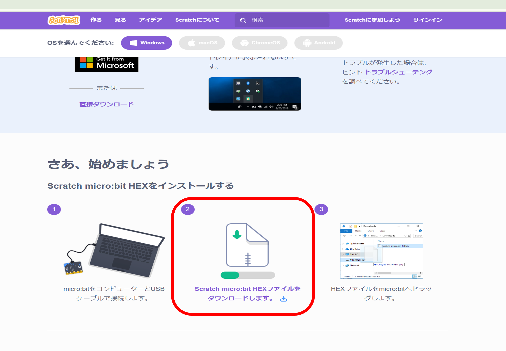
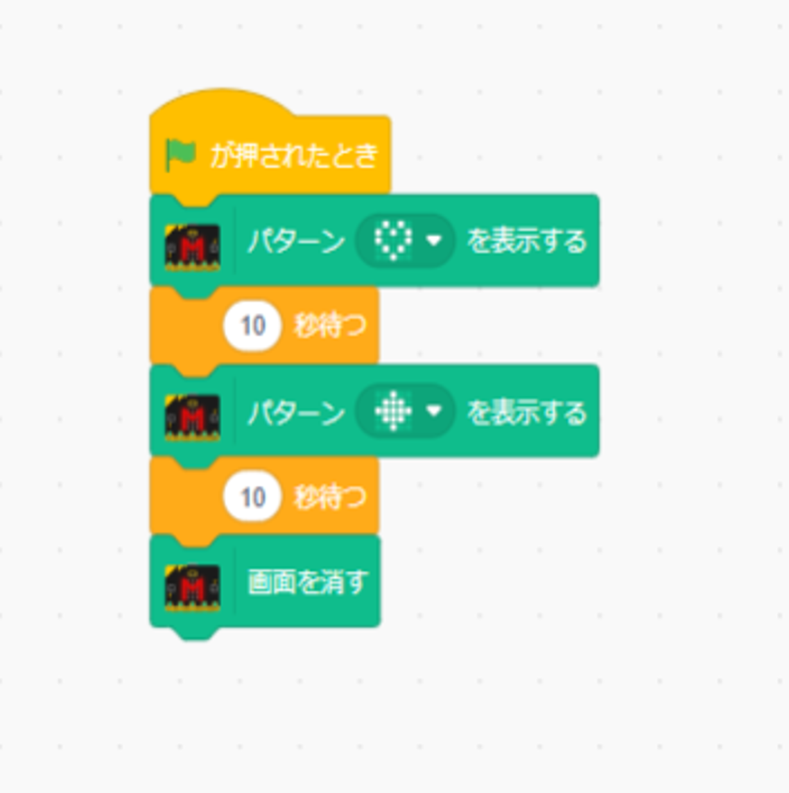

# 1 スモウルビー
## 目次

- [始めに](#始めに)
  - [スモウルビーとは？](#スモウルビーとは)
  - [マイクロビットを使う準備](#マイクロビットを使う準備)
  - [スモウルビーでマイクロビットを使う](#スモウルビーでマイクロビットを使う)
  - [パターン1：マイクロビットに模様を表示させる](#パターン1：マイクロビットに模様を表示させる)
  - [パターン2：マイクロビットに文字を表示させる](#パターン2：マイクロビットに文字を表示させる)
  - [パターン3：マイクロビットを振った時に文字を表示させる](#パターン3：マイクロビットを振った時に文字を表示させる)
  - [応用：だるまさんが転んだを作ってみよう](#応用：だるまさんが転んだを作ってみよう)

### 始めに
この項目は初めてプログラミングを学ぶ人にプログラム作成を体験してもらう項目です。  
いきなり実際のプログラミング言語を触る前に基本的な仕組みをしって操作に慣れてもらうことが目的になります。  
今回は後で学ぶ<strong>Ruby（ルビー）</strong>を簡単に扱うことができる<strong>スモウルビー</strong>を使って、作成していきます。

<br>

### スモウルビーとは？
始める前にスモウルビーについて簡単に説明します。
スモウルビーは、プログラマーの高尾宏治氏がご子息に幼いころからプログラミングの学習環境を提供したいという思いから<strong>Scratch（スクラッチ）</strong>という初心者や子ども向けのプログラミング言語を基に開発されたものです。  
あらかじめ準備されているブロックを組み合わせることで、プログラムを作成することができます。  

#### スモウルビーの特徴

- **プログラミング初心者でもすぐに作れる**  
  ブロックを繋ぐだけで、プログラムを作ることができます。

- **作った動きをすぐに試せる**  
  繋いだブロックをすぐに動かして、結果を確認できます。


今回は外部のものに対して影響させるプログラムを作成するため、マイクロビットを使っていきます。

- **マイクロビット（micro:bit）とは**  
  イギリスのBBC（英国放送協会）が開発した教育用のマイコンボードで、初心者でも簡単にプログラミングや電子工作を学べるように設計されています。  
  小さなコンピュータのようなもので、LEDディスプレイ、ボタン、センサー（加速度センサー、温度センサーなど）を備えています。また、無線通信機能も搭載しており、他のマイクロビットと通信したり、外部デバイスと連携したりできます。


次の項目ではマイクロビットを使うため、準備を行います。

<br>

---

### マイクロビットを使う準備
それではマイクロビットを使う準備を行っていきます。

#### ステップ1：Scratch micro:bit HEXファイルをダウンロード
マイクロビットを使えるように`Scratch micro:bit HEXファイル`をダウンロードします。    
新しいタブを開いて以下のURLでページを開いてください。  
https://scratch.mit.edu/microbit/  

開いたページの真ん中に画像の項目があると思いますのでその順番にそって行います。  



  1. micro:bitをPCと接続します。  
  1. `scratch micro:bit HEXファイルをダウンロードします。`をクリックして、ファイルをダウンロードします。  
  1. ダウンロードしたファイルをPCのmicro:bitへドラッグします。

以上でステップ1は完了です。

<br>

#### ステップ2：Scratch Linkをダウンロード
続いて`Scratch Link`をインストールします。  
このプログラムはスモウルビーとマイクロビットを繋げる役割を持ちます。  
今回はmicrosoftアカウントが無い想定のインストールです。  
先ほど開いていたページの少し上に戻ると次のような画面になると思います。  


<br>

ここからインストールを行っていきます。

  1. `黒背景のMicrosoft`または`直接ダウンロード`をクリックします。  

  1. ダウンロードされたファイルをダブルクリックすると画像のような画面がでますので、赤枠部分のファイルをダブルクリックします。  
    

  1. 次の画面が開かれるため、右下の「Next」をクリックしてください。
    

  1. インストールが行われたら画面が変わるため、右下に出た「Finish」をクリックして閉じてください。

以上でステップ2は完了です。

<br>

#### ステップ3：Bluetoothをオンにする。
最後にBluetoothをオンにしてください。

これでPCの設定は完了です。

<br>

---

### スモウルビーでマイクロビットを使う

ここからは実際にスモウルビーでプログラムを作っていきます。  

まず先ほどダウンロードした`Scratch Link`を実行させます。  
左下の検索欄で`Scratch Link`と入力すると、`Scratch Link`が表示されるため、クリックして起動してください。

続いて、以下のURLからスモウルビーのページに遷移しましょう。  
https://smalruby.jp/smalruby3-gui/

画面が表示されたらスモウルビーとマイクロビットを繋ぎましょう。

#### スモウルビーとマイクロビットの繋げ方

  1. 下の画面が表示されたら今度は左下の紫アイコンをクリックしましょう。
    

      <br>

  1. 画面表示が変わりますので、下側までスクロールして赤カッコで囲んである`MicroBit More (v2-0.2.5)`をクリックしてください。  
    

      <br>

  1. クリックして少し経つと下の画面になるので出てきたmicrobitを選択して（①）`ペア設定`をクリック（②）してください。  
    

      <br>

  1. 接続できたら下の画面が表示されますので`エディターへ行く`をクリックしてください。  
    
  
       <br>

  1. 左側を見ると先ほどまで存在しなかったmicro bit が新たに追加されています。これでマイクロビットを使うことができる状態になりました。  
    

---

#### パターン1：マイクロビットに模様を表示させる
それでは始めにマイクロビットに模様を表示させてみましょう。  
マイクロビットはLEDが 5×5 の合計25個ついていて、これを光らせることで文字や記号等を表示させることができます。  
  

このLEDを光らせて模様を出せるようにブロックを繋いでいきます。  


  1. ブロックを次のように組んでから、画面右側の緑旗をクリックしてください。  
    

  1. 最初にハートが10秒表示された後、四角が10秒表示されて最後にすべて消灯します。  
    イメージ　ハート  
        

      <br>

     イメージ　四角  
        

      <br>

   1. この処理をRubyで記述する際は下のコードになります。
    
        ```rb
        
        # .はLEDが光らない、1はLEDが光る

        when_flag_clicked do  # 旗が押されたらdo～end内の動きを行う
          microbit_more.display_pattern(  # ハートを表示させる
            ".1.1.",  # 1列目
            "1.1.1",  # 2列目
            "1...1",  # 3列目
            ".1.1.",  # 4列目
            "..1.."   # 5列目
          )
          sleep(10)  # 10秒間待つ
          microbit_more.display_pattern(  # 四角を表示させる
            ".1.1.",  # 1列目
            "1.1.1",  # 2列目
            "1...1",  # 3列目
            ".1.1.",  # 4列目
            "..1.."   # 5列目
          )
          sleep(10)  # 10秒間待つ
          microbit_moer.clear_display  # マイクロビットのLEDを消す
        end
        ```

       模様を表示させるためには、どのLEDを光らせるか設定する必要があります。  
       `microbit_more.display_patern`というあらかじめ設定されている動き（<strong>メソッド</strong>）の中に光らせない場合は`.`を、光らせる場合は`1`を設定することで出したい模様を表示することができます。  
       （メソッドの説明は後の章で詳しく行っていますので、そんな用語があると覚えておくだけで大丈夫です。）

---

#### パターン2：マイクロビットに文字を表示させる
続いてはマイクロビットに文字を表示させてみましょう。  
模様と同じように一文字ずつではありますが、マイクロビットに文字を出すことができます。  

  1. ブロックを次のように組んでみてから、画面右側の緑旗をクリックしてください。LEDが光って`HELLO`と1文字ずつ少し間隔を空けて3回流れてくると思います。  
    
  
      <br>

  1. この処理をRubyで記述する際は下のコードになります。
        ```rb

        when_flag_clicked do  # 旗が押されたらdo～end内の動きを行う
          3.times do  # do~end内の動きを3回行う
            # Helloを1文字ずつ間隔(120ミリ秒)を開けて表示する
            microbit_more.display_text_delay("Hello!", 120)
          end
        end
        ```
  
        模様よりもコードが短くなりました。  
        これは`display_text_delay`という部分が事前にプログラムとしてスモウルビーの中にあり、()内の左側に出したい文字を、右側に出したい速さを入力するだけで動かせるように設定されているからです。

---

#### パターン3：マイクロビットを振った時に文字を表示させる
今度は文字を表示させるのに現実での動きも取り入れてみます。  
先ほどは緑旗を押して`Hello`と表示させていましたが、ブロックを変えてマイクロビット自体を振った時に表示させる処理を行ってみましょう。  

  1. ブロックを次のように組んでみてから、マイクロビットを振ってみましょう。  
     マイクロビットを見てみると`HELLO`と3回でてくると思います。  
     
       <br>
  1. この処理をRubyで記述する際は下のコードになります。  
     
        ```rb

        microbit_more.when("shake") do  # マイクロビットを振ったらdo～end内の動きを行う
          3.times do  # do~end内の動きを3回行う
            # Helloを1文字ずつ間隔(120ミリ秒)を開けて表示する
            microbit_more.display_text_delay("Hello!", 120)
          end
        end
        ```

      パターン１やパターン２と一行目が先ほどと変わっています。  
      文章と同じように行動が違うと始まりの書き方も変わってきます。  
      
--- 

#### 応用：だるまさんが転んだを作ってみよう
ここまではマイクロビットへの表示という基礎的なプログラムを作成してきました。  
ただ、マイクロビットは単体だけでなく、画面と連動させたプログラムを作成することもできます。  
今回は応用として動きが分かり易い「だるまさんが転んだ」を作っていきましょう。  


<br>


<br>


<br>


<br>

  1. この処理をRubyで記述する際は下のコードになります。  
     
        ```rb

        microbit_more.when("shake") do  # マイクロビットを振ったらdo～end内の動きを行う
          move(5)
        end
        ```


---

### 自分で考えて作ってみよう
ここまでマイクロビットを使ったプログラムを作ってきました。  
今度は自身で考えてマイクロビットを使ったプログラムを作ってみましょう。  
ネットで探して気になるものでもいいですし、先ほど作ったプログラムを参考にしてみても構いません。  
挑戦してみましょう。