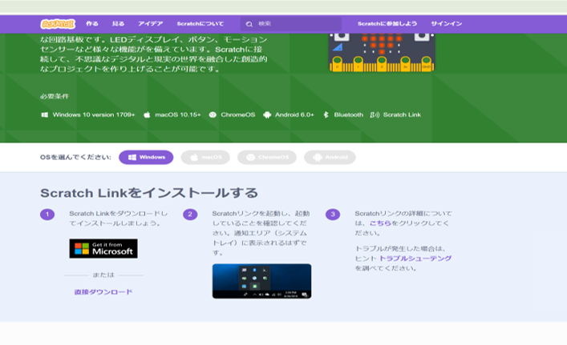

 1 スモウルビー
## 目次

- [始めに](#始めに)
  - [スモウルビーとは？](#スモウルビーとは)
  - [スモウルビーを使ってみる](#スモウルビーを使ってみる)

### 始めに
この項目は初めてプログラミングを学ぶ人にプログラム作成を体験してもらう項目です。  
いきなり実際のプログラミング言語を触る前に基本的な仕組みをしって操作に慣れてもらうことが目的になります。  
今回は後で学ぶ<strong>Ruby（ルビー）</strong>を簡単に扱うことができる<strong>スモウルビー</strong>を使って、作成していきます。

### スモウルビーとは？
始める前にスモウルビーについて簡単に説明します。
スモウルビーは、プログラマーの高尾宏治氏がご子息に幼いころからプログラミングの学習環境を提供したい思いから開発されたものです。  
あらかじめ準備されているブロックを組み合わせることで、プログラムを作成することができます。  

#### スモウルビーの特徴

- **プログラミング初心者でもすぐに作れる**  
  ブロックを繋ぐだけで、プログラムを作ることができます。

- **作った動きをすぐに試せる**  
  繋いだブロックをすぐに動かして、結果を確認できます。

---

### スモウルビーを使ってみる
それでは実際にスモウルビーを使ってみましょう。  
以下のURLからスモウルビーのページに遷移できます。  
https://smalruby.jp/smalruby3-gui/

今回はマイクロビットを使ったプログラムを作っていきます。

- **マイクロビット（micro:bit）とは**  
  イギリスのBBC（英国放送協会）が開発した教育用のマイコンボードで、初心者でも簡単にプログラミングや電子工作を学べるように設計されています。小さなコンピュータのようなもので、LEDディスプレイ、ボタン、センサー（加速度センサー、温度センサーなど）を備えています。また、無線通信機能も搭載しており、他のマイクロビットと通信したり、外部デバイスと連携したりできます。

#### ステップ1：必要なファイルのインストール
マイクロビットを使えるようにPCの設定を行っていきます。  
新しいタブを開いて以下のURLでページを開いてください。  
https://scratch.mit.edu/microbit/  

開いたページの真ん中に画像の項目があると思いますのでその順番にそって行います。  

1. micro:bitをPCと接続します。  
1. `scratch micro:bit HEXファイルをダウンロードします。`をクリックして、ファイルをダウンロードします。  
1. ダウンロードしたファイルをPCのmicro:bitへドラッグします。

ドラッグ完了後、別のプログラムをインストールします。  
今回はmicrosoftアカウントが無い想定のインストールです。  
先ほど開いていたページの少し上に戻ると次のような画面になると思います。

1. `黒背景のMicrosoft`または`直接ダウンロード`をクリックします。  
 
1. ダウンロードされたファイルをダブルクリックすると画像のような画面がでますので、赤枠部分のファイルをダブルクリックします。  
