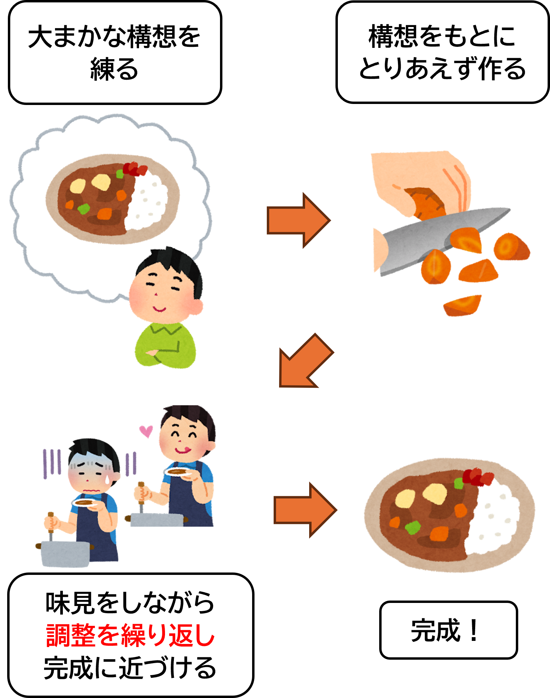

# 1 アジャイル開発基礎
## 目次
+ [システム開発](#システム開発)
    + [システム開発の目的とは？](#システム開発の目的とは)
    + [システム開発の流れ](#システム開発の流れ)
    + [プロジェクトに適した開発手法の選び方](#プロジェクトに適した開発手法の選び方)

## システム開発

### システム開発の目的とは？

システム開発の目的は、 **「問題を解決するための仕組みを作ること」** です。  
これをもう少し具体的に説明すると、次のような内容と例が含まれます。

1. __問題を解決する__   
    システム開発は、私たちが抱える問題や課題を解決するためのツールを作ることです。

    - **勤怠管理システム**  
    「社員の出勤・退勤時間を紙で管理するのが面倒」という課題を解決するため、出勤時間をデジタルで記録するシステムを作る。
    - **在庫管理システム**  
    「どの商品がどれくらい残っているかがわからない」という問題を解消するため、在庫をリアルタイムで確認できる仕組みを提供する。

1. __作業の効率化__  
    人間が手作業で行っていたことを、システムに任せることで効率化します。  

    - **自動化**  
    繰り返し行う作業（例：データの計算やチェック）を自動で行い、作業時間を短縮。
    - **スピードアップ**  
    必要な情報を瞬時に検索・取得するシステムを作成。

1. __データを管理する__  
    システムを使うことで、データを整理し、必要なときに簡単に取り出せるようになります。
    
    - **書籍管理システム**  
    図書館の本の情報を一元管理して、どの本が貸し出し中かすぐに確認できる。

1. __人や組織をサポートする__
    システム開発は、人や組織がスムーズに仕事を進めるためのサポートツールを作ることも目指します。  

    - **顧客管理システム**  
    お客様とのやり取りを記録し、より良いサービスを提供できるようにする。

これらを通じて、 **「より便利で快適な生活や仕事の環境を作る」** ことがシステム開発のゴールです。

---

### システム開発の流れ

システム開発の手法は大きく「**ウォーターフォール開発**」と「**アジャイル開発**」の2種類に分けられます。  
ここではアジャイル開発について触れる前に、両者の特徴を簡単におさらいしてみましょう。

+ __ウォーターフォール開発__  
    **ウォーターフォール開発**は、各工程（企画、設計、実装、テストなど）を**順番に進めていく方法**です。これを建築に例えると、家を建てるプロセスと似ています。

    

    前の工程が完了してから次に進むため、進行中に戻ることが難しく、**初期段階での計画や仕様が非常に重要になります。**

+ __アジャイル開発__

    **アジャイル開発**は、短い期間（スプリント）で**機能を少しずつ作りながら進める方法**です。これは味見をしながら料理を作る過程に似ています。
    
    
    
    要件や仕様は柔軟に変更でき、頻繁に顧客とコミュニケーションをとりながら開発を進めます。これにより、**変化に対応しやすく、早期に価値のある成果物を提供できるのが特徴**です。

### プロジェクトに適した開発手法の選び方

では、どちらの開発手法を取るのが望ましいのでしょうか。それぞれの手法が推奨される場合を挙げてみます。

+ **ウォーターフォールが推奨される場合**  
  + **要件が明確**で、変更の可能性が低いプロジェクト  
    + 政府のシステムやインフラ系の開発  
  + **規模が大きく**、**厳格な管理が必要**なプロジェクト  
    + 大企業の大規模システム構築  
  + **納期やコストが厳密に管理される必要がある**場合  
    + 契約ベースのプロジェクト  
  + **ドキュメントが重視される**場合  
    + 引き継ぎが必要な長期運用プロジェクト

+ **アジャイルが推奨される場合**  
  + **要件や仕様が変わる可能性が高い**プロジェクト  
    + スタートアップの新サービス開発
  + **顧客と頻繁にコミュニケーションが取れる**場合
    + エンドユーザーが近い小規模開発
  + **早いリリースが求められる**場合
    + 市場投入が重要な競争の激しい分野
  + **チームが自主的で柔軟に動ける**場合
    + 小規模なチームでのプロジェクト

近年では、初期段階でウォーターフォールを採用して全体の要件を固めた後、各機能の開発にアジャイルを取り入れる「**ハイブリッド開発**」を採用するプロジェクトが増えています。この手法は、両者の利点を組み合わせ、柔軟性と計画性を両立させた開発を可能にします。

--- 

#### ポイント  
+ **要件が明確で変化が少ない場合** → **ウォーターフォール**
+ **柔軟に対応しながら進めたい場合**  → **アジャイル**