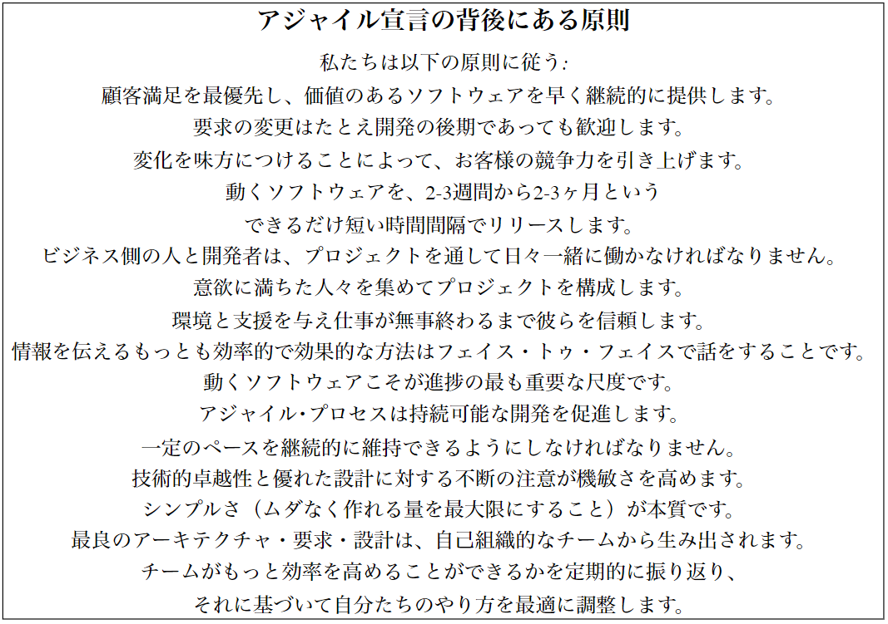
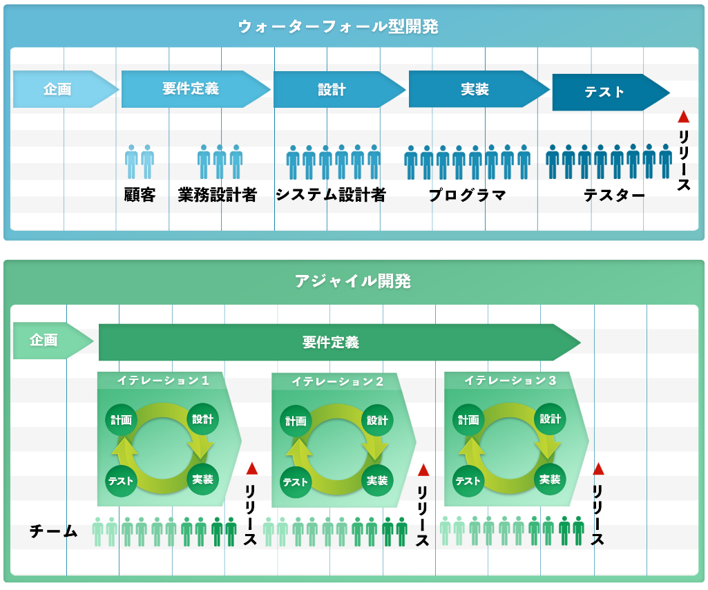
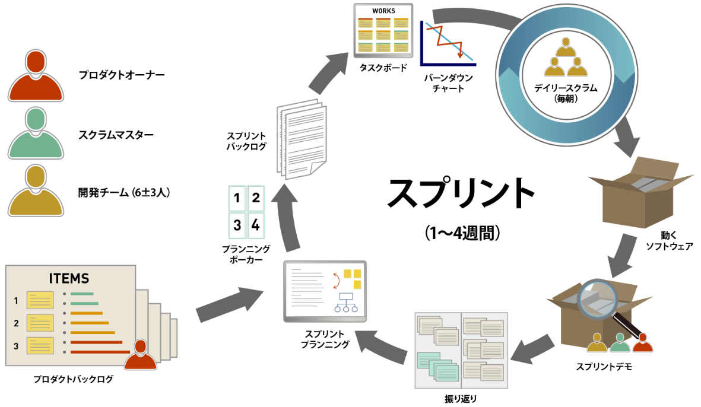
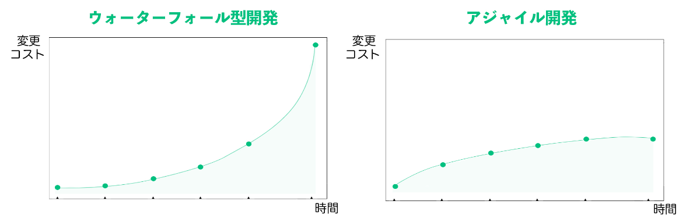
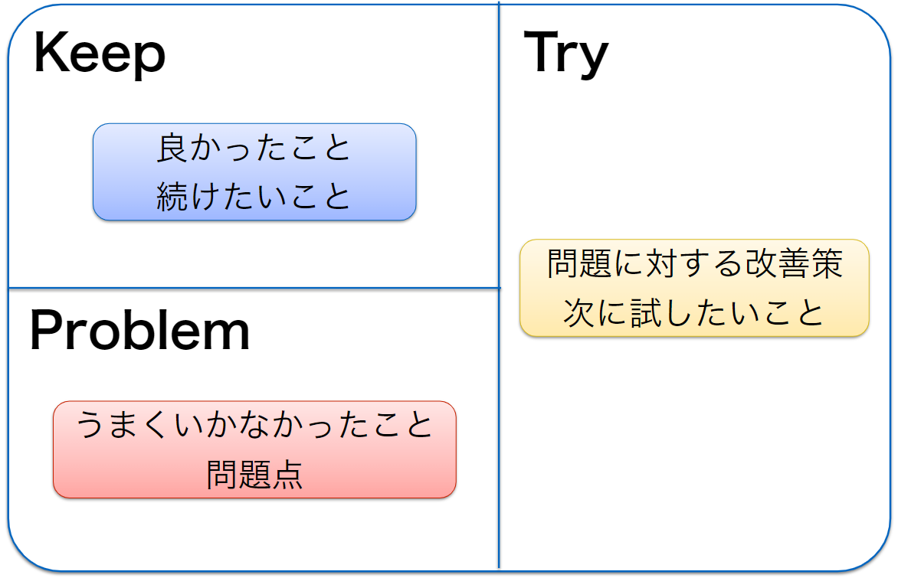
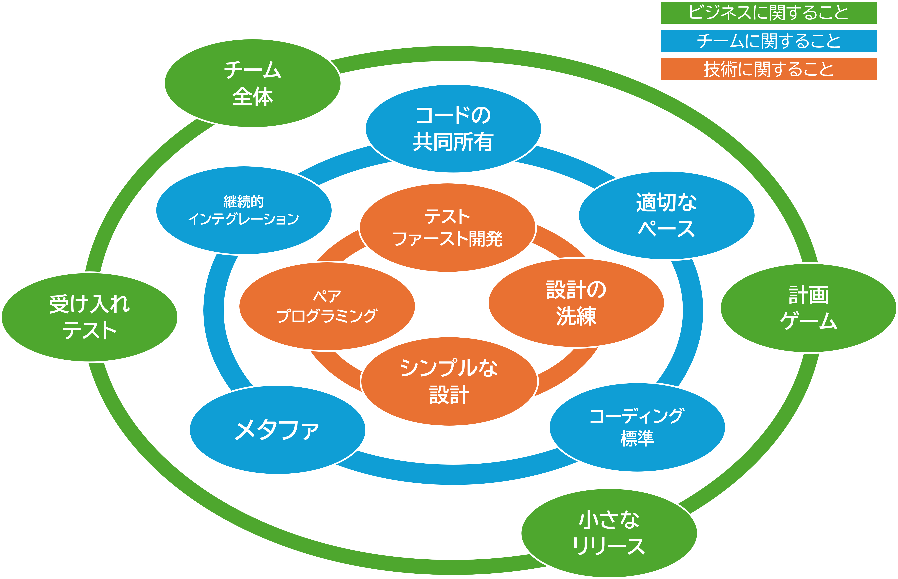

# 1 アジャイル開発基礎
## 目次
 + [アジャイル開発](#アジャイル開発)
    + [アジャイルソフトウェア開発宣言](#アジャイルソフトウェア開発宣言)
    + [アジャイル開発の特徴](#アジャイル開発の特徴)
    + [エクストリーム・プログラミング(XP)](#エクストリームプログラミングxp)

## アジャイル開発

### アジャイルソフトウェア開発宣言

#### アジャイルソフトウェア開発宣言とは？  
2001年にアメリカ・ユタ州で開催された開発者たちの会議で、**アジャイルソフトウェア開発宣言（Agile Manifesto）** が発表されました。この宣言は、ソフトウェア開発における価値観と原則を定めたもので、現在のアジャイル開発の基盤となっています。  

---

#### アジャイルソフトウェア開発宣言の4つの価値  
アジャイル宣言では、以下の4つの価値が掲げられています。  

+ プロセスやツールよりも、**個人と対話を重視**する  
    チーム内外のコミュニケーションを通じて、円滑な開発を目指します。  

+ 包括的なドキュメントよりも、**動くソフトウェアを重視**する  
    完璧な仕様書を作ることよりも、動く成果物を早く提供することを優先します。  

+ 契約交渉よりも、**顧客との協調を重視**する  
    固定された契約に縛られるのではなく、顧客との信頼関係と柔軟な対応を重視します。  

+ 計画に従うことよりも、**変化への対応を重視**する  
    要件変更を前向きに捉え、柔軟に対応することでより良い成果を生み出します。

>   
>
> https://agilemanifesto.org/iso/ja/manifesto.html より

---

#### アジャイルソフトウェア開発宣言の12の原則

4つの価値を支える具体的な実践として、アジャイル宣言には12の原則があります。主なポイントをいくつか紹介します。

+ **顧客満足を最優先**: 価値あるソフトウェアを早く、継続的に提供する。
+ **変化を歓迎**: 要件変更を受け入れ、競争優位性を維持。
+ **動くソフトウェアの提供**: 数週間～数か月単位で動作する成果物を納品。
+ **開発者と顧客の協働**: プロジェクト全体を通じて密接に連携する。
+ **信頼のあるチーム作り**: モチベーションを高める環境と支援を提供。
+ **継続的な改善**: 定期的に振り返り、効率やチーム力を向上させる。

>   
>
> https://agilemanifesto.org/iso/ja/principles.html より

--- 

#### ポイント

+ **アジャイル宣言が目指すもの**
    + アジャイル宣言は、従来の硬直的な開発プロセスの課題を解消し、柔軟かつ効率的な開発を実現するために作られました。その中心にあるのは、**「人」と「価値」** を重視する考え方です。  

    + アジャイル宣言の価値観や原則を取り入れることで、開発チームは**顧客と協力しながら**、変化に強いソフトウェアを効率よく作り上げることが可能になります。

 

---

### アジャイル開発の特徴

アジャイル開発は、柔軟で迅速な開発手法です。ここでは、アジャイル開発の特徴を初心者向けに簡単に説明します。

+ **変更に柔軟に対応する**  
    アジャイル開発では、開発の途中で新しい要望が出ても**柔軟に対応**できます。計画を変更したり、機能を追加したりすることができるため、予想外の変化があっても進めやすいです。

+ **早くリリースして継続的に改善する**  
    アジャイル開発では、**数週間ごとに動作するソフトウェアを少しずつ作り**、リリースします。毎回のリリース後に、顧客やチームの意見を聞いて改善し、次のリリースに活かします。この繰り返しによって、少しずつより良いソフトウェアを作り上げます。

+ **リスクを少なくする**  
    アジャイル開発では、**短期間で成果物を見せるので**、早い段階で問題を発見できます。これにより、大きな問題になる前に対処でき、リスクを最小限に抑えることができます。

+ **顧客満足度が高い**  
    顧客とのコミュニケーションを大切にして、顧客が本当に必要とする**機能や変更をすぐに取り入れられる**のが特徴です。そのため、最終的に顧客が満足できる成果物を提供しやすいです。

+ **市場の変化に対応できる**  
    市場や顧客のニーズは変化するものですが、アジャイル開発ではその**変化に素早く対応**できます。定期的にリリースを行うため、変化に柔軟に適応でき、競争力を維持しやすくなります。

    

---

#### 代表的なアジャイルプロセス  
アジャイル開発にはいくつかの方法がありますが、その中でもよく使われる代表的なプロセスをご紹介します。

 +  **XP（eXtreme Programming）**  
    XPは、アジャイル開発の中でも特に「**技術**」に焦点をあてた方法です。プログラマーが協力して、コードを書きながら**品質を保つこと**を大切にしています。例えば、**ペアプログラミング**という方法では、2人で1台のパソコンを使い、一緒にコードを書くことが推奨されます。  
    後ほど詳しく解説します。

 +  **Scrum（スクラム）**  
    Scrumは、アジャイル開発の中でも最も有名なフレームワークの一つです。Scrumでは、開発を「**スプリント**」と呼ばれる短期間のサイクルに分けて進めます。**スプリントごとに成果物をリリース**し、その後のスプリントで改善していくため、開発が進んでいる様子を常に確認でき、問題を早期に発見できます。

    

このように、アジャイル開発は「**柔軟で早く進む**」ことを大切にしており、変化に強いシステムを作るための手法です。特に、**市場や顧客の要求が変わることが予測される場合に有効**です。

--- 

#### 変更コスト曲線

アジャイル開発が**変更を柔軟に扱う理由**の一つに、「**変更コスト曲線**」があります。この曲線は、プロジェクトの進行に伴い、変更を加えるコストがどのように増えていくかを示しています。

プロジェクトの初期では変更が安価に行えますが、開発が進むと変更にかかるコストが大きくなります。つまり、**早い段階で変更を行う方がコストが低くて済む**のです。

アジャイル開発では、**初期の段階で変更しやすい状態を保ち**、スプリントごとに改善を繰り返すため、変更コストが急激に増える前に対応できます。これにより、効率的にリスクを管理しながら開発を進めることができます。

---

#### アジャイルは改善のプロセス  
アジャイル開発は、単にソフトウェアを作るだけでなく、**改善のプロセス**としても機能します。アジャイルでは、**定期的にふりかえり**を行うことで、チームの活動やプロジェクトの進行における課題を振り返り、次に活かすための改善策を見つけ出します。これにより、失敗や学びを迅速に反映させ、継続的に成長することができます。

##### 振り返りの代表的な手法
+ **KPT(Keep, Problem, Try)**  
  + **Keep**: 継続すべきこと（良かった点や成功した点）
  + **Problem**: 問題点や改善が必要なこと
  + **Try**: 次回試すべきこと、改善案

  

+ **YWT(やったこと, わかったこと, 次にやること)**
  + **やったこと**: 実施したことや活動内容
  + **わかったこと**: 学びや発見したこと
  + **次にやること**: 次回に活かすべき行動や改善点

 

--- 

### エクストリーム・プログラミング(XP)

**エクストリーム・プログラミング（eXtreme Programming）** は、アジャイル開発の一つで、特に技術面に重きを置いた手法です。XPの目指すところは、品質を維持しつつ、迅速で柔軟なソフトウェア開発を行うことです。ここではXPの特徴について、少し詳しく説明します。

---

#### 5つの価値
XPでは、以下の5つの価値観を重視します。

| 価値名 | 説明 |
|--------|------|
| **コミュニケーション** | チーム内でのしっかりとしたコミュニケーションを大切にし、意見交換や問題解決をスムーズに行う。 |
| **シンプル** | 複雑な設計や機能を避け、必要最小限の機能に絞って開発を進め、理解しやすくメンテナンスしやすいコードを生み出す。 |
| **フィードバック** | 顧客やチームからのフィードバックを迅速に取り入れ、開発を進める中で改良を加えていく。 |
| **勇気** | 必要な変更や改善を恐れずに行い、問題が発生しても早期に対応することでリスクを最小限に抑える。 |
| **尊重** | チームメンバーを尊重し、全員が協力し合いながら開発を進め、個々の意見を尊重して効率的に作業を進める。 |

---

#### 13のプラクティス
XPでは、これらの価値を実現するために13の**プラクティス**（実践方法）があります。

| プラクティス名 | 内容 | 結果 |
|---|---|---|
| **チーム全体** | **顧客**が開発チームの一員として、質問や優先順位の決定に関与し、迅速にフィードバックを得る。 | **顧客の要望**に迅速に対応できる。 |
| **計画ゲーム** | **顧客**と**開発者**が協力して計画を立て、柔軟に見直しながら進める。 | 変化に対応し、**顧客の期待**に沿ったプロダクトを作れる。 |
| **受け入れテスト** | **顧客**が「**受け入れテスト**」を作成し、開発中の機能が**期待通り**に動作するかを確認する。 | 顧客の期待に沿った機能が実装され、進捗が見える化される。 |
| **小さなリリース** | 開発したソフトウェアを**少しずつ頻繁にリリース**し、早期にフィードバックを得る。 | 改善サイクルを加速できる。 |
| **シンプルな設計** | **複雑さを避け**、最小限の機能を素早く実装する。 | 変更や機能追加が容易になる。 |
| **テストファースト開発** | 実際にコードを書く前に、先に**テスト**を作成し、そのテストに合格するようにコードを書く。 | 最初から**品質の高いコード**を作成できる。 |
| **ペアプログラミング** | **2人のプログラマー**が1台のコンピュータで共同作業し、コードを確かめ合いながら、知識を共有する。 | コードの品質向上と技術的な知識の共有が進む。 |
| **設計の洗練** | 定期的にコードを見直し、**シンプルで使いやすい設計**にする。 | 設計が最適化され、コードがより効率的で使いやすくなる。 |
| **コードの共同所有** | **チーム全員**がコードを共有し、誰でも変更や改善ができるようにする。 | 問題を早期に発見・解決できるようになる。 |
| **コーディング標準** | チーム全員が統一された**コーディングスタイル**を守る。 | コードが統一され理解しやすくなり、協力がスムーズに進む。 |
| **継続的インテグレーション** | 頻繁にコードを統合し、**問題**を早期に発見・修正する。 | リリース時の問題が減り、品質が向上する。 |
| **メタファ** | システムの動きや概念を**簡単な例え話**で説明し、チーム全員が共通の**理解**を持つようにする。 | チーム全員がシステムの理解を共有し、開発がスムーズに進む。 |
| **適切なペース** | **無理のないペース**で作業をする。 | チームメンバーが**過労を避け**、安定して成果を上げ続けられる。 |

---

#### ポイント

+ **5つの価値**
  + **コミュニケーション** – チーム内でしっかり意見交換。
  + **シンプル** – 複雑なことを避け、シンプルに進める。
  + **フィードバック** – 顧客やチームからの意見を早めに反映。
  + **勇気** – 必要な変更を恐れずに実行。
  + **尊重** – チームメンバーを尊重して協力し合う。  

+ **13のプラクティス（実践方法）**  
  + 顧客と開発者が一緒に計画を立てたり、**ペアプログラミング**でコードを作ったり、**テストファースト**で品質を保ったりします。
  + 小さな単位で頻繁にリリースして、早めにフィードバックをもらいます。

簡単に言うと、XPはチーム全員が協力して、高品質なソフトウェアを早く作る方法です。
