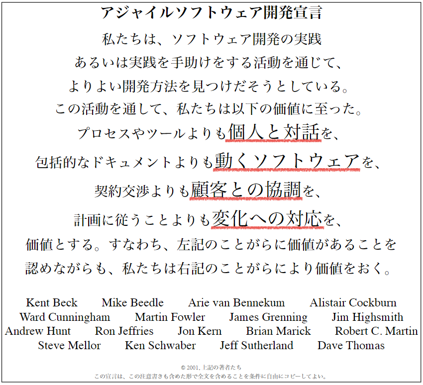

# 1 アジャイル開発基礎
## 目次
 + [サンプル目次](#サンプル)

## アジャイル開発

### アジャイル開発について

#### アジャイルソフトウェア開発宣言とは？  
2001年にアメリカ・ユタ州で開催された開発者たちの会議で、**アジャイルソフトウェア開発宣言（Agile Manifesto）** が発表されました。この宣言は、ソフトウェア開発における価値観と原則を定めたもので、現在のアジャイル開発の基盤となっています。  

>   

> https://agilemanifesto.org/iso/ja/manifesto.html より
