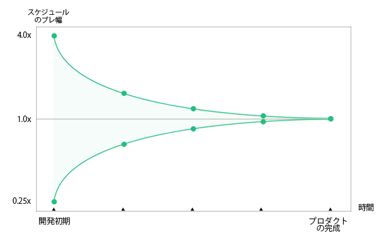
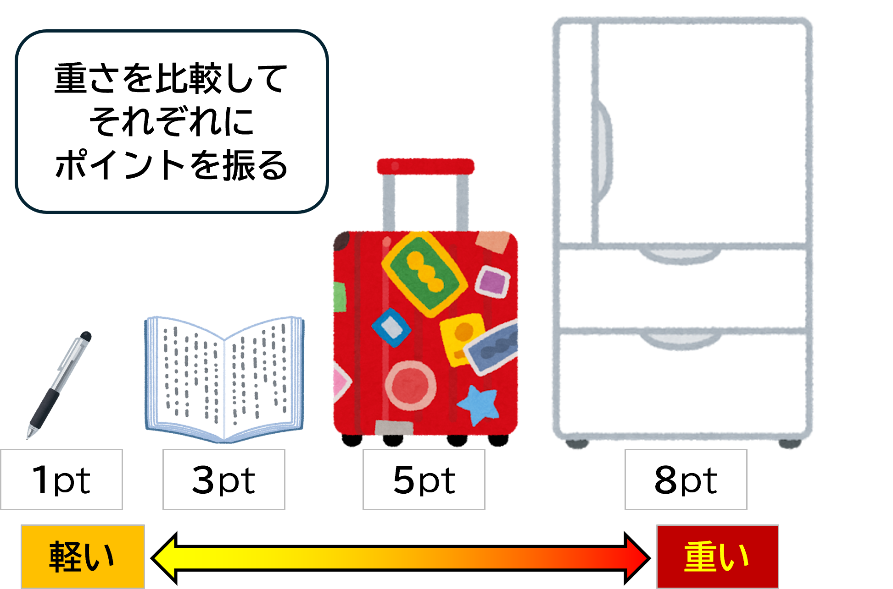
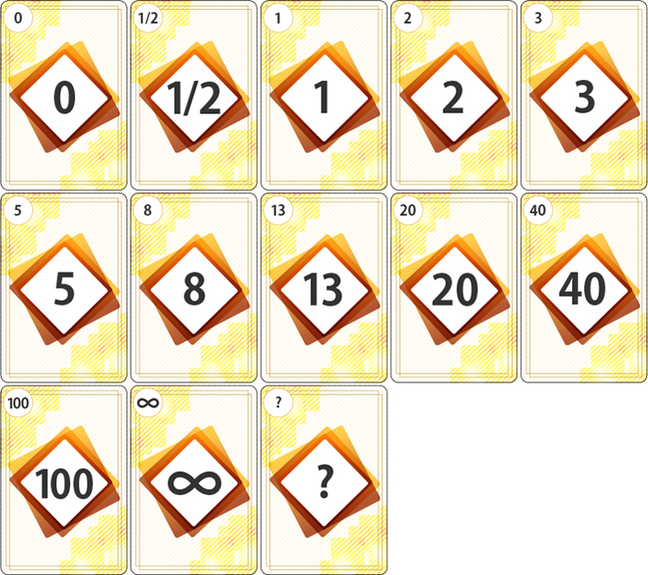
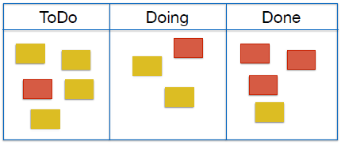
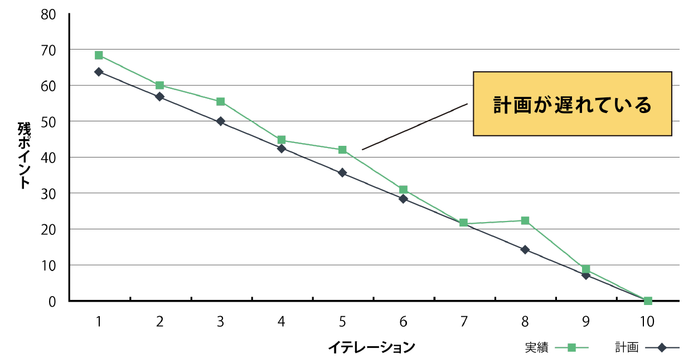
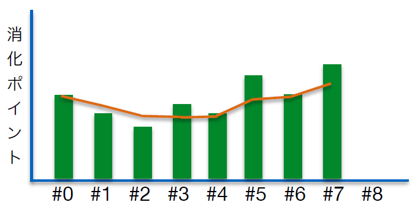

# 1 アジャイル開発基礎
## 目次
  + [アジャイルでのプロジェクト管理](#アジャイルでのプロジェクト管理)
    + [計画づくりの難しさ](#計画づくりの難しさ)
    + [アジャイルによる計画づくり](#アジャイルによる計画づくり)
    + [プロダクトバックログ](#プロダクトバックログ)
    + [スプリントバックログ](#スプリントバックログ)
    + [ストーリーポイント](#ストーリーポイント)
    + [プランニングポーカー](#プランニングポーカー)
    + [カンバン（タスクボード）](#カンバンタスクボード)
    + [バーンダウンチャート](#バーンダウンチャート)
    + [ベロシティ計測](#ベロシティ計測)

## アジャイルでのプロジェクト管理

### 計画づくりの難しさ
ソフトウェア開発では、プロジェクトを取り巻く状況や要件が常に変化します。そのため、開発の最初にすべてを正確に計画するのはとても難しいです。

#### 計画を狂わせる主な原因とその例
次のような理由で、当初の計画が狂うことがあります。
+ **途中で要件や仕様が変更される**
  + 顧客から「**新しい機能を追加してほしい**」と依頼される。  
  + ビジネスの事情が変わり、「**A機能よりB機能を早く作ってほしい**」と言われる。
+ **新しい課題が見つかる**
  + 開発中に使う予定だった**外部サービスがうまく動かない**。 
  + 実装を進めているうちに、**既存のシステムとうまく連携できない問題**が見つかる。
+ **より良い方法が見つかる**  
  + 新しい技術やツールを使うことで、**もっと効率よく作れる**と気づく。
  + 最初に決めた設計を見直して、**より良いアイデア**が見つかる。  
+ **チームメンバーのスキルが上がる**  
  + **新しいフレームワークを覚えて**、開発がスムーズに進むようになる。
  + チームの得意分野が増え、**複雑な要件にも対応できる**ようになる。

#### 不確実性コーン  
「**不確実性コーン**」とは、プロジェクトの計画や**見積もり**の精度が、時間とともに改善されるという考え方です。

開発の初期段階では、**問題の予測が難しい**ため、計画に誤差が生じやすいです。たとえば、どの機能を作るかが未確定だったり、使用する技術に問題が発生することがあります。このように、最初は不確実性が高く、計画が予測しづらいのです。

しかし、開発を進めると最初は不確実性が高かった状況が次第に明確になり、次のようなことが改善されます。

+ **要件が具体化する**  
  顧客やチームと話し合いを通じて、**必要な機能が明確**になります。  
  例えば、最初は「ユーザー管理機能」とだけ漠然と決まっていたが、具体的に「ユーザーの役割設定機能」として定義されるようになることがあります。
+ **リスクが軽減される**  
  最初に発生する**技術的な課題**が解決し、次にやるべきことが見えてきます。  
  例えば、使用する外部サービスに問題があったが、実際に使ってみると大きな問題がないことがわかり、リスクが減少することがあります。
+ **見積もりが正確になる**  
  **過去の作業ペース**を基に、次の計画が立てやすくなります。  
  例えば、最初はスプリント（一定の期間で行う開発作業）の進捗が遅れ気味だったが、チームの作業ペースを確認した結果、次のスプリントではより高いベロシティが予測できるようになることがあります。

これらの改善により、**不確実性**が減り、計画が**より正確**になっていきます。

---

#### ポイント
+ **開発の初期段階で完璧な計画を作るのは不可能**  
  初期段階では不確実性が高いため、すべてを予測することができません。
+ **アジャイル開発では柔軟な計画を立てる**  
  最初の計画が変更される可能性を考慮し、柔軟に対応することが大切です。
+ **進捗に応じて計画を見直す**  
  開発が進むことで明確になった情報を元に、計画を定期的に見直していきます。

#### 用語解説
+ **ベロシティ**  
  **ベロシティ**は、チームの作業速度を示す指標で、スプリントで完了した作業量を測ります。目的は、チームがどれだけ作業を進めたかを把握し、次のスプリントでできる作業量を予測することです。**過去のスプリントの成果を元に計測される**ため、チームの作業ペースを知るために役立ちます。

 

---

### プロダクトバックログ
ここからは具体的なプラクティスの例をいくつか説明していきます。  

**プロダクトバックログ**は、開発する機能や必要な変更などをリストにしたものです。これは、開発するべき内容を優先順位をつけて整理したものです。

+ **内容**  
  顧客が求める機能や改善点、修正すべきバグなどが含まれます。
+ **優先順位**  
  どの作業が重要かを決めるために、顧客の価値やコストを考慮して、リストに**順位**をつけます。
+ **チームの作業**  
  開発チームは、リストの中で最も重要なものから順に取り組みます。

**プロダクトバックログ**は、開発する内容の「**計画表**」として、チームと顧客のやり取りを円滑に進めるための重要な道しるべとなります。

#### やってみよう
  ボウリングのスコア計算プログラムの**プロダクトバックログ**を作成してみましょう。

1. **必要な要件を洗い出す**  
  最初に、プログラムに必要な機能や作業を全て書き出してみましょう。この段階では優先順位は考えず、思いつく限りの要件をリストアップします。  
    

    
例

    
    + 各フレームのスコア表示
    + ストライクやスペアの判定機能
    + スコアの入力機能
    + 合計スコアの計算機能
    
  

2. **要件に優先順位をつける**  
  次に、洗い出した要件に**優先順位**をつけます。実現したい機能や重要な機能から順番に並べます。
    + **高い優先度**  
      早く実現したい、または重要な機能は上に置きます。
    + **低い優先度**  
      余力があれば実現したい、または後回しでも良い機能は**下**に置きます。

    

    
例

    1. スコアの入力機能（最も重要）
    1. ストライクやスペアの判定機能
    1. 合計スコアの計算機能
    1. 各フレームのスコア表示（余裕があれば）

    
  

---

### スプリントバックログ
**スプリントバックログ**とは、プロダクトバックログの中から、今回の**スプリント**の間に開発する機能やストーリーを選び出し、そのストーリーを完成させるために必要な作業項目をリスト化したものです。スプリントバックログは、チームがスプリント内で何を作るのか、どんな作業をするのかを明確にするための大切な資料です。  

#### ポイント  
1. **作業量は適切にする**  
  スプリントバックログに載せる作業は、**大きすぎず、小さすぎず**というバランスが大切です。もし作業が大きすぎると、スプリント内で終わらせるのが難しくなります。逆に小さすぎると、作業が細かすぎて進捗を見失ってしまうことがあります。

1. **第三者が完了したか判断できる粒度**  
  スプリントバックログの作業項目は、**誰が見ても完了したか分かる**ようにする必要があります。例えば、「機能の実装完了」ではなく、「機能実装とテスト完了」といった具体的な作業内容に分けると、進捗が明確に確認できます。

 

---

### ストーリーポイント

**ストーリーポイント**は、アジャイル開発において、タスクやユーザーストーリーの**難易度**や**作業量**を評価するための単位です。ストーリーポイントは**時間**ではなく、**相対的な大きさ**で見積もられます。

ストーリーポイントは、次の要素を考慮してタスクを評価するために使われます。

+ **作業量**   
  + 完了するまでに必要な労力
  + 作業にかかる時間
+ **複雑さ**  
  + 問題の難しさ
  + 技術的なチャレンジ
+ **不確実性**  
  + 完了までの予測が難しい部分
  + 発生する不確実な要素

これにより、チームはタスクを時間でなく、**相対見積もり**で評価することができます。

#### 相対見積もり

**相対見積もり**とは、タスクの大きさや作業量を、絶対的な値（時間や人数など）ではなく、他のタスクと比較して評価する方法です。この方法では、タスクを直接測るのではなく、**どれくらいの規模感かを他のタスクと比べる**ことによって、相対的に評価します。これにより、見積もりが簡単で直感的になり、実際の作業にも活かしやすくなります。

  

#### 相対見積もりを「荷物の重さ」に例える
相対見積もりを「荷物の重さ」を基準にした例で考えてみましょう。

+ **軽い荷物（1ポイント）**  
  例えば、「ペンを1本持つ」というタスク。この荷物はとても軽く、ほとんど重さを感じません。作業量が非常に少ないとき、これを1ポイントとして見積もります。
+ **普通の荷物（3ポイント）**  
  次に、「本を1冊持つ」というタスクを考えます。本は少し重いけど、簡単に持てる程度。ペンよりは大きな作業ですが、それほど大変ではありません。これを3ポイントとして見積もります。
+ **重い荷物（5ポイント）**  
  例えば、「大きなバッグを持つ」というタスク。バッグは重くて持つのに少し力が必要です。作業量がもう少し大きくなったという感じ。これを5ポイントとして見積もります。
+ **とても重い荷物（8ポイント）**  
  最後に、「冷蔵庫を運ぶ」というタスク。冷蔵庫は重くて、かなりの力が必要です。作業量が非常に大きいと感じる時は、8ポイントとして見積もります。

これらをもとに、相対見積もりの流れを追ってみます。

1. **まずは基準を決める**  
「ペンを持つ」タスクを**1ポイント**として基準にします。
1. **次に新しいタスクを比較**  
新しいタスク（例えば、本を持つ）を「ペンを持つ」の重さと比べて「これくらいの重さだな」と感じます。そして、**3ポイント**として見積もります。
1. **さらに大きなタスクも比較**  
冷蔵庫を持つタスクがどれだけ大変かを比べて「これはすごく重い！」と感じて、**8ポイント**にします。

このように、相対見積もりは「ペン」「本」「冷蔵庫」のように**簡単に比べられる基準**を使ってタスクの大きさを見積もる方法です。  

では、これをWebシステムに置き換えた例をみてみましょう。

+ **1ポイント**：簡単なタスク  
  + ユーザープロフィール画面の文字変更  
  + 単純な画像の追加  
  + ヘッダーやフッターの文言修正
+ **3ポイント**：中程度の作業  
  + フォーム入力機能の実装  
  + ユーザー登録フォームのバリデーション追加  
  + ショッピングカートに商品を追加する機能実装  
  + 新規ページの作成（静的ページ）
+ **5ポイント**：複雑な作業  
  + 複数APIの連携とデータの表示  
  + ユーザー認証システムの実装（ログイン、ログアウト）  
  + リアルタイムチャット機能の実装  
  + ユーザーの行動履歴をトラッキングしてダッシュボードに表示  
+ **8ポイント**：非常に複雑な作業  
  + 高度な検索機能の実装（フィルタリング、並べ替え）  
  + 複雑なデータベースの設計とAPIの実装  
  + サーバーサイドのパフォーマンス最適化

これらのポイントはチームの経験に基づいて決められます。

 

---

### プランニングポーカー

  

プランニングポーカーは、見積もりのために「0, 1, 2, 3, 5, 8, 13, …」といった数字が書かれたカードを使って、チーム全員で素早く見積もりを行う方法です。これらの数字は「作業量」の目安を表しており、プロダクトバックログアイテムの複雑さや工数を示します。

#### ルール

+ **時間をかけすぎない**  
  見積もりにはあまり時間をかけすぎず、素早く決めることが大切です。長く考えすぎると、議論が長引いてしまう可能性があります。

+ **みんなで見積もる**  
  見積もりはチーム全員で行います。全員が参加することで、個々の意見を反映し、認識を合わせることができます。

+ **認識を合わせる**  
  みんなで同じ情報を共有し、認識を合わせることが目的です。意見が一致しない場合は、なぜその見積もりになったのかを話し合います。

+ **大きな数字の小さな差は気にしない**  
  数字が大きくなると、その差はあまり重要ではなくなります。例えば、8ptと13ptの違いはあまり気にせず、大まかな感覚で見積もりましょう。

#### やってみよう

1. **基準のバックログを決める**  
   最初に、どれか1つのタスク（バックログアイテム）を選んで、これを「2ポイント」や「3ポイント」に決めます。これが**基準**になります。

2. **他のタスクを見積もる**  
   次に、別のタスクを選んで、この**基準となるタスク**と比べます。例えば、基準のタスクが「2ポイント」だったら、今選んだタスクがそれより簡単なのか、難しいのかを考えます。

3. **みんなでカードを選ぶ**  
   全員が「これくらいかな？」と思う数字を書いたカードを選びます。例えば、基準が「2ポイント」だったら、今度のタスクは「5ポイント」や「3ポイント」かもしれません。

4. **みんなでカードを見せる**  
   みんながカードを選んだら、一斉にそのカードをテーブルに出します。

5. **数字が一致したら終了**  
   みんなが選んだ数字が同じなら、そのタスクの見積もりは**終了**です。

6. **違ったら話し合う**  
   もし数字が違っていたら、みんなでその**理由**を話し合います。どこが難しかったのか、どこが簡単だったのかを共有し、再度カードを選んで見積もりをします。再見積もりは**2回まで**にしましょう。

 

--- 

### カンバン（タスクボード）

カンバンは、チームの作業を視覚的に管理するためのツールで、進行中の作業を明確に示すことができます。各カードには、作業項目に関する詳細情報（**期日**、**残作業時間**など）を追加することも可能です。

#### 基本的なカンバンの列
- **ToDo**：まだ着手していないタスク
- **Doing**：現在進行中のタスク
- **Done**：完了したタスク

#### カンバンの活用方法

1. **バックログの作成**  
    最初にやるべき作業（バックログ）を**付箋**や**カード**に書き出します。
2. **視覚的管理**  
    これらの作業項目を「**ToDo**」「**Doing**」「**Done**」の列に配置し、進行中の作業をチーム全員で確認できるようにします。

    

 

---

### バーンダウンチャート

バーンダウンチャートは、**プロジェクトの進み具合**をグラフで簡単に見ることができるツールです。このグラフでは、**残りの作業量**が時間とともにどれだけ減っているかを示します。

#### バーンダウンチャートの使い方
- **横軸**（下の部分）は**時間**を表しています（例えば日ごと）。
- **縦軸**（左の部分）は**残りの作業量**を表していて、作業が進むほど下がっていきます。
- 初めは作業量が多く、時間が進むにつれて作業量が減っていく様子が「下降線」として描かれます。

バーンダウンチャートを見ることで、**予定通りに進んでいるか**、**遅れているのか**をすぐに確認できます。  

もしバーンダウンチャートで予定よりも進んでいないことが分かったら、**プロジェクトの期限を延ばす**か、**やるべき作業を減らしてスコープを調整**することで、遅れを取り戻します。  

 

---

### ベロシティ計測

ベロシティは、**スプリントで完成したバックログのポイントの合計**です。これを計測することで、チームがどれくらいの作業を進めているかが分かります。

ベロシティを使うと、**残りのバックログを消化するためにあと何スプリント必要か**が予測できます。しかし、スプリントごとのベロシティには**バラつき**があるため、通常は**数回分のスプリントの平均ベロシティ**を使って予測します。

 