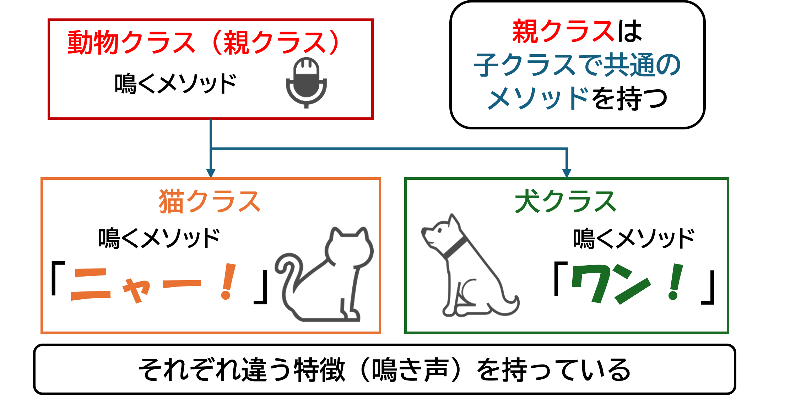

# 2 Ruby基礎

## 目次
- [(10) クラス](#10-クラス)
- [(11) モジュール](#11-モジュール)
- [【問題】](#問題)

---

###	__(10) クラス__  
オブジェクト指向プログラミングは、プログラムを「オブジェクト」という単位で作る方法です。オブジェクト指向には4つの基本原則があります。  

1. __オブジェクト指向プログラミング(OOP)とは？__
    + __カプセル化（Encapsulation）__：データとメソッドを一つにまとめ、外部からの不正なアクセスを防ぎます。  
        カプセル化は金庫などに例えることができます。  
          

    + __継承（Inheritance）__：既存のクラスから新しいクラスを作ることです。  
        + 例えば、動物クラスから犬や猫クラスを作って、それぞれに特徴を持たせます。  
            

    + __ポリモーフィズム（Polymorphism）__：同じメソッドでも、オブジェクトによって異なる動作をすることです。  
        + 例えば、犬と猫の「鳴くメソッド」がそれぞれ違う動作をします。  
            

    + __抽象化（Abstraction）__：必要な部分だけを公開し、詳細を隠すことで複雑さを減らします。
        + 例えば、動物（親）クラスの「鳴くメソッド」には詳細を書かず、犬クラスや猫クラスといった子クラスにそれぞれの動きを任せています。  
          

1. __クラスとは？__  
  __クラス__ は、料理を作るための __「レシピ」のようなもの__ です。レシピには料理の材料（属性）や調理方法（振る舞い）が書かれています。  
  例えば、「オムライスのレシピ」には、オムライスの具材や調理手順が書かれていますが、 __このレシピ自体はまだオムライスではありません__ 。
  
1. __オブジェクト（インスタンス）とは？__  
  __オブジェクト__（またはインスタンス）は、クラスを元に作られた実際の実体です。例えば、「オムライスのレシピ」から実際に作られた料理が「オブジェクト」にあたります。
  クラスを実体化（インスタンス化）すると、オブジェクトを操作できます。  
  

---

### __(10)-1 クラスの定義__

+ クラス名は __最初の文字を大文字__ (CamelCase／キャメルケース) にします。  

```rb
class SampleClass
  def hoge
  end
end
```

---

### __(10)-2 インスタンスの生成__

インスタンスを作るには、`new`メソッドを使います。`initialize`メソッドはインスタンスが生成される際に呼び出されます。

```rb
class SampleClass
  def initialize
    puts "create!"
  end
end

sample = SampleClass.new  #=> create!
```

--- 

### __(10)-3 インスタンス変数とクラス変数__  

__① インスタンス変数__

+ インスタンスに特有のデータを保持します。  
+ 各インスタンスごとに異なる値を持つことができます。  

  ```rb
  class Car
    def initialize(color, speed)
      @color = color
      @speed = speed
    end

    def show_info
      puts "This car is #{@color} and can go #{@speed} km/h."
    end
  end

  car1 = Car.new("red", 200)
  car1.show_info  # => "This car is red and can go 200 km/h."
  ```

__② クラス変数__

+ クラス全体で共有されるデータを保持します。  
+ クラスメソッドからもアクセスできます。  

  ```rb
  class Car
    @@total_cars = 0

    def initialize(color, speed)
      @color = color
      @speed = speed
      @@total_cars += 1
    end

    def self.total_cars
      @@total_cars
    end
  end

  car1 = Car.new("red", 200)
  car2 = Car.new("blue", 180)
  puts Car.total_cars  # => 2
  ```

---

### __(10)-4 継承__

__① クラスの継承__  

+ Rubyは単一継承です。1つのクラスからのみ継承できます。  
+ スーパークラス（親クラス）から機能を引き継ぎ、サブクラス（子クラス）を作成できます。  

  ```rb
  class Animal
    def initialize(name)
      @name = name
    end

    def speak
      puts "#{@name} makes a sound."
    end
  end

  class Dog < Animal
    def speak
      puts "#{@name} says Woof!"
    end
  end

  dog = Dog.new("Rex")
  dog.speak  # => "Rex says Woof!"
  ```

__② 継承されるもの__

+ インスタンスメソッド、クラスメソッド、クラス変数、定数は継承されます。  

  ```rb
  class Animal
    @@count = 0
    CONSTANT_VALUE = 100

    def self.count
      @@count
    end
  end

  class Dog < Animal
  end

  dog = Dog.new
  puts Dog.count  # => 0
  puts Dog::CONSTANT_VALUE  # => 100
  ```

__③ 継承されないもの__  

+ インスタンス変数は継承されません。子クラスで親クラスのインスタンス変数にアクセスすることはできません。

  ```rb
  class Animal
    def initialize(name)
      @name = name
    end
  end

  class Dog < Animal
    def show_name
      puts @name  # エラー: スーパークラスのインスタンス変数にはアクセスできない
    end
  end

  dog = Dog.new("Choco")
  dog.show_name

  ```

---

#### ポイント

+ __オブジェクト指向プログラミングの基本__
  1. __カプセル化__: データと処理をまとめ、外部からの不正アクセスを防ぐ。
  1. __継承__: 既存のクラスを基に新しいクラスを作る。
  1. __ポリモーフィズム__: 同じ名前のメソッドでも、オブジェクトによって異なる動作をする。
  1. __抽象化__: 詳細を隠して、必要な部分だけを外部に公開する。

+ __クラスとオブジェクト__  
  + __クラス__: オブジェクトを作るための設計図。
  + __オブジェクト__: クラスを元に作られた実際の実体。

+ __クラスとインスタンス__
  + クラスの名前は __大文字__ で始める。
  + インスタンスは`new`を使って生成し、生成時に`initialize`メソッドが呼ばれる。

+ __インスタンス変数とクラス変数__
  + __インスタンス変数__: インスタンスごとに異なるデータ。  
  + __クラス変数__: クラス全体で共有されるデータ。

+ __継承__  
  + 親クラスから子クラスを作り、__機能を引き継ぐ__。  
  + クラスメソッドや変数は継承されるが、__インスタンス変数は引き継がれない__。

<br>

---

###	__(11) モジュール__  
###	(11)-1 モジュールについて  
モジュールは、メソッドや定数をまとめるための「箱」のようなものです。クラスと似ていますが、以下の点で違いがあります。
+ モジュールは __インスタンスを生成できない__  
+ モジュールは __クラスのように継承できない__  

その代わりに、__mix-in__ という機能を使って、他のクラスにモジュールの内容を取り込むことができます。これにより、コードの重複を避け、共通の処理や機能をまとめて整理できます。また、モジュールは単に名前空間としても使われ、コードの目的が分かりやすくなります。  

以下のように工具箱に例えることもできます。  


---

### (11)-2 定義  
モジュールを定義する際のルールは以下の通りです
+ モジュール名は __最初の文字を大文字__ にする（定数と同じ）。  

```rb
module Sample
  def greet(name)
    puts "Hello, #{name}!"
  end
end
```

---

### (11)-3 mix-in  

モジュールをクラスに取り込むには、`include`を使います。この方法を __mix-in__ と言います。  

```rb
module Sample
  def to_answer(answer)
    puts "答えは#{answer}です"
  end
end

class Calc
  include Sample
end

calc = Calc.new
calc.to_answer(8)  #=> 答えは8です
```

モジュールを使うことで、共通の処理や機能を一つの場所にまとめ、必要なクラスでそれを使えるようになります。これにより、コードの重複を避け、コードを整理された状態に保つことができます。

---

### ポイント

+ __モジュールについて__
  + モジュールは、 __メソッドや定数をまとめるための「箱」__ のようなもの。  
  + __インスタンス生成__ や __継承__ はできない。  
  + __mix-in__ を使って、他のクラスにモジュールの内容を取り込み、コードの重複を避ける。  
  + 名前空間として利用されることもあり、コードの目的が明確になる。  

+ __定義__
  + モジュール名は __最初の文字を大文字__ にする（定数と同じ）。  

+ __mix-in__
  + モジュールの内容をクラスに取り込むためには、`include`を使う。  
  + これにより、共通の機能をクラス間で共有でき、コードを整理できる。

<br>

---

### __【問題】__  
1. 次の`Calculator`クラスを定義してください。`Calculator`クラスは次の属性とメソッドを持ちます：
    - 属性:
      - `name`：計算機の名前(文字列)
    - メソッド:
      - `add(a, b)`：与えられた2つの数`a`と`b`を足してその結果を返します。
      - `subtract(a, b)`：与えられた2つの数`a`から`b`を引いてその結果を返します。
	<details>
	<summary>解答例</summary>

    ```rb
    class Calculator
      attr_accessor :name

      def initialize(name)
        @name = name
      end

      def add(a, b)
        a + b
      end

      def subtract(a, b)
        a - b
      end
    end
    ```

	</details>

2. `Calculator`クラスのインスタンスを作成し、`add`メソッドと`subtract`メソッドを使って計算を行ってください。

	<details>
	<summary>解答例</summary>

    ```rb
    class Calculator
      attr_accessor :name

      def initialize(name)
        @name = name
      end

      def add(a, b)
        a + b
      end

      def subtract(a, b)
        a - b
      end
    end

    calc1 = Calculator.new("dentaku")
    num1,num2 = 7,3
    puts calc1.add(num1,num2)
    puts calc1.subtract(num1,num2)

    ```

	</details>

3. 以下の`Greeting`モジュールを定義してください。`Greeting`モジュールは`greet`メソッドを持ち、引数として受け取った名前に対してあいさつのメッセージを返します。

	<details>
	<summary>解答例</summary>

    ```rb
    module Greeting
      def greet(name)
        "Hello, #{name}!"
      end
    end
    ```

	</details>

4. `Greeting`モジュールを``Person`クラスに`include`して、`Person`クラスのインスタンスに対してあいさつの機能を追加してください。

	<details>
	<summary>解答例</summary>

    ```rb
    class Person
      include Greeting

      attr_accessor :name

      def initialize(name)
        @name = name
      end
    end

    person = Person.new("Alice")
    puts person.greet(person.name)  #=> Hello, Alice!
    ```

	</details>

5. 以下の`Logger`モジュールを定義してください。`Logger`モジュールは`log`メソッドを持ち、引数として受け取ったメッセージをログとして表示します。

	<details>
	<summary>解答例</summary>
    
    ```rb
    module Logger
      def log(message)
        puts "[LOG] #{message}"
      end
    end
    ```

	</details>

6. `Logger`モジュールを`EmailSender`クラスに`include`して、`EmailSender`クラスのインスタンスに対してログを記録する機能を追加してください。  

	<details>
	<summary>解答例</summary>
    
    ```rb
    class EmailSender
      include Logger

      def send_email(to, subject, body)
        log("Sending email to: #{to}, Subject: #{subject}, Body: #{body}")
      end
    end

    email_sender = EmailSender.new
    email_sender.send_email("example@example.com", "Test Email", "This is a test email.")
    ```

	</details>