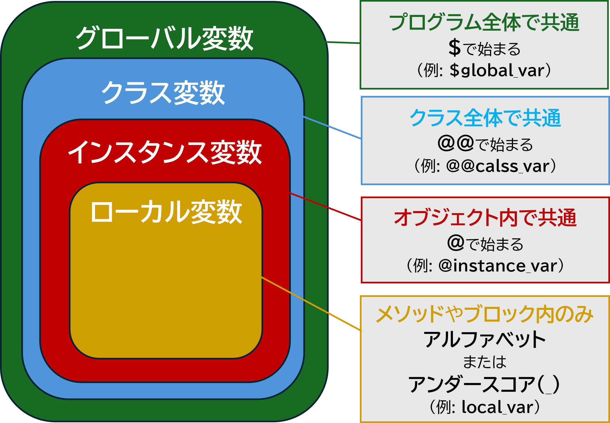

# 2 Ruby基礎
## 目次

- [Rubyの基本的な知識](#rubyの基本的な知識)
  - [Rubyって何？](#Rubyって何)
  - [最初のプログラムを書いてみよう](#最初のプログラムを書いてみよう)
  - [(1) 変数](#1-変数)
  - [(2) 定数](#2-定数)
  - [(3) 真偽値](#3-真偽値)
  - [(4) 配列](#4-配列)
  - [(5) ハッシュ（連想配列）](#5-ハッシュ連想配列)
  - [【問題】](#問題)

## Rubyの基本的な知識

### Rubyって何？


Rubyは、日本のプログラマーまつもとゆきひろ氏（通称Matz）が作ったプログラミング言語です。  
たとえば、「コンピュータにやってほしいこと」を指示するときに使います。

#### Rubyの特徴は？

- **シンプルで分かりやすい**  
  Rubyはプログラムを書くときに、難しい記号やルールが少なくて、自然言語に近い形で書けます。

- **すぐに試せる**  
  書いたコード（プログラム）をその場で動かして、すぐに結果を確認できます。

#### どんな考え方で動くの？

Rubyは「もの（オブジェクト）」を使ってプログラムを作ります。  
たとえば、現実の「車」や「犬」を思い浮かべてみてください。

- **車**には「色」や「速さ」といった情報があり、「走る」や「止まる」といった動きもありますよね。  
- **犬**なら「毛の色」や「体重」の情報と、「吠える」や「歩く」といった動きがあります。

Rubyでは、これらの「もの」をプログラムの中で作り、動かすことができます。

---

#### ポイント
1. __Rubyとは__
    + Rubyは日本のプログラマーまつもとゆきひろ（Matz）氏が作ったプログラミング言語です。
    + コンピュータにやってほしいことを指示するために使います。
1. __Rubyの特徴__
    + __シンプルで分かりやすい__: 自然言語に近い形でプログラミングできます。
    + __すぐに試せる__: コードをすぐに実行して結果を確認できます。
1. __Rubyの動きの考え方__
    + Rubyは「オブジェクト」を使ってプログラムを作ります。現実の「もの（車や犬）」のように、データと動きを組み合わせて動かします。
    
---

#### 簡単な例

例えば、Rubyを使うとこんな感じで書けます。  
```ruby
puts "こんにちは！"
```

このコードを実行すると、コンピュータが「こんにちは！」と画面に表示してくれます。  

---

### 最初のプログラムを書いてみよう

それではRubyを実際に動かしてみましょう。Rubyのコードを実行する方法を説明します。

#### ステップ1: 対話型シェルを使ってみよう

まず、Rubyを試すために「対話型シェル」というツールを使います。以下の手順に従って進めてみましょう。  

1. __シェルを起動する__　　

    __ターミナル__ を開きます。そして次のコマンドを入力してください。
    ```sh
    $ irb
    ```

    正しく入力すると、以下のような画面が表示されます。

    ```rb
    irb(main):001>
    ```
    これで、Rubyのインタラクティブ環境（`irb`）が起動しました。

1. __簡単なコードを書いてみる__  
    
    次に、「`Hello world!`」と表示させてみましょう。
    ```rb
    irb(main):XXX> puts "Hello world!"
    ```
    
    実行すると、次のように表示されます。
    ```rb
    Hello world!
    ```

    これで、Rubyのコードが正しく動いたことが確認できました。  

1. __変数を使ってみる__  

    次に、「変数」を使った簡単なコードを書いてみましょう。  
    
    変数はデータを保存して後で使うための箱です。たとえば、「Alice」という名前を覚えておく箱を用意するとします。この箱にデータを入れたり、取り出したりできるのが変数の役割です。詳しくは後ほど解説します。  

      

    以下のコードを1行ずつ入力して、Enterを押してください。
    
    1. 名前を格納する変数
        ```rb
        irb(main):XXX> name = "Alice"
        ```

    2. 年齢を格納する変数
        ```rb
        irb(main):XXX> age = 30
        ```

    これで変数にデータが保存されました。次に、これらの変数を使って情報を表示してみましょう。 
    
    3. 表示処理のコード
        ```rb
        irb(main):XXX> puts "名前: #{name}, 年齢: #{age}"
        ```

    実行すると、次のように表示されます。
      ```rb
      名前: Alice, 年齢: 30
      ```
    このコードでは、`#{}`の中で変数を呼び出して、変数に保存された値を文字列に埋め込んでいます。  

<br>

#### ステップ2: ファイルにコードを書いて実行する
次に、Rubyのコードをファイルに保存して実行する方法を学びます。

0. __シェルを閉じる__  

    先ほどまで開いていた`irb`を閉じるには、下記のコマンドを入力します。
    ```rb
    exit
    ```

0. __フォルダとファイルを作成する__  

    ターミナルで以下のコマンドを入力して、新しいフォルダとファイルを作りましょう。
    ```sh
    # フォルダを作成する
    $ mkdir ruby

    # 作成したフォルダに移動する
    $ cd ruby
    
    # 新しいファイルを作成する
    $ touch ruby.rb
    ```

    これで、`ruby`というフォルダの中に`ruby.rb`というファイルが作成されました。  

0. __ファイルにコードを書く__  

    次に、`ruby.rb`ファイルをエディタで開き、以下のコードを書いてみてください。
    ```rb
    # ruby.rb

    # 名前と年齢を設定
    name = "Alice"  # "Alice"という名前を変数nameに保存
    age = 30        # 数字30を変数ageに保存

    # 名前と年齢を画面に表示
    puts "名前: #{name}, 年齢: #{age}"  # 変数の値を文字列に埋め込んで出力
    ```
    
<br>

#### ステップ3: コードを実行する
  ターミナルに戻り、以下のコマンドでコードを実行します。

  ```sh
  $ ruby ruby.rb
  ```
  
  実行すると、次のような結果が表示されます。

  ```sh
  名前: Alice, 年齢: 30
  ```

---

#### 用語解説
* __ターミナル__  
  コンピュータにコマンド（指示）を入力するための画面です。Windowsでは「__コマンドプロンプト__」や「__PowerShell__」、Macでは「__ターミナル__」と呼ばれるアプリがあります。  
* __インタラクティブ__  
  コンピュータとユーザーがやり取りをしながらプログラムを実行する方法を指します。 コードを入力するとすぐに実行され、結果が表示されます。初心者がRubyの使い方を学ぶときや、コードの挙動を確かめたいときに便利です。  
* `puts`  
  Rubyで文字列や結果を出力するコマンドです。  
* `#{}`  
  文字列の中で変数の値を埋め込むときに使います。  

<br>

---

### (1) 変数
### (1)-1 変数について  
  Rubyでは、データを扱うために「変数」を使います。変数は、いろいろな種類のデータを格納できる「箱」のようなものです。Rubyには、いくつかのデータ型（データの種類）があり、それぞれのデータ型には特定の特徴があります。以下に、主なデータ型を紹介します。  


<br>

1. __数値型(Numeric)__  
  数値型は、数字を扱うためのデータ型です。数値には2つのタイプがあります。
    + __整数(Integer)__：小数点のない数値。`1`, `100`, `-5`など  
    + __浮動小数点数(Float)__：小数点を含む数値。`3.14`, `2.71828`など

1. __文字列型 (String)__  
  一連の文字。ダブルクォート (`"`) もしくはシングルクォート (`'`) で囲みます。
    + `"Hello, world!"` や `'Ruby is fun!'` など

1. __真偽値型(Boolean)__  
  真偽値型は、2つの値、__真（`true`）__ と __偽（`false`）__ を扱います。この型は、条件分岐などでよく使います。  
  _真偽値については後ほど解説します。_

1. __配列型(Array)__  
  配列型は、複数のデータを1つにまとめて格納できるデータ型です。配列の要素（データ）は、カンマで区切り、角括弧（`[]`）で囲みます。
    + `[1, 2, 3]`   
    + `["apple", "banana", "cherry"]` など

1. __ハッシュ型(Hash)__  
  ハッシュ型は、キーと値のペアを扱うデータ型です。キーは一意の識別子となり、対応する値を取り出すために使います。ハッシュは波括弧（`{}`）で囲み、キーと値は`=>`で結びます。
    + `{ "name" => "John", "age" => 30 }` など

1. __シンボル型(Symbol)__  
  シンボル型は、文字列に似ていますが、特別な特徴があります。シンボルは変更できないデータ（イミュータブル）で、同じシンボルは常に同じオブジェクトを指します。シンボルはコロン（`:`）で始まります。
    + `:name`
    + `:age` など

<br>

これらのデータ型をうまく組み合わせることで、柔軟で強力なRubyプログラムを作ることができます。

Rubyはオブジェクト指向のプログラミング言語であり、全てのデータ型はオブジェクトです。これにより、それぞれのデータ型はメソッドを持ち、様々な操作を行うことができます。

Rubyは「動的型付け言語」という特徴があります。これは、変数を使うときに、型を宣言する必要がないという意味です。たとえば、変数に数値を入れた後、文字列を入れても問題ありません。  

#### 用語解説
* __オブジェクト指向__  
  オブジェクト指向は、 __「もの」を使ってプログラムを作る考え方__ です。たとえば、「犬」を考えると、犬には「毛の色」や「体重」という特徴（データ）があり、「吠える」や「歩く」という動き（メソッド）があります。
  プログラムの中でも、「犬」や「車」などをオブジェクトとして表現し、その特徴や動きを組み合わせて作るのがオブジェクト指向です。
  Rubyでは、すべてのデータがオブジェクトなので、これを自然に扱えます。
  + 簡単なイメージ
    + __特徴（データ）__:「犬の名前はポチ」
    + __動き（メソッド）__:「ポチが吠える」  
  これらをプログラムで表現することで、現実のイメージに近い構造を実現することができます。
* __メソッド__  
  メソッドとは、 __「何かをするための命令のまとまり」__ です。たとえば、「犬が吠える」や「数字を足す」といった動きをプログラムでまとめたものがメソッドです。  
  メソッドを使うと、同じ動きを何度も書かなくて済むので、プログラムがわかりやすく、管理しやすくなります。詳しくは「メソッド」の項目で解説します。

---

### (1)-2 Rubyの変数の種類
Rubyでは、変数にはいくつかの種類があります。それぞれの変数の使い方や特徴を簡単に説明します。



1. __ローカル変数__  
    + __ローカル変数__ は、メソッドの中で使える変数で、そのメソッド内でしか使うことができません。  
    + ローカル変数の名前は、小文字またはアンダースコア（`_`）で始まります。  
1. __グローバル変数__  
    + __グローバル変数__ は、どこからでもアクセスできる変数です。名前の前に `$` をつけて定義します。  
    + 例えば、`$global_var = 100` のように使います。
1. __インスタンス変数__
    + __インスタンス変数__ は、オブジェクト（インスタンス）の状態を保存するために使います。名前の前に `@` をつけます。
    + 例えば、`@name = "Alice"` のように使います。
1. __クラス変数__
    + __クラス変数__ は、クラス内で共有される変数です。名前の前に `@@` をつけます。
    + 例えば、`@@count = 0` のように使います。
1. __疑似変数__
    + __疑似変数__ は、Rubyで特別な意味を持つ変数です。`self`, `nil`, `true`, `false` など、プログラムの中で特別な使い方をします。  
    + これらは値を変更できない予約語です。

---

#### ① ローカル変数とは？  
+ __ローカル変数__ は、メソッドや特定のコードの中でだけ使える変数です。  
+ 名前は小文字の __アルファベット__ または __アンダースコア（`_`）__ から始まります。  

```rb
num = 100
_num = 200

puts num   # 結果: 100
puts _num  # 結果: 200
```  

__注意点__  
ローカル変数は、メソッドの外と中で分離されています。外で作った変数は、メソッド内で直接使えません。  
```rb
num = 100

def output
  puts num  #=> エラーになります
end

output
```

---

#### ② グローバル変数とは？  
+ __グローバル変数__ はプログラムのどこからでも使える変数です。  
+ 名前は __`$`マーク__ で始まります。
```rb
$num = 100

puts $num   #=> 結果: 100
```

__特徴__  
__プログラム全体__ で使えるので便利ですが、 __思わぬバグの原因__ になることもあります。  
__初心者の段階では、まずは他の方法を試してみるのがおすすめです。__  
```rb
$num = 100

def output
  puts $num  # メソッドの中からも使えます
end

output  #=> 結果: 100
```

---

#### ③ インスタンス変数とは？
+ __インスタンス変数__ は、 __オブジェクトごと__ に個別に値を保存できる変数です。  
+ 名前は __`@`マーク__ で始まります。  
  ```rb
  @num = 100

  puts @num   #=> 結果: 100
  ```
__詳しくは「クラス」の項目で説明しますが、同じクラスの別のインスタンスでは異なる値を持つことができます。__

---

#### ④ クラス変数とは？
+ __クラス変数__ は、同じクラスの全てのインスタンスで __共有__ される変数です。  
+ 名前は __`@@`マーク__ で始まります。
```rb
@@num = 100

puts @@num  #=> 100
```
__クラス変数も、詳細は「クラス」の項目で解説します。__

---

#### ⑤ 疑似変数  
+ 疑似変数はRubyが用意した特殊な変数です。
+ 自分で値を変更することはできません（読み取り専用です）。 

__主な疑似変数__  
+ `true` : __真__ の値
+ `false` : __偽__ の値
+ `nil` : __何もない状態__ を表します。他の言語の「`null`」に近い役割をします。

```rb
puts true  #=> 結果: true
puts false #=> 結果: false
puts nil   #=> 結果: 空の状態
```

---

### (1)-3 変数の有効範囲（スコープ）
__スコープ__ とは、変数が使える範囲のことです。Rubyでは主に次のスコープがあります。 
1. __ローカルスコープ__  
    + ローカル変数は、定義された場所（例えば、メソッドの中）でだけ使えます。
      ```rb
      def my_method
      x = 10
      puts x
      end

      my_method   #=> 結果: 10
      puts x      #=> エラー(xはメソッドの外では使えません)
      ```

1. __グローバルスコープ__  
    + グローバル変数は、プログラムのどこからでも使えます。
      ```rb
      $global_var = 20

      def my_method
        puts $global_var
      end

      my_method   #=> 結果: 20
      ```

1. __インスタンススコープ__  
    + インスタンス変数は、そのインスタンスの中でのみ有効です。
      ```rb
      class MyClass
        def initialize
          @instance_var = 30
        end

        def show_instance_var
          puts @instance_var
        end
      end

      obj = MyClass.new
      obj.show_instance_var   #=> 結果: 30
      ```

1. __クラススコープ__  
    + クラス変数はそのクラスとそのサブクラスのインスタンス間で共有されます。
      ```rb
      class MyClass
        @@class_var = 40

        def self.show_class_var
          puts @@class_var
        end
      end

      MyClass.show_class_var   #=> 結果: 40
      ```
      
プログラムを学校に例えた場合、スコープは次のようになります。

| スコープ | 例え | 特徴 |
| ---- | ---- | ---- |
| ローカルスコープ | 教室の黒板 | メソッド内でのみ有効、メソッド外からはアクセスできない。<br>（教室内にいる人なら内容を確認できる。） | 
| グローバルスコープ | 校内掲示板 | プログラム全体でアクセス可能。<br>(校内の誰でも掲示板を利用することができる。) |
| インスタンススコープ | それぞれの生徒の机の引き出し | 各インスタンスごとに個別の情報を保持。<br>(生徒ごとに個別の引き出しを持っている。) |
| クラススコープ | 学級日誌 | クラス全体で共有され、全てのインスタンスがアクセスできる情報。<br>(その学級の生徒なら誰でも日誌を読んだり書き込むことができる。) |

---

#### ポイント
+ __ローカル変数__ は基本的に使いやすく、安全です。
+ __グローバル変数__ は便利ですが、初心者の段階では、慎重に使いながら他の方法を試してみるのがおすすめです。
+ __インスタンス変数__ や __クラス変数__ は、オブジェクト指向の理解が深まると役立ちます。  

この内容を少しずつ試しながら、Rubyの変数に慣れていきましょう。

<br>

---

### (2) 定数  
### (2)-1 定数について  
__定数__ とは、「基本的に変更しない値」を表すものです。変数とは違い、一度設定した値を基本的に変更しないようにするために使います。

+ 定数の名前は必ず __大文字で始める必要__ があります。  
  ```rb
  MAX = 50  # 定数

  puts MAX  #=> 結果: 50
  ```

+ 定数は __メソッドの中で定義することはできません__ 。もし試みるとエラーになります。
  ```rb
  def output_max
    MAX = 50
    puts MAX
  end

  output_max  #=> エラー: dynamic constant assignment
  ```

---

### (2)-2 Rubyでの定数の扱い  
Rubyでは、定数であっても値を再度代入することが可能です。ただし、再代入すると警告が表示されます。この警告を注意喚起と考え、基本的には定数の値を変更しないように心がけましょう。
+ __例: 再代入はできるが警告が出る__
  ```rb
  MAX1 = 50
  MAX1 = 100  #=> 警告: already initialized constant MAX
  puts MAX1   #=> 結果: 100
  ```

#### 定数を変更不可にする方法
もし「絶対に値を変更したくない」という場合は、`freeze`メソッドを使うと、値そのものを変更できなくなります。
+ __例: freezeを使った場合の挙動__  
  ```rb
  # freezeを使うと値が変更できなくなる
  MAX = "固定の値".freeze
  MAX.replace("新しい値")  #=> エラー: can't modify frozen String
  ```

+ ただし、 __freezeを使っても再代入そのものは可能__ です。  
  ```rb
  MAX = "固定の値".freeze
  MAX = "再代入された値"  #=> 警告が出るが代入は可能
  puts MAX  #=> "再代入された値"
  ```

#### ポイント
+ __定数は「変更しないもの」として扱うのが原則__ です。再代入が可能ですが、コードの可読性を損ねたり、バグを引き起こす原因になります。
+ `freeze`メソッドを使うことで、値そのものを変更できなくすることができますが、再代入の防止にはなりません。  

定数を適切に使うことで、プログラムの意図をわかりやすく伝えることができます。

#### 用語解説
+ __再代入__  
  変数や定数に新しい値を設定することです。定数の場合は再代入すると警告が表示されますが、動作自体は可能です。
+ __可読性__  
  コードがどれだけ「読みやすい」かを表します。定数を変更してしまうと、プログラムの意図が分かりにくくなるため、可読性が下がります。

<br>

---

### (3) 真偽値  
プログラムでは「本当かどうか」を判断するために、 __真偽値（しんぎち）__ を使います。真偽値には「真（`true`）」と「偽（`false`）」の2種類があります。   

+ __真の値__  
  Rubyでは、`false`と`nil`以外はすべて「真（`true`）」として扱われます。  
  例えば以下の値はすべて「真」です 
  ```rb
  puts true       #=> true （これ自体が「真」）

  puts !!0        #=> true （0は「真」として扱われる）

  puts !!"false"  #=> true （文字列も「真」として扱われる）
  ```


+ __偽の値__  
  Rubyで「偽」として扱われるのは、`false`と`nil`__だけ__ です。  
  ```rb
  puts false  #=> false （「偽」そのもの）

  puts !!nil  #=> false （`nil`は「何もない」を意味し「偽」として扱われる）
  ```

#### 用語解説
+ `!!`  
  変数を`true`または`false`として表示する際に使用します。

<br>

---

###	(4) 配列  
__配列__ は、データを順番に並べて保存するための入れ物です。  

一度、配列を本棚に例えてみましょう。  


+ 本棚(__配列__)  
本棚には複数の本を順番に並べて収納できます。  
+ 位置(__インデックス__)  
各本には位置があり、1冊目（インデックス0）、2冊目（インデックス1）…というように順番がついています。

本棚を設置したり、本棚から本を取り出したり、本棚に本を追加したりなど、これらと同様の操作を配列でも行うことができます。

---

### (4)-1 配列の作り方  
+ 配列を作るには、`[]`または`Array.new`を使います。  
+ データを`[]`の中にカンマ区切りで並べることで、要素を含む配列を作成します。  

```rb
# 空の配列を作る
arr = []
arr = Array.new  # こう書いてもOK

# データを入れて配列を作る
books = ["水色の本", "白い本", "黄色い本", "緑色の本"]
``` 


---

### (4)-2 配列の中身を取り出す
配列に入っているデータを取り出すには、順番（インデックス）を指定します。インデックスは __0から始まる__ ことに注意してください。

- `books[0]`: 配列の1番目のデータを取得します。  
- `books[-1]`: 配列の最後のデータを取得します。負のインデックスを使うと、__配列の後ろから数えます__。  
```rb
books = ["水色の本", "白い本", "黄色い本", "緑色の本"]

puts books[0]  #=> 水色の本
puts books[1]  #=> 白い本
puts books[-1] #=> 緑色の本 （最後のデータを取り出す）
puts books[-2] #=> 黄色い本 （最後から2番目のデータを取り出す）
```


---

### (4)-3 配列にデータを追加する
配列に新しいデータを追加する方法を2つ紹介します。
1. `push`メソッドを使う
    ```rb
    books = ["水色の本", "白い本"]

    # 配列の最後に"黄色い本"を追加する
    books.push("黄色い本")

    p books  #=> ["水色の本", "白い本", "黄色い本"]
    ```

1. `<<`演算子を使う  
    この方法は簡潔に書けるのでよく使われます。  
    ```rb
    books = ["水色の本", "白い本", "黄色い本"]

    # 配列の最後に"緑色の本"を追加する
    books << "緑色の本"

    p books  #=> ["水色の本", "白い本", "黄色い本", "緑色の本"]
    ```


---

### (4)-4 配列の長さを取得する
配列に入っているデータの数（要素数）を取得するには、`length`または`size`メソッドを使います。どちらも同じ結果を返します。

```rb 
books = ["水色の本", "白い本", "黄色い本", "緑色の本"]

# 配列の長さを取得する
puts books.length  #=> 4
puts books.size    #=> 4
```


---

#### ポイント
1. __配列の作り方__  
    + `[]`または`Array.new`で作成。  
    + データはカンマ区切り(`,`)で並べて定義する。
1. __配列の中身を取り出す__
    + インデックス（順番）を指定して取得。  
    + インデックスは0から始まり、負のインデックスで後ろから取り出せる。
1. __配列にデータを追加する__
    + `push`メソッドまたは`<<`演算子を使う。
    + どちらも配列の最後にデータを追加する。
1. __配列の長さを取得する__
    + `length`または`size`メソッドを使用する。

#### 用語解説
* __`p`メソッド__  
  Rubyの`p`メソッドは、オブジェクト（値や変数など）を「デバッグ用」にわかりやすく表示するためのメソッドです。  
  通常の`puts`や`print`と違い、オブジェクトの内容や型をそのまま確認できるのが特徴です。

<br>

--- 

###	(5) ハッシュ（連想配列） 
#### ハッシュとは？
ハッシュは、データを「 __キー__ 」と「 __値__ 」のペアで保存する特別な入れ物です。  

お店の商品で例えてみます。  
  
果物が売っていますね。それぞれの商品には値段がついています。  
これをハッシュで表現してみましょう。  

まず、以下のように商品名と値段を表にまとめます。  

| キー(商品名) | 値(値段) | 
| --- | --- |
| バナナ | 60円 |
| レモン | 150円 |
| りんご | 100円 |

商品名（キー）と値段（値）が __1対1で紐づいている__ ことがわかりますね。このようなデータのペアをハッシュを使えば、ひとまとめにして管理できます。  

さらに、ハッシュでは商品名（キー）を指定すると、対応する値段（値）をすぐに取り出せます。  
たとえば「バナナ」を指定すれば、瞬時に「60円」という値段がわかります。  

ハッシュは、このようにデータを整理して扱うのに非常に便利な仕組みです。  

---

### (5)-1 ハッシュの作り方
ハッシュを作るには、`{}`または`Hash.new`を使います。

```rb
# 空のハッシュを作る
hash = {}
hash = Hash.new  # この書き方でもOK

# データを入れたハッシュを作る
fruits = {"apple" => 100, "banana" => 60, "lemon" => 150}
```

#### シンボルを使った書き方（おすすめ）
Rubyでは、キーに文字列を使うよりもシンボルを使う書き方がよく使われます。シンボルは、キーを効率よく管理できるメリットがあります。
```rb
fruits = {apple: 100, banana: 60, lemon: 150}  # シンボルで定義
```

---

### (5)-2 ハッシュの中身を取り出す  
`ハッシュ名[キー]`で、格納された値を取り出すことができます。  
例えば、ハッシュ`fruits`の中のキー`apple`の値を取り出すには、`fruits[:apple]`と記述します。  
```rb
fruits = {apple: 100, banana: 60, lemon: 150}

# キーを指定して値を取り出す
puts fruits[:apple]  #=> 100
```

---

### (5)-3 ハッシュにデータを追加する
`ハッシュ名[新しいキー] = 値`で、新たに値を格納することができます。  
例えば、ハッシュ`fruits`の中に新しいキー`banana`を設定し、値`60`を持たせるには、`fruits[:banana] = 60`と記述します。 

```rb
fruits = {apple: 100}

# 新しいキーと値を追加
fruits[:banana] = 60
p fruits  #=> {:apple=>100, :banana=>60}
```

---

#### ポイント  
1. __ハッシュとは__  
  「キー」と「値」のセットを保存する入れ物。  
2. __作り方__  
  `{}`で囲む。シンボルを使った定義がおすすめ。  
3. __使い方__  
    + 値を取り出す：`ハッシュ名[キー]`
    + 値を追加する：`ハッシュ名[新しいキー] = 値`
    
<br>

---

### 【問題】  
1. 変数`name`に文字列で自分の名前を代入し、それを出力するコードを書いてください。  
    <details>
      <summary>解答例</summary>
    
      ```rb
      name = "Alice"
      puts name
      ```

    </details>

2. グローバル変数`age`に値`30`を代入し、それを出力するコードを書いてください。  
    <details>
      <summary>解答例</summary>

      ```rb
      $age = 30
      puts $age
      ```

    </details>

3. インスタンス変数`height`に値`180`を代入し、それを出力するコードを書いてください。  
    <details>
      <summary>解答例</summary>

      ```rb
      @height = 180
      puts @height
      ```

    </details>

4. クラス変数`count`に値`10`を代入し、それを出力するコードを書いてください。
    <details>
      <summary>解答例</summary>

      ```rb
      class Sample
        @@count = 10
        puts @@count
      end
      ```

    </details>

5. 真偽値`true`を出力するコードを書いてください。
    <details>
      <summary>解答例</summary>

      ```rb
      puts true
      ```

    </details>

6. 配列`numbers`に要素`1`, `2`, `3`を格納し、それを出力するコードを書いてください。
    <details>
      <summary>解答例</summary>

      ```rb
      numbers = [1, 2, 3]
      puts numbers
      ```

    </details>

7. ハッシュ`person`にキーとして`name`、値として自分の名前を追加し、そのハッシュから`name`の値を出力するコードを書いてください。
    <details>
      <summary>解答例</summary>

      ```rb
      person = {}
      person[:name] = "Bob"
      puts person[:name]
      ```

    </details>

8. 定数`PI`に値`3.14`を代入し、それを出力するコードを書いてください。
    <details>
      <summary>解答例</summary>

      ```rb
      PI = 3.14
      puts PI
      ```

    </details>

9. 真偽値`false`を出力するコードを書いてください。
    <details>
      <summary>解答例</summary>

      ```rb
      puts false
      ```

    </details>

10. 配列`colors`に要素`"red"`, `"blue"`, `"green"`を格納し、その要素数を出力するコードを書いてください。
    <details>
      <summary>解答例</summary>

      ```rb
      colors = ["red", "blue", "green"]
      puts colors.length
      ```

    </details>
