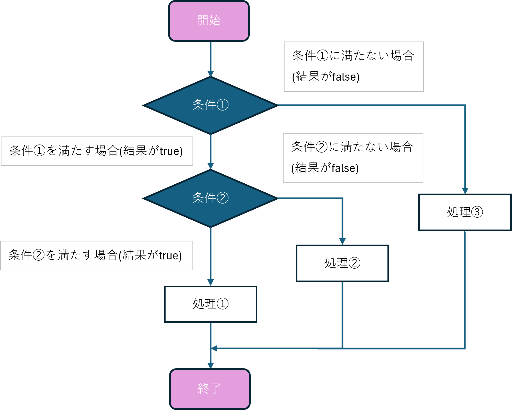
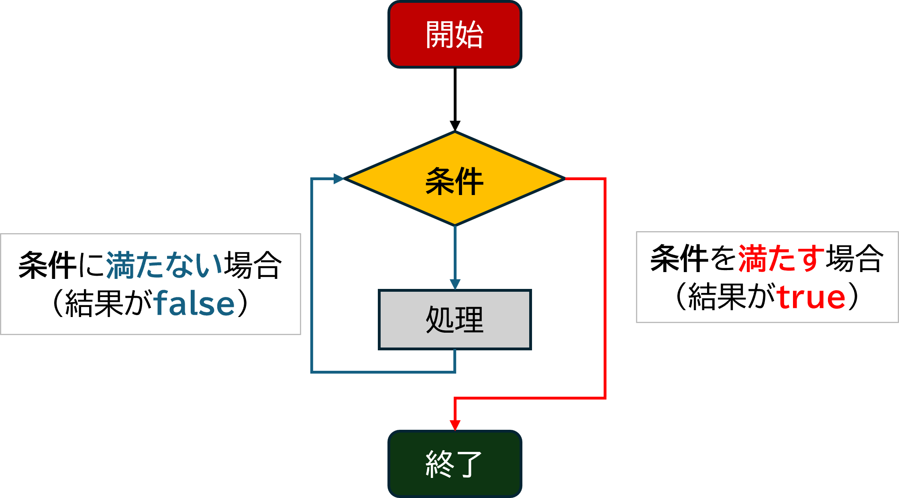
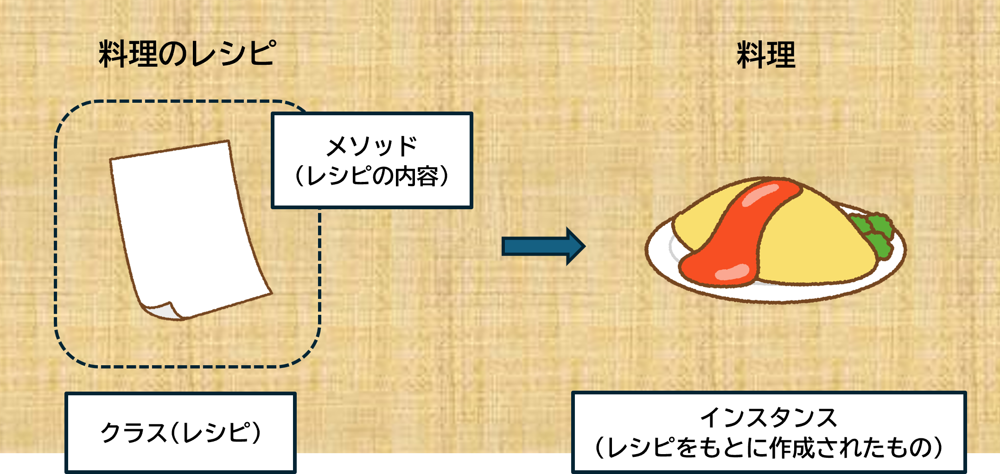

# 2 Ruby基礎

## 目次

- [(6) 演算子](#6-演算子)
- [(7) 条件分岐](#7-条件分岐)
- [(8) 繰り返し](#8-繰り返し)
  - [（8.5）インクリメント](#85-インクリメント値を1増やす)
- [(9) メソッド](#9-メソッド)
- [【問題】](#問題)

--- 

###	(6) __演算子__  
###	(6)-1 演算子とは？ 
Rubyでは、演算子（`+` や `-` など）は特別な「キーワード」のように見えますが、実はすべて「 __メソッド__ 」として扱われています。  
そのため、ほとんどの演算子を自分で作り変えること（再定義）が可能です。  

ただし、Rubyが用意していない演算子を使おうとするとエラーが発生しますので注意してください。

---

###	(6)-2 演算子の優先順位
プログラムの中で複数の演算子を使うとき、それぞれの計算をどの順番で行うかは「 __優先順位__ 」によって決まります。  
この優先順位を知らないと、プログラムが自分の意図と違う動きをしてしまうことがあります。  

例えば以下のように、`*` や `/` は `+` よりも優先して計算されます。

---

#### 演算子の優先順位（高い順）
| 優先順位 | 演算子 | 説明 | 例 |
|---------:|--------|------|----|
| 1 | `::` | 定数やクラスの参照 | `Math::PI` |
| 2 | `[]` | 配列・ハッシュの要素参照 | `array[0]` |
| 3 | `+`(単項), `!`, `~` | 正の値、論理否定、ビット反転 | `+a`, `!true`, `~0b1010` |
| 4 | `**` | べき乗 | `2**3`（2の3乗） |
| 5 | `-`(単項) | 負の値 | `-10` |
| 6 | `*`, `/`, `%` | 掛け算、割り算、余り | `10 * 2`, `10 / 3`, `10 % 3` |
| 7 | `+`, `-` | 足し算、引き算 | `5 + 3`, `5 - 3` |
| 8 | `<<`, `>>` | ビットシフト | `2 << 1` |
| 9 | `&` | ビットAND | `5 & 3` |
| 10 | **&#x7C;** , `^` | ビットOR、XOR | **5 &#x7C; 3** , `5 ^ 3` |
| 11 | `>`, `>=`, `<`, `<=` | 大小比較 | `5 > 3`（true） |
| 12 | `<=>`, `==`, `===`, `!=`, `=~`, `!~` | 比較・正規表現マッチ | `"abc" =~ /a/` |
| 13 | `&&` | 論理AND | `true && false` |
| 14 | **&#x7C;&#x7C;** | 論理OR | **true &#x7C;&#x7C; false** |
| 15 | `..`, `...` | 範囲 | `(1..5)`, `(1...5)` |
| 16 | `?:` | 条件演算子 | `条件 ? 真 : 偽` |
| 17 | `=`, `+=`, `-=`, `*=`, `/=` | 代入 | `x = 5`, `x += 3` |
| 18 | `not` | 否定（`!` と同じ） | `not true`（false） |
| 19 | `and`, `or` | 条件の結合 | `true and false`（false） |

---

__優先順位の例__  
具体例を見てみましょう。  

```rb
a && b || c
```

1. `&&` は `||` よりも優先順位が高いため、まず `(a && b)` が計算されます。  
2. 次に `(a && b) || c` が計算されます。  

もう一つの例です。

```rb
a || b && c
```

1. `&&` は `||` よりも優先順位が高いため、まず `(b && c)` が計算されます。  
2. 次に `a || (b && c)` が計算されます。

---

#### ポイント

+ __演算子の優先順位は、数学のルールに似ています。__  
  例えば、掛け算（`*`）は足し算（`+`）よりも先に計算されるのと同じです。

+ __必要に応じてカッコを使うと優先順位を明確にできます。__  
  例えば、`a || (b && c)` のように書くと、計算の順番がはっきりして間違いにくくなります。

<br>

--- 

### (7) __条件分岐__  
プログラムで「条件に応じて違う処理をする」ために使います。  



###	(7)-1　if（もし〜なら）  
#### ①　基本の使い方

条件が __真（true）__ なら処理を実行します。

```rb
num = 10

if num == 10
  puts "OK"  # numが10ならこの行が実行される
end
```

#### ② if文の条件に満たない場合

`else` を使うと、条件が __偽（false）__ の場合の処理も書けます。

```rb
num = 100

if num < 10
  puts "OK"  # numが10未満ならこの行が実行される
else
  puts "NG"  # それ以外ならこの行が実行される
end
```

#### ③ 複数の条件がある場合  

`elsif` を使うと、条件をさらに増やせます。

```rb
num = 1

if num < 0
  puts "negative"  # numが0未満ならこの行
elsif num == 1
  puts "one"       # numが1ならこの行
else
  puts num         # その他の場合はnumをそのまま表示
end
```

#### ④ 後置if（簡単な条件で使う）  

処理を短く書けます。  

```rb
puts "OK" if true  # 条件がtrueなら"OK"を表示
```

#### ⑤ 三項演算子 

`?:`を使うことで、短く条件分岐を書けます。

```rb
num = 5
result = num > 0 ? "positive" : "negative"
puts result  # numが0より大きければ"positive"、それ以外は"negative"
```

---

### (7)-2 unless（〜でない場合）
`if` の逆で、条件が __偽（false）__ のときに処理を実行します。
```rb
unless false
  puts "OK"  # 条件がfalseならこの行
else
  puts "NG"  # 条件がtrueならこの行
end
```

---

### (7)-3 case（たくさんの条件がある場合）
複数の条件をシンプルに書くのに便利です。他の言語の `switch` に似ています。  

```rb
num = 1

case num
when 0
  puts "zero"       # numが0ならこの行
when 1
  puts "one"        # numが1ならこの行
when 2, 3, 5, 7
  puts "prime"      # numが2, 3, 5, 7のいずれかならこの行
when 100..1000
  puts "over 100"   # numが100〜1000ならこの行
else
  puts "unknown"    # その他の場合
end
```

---

#### ポイント

+ __`if` と `unless` の違い__  
  if は「〜なら」、unless は「〜でなければ」を表します。
+ __後置ifと三項演算子__  
  短い条件分岐に便利。コードがスッキリします。
+ __`case`__  
  複数条件がある場合に便利。

<br>

--- 

###	(8) __繰り返し__  

プログラムで同じ処理を何度も繰り返したいときに使います。
Rubyには便利な繰り返しの仕組みがたくさんあります。  



###	(8)-1 while（〜の間繰り返す）  

#### ① 基本の使い方  

条件が`true`の間、処理を繰り返します。

```rb
arr = []

# 配列のサイズが3未満の間、"hoge"を追加する
while arr.size < 3
  arr << "hoge"
end

p arr  #=> ["hoge", "hoge", "hoge"]
```

#### ② 短く書く（後置while）  

`while` を後ろに置くことで、簡潔に書けます。  

```rb
arr = []

# 配列のサイズが3未満の間、"hoge"を追加する
arr << "hoge" while arr.size < 3

p arr  #=> ["hoge", "hoge", "hoge"]
```

---

###	(8)-2 times（指定回数繰り返す）  

指定した回数だけ繰り返し処理を行います。  

```rb
# 5回繰り返して "OK" を表示する
5.times do
  puts "OK"
end

# 実行結果:
# OK
# OK
# OK
# OK
# OK
```

---

###	(8)-3 each（データの中身を順番に取り出す）  
配列やデータの要素を一つずつ取り出して処理します。  

```rb
numbers = [1, 2, 3, 4, 5]

# 配列の要素を一つずつ取り出して表示する
numbers.each do |num|
  puts num
end

# 実行結果:
# 1
# 2
# 3
# 4
# 5
```

---

###	(8)-4 for（指定した範囲で繰り返す）  
`for` を使うと、指定した範囲や配列の要素を順番に繰り返すことができます。  

```rb
# 1から5まで繰り返す
for i in 1..5
  puts i
end

# 実行結果:
# 1
# 2
# 3
# 4
# 5
```

`for` は範囲（`1..5`）の中で繰り返す処理を簡単に書ける方法です。

---

### (8)-5 until（〜でない限り繰り返す）  
`until` は条件が __false__ である限り処理を繰り返します。つまり、「条件が __true__ になったら止まる」という形になります。  

```rb
# 配列のサイズが3以上になるまで繰り返す
arr = []

until arr.size >= 3
  arr << "hoge"
end

p arr  #=> ["hoge", "hoge", "hoge"]
```

---

### (8)-6 upto（指定した数まで繰り返す）   
`upto` は指定した数まで順番に繰り返します。指定した数を含めて繰り返すのが特徴です。  

```rb
# 1から5まで繰り返す（5も含まれる）
1.upto(5) do |i|
  puts i
end

# 実行結果:
# 1
# 2
# 3
# 4
# 5
```

---

### (8.5) インクリメント（値を1増やす）  
繰り返し処理では、変数を少しずつ増やしたり（インクリメント）することがよくあります。  

1. __`+=` を使う__  
変数に特定の値を加えます。
    ```rb
    x = 5
    x += 1  # xに1を足す
    puts x  # 出力: 6
    ```

2. __`succ` メソッドを使う__  
`succ` は次の値を返すメソッドです（数値や文字に使えます）。  
    ```rb
    # 数値を増やす
    x = 5
    x = x.succ
    puts x  # 出力: 6

    # 文字を次に進める
    str = "a"
    str = str.succ
    puts str  # 出力: "b"
    ```

---

#### ポイント
1. `while`__（条件が`true`の間繰り返す）__  
    + 条件が `true` の間、処理を繰り返す。
    + 後置`while`で簡潔に書ける。
2. `times`__（指定回数繰り返す）__  
    + 指定した回数だけ繰り返し処理を実行。
3. `each`__（データの要素を一つずつ取り出す）__  
    + 配列などのデータを順番に取り出して処理。
4. `for`__（範囲や配列の要素を繰り返す）__  
    + 範囲（`1..5`）などで指定された値を順番に繰り返し。
5. `until`__（条件がfalseである限り繰り返す）__  
    + 条件が`true`になるまで繰り返し処理を実行。
6. `upto`__（指定した数まで繰り返す）__  
    + 指定した数まで順番に繰り返し（指定した数も含む）。
7. __インクリメント（値を1増やす）__  
    + `+=`演算子や`succ`メソッドを使って、変数の値を増やす。

<br>

--- 

###	(9) __メソッド__  
プログラムの中で、繰り返し使う処理をまとめておくために「__メソッド__」を使います。これを使うことで、コードを整理し、再利用することができます。  
例えるならば、クラスは「料理のレシピ」、オブジェクトは「実際に作られた料理」です。メソッドはレシピに書かれた「料理の手順」で、手順通りに作ることで料理が完成します。クラスを使ってオブジェクトを作り、メソッドで動作を実行します。  



###	(9)-1　メソッドについて    
メソッドを使うとき、どのオブジェクトに対してそのメソッドを実行するかを「__レシーバ__」と言います。  
Rubyのメソッドは「レシーバ」によって3つの種類に分けることができます。
#### ① __インスタンスメソッド__  
+ __インスタンス__ を使ってメソッドを呼び出します。  
+ クラスから作ったオブジェクト（インスタンス）に対してメソッドを実行します。  
#### ② __クラスメソッド__  
+ __クラス__ そのものに対してメソッドを呼び出します。  
+ クラス自体を使ってメソッドを実行します。  
#### ③ __プライベートメソッド__  
+ 他の場所からは呼び出せません。  
+ クラス内の処理でのみ使うためのメソッドです。  

例えば、次の例では`numbers`がレシーバです。

```rb
numbers.each do |num|
  puts num
end
```

##### 用語解説
+ __クラス__: 関連するデータ（属性）と処理（メソッド）をひとまとめにする仕組み。  
+ __インスタンス__: インスタンスは、クラスから実際に生成されたオブジェクトのこと。  

詳しくはそれぞれの項目で解説します。

---

#### 引数と戻り値  

メソッドには「引数」と「戻り値」という概念があります。  
+ __引数__  
  メソッドに渡す情報です。メソッドを使うときに必要なデータを渡すことで、そのデータを使ってメソッドが処理をします。
+ __戻り値__  
  メソッドを実行した後に返ってくる結果です。  

例えば、次のメソッドでは、2つの数字を受け取って足してその結果を`return`を使って返します。  

```rb
def add(x, y)
  return x + y
end

result = add(3, 5)  # 3と5を足して、結果8が返ってくる
puts result  #=> 8
```

戻り値を返さないメソッドもあります。この場合、デフォルトで`nil`が返されます。  

```rb
def say_hello
  puts "Hello, World!"
end

result = say_hello
puts result  #=> nil
```

また、`return`を使用するとそれ以降のメソッド内の処理は行われないため、注意が必要です。  

---

###	(9)-2 メソッドの定義方法  

#### ① __メソッドの共通の書き方__  
+ メソッド名は最初を小文字にし、複数の単語がある場合は`_`でつなげます（スネークケース）。  
+ メソッドを定義するには、`def`（定義の開始）と`end`（定義の終了）で囲みます。  

  ```rb
  def to_answer(answer)
    puts "答えは#{answer}です"
  end

  to_answer(8)  #=> 答えは8です
  ```

#### ② __インスタンスメソッド__  
+ クラス内で定義したメソッドで、インスタンスを使って実行します。

  ```rb
  class Sample
    def to_answer(answer)
      puts "答えは#{answer}です"
    end
  end

  sample = Sample.new
  sample.to_answer(8)  #=> 答えは8です
  ```

#### ③ クラスメソッド  
+ クラス自体を使って実行するメソッドです。  
+ `class`内で定義するか、`class名.method名`で定義します。

  ```rb
  class Sample
  end

  def Sample.to_answer(answer)
    puts "答えは#{answer}です"
  end

  Sample.to_answer(8)  #=> 答えは8です
  ```

  クラス定義内でも`self`を使ってクラスメソッドを定義できます。  

  ```rb
  class Sample
    def self.to_answer(answer)
      puts "答えは#{answer}です"
    end
  end

  Sample.to_answer(8)  #=> 答えは8です
  ```

####	④　プライベートメソッド  
+ クラス内でしか使えないメソッドです。
+ 外部からは呼び出せません。内部処理用のメソッドとして使います。
+ `private`を使うことで、それ以降のメソッドはプライベートメソッドとして扱われます。  

  ```rb
  class Sample
    private

    def to_answer(answer)
      puts "答えは#{answer}です"
    end
  end

  sample = Sample.new
  sample.to_answer(8)  #=> これはエラーになる
  ```
  ---

#### ポイント
1. __メソッドとは？__  
    + 繰り返し使う処理をまとめたもの。  
    + コードを整理し、再利用できるようにする仕組み。  

2. __メソッドの種類（Rubyの「レシーバ」による分類）__  
    1. __インスタンスメソッド__
        + インスタンス（クラスから作られたオブジェクト）を使って呼び出すメソッド。
    2. __クラスメソッド__
        + クラスそのものに対して呼び出すメソッド。
    3. __プライベートメソッド__
        + クラス内部でのみ使えるメソッド。外部から呼び出すことはできない。

3. __引数と戻り値__
    + __引数__：メソッドに渡す情報。処理に必要なデータを提供する。
    + __戻り値__：メソッドが実行後に返す結果。計算結果や処理結果など。

4. __メソッドの書き方__
    1. __基本の書き方__
        + メソッド名はスネークケース（単語をアンダースコアで区切る形式）で書く。
        + 定義は「開始」と「終了」を明確に記述する。
    2. __インスタンスメソッド__
        + クラス内で定義し、インスタンスを使って実行する。
    3. __クラスメソッド__
        + クラス自体で実行するためのメソッド。
        + クラス内で定義するか、クラス名を使って直接定義する方法がある。
    4. __プライベートメソッド__
        + 外部からは呼び出せず、クラス内部専用。
        + 定義時に「プライベートであること」を明示する。

5. __メソッドを使うメリット__
    + コードを簡潔でわかりやすくする。  
    + 同じ処理を繰り返し記述する必要がなくなる。
    + 処理をまとめて管理できるため、バグを防ぎやすい。
    + 再利用性が高まり、開発効率が向上する。

---

### (9)-3 Rubyの組み込みメソッド

前項目で解説したメソッドとは異なり、Rubyには**あらかじめ用意されたメソッド**がいくつかあります。これを「**組み込みメソッド**」と呼び、特別な準備なしに使うことができます。例えば、配列の`length`メソッドや、標準出力をする`puts`もその一つです。代表的なものを中心に紹介していきます。

<details open>
<summary>文字列操作</summary>

#### `puts`  
値を出力するためのメソッド。文字列をコンソールに表示し、表示後に改行を追加します。  
```ruby
puts "Hello, world!"
```

---

#### `gets`
ユーザーからの入力を受け取るためのメソッド。入力後、改行が含まれるため、必要に応じて`chomp`メソッドで改行を削除します。
```ruby
name = gets
puts "Hello, #{name}!"
```

---

#### `chomp`
文字列の末尾の改行を削除するメソッド。`gets`で入力した文字列の末尾に改行が含まれるため、それを削除するために`chomp`を使います。
```ruby
name = gets.chomp
puts "Hello, #{name}!"
```

---

#### `reverse`
文字列の順番を逆にするメソッド。
```ruby
str = "hello"
puts str.reverse  # "olleh"
```

---

#### `upcase` / `downcase`
文字列を全て大文字または小文字に変換するメソッド。`upcase`は大文字に、`downcase`は小文字に変換します。  

```ruby
str = "hello"
puts str.upcase   # "HELLO"
puts str.downcase # "hello"
```

---

#### `split`
文字列を指定した区切り文字で分割し、配列を返すメソッド。
```ruby
str = "apple,banana,orange"
arr = str.split(",")
puts arr.inspect  # 結果は["apple", "banana", "orange"]

# 区切り文字を指定しないと、空白で分割される
str = "hello world"
arr = str.split
puts arr.inspect  # 結果は["hello", "world"]
```

---

</details>

<br>

<details>
<summary>配列系(クリックすると開きます)</summary>

#### `length` / `size`  
配列や文字列の長さ（要素数や文字数）を返すメソッド。
```ruby
str = "Hello"
puts str.length  # 5

str = "Hello"
puts str.size    # 5
```

---

#### `p` / `inspect`
オブジェクトの内容を人間が理解できる形式で文字列として返すメソッド。デバッグや表示用に使われることが多い。
```ruby
arr = [1, 2, 3]
result = arr.inspect
puts result  # 結果は "[1, 2, 3]"（配列の内容が文字列で表示される）

str = "hello"
result = str.inspect
puts result  # 結果は "\"hello\""（文字列は引用符付きで表示される）
```

```ruby
arr = [1, 2, 3]
p arr  # 結果は [1, 2, 3]（配列の内容がそのまま表示される）

str = "hello"
p str  # 結果は "hello"（文字列がそのまま表示される）
```

---

#### `keys`
ハッシュのキーを配列として返すメソッド。ハッシュのすべてのキーを取得したい場合に使用します。
```ruby
hash = {a: 1, b: 2, c: 3}
result = hash.keys
puts result.inspect  # 結果は [:a, :b, :c]（ハッシュのキーが配列として返される）
```

---

#### `values`
ハッシュの値を配列として返すメソッド。ハッシュのすべての値を取得したい場合に使用します。
```ruby
hash = {a: 1, b: 2, c: 3}
result = hash.values
puts result.inspect  # 結果は [1, 2, 3]（ハッシュの値が配列として返される）
```

---

#### `index`
配列の中で、指定した要素が最初に出現するインデックス（位置）を返すメソッド。要素が見つからない場合は `nil` を返す。
```ruby
arr = [10, 20, 30, 40]
puts arr.index(30)  # 結果は2
puts arr.index(50)  # 結果はnil
```

---

#### `push`
配列の末尾に1つまたは複数の要素を追加するメソッド。
```ruby
arr = [1, 2, 3]
arr.push(4)
puts arr.inspect  # 結果は[1, 2, 3, 4]

arr.push(5, 6)
puts arr.inspect  # 結果は[1, 2, 3, 4, 5, 6]
```

---

#### `insert`
指定した位置に要素を挿入するメソッド。元の配列が変更され、その後の要素は右にシフトされる。
```ruby
arr = [1, 2, 4, 5]
arr.insert(2, 3)  # インデックス2の位置に3を挿入
puts arr.inspect  # 結果は [1, 2, 3, 4, 5]

# 複数の要素を挿入
arr.insert(1, "a", "b")
puts arr.inspect  # 結果は [1, "a", "b", 2, 3, 4, 5]
```

---

#### `delete`
配列やハッシュの中から指定した要素を削除するメソッド。削除した要素を返し、要素が存在しない場合は `nil` を返す。
```ruby
arr = [1, 2, 3, 4, 5]
result = arr.delete(3)
puts result  # 結果は3（削除した要素）
puts arr.inspect  # 結果は [1, 2, 4, 5]

# 存在しない要素を削除しようとした場合
result = arr.delete(6)
puts result  # 結果はnil
```

---

#### `slice`
配列や文字列から指定した範囲の部分を切り出して返すメソッド。指定したインデックスまたは範囲に基づいて要素を取得できる。
```ruby
arr = [1, 2, 3, 4, 5]
result = arr.slice(1, 3)  # インデックス1から3つの要素を取り出す
puts result.inspect  # 結果は [2, 3, 4]

# 範囲で指定
result = arr.slice(1..3)  # インデックス1から3までの要素を取り出す
puts result.inspect  # 結果は [2, 3, 4]
```

---

#### `pop`
配列の末尾から1つの要素を取り出し、その要素を配列から削除するメソッド。
```ruby
arr = [1, 2, 3, 4]
puts arr.pop  # 結果は4
puts arr.inspect  # 結果は[1, 2, 3]
```

---

#### `join`
配列の要素を指定した区切り文字で結合して、1つの文字列を作成するメソッド。
```ruby
arr = ["apple", "banana", "cherry"]
result = arr.join(", ")
puts result  # 結果は "apple, banana, cherry"

# 区切り文字なしで結合
result = arr.join
puts result  # 結果は "applebananacherry"
```

---

#### `each`  
配列やハッシュの各要素を繰り返し処理するメソッド。配列やハッシュの各要素を一つずつ取り出して処理します。
```ruby
[1, 2, 3].each do |num|
  puts num * 2
end
```

---

#### `reverse_each`
配列の要素を逆順で繰り返し処理するメソッド。元の配列は変更されません。
```ruby
arr = [1, 2, 3, 4]
arr.reverse_each do |n|
  puts n
end
# 結果は:
# 4
# 3
# 2
# 1
```

---

#### `each_with_index`  
配列やハッシュの各要素とそのインデックスを取得して繰り返し処理するメソッド。
```ruby
["a", "b", "c"].each_with_index do |value, index|
  puts "#{index}: #{value}"
end
```

---

#### `cycle`
配列の要素を指定した回数だけ繰り返して処理するメソッド。無限に繰り返すことも可能。ブロックを指定しない場合は Enumerator を返す。
```ruby
arr = [1, 2, 3]

# 指定した回数だけ繰り返し処理
arr.cycle(2) do |n|
  puts n
end
# 結果は:
# 1
# 2
# 3
# 1
# 2

# 無限に繰り返す場合
arr.cycle do |n|
  puts n
  break if n == 2  # 条件を満たしたら終了
end
```

---

#### `max`
配列の中で最大の要素を返すメソッド。複数の最大値がある場合は最初に出現するものを返す。
```ruby
arr = [1, 5, 3, 9, 2]
puts arr.max  # 結果は9

# 比較する基準をブロックで指定することもできる
arr = [1, 2, 3, 4]
puts arr.max { |a, b| a <=> b }  # 結果は4
```

---

#### `min`
配列の中で最小の要素を返すメソッド。複数の最小値がある場合は最初に出現するものを返す。
```ruby
arr = [1, 5, 3, 9, 2]
puts arr.min  # 結果は1

# 比較する基準をブロックで指定することもできる
arr = [1, 2, 3, 4]
puts arr.min { |a, b| a <=> b }  # 結果は1
```

---

#### `sample`
配列からランダムに1つまたは指定した数の要素を選んで返すメソッド。
```ruby
arr = [1, 2, 3, 4, 5]
result = arr.sample  # ランダムに1つの要素を選ぶ
puts result  # 結果はランダムな1つの要素（例: 3）

# 複数の要素をランダムに選ぶ
result = arr.sample(3)
puts result.inspect  # 結果はランダムに選ばれた3つの要素（例: [1, 4, 2]）
```

---

#### `find`
配列の中から、ブロックの条件を満たす最初の要素を返すメソッド。条件を満たす要素がない場合は `nil` を返す。
```ruby
arr = [1, 2, 3, 4, 5]
result = arr.find { |n| n > 3 }
puts result  # 結果は4

# 条件を満たす要素がない場合
result = arr.find { |n| n > 5 }
puts result  # 結果はnil
```

---

#### `count`
配列やEnumerableの中で、条件を満たす要素の数を返すメソッド。引数なしで呼び出すと、配列の全要素数を返す。
```ruby
arr = [1, 2, 3, 4, 5]
result = arr.count { |n| n.even? }
puts result  # 結果は2（2と4が条件を満たす）

result = arr.count
puts result  # 結果は5（配列の要素数）
```

---

#### `map`  
配列の各要素に対して処理を行い、その結果を新しい配列として返すメソッド。
```ruby
numbers = [1, 2, 3]
doubled = numbers.map { |num| num * 2 }
puts doubled  # [2, 4, 6]
```

---

#### `select`  
配列の各要素に対して条件を満たすものを選び、その結果を新しい配列を返すメソッド。
```ruby
numbers = [1, 2, 3, 4, 5]
even_numbers = numbers.select { |num| num.even? }
puts even_numbers  # [2, 4]
```

---

#### `reject`
配列の各要素に対して条件を満たさないものを選び、その結果を新しい配列を返すメソッド。
```ruby
arr = [1, 2, 3, 4, 5]
result = arr.reject { |n| n.even? }
puts result.inspect  # 結果は[1, 3, 5]
```

---

#### `uniq`
配列の中で重複する要素を削除し、一意な要素だけを含む新しい配列を返すメソッド。
```ruby
arr = [1, 2, 2, 3, 3, 4]
puts arr.uniq.inspect  # 結果は[1, 2, 3, 4]
```

---

#### `zip`
複数の配列を順番に結びつけて、新しい配列を作成するメソッド。各配列の対応する要素が1つの配列にまとめられ、元の配列の数と長さが揃わない場合は、短い方が `nil` で埋められる。
```ruby
arr1 = [1, 2, 3]
arr2 = ['a', 'b', 'c']
result = arr1.zip(arr2)
puts result.inspect  # 結果は [[1, "a"], [2, "b"], [3, "c"]]

# 配列が長さが違う場合
arr3 = [10, 20]
result = arr1.zip(arr3)
puts result.inspect  # 結果は [[1, 10], [2, 20], [3, nil]]
```

---

#### `reverse`
配列の順番を逆にするメソッド(文字列と同様)。
```ruby
arr = [1, 2, 3]
puts arr.reverse  # [3, 2, 1]
```

---

#### `sort`
配列を昇順に並べ替える(ソートする)メソッド。`reverse`と組み合わせて使うと降順にできます。

```ruby
arr = [3, 1, 2]
sorted_arr = arr.sort
puts sorted_arr  # [1, 2, 3]
```

```ruby
arr = [3, 1, 2]
sorted_arr = arr.sort.reverse
puts sorted_arr  # [3, 2, 1]
```

---

#### `sort_by`
指定した基準で、配列の要素を並べ替えるメソッド。ブロック内で基準となる値を返すことで並べ替えを行う。
```ruby
arr = [{ name: "Alice", age: 25 }, { name: "Bob", age: 30 }, { name: "Charlie", age: 20 }]
sorted_arr = arr.sort_by { |person| person[:age] }
puts sorted_arr.inspect
# 結果は:
# [{:name=>"Charlie", :age=>20}, {:name=>"Alice", :age=>25}, {:name=>"Bob", :age=>30}]
```

---

#### `inject`  
配列や範囲の要素を順に処理して、最終的な結果を返すメソッド。  
```ruby
numbers = [1, 2, 3, 4]
sum = numbers.inject(0) { |sum, num| sum + num }
puts sum  # 10
```
`inject`は配列や範囲の要素を累積処理します。

---

#### `shift`
配列の最初の要素を取り出し、その要素を配列から削除するメソッド。
```ruby
arr = [1, 2, 3]
puts arr.shift  # 結果は1
puts arr.inspect  # 結果は[2, 3]
```

---

#### `unshift`
配列の最初に1つまたは複数の要素を追加するメソッド。
```ruby
arr = [2, 3]
arr.unshift(1)
puts arr.inspect  # 結果は[1, 2, 3]

arr.unshift(-1, 0)
puts arr.inspect  # 結果は[-1, 0, 1, 2, 3]
```

---

#### `flatten`
多次元の配列を1次元の配列に変換するメソッド。配列内のすべてのネストされた配列を平坦化する。
```ruby
arr = [1, [2, 3], [4, [5, 6]]]
flattened_arr = arr.flatten
puts flattened_arr.inspect  # 結果は [1, 2, 3, 4, 5, 6]
```

---

#### `compact`
配列から `nil` の要素を取り除いた新しい配列を返すメソッド。元の配列は変更されません。
```ruby
arr = [1, nil, 2, nil, 3]
result = arr.compact
puts result.inspect  # 結果は [1, 2, 3]
puts arr.inspect     # 元の配列は変更されていない: [1, nil, 2, nil, 3]
```

---

#### `transpose`
配列の配列を行列のように扱い、行と列を入れ替えるメソッド。2次元配列に適用すると、行と列が入れ替わった新しい配列を返す。
```ruby
arr = [[1, 2, 3], [4, 5, 6], [7, 8, 9]]
result = arr.transpose
puts result.inspect  # 結果は [[1, 4, 7], [2, 5, 8], [3, 6, 9]]
```

---

#### `partition`
配列の要素を、指定した条件に基づいて2つのグループに分けるメソッド。条件を満たす要素と満たさない要素をそれぞれ別々の配列として返す。
```ruby
arr = [1, 2, 3, 4, 5]
result = arr.partition { |n| n.even? }
puts result.inspect  # 結果は [[2, 4], [1, 3, 5]]（偶数と奇数に分けられた配列）
```

---


</details>

<br>

<details>
<summary>条件判定(クリックすると開きます)</summary>

#### `nil?`  
オブジェクトが`nil`かどうかを確認するメソッド。
```ruby
x = nil
puts x.nil?  # true
```

---

#### `include?`
配列に指定した要素が含まれているかを確認するメソッド。
```ruby
arr = [1, 2, 3]
puts arr.include?(2)  # true
```

---

#### `empty?`
配列や文字列などのオブジェクトが空かどうかを判定するメソッド。空であれば `true` を返し、そうでなければ `false` を返す。
```ruby
arr = []
puts arr.empty?  # 結果はtrue

str = "Hello"
puts str.empty?  # 結果はfalse
```

---

#### `none?`
配列やEnumerableの要素が全てブロックの条件を満たさない場合に `true` を返し、1つでも条件を満たす要素があれば `false` を返すメソッド。
```ruby
arr = [1, 2, 3, 4]
result = arr.none? { |n| n > 5 }
puts result  # 結果はtrue（全ての要素は5より小さい）

result = arr.none? { |n| n > 3 }
puts result  # 結果はfalse（4が条件を満たす）
```

---

#### `all?`
配列やEnumerableの要素が全てブロックの条件を満たす場合に `true` を返し、1つでも条件を満たさない要素があれば `false` を返すメソッド。
```ruby
arr = [2, 4, 6, 8]
result = arr.all? { |n| n.even? }
puts result  # 結果はtrue（全ての要素が偶数）

result = arr.all? { |n| n > 5 }
puts result  # 結果はfalse（2と4は5より小さい）
```

---

#### `any?`
配列やEnumerableの要素の中で、1つでもブロックの条件を満たす場合に `true` を返し、全ての要素が条件を満たさない場合に `false` を返すメソッド。
```ruby
arr = [1, 2, 3, 4]
result = arr.any? { |n| n.even? }
puts result  # 結果はtrue（2, 4が条件を満たす）

result = arr.any? { |n| n > 5 }
puts result  # 結果はfalse（全ての要素は5以下）
```

---

</details>

<br>

<details>
<summary>その他(クリックすると開きます)</summary>

#### `times`
指定した回数だけブロックを実行するメソッド。ブロックの引数には0から指定した回数-1までの整数が渡される。
```ruby
5.times do |i|
  puts "これは #{i + 1} 回目の繰り返しです"
end
# 結果は:
# これは 1 回目の繰り返しです
# これは 2 回目の繰り返しです
# これは 3 回目の繰り返しです
# これは 4 回目の繰り返しです
# これは 5 回目の繰り返しです
```

---

#### `to_i`
文字列を整数に変換するメソッド。数字以外の文字が含まれている場合、`0`が返される。
```ruby
num = "42".to_i
puts num + 8  # 50
```

---

#### `to_s`
他の型（整数、配列など）を文字列に変換するメソッド。
```ruby
num = 42
puts num.to_s + " is the answer."
```

---

#### `to_f`
他の型（整数、文字列など）を浮動小数点数（`Float`）に変換するメソッド。
```ruby
str = "42.5"
puts str.to_f + 0.5  # 結果は43.0
```

---

#### `rand`
ランダムな数値を生成するメソッド。

- 引数なしで呼び出すと、0以上1未満のランダムな浮動小数点数を返す。
- 引数に整数を渡すと、0以上その整数未満のランダムな整数を返す。
- 範囲を指定すると、その範囲内のランダムな整数を返す。

```ruby
puts rand         # 例: 0.5692854708335349
puts rand(10)     # 結果は0以上10未満の整数（例: 7）
puts rand(1..10)  # 結果は1以上10以下の整数（例: 3）
```

---

#### `shuffle`
配列の要素をランダムに並べ替えるメソッド。元の配列は変更されず、新しい配列が返される。
```ruby
arr = [1, 2, 3, 4, 5]
shuffled_arr = arr.shuffle
puts shuffled_arr.inspect  # 結果はランダムな順序の配列（例: [3, 1, 4, 5, 2]）
puts arr.inspect  # 元の配列は変更されていない: [1, 2, 3, 4, 5]
```

---

</details>

<br>

この他にもメソッドが存在します。必要に応じて調べて取り入れてみましょう。  

<br>

--- 

### __【問題】__  
1. 与えられた2つの整数`a`と`b`の和を計算するコードを作成してください。  
	<details>
	<summary>解答例</summary>
	
	```rb
	a = 5
	b = 10
	puts  a + b
	```

	</details>
2. 与えられた整数`num`が偶数であれば`true`、奇数であれば`false`を返すコードを作成してください。  
	<details>
	<summary>解答例</summary>
	
	```rb
	num = 8
	puts num % 2 == 0
	```

	</details>
3. 与えられた2つの文字列`str1`と`str2`を連結して返すコードを作成してください。ただし、`+`演算子を使用してはいけません。  
	<details>
	<summary>解答例</summary>
	
	```rb
	str1 = "abc"
	str2 = "dfg"
	puts str1 << str2
	```

	</details>
4. 与えられた2つの整数`a`と`b`で`a`が`b`より大きいときに`true`、そうでなければ`false`を返すコードを作成してください。  
	<details>
	<summary>解答例</summary>
	
	```rb
	a = 30
	b = 10
	puts a > b
	```

	</details>
5. 与えられた整数`num`が偶数か奇数かを判定し、偶数ならば`"Even"`、奇数ならば`"Odd"`を返すコードを作成してください。  
	<details>
	<summary>解答例</summary>

	```rb
	num = 10

	if num % 2 == 0
		puts "Even"
	else
		puts "Odd"
	end
	```

	</details>
6. 与えられた2つの整数`a`と`b`の大小を比較し、`a`が`b`より大きければ`"aはbより大きい"`、`b`が`a`より大きければ`"bはaより大きい"`、等しければ`"aとbは同じ"`を返すコードを作成してください。
	<details>
	<summary>解答例</summary>

	```rb
	a = 10
	b = 20

	if a > b
		puts "aはbより大きい"
	elsif b > a
		puts "bはaより大きい"
	else
		puts "aとbは同じ"
	end
	```

	</details>
7. 1から10までの整数を順番に出力するコードを作成してください。ただし、繰り返し処理には`while`を使用してください。
	<details>
	<summary>解答例</summary>

	```rb
	num = 1

	while num <= 10
		puts num
		num += 1
	end
	```

	</details>
8. 与えられた配列`arr`の要素を順番に出力するコードを作成してください。ただし、`arr`の中身は文字列、繰り返し処理には`each`を使用してください。
	<details>
	<summary>解答例</summary>

	```rb
	arr = ["apple", "orange", "banana"]

	arr.each do |elem|
		puts elem
	end
	```

	</details>
9. 2つの整数`a`と`b`の和を計算するメソッド`add`を作成してください。
	<details>
	<summary>解答例</summary>

	```rb
	def add(a, b)
		a + b
	end

	puts add(100, 200)
	```

	</details>
10. 与えられた配列`arr`の要素の平均を出力するメソッド`calculate_average`を作成してください。ただし、`arr`の中身は数値、メソッドは戻り値を返すようにしてください。
	<details>
	<summary>解答例</summary>

	```rb
	def calculate_average(arr)
		total = arr.sum
		average = total / arr.length
		return average
	end

	result = calculate_average([100, 200, 300, 400, 500])
	puts result
	```
	</details>

  