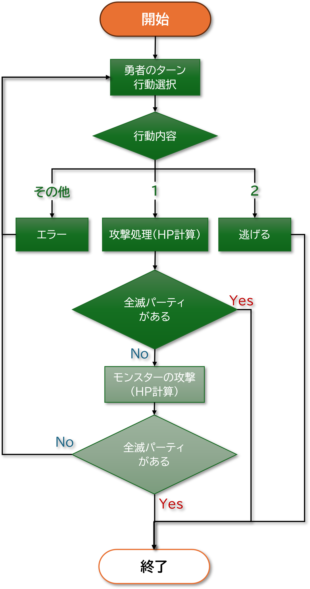

# 2 実践Rubyプログラム：RPGバトルを作ろう！

## 目次
+ [RPGバトルを作ろう](#rpgバトルを作ろう)

<br>

---

## RPGバトルを作ろう

このテキストでは、Rubyを使ってシンプルなRPGバトルを実装します。ターン制バトルを作りながら、Rubyの基本的な構文や概念を復習します。

### ゲームの目的

このゲームの目的は、プレイヤー（勇者）とコンピューター操作のモンスターが戦うターン制バトルを実装することです。プレイヤーは攻撃や魔法を使ってモンスターを倒し、勝利を目指します。

+ **完成イメージ（例）**

  ```sh
  勇者の名前を入力してください:リバティ

  === ターン 1 ===
  リバティ: HP=30 Attack=6
  魔術師: HP=20 Attack=8
  オーク: HP=30 Attack=8
  ゴブリン: HP=25 Attack=6
  リバティのターンです。
  1: 攻撃 2: 逃げる
  1
  リバティの攻撃！オークに5のダメージ！
  魔術師の魔法攻撃！オークに9のダメージ！
  オークの攻撃！リバティに5のダメージ！
  ゴブリンの攻撃！リバティに7のダメージ！

  === ターン 2 ===
  リバティ: HP=18 Attack=6
  魔術師: HP=20 Attack=8
  オーク: HP=16 Attack=8
  ゴブリン: HP=25 Attack=6
  リバティのターンです。
  1: 攻撃 2: 逃げる
  1
  リバティの攻撃！オークに4のダメージ！
  魔術師の魔法攻撃！オークに6のダメージ！
  オークの攻撃！リバティに11のダメージ！
  ゴブリンの攻撃！リバティに3のダメージ！

  ...

  === ターン 6 ===
  ✕リバティ: HP=0 Attack=6
  魔術師: HP=3 Attack=8
  ✕オーク: HP=0 Attack=8
  ゴブリン: HP=9 Attack=6
  魔術師の魔法攻撃！ゴブリンに7のダメージ！
  ゴブリンの攻撃！魔術師に9のダメージ！
  魔術師は死滅した！
  GAME OVER
  ```

  <details>
  <summary>もっと見る</summary>

  ```sh
  勇者の名前を入力してください:リバティ

  === ターン 1 ===
  リバティ: HP=30 Attack=6
  魔術師: HP=20 Attack=8
  オーク: HP=30 Attack=8
  ゴブリン: HP=25 Attack=6
  リバティのターンです。
  1: 攻撃 2: 逃げる
  1
  リバティの攻撃！オークに5のダメージ！
  魔術師の魔法攻撃！オークに9のダメージ！
  オークの攻撃！リバティに11のダメージ！
  ゴブリンの攻撃！リバティに8のダメージ！

  === ターン 2 ===
  リバティ: HP=11 Attack=6
  魔術師: HP=20 Attack=8
  オーク: HP=16 Attack=8
  ゴブリン: HP=25 Attack=6
  リバティのターンです。
  1: 攻撃 2: 逃げる
  1
  リバティの攻撃！オークに5のダメージ！
  魔術師の魔法攻撃！オークに10のダメージ！
  オークの攻撃！リバティに8のダメージ！
  ゴブリンの攻撃！リバティに5のダメージ！
  リバティは死滅した！
  
  ...

  === ターン 6 ===
  ✕リバティ: HP=0 Attack=6
  魔術師: HP=2 Attack=8
  ✕オーク: HP=0 Attack=8
  ゴブリン: HP=7 Attack=6
  魔術師の魔法攻撃！ゴブリンに9のダメージ！
  ゴブリンは死滅した！
  勇者パーティの勝利！
  ```
  
  ```sh
  勇者の名前を入力してください:リバティ

  === ターン 1 ===
  リバティ: HP=30 Attack=6
  魔術師: HP=20 Attack=8
  オーク: HP=30 Attack=8
  ゴブリン: HP=25 Attack=6
  リバティのターンです。
  1: 攻撃 2: 逃げる
  1
  リバティの攻撃！オークに4のダメージ！
  魔術師の魔法攻撃！オークに11のダメージ！
  オークの攻撃！リバティに5のダメージ！
  ゴブリンの攻撃！リバティに7のダメージ！

  === ターン 2 ===
  リバティ: HP=18 Attack=6
  魔術師: HP=20 Attack=8
  オーク: HP=15 Attack=8
  ゴブリン: HP=25 Attack=6
  リバティのターンです。
  1: 攻撃 2: 逃げる
  2
  リバティは逃げ出した！
  GAME OVER
  ```

  </summary>

---

### ゲームの流れ
ゲームをプログラミングするにあたって、まずは流れの把握をしましょう。



以下編集中
---

### 2. クラスを使ってキャラクターを作ろう

まず、ゲームに登場するキャラクター（勇者やモンスター）を表す`Character`クラスを作成します。各キャラクターには、名前、HP（ヒットポイント）、攻撃力などの属性があります。

### `Character`クラスの実装

```ruby
class Character
  attr_accessor :name, :hp, :attack_power

  def initialize(name, hp, attack_power)
    @name = name
    @hp = hp
    @attack_power = attack_power
  end

  def take_damage(damage)
    @hp -= damage
    @hp = 0 if @hp < 0 # HPが0未満にならないようにする
  end

  def attack(target)
    damage = rand(@attack_power - 3..@attack_power + 3)
    target.take_damage(damage)
    puts "#{@name}の攻撃！#{target.name}に#{damage}のダメージ！"
  end

  def status
    "#{@name}: HP=#{@hp} Attack=#{@attack_power}"
  end

  def alive?
    @hp > 0
  end
end
```

このクラスには以下のメソッドがあります：
- `initialize`: キャラクターの初期化。
- `take_damage`: ダメージを受ける。
- `attack`: 他のキャラクターを攻撃する。
- `status`: キャラクターのステータスを表示。
- `alive?`: キャラクターが生きているか確認。

---

## 3. メッセージを表示するクラス

ゲーム中に表示するメッセージを管理するために、`Message`クラスを作成します。攻撃や魔法攻撃のメッセージ、ゲームオーバーのメッセージなどを管理します。

### `Message`クラスの実装

```ruby
class Message
  def self.attack(attacker, target, damage)
    puts "#{attacker.name}の攻撃！#{target.name}に#{damage}のダメージ！"
  end

  def self.death(target)
    puts "#{target.name}は死滅した！"
  end
end
```

---

## 4. ターン制バトルを実装しよう

次に、ゲームの流れを作ります。ターンごとにプレイヤー（勇者）とモンスターが交互に行動します。

### ゲームの進行

```ruby
class Game
  def initialize
    @heroes = [
      Character.new('勇者', 30, 6),  # プレイヤーキャラクター
      Character.new('魔術師', 20, 8) # CPUキャラクター
    ]
    @monsters = [
      Character.new('オーク', 30, 8), # モンスターキャラクター
      Character.new('ゴブリン', 25, 6)
    ]
  end

  def start
    turn = 0
    while @heroes.any?(&:alive?) && @monsters.any?(&:alive?)
      turn += 1
      puts "
=== ターン #{turn} ==="
      show_status  # ステータスの表示
      hero_turn if @heroes.any?(&:alive?) # 勇者のターン
      break if game_over? # ゲームオーバー判定
      monster_turn if @monsters.any?(&:alive?) # モンスターのターン
      break if game_over? # ゲームオーバー判定
    end
    winner
  end

  private

  def show_status
    @heroes.each { |hero| puts hero.status }
    @monsters.each { |monster| puts monster.status }
  end

  def hero_turn
    @heroes.each do |hero|
      next unless hero.alive?

      puts "#{hero.name}のターンです。"
      hero.attack(@monsters.first)
    end
  end

  def monster_turn
    @monsters.each do |monster|
      next unless monster.alive?

      monster.attack(@heroes.first)
    end
  end

  def game_over?
    !@heroes.any?(&:alive?) || !@monsters.any?(&:alive?)
  end

  def winner
    if @heroes.any?(&:alive?)
      puts "勇者パーティの勝利！"
    else
      puts "GAME OVER"
    end
  end
end

# ゲーム開始
game = Game.new
game.start
```

このコードでは、ゲームのターン制バトルを作成しました。`hero_turn`と`monster_turn`で勇者とモンスターが交互に攻撃し、ゲームが進行します。

---

## 5. ユーザー入力の処理（選択肢の入力）

ゲームにユーザーの入力を組み込むことで、プレイヤーが攻撃するか逃げるか選べるようにします。これにより、よりインタラクティブなゲームになります。

### 攻撃と逃げる選択肢

```ruby
def player_turn
  loop do
    puts "1: 攻撃 2: 逃げる"
    choice = gets.chomp.to_i

    case choice
    when 1
      @heroes.first.attack(@monsters.first)
      break
    when 2
      puts "勇者は逃げた！"
      exit
    else
      puts "無効な選択肢です。再度選んでください。"
    end
  end
end
```

---

## 6. ゲームオーバーと勝利判定

ゲームの進行中に、キャラクターが死亡した場合や全滅した場合の処理を追加します。

### 勝利判定とゲームオーバー

```ruby
def winner
  if @heroes.any?(&:alive?)
    puts "勇者パーティの勝利！"
  else
    puts "GAME OVER"
  end
end
```

---

## 7. まとめと次のステップ

ここまでで、基本的なRPGバトルのゲームが完成しました。次のステップとして、以下のような追加機能を考えてみると面白いでしょう：
- アイテムシステムの追加（回復アイテム、強化アイテム）
- キャラクターのレベルアップシステム
- 戦闘のエフェクト（アニメーションや音声の追加）

---

このテキストを通じて、Rubyの基本的な構文を復習しながら、簡単なRPGバトルゲームを作成することができました。次のステップでは、さらに複雑な機能を追加して、ゲームをもっと面白くしていきましょう！
