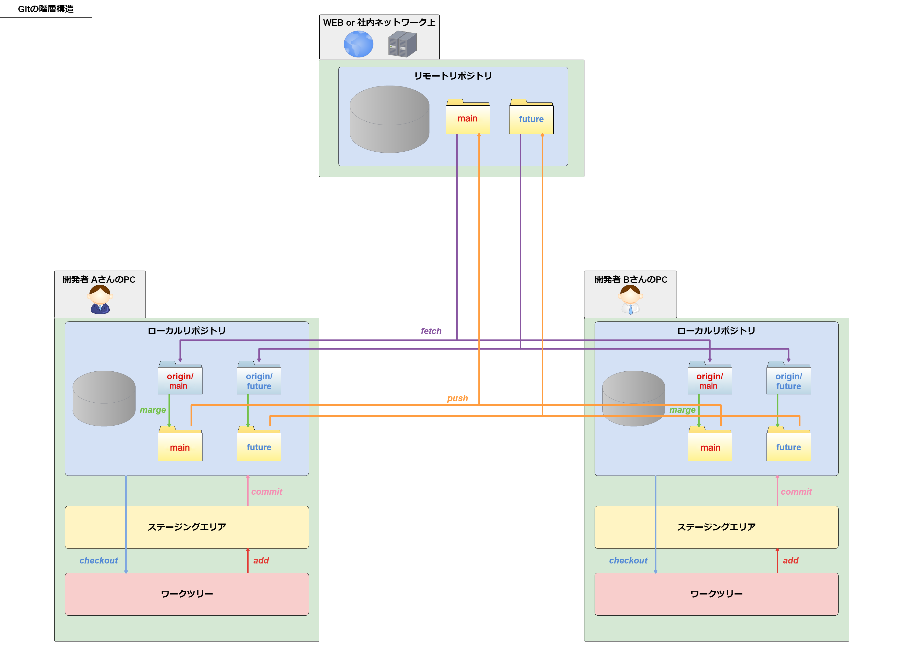
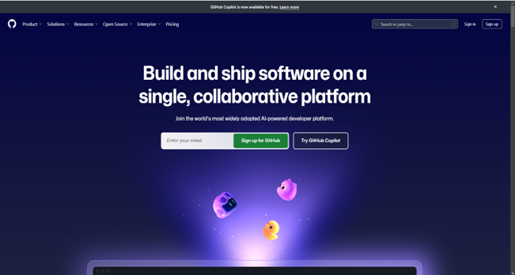
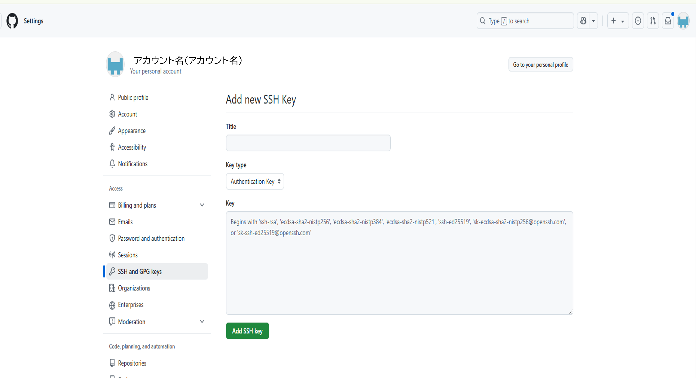
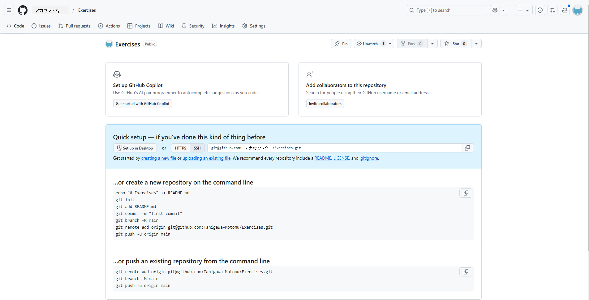

# 3 Git基礎

## 目次

- [Gitの基礎的な知識](#gitの基礎的な知識)
  - [Gitとは](#gitとは)
  - [Gitの仕組み](#gitの仕組み)
  - [GitHubとは](#githubとは)

## Gitの基礎的な知識

### Gitとは
ソフトウェア開発で広く使用されているファイルをバージョンごとに管理する **分散型バージョン管理システム(VCS)** です。  
この言葉を聞いただけではイメージがつきにくいと思いますので、1つずつ順を追って説明していきます。    

#### バージョン管理システム  
皆さんも日常的に何かのファイルを作成、変更した際に名前や日付をファイル名につけるバージョン管理を行っています。ただ、ファイル管理が複雑になったり、複数人で同じファイルに変更を加えたりする場合、正確に管理することが難しく、ミスの発生が高まります。
例えば、下の図のように複数の担当者が無秩序にファイル名を付けて保存した場合、どれがどのファイルか判別ができなくなってしまいます。　　


そのため現場では、人為的なミスを減らしてより正確なバージョン管理を行うことを目的に、**バージョン管理システム**を導入するのが一般的です。

バージョン管理システムは、ファイル自体とファイルの変更履歴をセットで管理するシステムです。  
**「いつ」「誰が」「どんな内容で」ファイルを変更したのか**を記録していき、**複数人で共有**することが出来ます。  

普通のファイル共有等を用いた管理方法と比べると、次のような利点があります。  

- __変更履歴の記録・追跡__  
各ファイルの変更した履歴（**コミット**）がどのように行われたかを記録しています。そのため、どの**コミットがどの変更を含んでいるかを追跡できます**。

- __複数人での共同作業をサポート__  
複数の開発者が同時に同じプロジェクトで作業しても、各変更を統合できる仕組みを提供しています。そのため、**異なる作業を安全に並行して行うことができます**。  

- __過去のバージョンへの復元__  
変更の履歴を遡ることで、誤って変更した場合や問題が発生した場合に、**以前の状態に戻すことができます**。  

また、バージョン管理システムには大きく「**集中型バージョン管理システム**」と「**分散型バージョン管理システム**」の2つに分けられます。

- __集中型バージョン管理システム(Centralized Version Control System, CVCS)__
  - 1つの専用サーバで管理するシステムなので、システム全体の管理がシンプル  
  - アクセスするユーザーや権限の管理が簡単なため、アクセス制御も比較的シンプルに行える  
  - 作業中は常にサーバへ接続する必要がある  
  - サーバーが唯一のデータソースなため、サーバーがダウンすると全員が作業できなくなる   

- __分散型バージョン管理システム(Distributed Version Control System, DVCS)__
  - 各ユーザーの端末にリポジトリの複製を保存するシステム
  - 自身のタイミングで編集したリポジトリの情報をサーバ側へ反映させることができる 
  - 開発に関わる個人ごとにリポジトリを持っているため、管理が複雑になりやすい  
  - サーバー側が障害を起こすと変更の共有や同期ができなくなるため、集中型と同様にサーバー側の管理が必要 

---

#### 用語解説

- __リポジトリ（Repository）__  
リポジトリは**ソースコードやその履歴、変更を管理するための場所**です。ローカルリポジトリとリモートリポジトリがあり、ローカルリポジトリは開発者のPC上に、リモートリポジトリはサーバー（GitHubやGitLabなど）上に存在します。

- __コミット（Commit）__  
コミットは **コードに対する「変更の記録」** です。各コミットには、変更内容やそれに対するメッセージが保存されます。

---

### Gitの仕組み

#### **Gitの階層構造**  
Gitは何段もの階層構造になっていて、それぞれの階層に役割があります。  

    

- __リモートリポジトリ__  
  - 共有,管理のベースとなるリポジトリ
  - ネットワーク上に作成する
  - 開発者全員で共有するファイルを保管しておく場所

- __ローカルリポジトリ__  
  - リモートリポジトリから複製またはローカルで新規に作成したリポジトリ
  - 実際に作業するPC上に作成する
  - 個人で作業するためのファイルまたは編集済みのファイル等を保管しておく場所

- __ステージングエリア（インデックス）__  
  - ローカルリポジトリに登録する前の一時保存場所
  - ステージングエリアが存在することで、変更されたワークツリーの一部だけをコミットすることも可能になる

- __ワークツリー__  
  - 実際に作業を行うPC上の領域
  - 画面上のフォルダ(ディレクトリ)に表示されているものの状況が反映される

---

#### **ブランチ**  
Gitには「**ブランチ**」というものを作成する機能があります。  

実は最初にリポジトリへ変更履歴を付けた時には、自動で**master**というブランチが作成されるようになっています。  

自身で作成する際には、このmaster等の既存ブランチから派生させる形で作成していきます。(現在では、**master**は推奨されていないため**main**が一般的となっております。そのため、`git init`というコマンドを実行すると警告文が出てきます。以降では**master**ではなく**main**と表記します。)  

<br>

ブランチを作成する時には、  
**ファイルが格納されているフォルダ(既存ブランチ)を丸ごとコピーして、新しいフォルダ(新規ブランチ)を作成している**  
というとイメージを掴みやすいかもしれません。  

ブランチはそれぞれが独立しているので、他の人に影響を与えずに自分の作業を進められるようになります。  

また、作成したブランチは、他のブランチに統合することが出来ます。  
１つのブランチに複数のブランチの内容をまとめることも出来るので、実際に開発では機能毎にブランチを作成して、個々が完成してからmain等のまとめ役になるブランチに統合すると、よりスムーズに開発することが出来ます。  

このブランチの運用方法に関しては、後ほど詳しく解説します。

---

#### 用語解説

- __ブランチ（Branch）__
ブランチは、プロジェクトの独立した作業ラインです。例えば、新しい機能を開発する場合、featureブランチを作成してその中で作業し、作業が終わったらmainブランチにマージ（統合）します。

- __マージ（Merge）__
マージは、異なるブランチを統合する操作です。例えば、開発が終わった機能をmainブランチに統合するために、featureブランチをmainにマージします。

<br>

---

### GitHubとは
  GitHubは、Gitを使った共有ウェブサービスの事で、主にソフトウェア開発を目的として使用されています。  
  簡潔に述べるならば、Git基礎で解説したリモート(リモートリポジトリを置いておく所)です。  

- __開発者に嬉しい機能__  
  単純にリモートの役割を果たすだけでなく、開発者同士のコミュニケーションをとれるSNS機能や、タスク管理にコードレビューの補助が出来るようなものまで、開発を効率的に進めるための機能が備わっています。  
  これらは非常に強力で、サポート機能を活かした**GitHub Flow**というワークフローも考案されています。  
  このワークフローは今回のセミナーでも活用していきますので、後ほど詳しく解説します。  

代表的な機能には以下のようなものがあります。

---

#### Issues  

**Issues**は、リポジトリごとに「issue（課題）」を作成し、管理する機能です。  
"issue"は直訳すると「問題」ですが、ここでは **「課題」** の意味で捉えるとよいでしょう。  

+ **用途**  
  issueは、リポジトリ内で議論したいことや対応すべき課題を書き出すために使います。  
  また、**タグを付けたり、担当者を割り振ることも可能**なため、運用次第でさまざまな活用ができます。  

+ **特徴**  
  - 作成したissueには**IDが自動で割り振られる**  
  - IDを使ってissueへのリンクを貼れる  
  - **Pull Requests**や**Projects**と紐付けて使用できる  

このように、GitHub内のさまざまな機能と連携しながら、効果的に課題管理を行えます。  

---

#### Pull Requests    
**Pull Requests（PR）**は、**コードレビューを補助するための機能**です。  
PRは2つのブランチを使って作成され、変更内容をレビューし、問題なければマージ（取り込み）する流れになります。  

+ **PRの意味**  
「Pull」とは、Gitのコマンド`git pull`を指します。このコマンドは他のブランチの変更を自分のブランチに取り込むものです。  
そこに「Request（要求）」が加わることで、PRは  
**「私の変更をレビューして、良ければ取り入れてください」**  
という依頼の意味になります。  

+ **PRの作成・使用の流れ**  
    1. **ブランチを作成し、作業を進める**  
    2. **リモートに変更を反映し、GitHub上でPRを作成する**  
    3. **他の人がPRを基にレビューをする**  
    4. **修正点があれば修正する**  
    5. **OKならマージ（取り込み）する**  

+ **PRのメリット**  
  PRの最大のメリットは、**レビューのしやすさ**です。  
  PRを作成すると、マージ先のブランチとの**差分**が自動で作成されます。  
  そのため、レビュー担当者は効率的にコードを確認できます。  

  また、**1行ごとにコメントを付ける機能**があるため、  
  「○○行目の××について…」と説明せずとも、該当行に直接コメントを付けられます。  
  これにより、レビューする側も受ける側もスムーズにやり取りができます。 

+ **[WIP]について**  
  PRには自由に名前をつけられますが、先頭に`[WIP]`がついていることがあります。  
  `[WIP]`は **"Work In Progress"（作業中）** の略で、まだ完成していないことを示します。  

  これは主に、  
  - **相談があるとき**  
  - **実装に不安があり、一度フィードバックが欲しいとき**  

  など、「マージはしてほしくないが、レビューは受けたい」場合に使われます。  

  また、PRには説明文を付けられるため、**困っていることを書いて相談用ツールとして活用**することも可能です。  
  `[WIP]`以外にもタグがあるので、興味があれば調べてみると良いでしょう。  

---

#### Projects  
**Projects**は、**電子化されたホワイトボード**のようなもので、GitHubで提供されているカンバン機能です。  

アジャイル開発では、ホワイトボードに付箋を貼ってタスクやストーリーを管理する「バックログ」が用いられます。しかし、リモートワークの普及により、直接ホワイトボードで作業するのが難しくなりました。  

そこで登場したのが**Projects**です。**WEB上のホワイトボードにカード（付箋のようなもの）を貼り、タスク管理を行う**仕組みになっています。

---

#### ポイント

- **GitHub**：ソースコードを管理・共有できる開発プラットフォーム  

- **Projects**：タスク管理をするカンバン機能  

- **Issues**：課題や議論を管理する機能  

- **Pull Requests**：コードレビューを行うための機能  

<br>

---

### Gitの利用

ここからはGitとGitHubを利用したワークフロー**GitHub Flow**を使用して進めていきます。
ここではGitとGitHubを利用するための事前準備と基本的なコマンドや利用方法について説明します。

---

#### Gitのインストール

1. **Gitがインストールされているか確認する**  
コマンドプロンプトもしくはターミナルで以下のコマンドを入力します。
    ```sh
    $ git --version
    ```

1. **Gitをインストールする**（バージョンが表示されている場合はこの作業は不要です）  
1を実行してバージョンが表示されない場合(バージョン1.8未満も含む)は、以下のURLからダウンロード後、Gitをインストールします。
    - **git**  
    https://git-scm.com/downloads

---

#### GitHubのアカウントの作成とGitの初期設定

1. __GitHubのアカウント作成__  
  「GitHub」の公式サイト( https://github.com/ )にアクセスしてアカウントを作成します。  
  既にアカウントがある場合はログインしてください。  

   - **GitHub公式サイト**

     https://github.com/
  
     **Sign up for GitHub**をクリックしてアカウントを作成できます。  
     

2. __初期設定__  
  Gitを利用するための初期設定を行います  

    - コマンドプロンプトもしくはターミナルで以下のコマンドを入力します。

      ```sh
      $ git config --global user.name "your-name"
      $ git config --global user.email "your-email"
      ```

      ※ "your-name" , "your-email" の部分は GitHubで登録したUsernameとEmailを入れてください。  

    - コマンドプロンプトもしくはターミナルで以下のコマンドを入力し、nameとemailの設定が反映されていることを確認してみましょう。

      ```sh
      $ git config --list
      ```

    - 以下の方法で直接変更することもできます。

      ```sh
      $ git config --global --edit
      ```

---

#### Gitの利用と基本のコマンド操作

##### (1) __リポジトリの作成__  

  まずはGitを利用するためにリポジトリを作成しましょう。  
  今回はGitHub上でリポジトリを作成しておいて、それをローカルにクローン（複製）する形式で行います。  
  GitHub上にリポジトリを作成する手順は以下の通りです。  

  1. 右上の＋メニュー等から、「**New repository**」を選択します。  
  1. 「**Repository name**」の項目に、`fizzbuzz`と入力して「**Create repository**」ボタンをクリックします。  
  1. リポジトリのトップページに遷移します。  

  作成自体はこれで完了です。  
  次に、実際に作業をする場所を作成していきましょう。  

---

##### (2) __ssh-keyの登録__  
作成したリポジトリをクローンするには、**ssh-keyを発行してGitHubに登録する**必要があります。  
以下の手順で登録をしてください。  

1. __ssh-keyの発行__  
    まずはターミナル側（コマンドプロンプトやubuntu等）で、ssh-keyを入れる階層へ移動してからssh-keyを作成します。  
    ディレクトリが存在しなければ、`mkdir ~/.sshで`作成しましょう。

    ```sh
    $ cd ~/.ssh
    $ ssh-keygen -t rsa
    ```

    下記のようにメッセージが出てきますが、3回とも何も入力せずにそのままEnterキーを押しましょう。

    ```sh
    Generating public/private rsa key pair.
    Enter file in which to save the key (/Users/(username)/.ssh/id_rsa):
    Enter passphrase (empty for no passphrase):
    Enter same passphrase again:
    ```

1. __ssh-keyをGitHubに登録__  
  以下の手順で登録をしておくことで、ssh-keyの利用をすることが出来ます。 

    - 下記コマンドで鍵の内容を表示できます。

      ```sh
      $ cat ~/.ssh/id_rsa.pub
      ```

    - `ssh-rsa`から始まる枠内の文字列をコピーします。
    - GitHub側の「**Settings**」メニュー内で「**SSH and GPG keys**」を選択します。
    - 「**New SSH key**」ボタンを押して、「**Title**」に`FizzBuzz`（目的や用途が分かる名前）、「**Key**」にコピーした文字列をそのまま貼り付けます。  
    - 「**Add SSH key**」ボタンを押してssh-keyを登録します。  

    

---

##### (3) __GitをCloneする__

  1. __フォルダの作成__  
      ローカルにリポジトリを格納するフォルダ（ワークスペース）を作成しましょう。  
      ※既に存在する場合は移動のみ。
      ```sh
      $ mkdir /home/ユーザー名/ruby
      $ cd /home/ユーザー名/ruby
      ```
      今回は、先ほど作成したfizzbuzzリポジトリのURLを使用して、ワークスペースを新規作成しましょう。リポジトリのURLは、作成したリポジトリのトップページから確認することが出来ます。

       

  1. __リモートリポジトリをローカルリポジトリにクローン__   
      作成したリポジトリをローカルにクローンします。  
      ```sh
      $ git clone git@github.com:XXX/fizzbuzz.git
      ```

  1. __リポジトリに移動__  
      クローンが完了したらリポジトリの中に入りましょう。
      ```sh
      $ cd fizzbuzz
      ```  

---

#### (4) __mainブランチをリモートに作成し、コミットする。__  

ワークスペースが作成出来たら、mainブランチをリモートにも作成するために`first commit`をしましょう。  

1. __git commit コマンドを使ってファイルの変更内容をコミットする__  

    gitを使用すれば簡単にファイルの進捗を管理することができます。  
    進捗を管理するためにはファイルの変更や追加などを保存しておく必要があります。そのためのコマンドが`git commit`です。
    git commitを利用すればファイルの変更をgitレポジトリに保存することができます。  

    それでは実際に`git commit`を使用してみましょう。  
    以下のコマンドを実行し、README.mdファイルを新規作成してください。  

    ```sh
    $ echo "# fizzbuzz" >> README.md
    ```

    `git status`コマンドで確認してみると、README.mdファイルが新たに作成されていることがわかります。

    ```sh
    $ git status
    ```

    `git add <ファイル名>`のコマンドを実行すると、作業ディレクトリ内の変更内容をステージングエリアに一時保存することができます。ステージングエリアに追加されたファイルは、次のコミットでコミット対象となります。  

    - 単一ファイルのステージング  
      例えば、README.md というファイルをステージングしたい場合、次のようにします。

      ```sh
      $ git add README.md
      ``` 

    - ディレクトリ内の全ての変更をステージング  
      あるディレクトリ内の全ての変更をステージングしたい場合は、ディレクトリ名を指定します。

      ```sh
      $ git add path/to/directory
      ```  
            
    そして`git status`コマンドで確認してみると、以下のようにステージングエリアにファイルが移動されたことがわかります。  

    ```sh
    $ git status
    ```
    このようにしてコミット前には`git status`コマンドで確認する癖をつけましょう。

    ファイルの変更をgitのリモートリポジトリに保存するために変更内容をコミットします。  
    `git commit`で変更の履歴を付けます。  
    `-m`オプションを加えることでコミットメッセージを入力することができます。コメントを残すことによって変更の目的を明確にすることができ、履歴を調べるときにも特定のコミットを見つけやすくなります。

    ```sh
    $ git commit -m "first commit"
    ```

    コミットの詳細は `git show`コマンドで確認することができます。

    ```sh
    $ git show
    ```

    

    リポジトリの変更履歴は `git log`コマンドで確認することができます。

    ```sh
    $ git log
    ```

    

    logは今までしたコミットをコミットメッセージの一覧という形で表示します。  
    そのためgit logをした際に一目で何をしたのかわかるようなコミットメッセージを書く必要があります。  

    <br>

1. __ローカルリポジトリの変更をリモートリポジトリに反映する__

    ローカルリポジトリで開発したとしても、それをリモートリポジトリに反映できなければ、他の人が書いているコードは過去のバージョンのコードのままになっています。
    開発コードの状態の矛盾がおきないように、git では`git push`というリモートリポジトリにローカルリポジトリの変更を反映するためのコマンドが用意されています。  
  
    それではローカルのmainブランチで、コミットした変更内容をリモートリポジトリに反映しましょう。以下のコマンドを実行してください。

      ```sh
      $ git push origin main
      ```

      上記のコマンドは、`origin`というリモートリポジトリの`main`というブランチにプッシュするという意味になります。

      基本的に開発はこのmainブランチを基にして、作業内容毎にブランチを切って進めていくことになります。

---

#### 補足：git commit コマンドオプション  
`git commit` コマンドは開発を進めていく際に最も多く使うコマンドのひとつです。  
そのためいくつかのオプションを覚えておくことで、効率よく開発を進めていくことができます。

- __変更したファイルを全てコミットする__  
  既にgitに追加済のファイルで、変更があったものを全てコミットするには以下のように入力します。

    ```sh
    $ git add -a
    $ git commit
    ```

  上記と同じことを、「.」を使って１回で行うことができます。

    ```sh
    $ git commit .
    ```

- __新規ファイルも含め、全てコミットする__  
  新規に作成した（gitに追加していない）ファイルも含め、コミットするには以下のように入力します。

    ```sh
    $ git add -A
    $ git commit
    ```

  先程と同様にこちらも「.」を使って行うことができます。

    ```sh
    $ git add .
    $ git commit
    ```

  `git add -a`コマンドと`git add -A`コマンドの挙動が紛らわしいので、新規ファイルを追加する場合は `git add .` で行う方法で覚えておくとよいです。

- __コミットメッセージを指定してコミットする__  
  「-m」オプションを指定すると、コミット時にコミットメッセージを指定することができます。

    ```sh
    $ git commit -m "コミットメッセージ"
    ```

- __間違ったコミットを取り消す__  
  間違ってコミットしてしまった場合は`git reset`コマンドを使用します。  
  コミットを取り消す処理は、本当に取り消してよいか、十分注意して行いましょう。

  - コミットだけを取り消す（ローカルのワークディレクトリの内容は変更しない）

      ```sh
      $ git reset --soft
      ```

  - ローカルのワークディレクトリの内容も含め、コミットを取り消す

      ```sh
      $ git reset --hard
      ```

  - 直前の間違ったコミットを取り消す（「HEAD^」は、直前のコミットという意味を表すオプションです）

      ```sh
      $ git reset --soft HEAD^
      ```