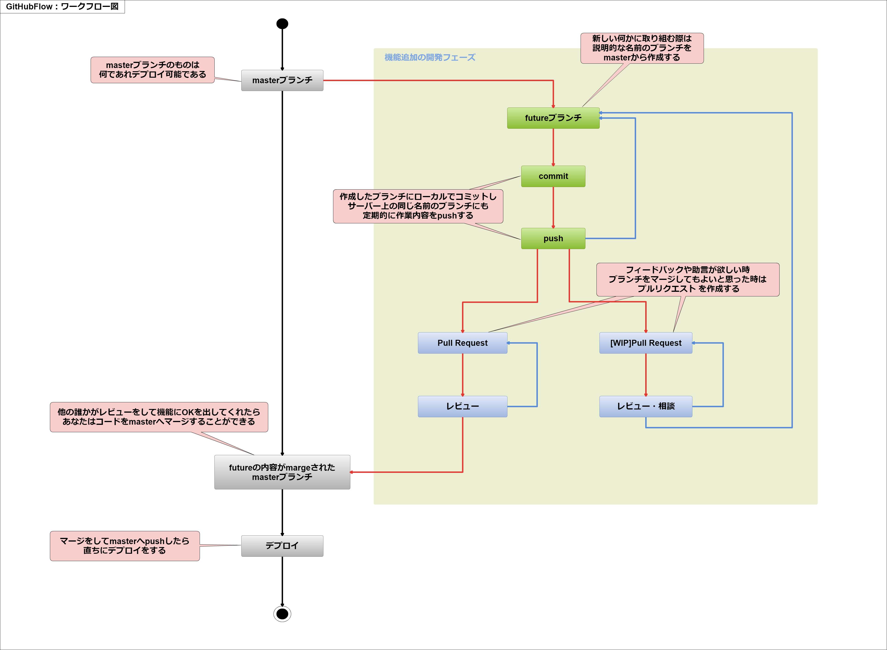
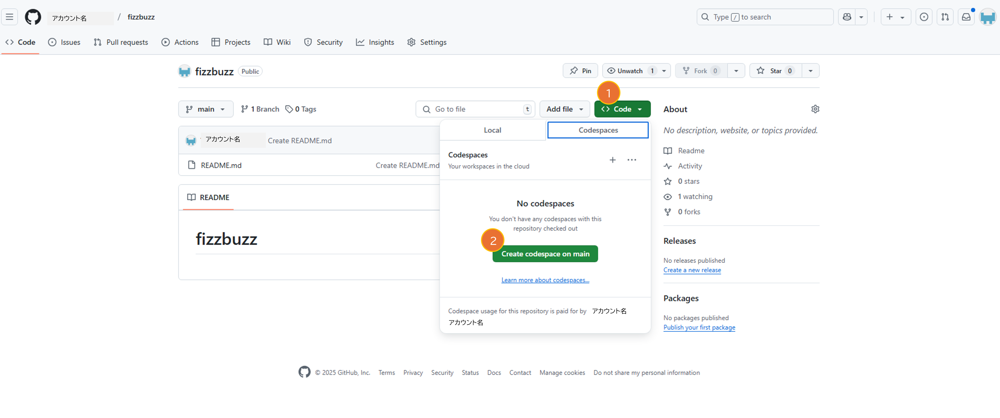
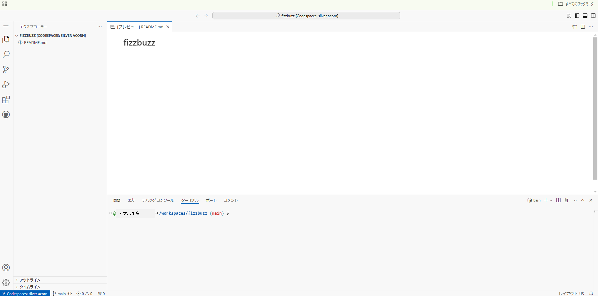
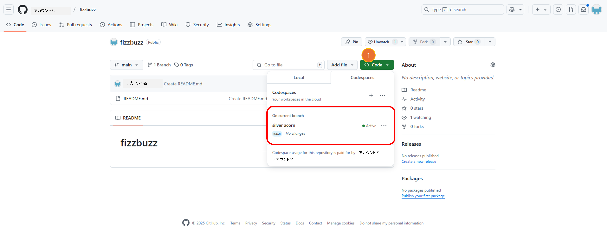
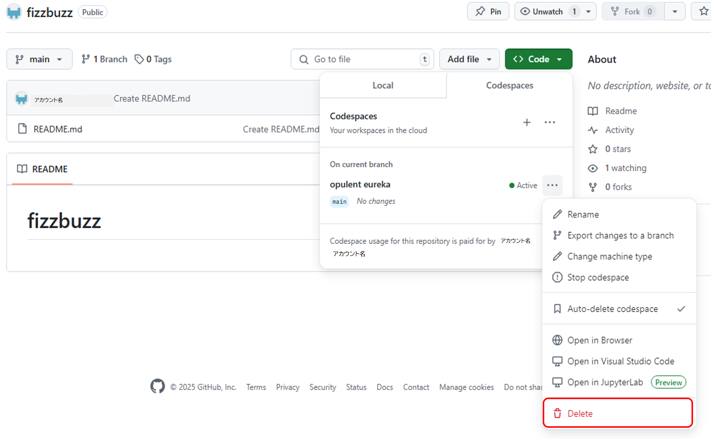
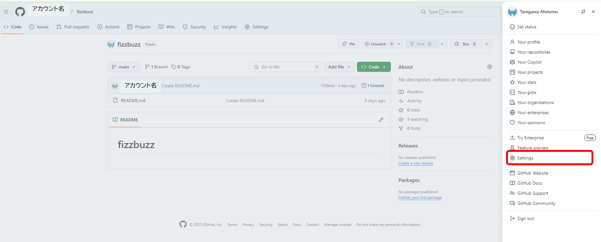
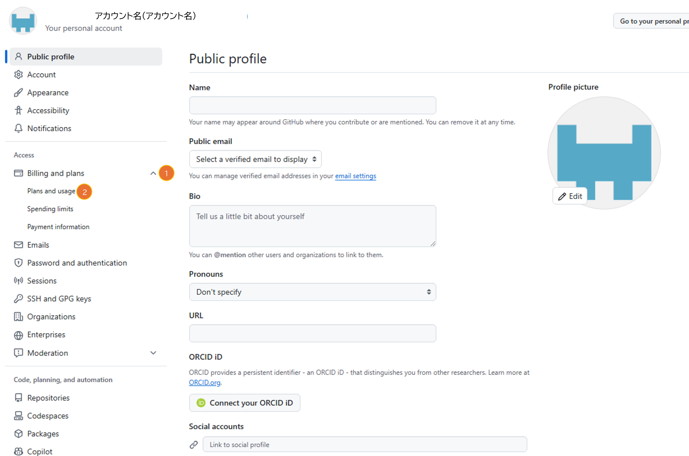
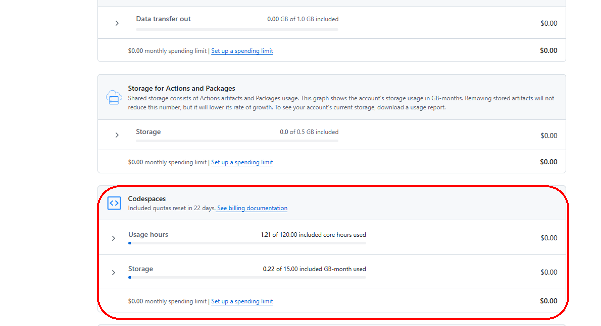

# 3 Git基礎

## 目次
- [ワーキングディレクトリと作業ブランチについて](#ワーキングディレクトリと作業ブランチについて)
- [作業のやりなおしについて](#作業のやりなおしについて)
- [GitHub Flowとは](#gitHub-flowとは)
- [GitHub Codespaces](#github-codespaces)

---

### ワーキングディレクトリと作業ブランチについて

#### __作業ブランチの作成__  
前の項目で作成したリモートリポジトリ「FizzBuzz」には、`main`ブランチのみが存在していました。  
今回はプログラムの内容を追加するため、新たにブランチを作成してみましょう。  
ブランチの作成と作業ブランチへの切り替え（ワーキングディレクトリへの移動）は、以下のコマンドを使用して行います。

```sh
$ git branch call_fizzbuzz   # call_fizzbuzzブランチを作成
$ git checkout call_fizzbuzz # call_fizzbuzzブランチに切り替え
```

1行目の`git branch`コマンドで作業用のブランチを作成し、2行目の`git checkout`コマンドでそのブランチに切り替えます。
また、以下のようにブランチの作成と切り替えを1つのコマンドでまとめることもできます。

```sh
$ git checkout -b call_fizzbuzz # -b は branch の略称
```

#### Git 2.23以降の新しい方法

Gitのバージョン2.23以降では、ブランチの作成と切り替えをより分かりやすくするために、`git switch`コマンドが追加されました。  
従来の`git checkout`はブランチの切り替え以外にも、作業ディレクトリの変更取り消しなど多くの機能を持っているため、操作を間違えやすいという課題がありました。  
そこで、ブランチの切り替え専用の`git switch`が導入され、よりシンプルで直感的に操作できるようになりました。

Git 2.23以降では、新しいブランチを作成して切り替える場合、以下のコマンドを使います。

```sh
$ git switch -c <作りたいブランチ名>
```

すでに存在するブランチに切り替える場合は、以下のコマンドを実行します。

```sh
$ git switch <切り替えたいブランチ名>
```

このように`git switch`を使うことで、ブランチの作成と切り替えを直感的に行うことができます。  
従来の`git checkout`も引き続き使用できますが、`git switch`を使うことで役割が明確になり、操作をより安全に行うことができます。

---

#### __ブランチの一覧表示__  

`git branch`コマンドの引数を指定せずに実行すると、ブランチの一覧を表示することができます。現在のブランチは頭に `*`**（アスタリスク）** がついています。

```sh
$ git branch
  * call_fizzbuzz # 現在いるブランチ
  main            # 他に存在するブランチ
```

---

### 作業のやり直しについて

開発中に変更を取り消したくなることはよくあります。  
ここでは、作業を元に戻すための基本的な Git コマンドを紹介します。

---

#### 変更を取り消す（作業ブランチ）

```sh
$ git checkout .
```
+ `git checkout <ファイル名>`  
  指定したファイルの変更を取り消す

+ `git checkout .`  
  すべての変更を取り消す（ただし、新しく追加したファイルは削除されない）

新規追加したファイルも含めて削除したい場合は、以下のコマンドを実行します。

```sh
$ git clean -df .
``` 

---

#### `git add` した変更を取り消す
  
```sh
$ git reset HEAD .
```
    
+ ステージングエリア（git add した変更）からファイルを削除

+ ファイルの変更内容自体はそのまま残る

---

#### `git commit` した変更を取り消す

```sh
$ git reset <mode> <commit> .
```

+ `--mixed`（デフォルト）  
  コミットを取り消し、変更はそのまま残す

+ `--hard`  
  コミットを取り消し、変更もすべて破棄

※ `--hard` を使っても、新規追加したファイルは削除されないので、手動で削除する必要があります。

---

#### リモートリポジトリの変更を取り消す

```sh
$ git revert [<commit>]
$ git push
```

+ `git revert`   
  指定したコミットを「打ち消すコミット」を作成  
  →履歴を壊さず、安全に変更を取り消す方法

+ `git push`   
  リモートリポジトリに反映

---

### GitHub Flowとは

#### 概要

  **GitHub Flow**は、GitとGitHubを利用したワークフローで、とてもシンプルな構造であるにも関わらず、生産性を大きく向上させる効果を持っています。  
  コマンドライン上の操作だけではなく、GUIを用いた仕組みを取り入れることで、Gitに慣れていない人でも比較的ハードルの低いワークフローになっています。    

---

#### **基本原則**  

- **mainブランチ** のものは何であれ **デプロイ可能** である  
- 新しい何かに取り組む際は、**説明的な名前のブランチ** を **main** から作成する（例: `new-oauth2-scopes`）  
- 作成したブランチに **ローカルでコミット** し、サーバー上の **同じ名前のブランチ** にも定期的に **push** する  
- **フィードバック** や **助言** が欲しい時、ブランチを **マージ** してもよいと思ったときは、 **プルリクエスト** を作成する  
- **他の誰かがレビュー** をして **機能にOK** を出してくれたら、あなたはコードを **mainへマージ** することができる  
- **マージをしてmainへpush** したら、直ちに **デプロイ** をする  

---

#### 実際のワークフロー

  最初にもある通り、このワークフローはとてもシンプルな構造になっています。  
  具体的には、基本原則を一通りなぞっていけば、それがこのワークフローの全てだと言える程です。  
  以下がワークフローの詳細です。

 

この教材での開発はこのワークフローを使用して進めていくことになります。  

---

### GitHub Codespaces

>**注意**  
>GitHub Codespacesは使用の無料枠に上限があります。メインの開発環境として使う場合は十分に気を付けましょう。


#### GitHub Codespacesとは
**GitHub Codespaces** (以下 **Codespaces**) はGitHubがクラウド上に提供している開発環境です。機能的にもUI的にも Visual Studio Code とほぼ同じなため、普段 Visual Studio Code を利用されている方であれば、すぐに作業に入ることができます。  

---

#### 特徴
Codespacesには多くの利点が存在します。今回はその内の何点かについて次にまとめています。    

- __ブラウザ上で利用できる__  
Codespacesはインターネットに接続さえできれば、**ブラウザ上で利用可能**です。そのため、端末が違ってもGitHubにログインさえできれば、作業を行うことができます。

- __環境構築を省略__  
**必要な依存関係やツールを事前に設定した状態で**開発環境が瞬時に立ち上がります。そのため、環境構築の手間や時間を省けます。

- __OSに縛られない__  
ブラウザさえ起動すれば環境が整うため、WindowsやiOSなどのOSが違う場合でも同様に作業を行うことができます。  

他にも多くの利点があります。もし気になる場合は、後ほど調べていただければと思います。  

---

#### 注意
Codespacesは大変便利ですが、いくつか注意事項があります。その内、特に覚えていてほしい点を次に記載します。

- __無料枠に上限がある__  
上記でも説明しましたが、Codespacesは無料で使えるコア時間およびストレージ量に上限があります。  
GitHubのアカウントが無料プランの場合、 コア時間は作成したCodespaces全体で **1か月で120時間まで** が無料枠になります。そのため毎日8時間ずつCodespacesを使用した場合、**8日ほどで上限** に届きます。  
また、ストレージ量は **1か月で15GBまで** が無料になります。こちらも作成したCodespaces全体の合計数値です。  
日々長時間の作業をCodespacesで行う場合は、有料になることを覚えておきましょう。  

- __環境を削除するとCodespaceの中身も消える__  
CodespacesはGitHubが用意した環境を利用しています。この環境によってどこからでも利用できますが、環境を削除すると環境内の内容は全て削除されてしまいます。  
Codespaces上で編集を行った場合は必ずGitHubなどにpushしておきましょう。  

- __放置した場合もCodespaceが削除される__  
先ほどの話しと繋がりますが、Codespacesを構わず置いていた場合、デフォルトでは30日後に自動削除されます。環境が削除されるため、手動で削除した場合と同様に中身も消えてしまいますので注意しましょう。  

Codespacesは必要以上に多くの環境を長時間立ち上げたり、大きいファイルを多数扱うなどを行うと**無料枠がすぐに消費**され、課金対象になるため使用する場合は十分注意しましょう。  

---

#### 利用方法
ここからは実際にCodespacesの利用方法を説明していきます。今回は前に作成したリモートリポジトリ「FizzBuzz」をもとに行っていきます。

1. リポジトリ「FizzBuzz」のトップページに移動してから**Code**ボタン（①）をクリックします。そうすると下の図のような状態になるため、**Create codespace on main**ボタン（②）をクリックしてください。  
     

1. 画面が遷移されて、少し待つと下の図のようになります。これでこのリポジトリのCodespaceが作成されて、利用可能になります。Codespaceを閉じたい時はタブを閉じるか前の画面に戻ると停止状態になります。
     

1. 閉じた後にリポジトリのトップページに戻って再度**Code**ボタン（①）をクリックすると、下の図のようになります。最初は無かった部分が表示されているのが分かります。この場合ですと**silver acorn**をクリックすることで作成したCodespaceを再び開くことが可能です。  
     

1. 作成したCodespaceを削除したい場合は、Codespaceの右側にある`・・・`をクリックするとバーが表示されるため、一番下の`Delete`をクリックして削除できます。  
    

また、Codespacesの利用状況を確認したい場合は次の手順で行えます。

1. 一番右のアイコンを押すと下のようにサイドバーが表示されます。出てきたサイドバーの赤枠で囲んでいる「Settings」をクリックしてください。
    

1. 少し待つと下の画面が表示されますので、「Access」内の「Billing and plans」の右にある`v`(①)をクリックして、展開された最初にある「Plans and usage」(②)をクリックしてください。  
    

1. 少し待つと画面が表示されますので、下にスクロールすると次の画像のように欄が出てきます。赤枠で囲んであるで、1か月間のCodespacesの利用コア時間と利用ストレージ量が確認できます。
    