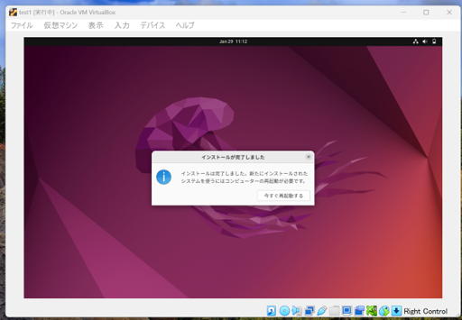

## 2 開発環境の構築

ここでは、Ruby on Railsの開発環境を構築する手順を説明します。

Ruby on Railsは、その名前にあるようにRubyやRailsが必要です。また、そのRubyやRailsの動作に必要な環境やソフトウェアのインストールも必要です。

環境構築は、オペレーティングシステム(OS)によって、インストールの手順が異なります。今回は以下の項目の説明をします。

 1. [Windows 用セットアップ(WSLが利用できるWindows 10 64bit)](#1-windows-用セットアップwslが利用できるwindows-10-64bit)
 1. [Linux 用セットアップ(Ubuntu 22.04 LTS)](#2-linux-用セットアップubuntu-2204-lts)
 1. [仮想環境(VirtualBox)](#3-仮想環境virtualbox)

<br>

どのオペレーティングシステムを利用する場合でも、インターネットへ接続が必要です。その際、インストール手順によっては、ギガバイト単位でファイルをダウンロードすることもありますので、ご注意ください。

ダウンロードするファイルは、一般的にセキュリティの問題やバグで修正があればバージョン番号が上がります。  
以下の手順に示されているファイルのバージョンと比べて、メンテナンスバージョン(たとえば、v1.2.3でいうと3のところ)が大きくなっていることがあります。  
その場合は、新しいものをダウンロードしてください。

また、メジャーバージョン(たとえば、v1.2.3でいうところの1のところ)やマイナーバージョンが異なる場合は、機能の追加や廃止等の理由から期待している動作をしない可能性もありますので、ご注意ください。

ここから各項目について説明していきます。


### 1. Windows 用セットアップ(WSLが利用できるWindows 10 64bit)

Windows 10で利用できる、WSLとUbuntuのアプリで環境を構築します。

以下の手順では、Windowsの管理者のパスワードが必要です。

 1-1 Windows Subsystem for Linuxをインストール
 
   1. 画面左下の`スタート`アイコンをクリックします。  

      <br>

   1. 歯車の`設定`アイコンをクリックします。  
      
      <br>

   1. `アプリ`をクリックします。  

      <br>

   1. `プログラムと機能`をクリックします。  

      <br>

   1. `Windowsの機能の有効化または無効化`をクリックします。  

      <br>

   1. パスワードの入力を求められたら管理者のアカウント名を確認して、パスワードを入力します。  

      <br>

   1. `Windowsの機能`ダイアログが表示されるので、`Windows Subsystem for Linux(Linux 用 Windows サブシステム)`をチェックします。  

      <br>

   1. `OK`ボタンをクリックします。  

      <br>

   1. インストールにしばらく時間がかかります。再起動が必要であれば再起動します。

      <br>

 1-2 Microsoft StoreからUbuntuをインストール
 
   1. 画面左下の`スタート`アイコンをクリックします。  

      <br>

   1. `Microsoft Store`をクリックします。  

      <br>

   1. `検索`のキーワードを入力する枠にubuntuと入力して検索します。  

      <br>

   1. `Ubuntu 22.04`と表示のあるアプリをクリックした後、 `入手`ボタンをクリックします。  

      <br>

   1. `複数のデバイスで使用する`と確認される場合がありますが、ここでは`必要ありません`をクリックします。  

      <br>

   1. インストールにしばらく時間がかかります。  

      <br>

   1. `起動`ボタンをクリックします。準備にしばらく時間がかかります。  

      <br>

   1. 次の文が表示されたら、任意のユーザー名を入力します。  
      ```sh
      Enter new UNIX username:
      ```

   1.  次の文が表示されたら、任意のパスワードを入力します。  
       ```sh
       Enter new password:
       ```
   
   1. 今使っているWindowsアカウントのパスワードや管理者のパスワードではありません。  
      次の文が表示されたら、先ほどと同じパスワードを入力します。  
      ```sh
      Retype new password:
      ```

   1. ２つのパスワードが一致すると次のように表示されます。  
      ```sh
      xxxx@yyyy: $
      ```
      xxxxには、先ほどのユーザー名、yyyyはWindowsのコンピュータ名が表示されます。  
      ユーザー名と、パスワードは忘れないようにしましょう。  

      <br> 
   
   1. 念のため、日本時間に合わせます。  
      ```sh
      sudo dpkg-reconfigure tzdata
      ```
      (補足)
      もし、コマンドをテキストから貼り付ける場合は、マウスの右ボタン(右利きの場合)をクリックすると貼り付けることができます。  

      パスワードには、UNIX(WSL)のパスワードを入力します。  

      AsiaとTokyoを選択します。ただし`OK`を選択するためにはマウスは使えないので、`TAB`キーを数回押して移動して選択してください。  
      ```sh
      date
      ```
      と入力して、Asia/Tokyoと表示されれば設定できています。  

      <br>

 1-3 環境を最新化

   1. UNIX(WSL)環境を最新化するため、次のコードを1行ずつ行っていきます。
      ```sh
      sudo apt update
      sudo apt upgrade -y
      sudo apt install autoconf bison build-essential libyaml-dev libreadline-dev zlib1g-dev libncurses5-dev libffi-dev libgdbm-dev sqlite3 libsqlite3-dev node-gyp npm -y 
      ```

   1. Rubyのバージョン管理システムのrbenvをインストールします。

      ```sh
      git clone https://github.com/rbenv/rbenv.git ~/.rbenv
      echo 'export PATH="$HOME/.rbenv/bin:$PATH"' >> ~/.bashrc
      echo 'eval "$(rbenv init -)"' >> ~/.bashrc
      source ~/.bashrc
      git clone https://github.com/rbenv/ruby-build.git "$(rbenv root)"/plugins/ruby-build
      ```

   1. rbenvを使ってRubyをインストールします。
      ```sh
      rbenv install 3.2.4
      ```

   1. 手順5でインストールしたRubyを常用のRubyとして設定します。
      ```sh
      rbenv global 3.2.4
      ```

   1. Railsをインストールをします。
      ```sh
      gem install rails -v 7.1.1 --no-document
      ```

   1. 動作確認をします。
      ```sh
      rails new sample
      cd sample
      rails g scaffold book name:string
      rails db:migrate
      rails server
      ```
      ブラウザのURL欄に `http://localhost:3000/books` と入力して、画面が表示されれば成功です。


      動作が確認できたら、`CTRL`キーと`C`キーを同時に押して、Rails serverを停止しましょう。  

      <br>

      (補足)

      UNIX(WSL)環境で、
      ```sh
      explorer.exe .
      ```
      とすることで、作業しているディレクトリ(カレントディレクトリ)をWindowsのエクスプローラで参照できます。
      この場所をWindows上にインストールしたコードエディタで参照することでファイルを編集できます。  

      <br>

   1. コードエディタをインストールします。

      コードエディタの一例は以下の通りです。  
        - ATOM
        - Visual Studio Code
        - Sublime Text
      
      <br>

      エディタはWindows用をダウンロードして、インストールします。  
      すでにお気に入りのコードエディタをインストールされている場合は、それらをお使いください。


<br>

---

### 2. Linux 用セットアップ(Ubuntu 22.04 LTS)

 1. Rubyのインストールに必要なコマンド等をインストールします

    ```sh
    sudo apt update
    sudo apt upgrade -y
    sudo apt install git curl net-tools gcc make -y
    ```

 1. Ruby on Railsの環境に必要なライブラリ等をインストールします

    ```sh
    sudo apt install autoconf bison build-essential libyaml-dev libreadline-dev zlib1g-dev libncurses5-dev libffi-dev libgdbm-dev sqlite3 libsqlite3-dev -y
    ```

    ※VB環境でインストールするときに`rbenv install 3.2.4`がうまくできないときがあります。その時は下記のコマンドを入力してください。
    ```sh
    sudo apt-get install -y libssl-dev
    ```

 1. Rubyのバージョン管理システムのrbenvをインストールします

    ```sh
    git clone https://github.com/rbenv/rbenv.git ~/.rbenv
    echo 'export PATH="$HOME/.rbenv/bin:$PATH"' >> ~/.bashrc
    echo 'eval "$(rbenv init -)"' >> ~/.bashrc
    source ~/.bashrc
    git clone https://github.com/rbenv/ruby-build.git "$(rbenv root)"/plugins/ruby-build
    ```

 1. rbenvを使ってRubyをインストールします

    ```sh
    rbenv install 3.2.4
    ```

 1. 手順4でインストールしたRubyを常用のRubyとして設定します

    ```sh
    rbenv global 3.2.4
    ```

 1. Railsをインストールをします

    ```sh
    gem install rails -v 7.1.5 -N
    ```


 1. 動作確認をします

      ```
      rails new sample
      cd sample
      rails g scaffold book name:string
      rails db:create
      rails db:migrate
      rails server
      ```
      ブラウザのURL欄に `http://localhost:3000/books` と入力して、画面が表示されれば成功です。

      動作が確認できたら、`CTRL`キーと`C`キーを同時に押して、Rails serverを停止しましょう。  

      <br>

   1. コードエディタをインストールします。

      コードエディタの一例は以下のとおりです。  
        - ATOM
        - Visual Studio Code
        - Sublime Text
      
      <br>

      エディタはWindows用をダウンロードして、インストールします。  
      すでにお気に入りのコードエディタをインストールされている場合は、それらをお使いください。

<br>

---


### 3. 仮想環境(VirtualBox)

コンピュータの中に、別のコンピュータの環境を構築できる仮想環境ソフトウェアとしてVirtualBoxやVMware、Hyper-V等があります。
ここではVirtualBoxを使用した方法で環境構築します。

また、仮想環境内に構築する開発環境はUbuntu 22.04 LTSを使用します。

仮想環境はウィンドウやマウスを使用するGUIの環境で構築しますので、使用するコンピュータが搭載しているメモリは4GB以上、ハードディスクやSSD等の補助記憶装置には空き領域が25GB以上あることを確認してください。

__作業前に注意!!__

**VirtualBoxがPCへすでにインストールしてある場合、ダウンロード・インストールは不要です。**


 1. VirtualBoxのダウンロード

    VirtualBoxをダウンロードするため、以下のURLを開きます。  
    最新バージョンのVirtualBoxもありますが、今回は **7.0.18-162988** を使用していきます。

    https://virtualbox.jp.uptodown.com/windows/versions

      
  

    画面が表示されたら **7.0.18-162988** をクリックして、表示されたページの下にあるダウンロードを押します。

       

     ダウンロードはこれで完了です。

    <br>
  
 1. VirtualBoxのインストール

    ダウンロードフォルダからダウンロードしたファイルをダブルクリックして実行します。  
    ダブルクリックした後、次の画面が出てくると思います。  

      

    インストールの途中に、構成の確認がありますが、変更せず`Next`ボタンをクリックして進めます。
    
   
    また、仮想のネットワークアダプタを追加する確認画面が表示されますが、`インストール`を選択して進めます。

       

    インストールが完了したら次の画面が出てくるはずです。

       

   

    <br>
 
 1. 仮想環境の中に構築するOSのインストーラをダウンロード

    以下のURLから64-bit PC (AMD64) desktop imageをクリックしてUbuntu 22.04のインストーラをダウンロードします。

    https://releases.ubuntu.com/22.04/

     <br>

 1. 仮想環境の構築

    VirtualBoxマネージャが表示されていなければ、画面左下の`スタート`、`すべてのプログラム`、`Oracle VM VirtualBox`、`Orale VM VirtualBox`をクリックして起動します。

    マネージャー画面の`新規`アイコンをクリックして、仮想マシンの作成を行っていきます。  
    今回は以下のように設定していきましょう。  

      + 名前 ： Ruby on Rails

      + タイプ ： Linux  

      + バージョン ： Ubuntu(64-bit)

      
      
      <br>

      + メモリ ： 2048 MB ⇐ ホストのメモリに余裕があれば4096MB程度が良いです。

      

      + 仮想ハードディスク ： 仮想ハードディスクを作成する

      <!--   + 仮想ハードディスクの種類 ： VDI/可変サイズ  -->

      + 仮想ハードディスクのサイズ ： 25.00 GB


      
 
     設定し終わったら**完了**ボタンをクリックして設定を完了します。
 
       


 1. OSの割り当て

    手順3でダウンロードしたOSのイメージを作成した仮想環境に割り当てます。

    まず`ストレージ`から、`IDE セカンダリマスター`の右横に表示されている`光学ドライブ`空をクリックして、`ディスクファイルを選択...`をクリックします。

    

    選択画面が出たらダウンロードフォルダから`ubuntu`ファイルを選択します。


    その後、`ネットワーク`から、`割り当て`の右横に表示されている`NAT`をクリックして、`ブリッジアダプター`に変更します。  
    この時、名前の選択は回線の繋げ方で変わるため、起動しない時は別の選択肢を選んでみましょう。  
   
    


    これでVirtualBoxマネージャーでの設定は完了になります。

    <br>
    
 
 1. 仮想環境の設定～ログイン前

    ここからは仮想環境での設定になります。  
    まず`起動`アイコンをクリックして仮想環境を起動します。

    

    時間が経つと次の画面が出てきます。  
    

    左側の言語選択欄から`日本語`を選択します。  
    選択すると次の画面になります。  
    変わったのを確認できたら、`Ubuntuをインストール`ボタンをクリックします。
    

    続いてキーボードの選択が表示されます。  
    入力欄にアットマーク(@)やダブルクオート(")等を入力してみましょう。  
    正しく表示されることを確認して`続ける`ボタンをクリックします。  
    

    もし画面上に`続ける`ボタンが見えない場合は、キーボードの`ALT`キーと`F7`キーを同時に押してウィンドウを移動してみてください。
     
     <br>

    続いてアップデートと他のソフトウェアについて出てきます。
    `Ubuntuのインストール中にアップデートをダウンロードする`のチェックを外して、`通常のインストール`のみ選択している状態で`続ける`をクリックします。
  

    

    
    `ディスクを削除してUbuntuをインストール`を選択して`インストール`をクリックします。

    

    **注意！！**

    **ここでは、仮想環境の中で作業をしているので、ディスクとは仮想環境の中の仮想ディスクのことです。**

    <br>

    下の画面が出たら`続ける`をクリックします。
   
    


    続いては場所(タイムゾーン)の選択で`Tokyo`を選択します。

    


    続いて利用する名前、コンピュータ名、パスワードを入力して`続ける`をクリックするとインストールが始まります。    
    名前とパスワードは忘れないようにしましょう。  

    


    インストールにしばらく時間がかかります。
 
    

    インストール完了のメッセージが表示されたら`今すぐ再起動する`ボタンをクリックします。

    

    再起動すると次のように画面が表示されるため、下側に次の文が出たらエンターキーを押してください。
    エンターキーを押してから、エラーが出て画面が変わらない場合、上の`仮想マシン`内にある`一時停止`をクリックし、`ファイル`内の`終了`を押してから再起動しましょう。
    ```
    Please remove the installation medium, then press ENTER:
    ```
    

    
 1. 仮想環境へのログインとゲスト環境用追加ソフトウェアのインストール

    インストールのときに入力したアカウントを選択、パスワードを入力してログインします。

    

    ログインできたら仮想環境の中で下の画面が表示されるため、画面上部の`Ubuntuへようこそ`から`終了`をクリックします。

    

    
    続いて追加ソフトウェアのインストールをしていきます。  
    仮想環境の中の左下の`アプリケーションを表示する`アイコンをクリックし、端末をクリックしてください。  
    見つからなければ検索ワードに`端末`と入力したら出てきます。

    

    

    端末が表示できたら次のように表示されます。 
    黒塗りしてあるところはアカウントの名前が表示されているはずです。 

    

    ここからubuntuの日本語環境の構築をしていきます。  
    (参考：<https://www.ubuntulinux.jp/japanese>)。

    <br>

    Ubuntu 22.04 LTSの場合は次のコマンドを1つずつ入力してからエンターキーを押してください。  
    なお、できるだけコピー＆ペーストで行いましょう。入力して行うとスペルミスが発生した際に修正作業が入るためです。
    
    ```sh
    sudo wget https://www.ubuntulinux.jp/ubuntu-jp-ppa-keyring.gpg -P /etc/apt/trusted.gpg.d/
    sudo wget https://www.ubuntulinux.jp/ubuntu-ja-archive-keyring.gpg -P /etc/apt/trusted.gpg.d/
    sudo wget https://www.ubuntulinux.jp/sources.list.d/jammy.list -O /etc/apt/sources.list.d/ubuntu-ja.list

    sudo apt update
    sudo apt upgrade -y
    sudo apt install gcc make perl -y
    sudo apt install ubuntu-defaults-ja
    ```

    すべて終了したら右上のアイコンをクリックし、`電源オフ/ログアウト`をクリック後、`再起動`をクリックします。  
    再起動したら再度、ログインします。

    最後にVirtualBoxのメニューから`デバイス`、`Guest Additions CD イメージの挿入...`をクリックします。  
    
    <br>

    (補足)
    この時、うまくインストールされない場合は仮想環境で以下のコマンドを実行してください。
    ```sh
    sudo apt install bzip2
    sudo apt install gcc make perl -y
    sudo /media/ユーザー名/VBox_GAs_x.x.xx/VBoxLinuxAdditions.run
    ```
    `VBox_GAs_x.x.xx`のx.x.xxにはバージョンの番号が入ります。
    うまくインストールされると仮想スクリーンとの親和性が高まりウィンドウのサイズなどが変更できるようになります。    

    インストールが完了すると、
    ```
    Press Return to close this window...
    ```
    と表示されるのでエンターキーを押します。

      <br>

 1. Rails環境の構築

    ここからは、Linux 用セットアップ(Ubuntu)と同じですので、[2. Linux 用セットアップ(Ubuntu 22.04 LTS)](#2-linux-用セットアップubuntu-2204-lts)を参照してください。

