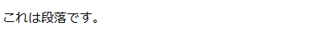
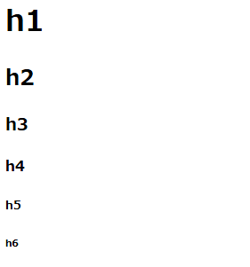
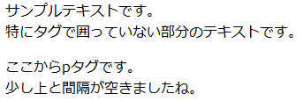
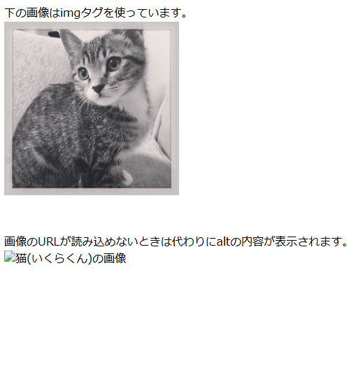
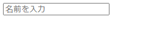
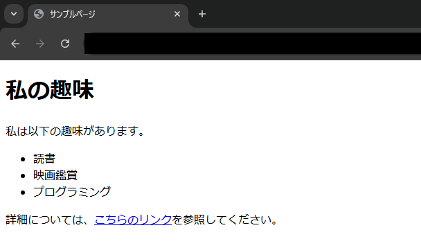

# 4 HTMLとCSS

## 目次
+ [フロントエンドにおけるHTMLとCSS](#フロントエンドにおけるhtmlとcss)
  + [HTMLとCSS](#htmlとcss)
+ [HTMLの書き方](#htmlの書き方)  
  + [HTMLの基本構造](#htmlの基本構造)  
  + [HTMLでよく使われるタグ](#htmlでよく使われるタグ)  
  + [HTMLを書いてみよう](#htmlを書いてみよう)  

<br>

---

## フロントエンドにおけるHTMLとCSS

### HTMLとCSS

**HTML**と**CSS**はウェブページ作成の基本であり、欠かせない2つの要素です。  

+ **HTMLとは**  
    **HTML**（HyperText Markup Language）は、ウェブページを作成するための基本的な言語です。  
    HTMLは、ページ内の**構造**や**内容**を定義します。  
    例えば、**テキスト、リンク、画像、リスト**などの要素をウェブページに組み込むために使用されます。  
    HTMLでは、タグ（`< >`）を使って情報を記述します。

+ **CSSとは**  
    **CSS**（Cascading Style Sheets）は、ウェブページの**デザイン**を担当する言語です。  
    CSSでは、**文字の色やサイズ、配置、背景色**などを指定できます。  
    HTMLで作成したページに、視覚的なデザインを加える役割を果たします。

**HTML**はページの**内容**を作り、**CSS**はその内容を**見た目**として整える役割を持っています。  
これらを組み合わせることで、**文字や画像の配置**や**デザイン**が決まります。  
それぞれの言語の役割を理解することで、ウェブページの作成がよりスムーズになります。

  

---

#### ポイント  

+ **HTML**はウェブページの**構造**と**内容**を定義する言語。  

+ **CSS**はHTMLで作成したウェブページに**デザイン**を加えるための言語。  

+ HTMLはページの**骨組み**を作り、CSSはその**見た目**を整える役割を持つ。  

+ **HTMLとCSSは密接に連携**して、ユーザーに魅力的なウェブページを提供する。  

#### 用語解説

+ **フロントエンド**  
  **フロントエンド**とは、ウェブページやアプリでユーザーが直接触れる部分です。HTML、CSS、JavaScriptを使って、ページの内容やデザイン、動きなどを作ります。ユーザーが見たり、操作したりする部分がフロントエンドの仕事です。

+ **マークアップ**  
  HTMLにおいて、テキストや画像などの要素をタグで囲んで、ページに表示する内容や構造を定義する作業。  
  例えば、`<h1>`タグは見出しを表示するために使用されます。

<br>

---

## HTMLの書き方

### HTMLの基本構造  
HTMLは、ウェブページを作成するための基本的な構造を持っています。HTMLドキュメントは、いくつかの基本的な部分から成り立っています。これを理解することで、ウェブページがどのように構造化されているかがわかります。  

#### 基本的なHTMLの書き方  

```html
<!DOCTYPE html>
<html lang="ja">
<head>
    <meta charset="UTF-8">
    <meta name="viewport" content="width=device-width, initial-scale=1.0">
    <title>ページタイトル</title>
</head>
<body>
    <h1>見出し1</h1>
    <p>これは段落です。</p>
    <a href="https://www.libertyfish.co.jp">リンクテキスト</a>
</body>
</html>
```

上のコードを実際にブラウザ上で表示すると次のような見た目になります。  

  

このコードは、**HTMLの基本的な構造**を示しています。それぞれの部分について説明していきます。  

1. **`<!DOCTYPE html>`**  
  この行は、**HTML5**を使用していることを宣言しています。ウェブブラウザに「このページは**HTML5**で作られているよ」と教える役割があります。

1. **`<html lang="ja">`**  
  `<html>`タグは、**HTML文書全体**を囲むタグです。このタグの中に、ウェブページの全ての内容が入ります。`lang="ja"`は、このページが**日本語**で書かれていることを示しています。

1. **`<head>`**  
  `<head>`タグの中には、ウェブページに関する**情報**を記述します。これにはページの**タイトル**、**文字コード**、**表示設定**などが含まれます。`<head>`の内容は実際のページには表示されませんが、ページを表示するために必要な情報が含まれています。
    + `<meta charset="UTF-8">`  
      この設定はページで使う**文字の種類**を決めます。**UTF-8**は、多くの言語をサポートしている文字コードです。  

    + `<meta name="viewport" content="width=device-width, initial-scale=1.0">`  
      これにより、ページが**スマートフォンやタブレット**などのデバイスに応じて、適切に表示されるようになります。  

    + `<title>ページタイトル</title>`  
      **ブラウザタブ**に表示されるページの**タイトル**を指定します。  

        

1. **`<body>`**  
  `<body>`タグの中には、実際にページに表示される内容が書かれます。この部分が、ウェブページの「**中身**」にあたります。

    + `<h1>見出し1</h1>`  
      `<h1>`タグは、ページの最も重要な**見出し**を表します。番号の大きい見出し（`<h2>`, `<h3>` など）もありますが、`<h1>`は最も重要な見出しです。 

        

    + `<p>これは段落です。</p>`  
      `<p>`タグは、**段落**を作るためのタグです。このタグで囲んだテキストは、改行されて段落として表示されます。  

        

    + `<a href="https://www.libertyfish.co.jp">リンクテキスト</a>`  
      `<a>`タグは**リンク**を作成します。**href属性**にURLを指定すると、クリックした際に指定されたウェブページに移動します。`<a>`タグで囲まれたテキストが、リンクとして表示されます。

        

---

#### HTMLの属性
HTMLの要素には、追加の情報を持たせるための「**属性**」を設定できます。特によく使われるのが、`class` と `id` です。  
属性は`属性="内容"`という形で指定します。

+ **`class`属性**  
  複数の要素に共通のスタイルを適用するときに使用します。

  ```html
  <!DOCTYPE html>
  <html lang="ja">
  <head>
      <meta charset="UTF-8">
      <meta name="viewport" content="width=device-width, initial-scale=1.0">
      <title>classの例</title>
      <style>
          /* classが"highlight"の場合のCSS
             ※CSSについては後ほど解説します */
          .highlight {
              color: red;         /*文字を赤く*/
              font-weight: bold;  /*太字にする*/
          }
      </style>
  </head>
  <body>
      <!-- classが"highlight"なのでスタイルが変わる --->
      <p class="highlight">これは赤い文字で表示されます。</p>

      <br>

      <!-- classが"highlight"ではないのでスタイルは変わらない --->
      <p>これは普通の段落です。</p> 
      <p class="example-class">これは違うclassの段落なのでスタイルは変わりません。</p> 

      <br>

      <p class="highlight">これも赤い文字で表示されます。</p>
      <p class="highlight">同じclassなら同じスタイルが適用されます。</p>
  </body>
  </html>
  ```

  + `class="highlight"` のついた段落は、CSSで設定した `color: red;` によって赤く表示される。
  + 複数の要素に同じ `class` を指定すれば、まとめてスタイルを適用できる。


    

+ **`id`属性**  
  一意（ユニーク）な要素に対して使います。同じページ内で**同じ`id`は1つしか設定できません**。

  ```html
  <!DOCTYPE html>
  <html lang="ja">
  <head>
      <meta charset="UTF-8">
      <meta name="viewport" content="width=device-width, initial-scale=1.0">
      <title>idの例</title>
      <style>
          /* idが"uniqueの場合のCSS */
          #unique {
              background-color: yellow; /* "背景色を黄色に指定 */
          }
      </style>
  </head>
  <body>
      <!-- idが"highlight"なのでスタイルが変わる --->
      <h1 id="unique">この見出しだけ背景が黄色になります。</h1>
      <p>この段落には何も影響しません。</p>
  </body>
  </html>
  ```
  
  + `id="unique"` を指定した `h1` に、CSSで `background-color: yellow;`(背景色を黄色にする) を適用。
  + `id` は **同じページ内で一意（ユニーク）** である必要があるので、**他の要素に `id="unique"`をつけるのはNG**。

    

<br>

---

### HTMLでよく使われるタグ

+ **`<h1>`～`<h6>`**  
  見出しタグ。数字が小さいほど**重要度が高い**。  
  ```html
  <h1>大見出し</h1>
  <h2>中見出し</h2>
  <h3>小見出し</h3>
  ```
    

+ **`<p>`**  
  **段落**タグ。テキストを段落として表示。  
  ```html
  <p>段落の文章です。</p>
  ```
   

+ **`<br>`**  
  **改行**タグ。テキストを改行する。  
  ```html
  エディタ上では
  改行されていますが、
  プレビューでは
  改行されません。

  <br><br>

  brタグを使うことによって<br>
  改行を発生させることが<br>
  できます。
  ```

     


+ **`<a href="URL">`**  
  **リンク**タグ。`href`属性でリンク先のURLを指定。  
  ```html
  <a href="https://www.libertyfish.co.jp">リバティ・フィッシュ株式会社のWebサイト</a>
  ```
     

+ **`<ul>`, `<ol>`, `<li>`**   
  **リスト**タグ。`<ul>`は順不同リスト、`<ol>`は順序付きリスト、`<li>`はリスト項目。  
  ```html
  <ul>
    <li>りんご</li>
    <li>みかん</li>
  </ul>

  <ol>
    <li>ステップ1</li>
    <li>ステップ2</li>
  </ol>
  ```
   

+ **``**  
  **画像**タグ。`src`で画像のURL、`alt`で画像の説明を指定。  
  ```html
  
  ```
    

+ **`<input>`**  
  ユーザーからの入力を受け取るためのタグ。  
  ```html
  <input type="text" name="username" placeholder="名前を入力">
  ```
    

  + **`type`について**  
    `type`には以下のようなプロパティを指定することができ、値によってそれぞれ違った入力を受け付けることができる。

    | `type`の値| 説明|
    |----------------------|----------------------------------------------------|
    | **`text`**| 一行のテキスト入力欄。|
    | **`password`**| パスワード入力欄（入力がマスキングされる）。|
    | **`email`**| メールアドレスの入力欄（正しい形式のチェックあり）。 |
    | **`url`**| URLの入力欄（正しい形式のチェックあり）。|
    | **`tel`**| 電話番号の入力欄（ブラウザによって専用キーパッド表示）。 |
    | **`number`**| 数値の入力欄（増減ボタン付き）。|
    | **`search`**| 検索ボックス（スタイルが検索向けに調整される場合あり）。 |
    | **`date`**| 日付選択欄（カレンダーUI付き）。|
    | **`datetime-local`**| 日時選択欄（カレンダー＋時間ピッカーUI付き）。|
    | **`month`**| 月の選択欄（年月のみ）。|
    | **`week`**| 週の選択欄（年＋週番号）。|
    | **`time`**| 時刻選択欄（時間・分・秒の入力）。|
    | **`checkbox`**| チェックボックス（複数選択可能）。|
    | **`radio`**| ラジオボタン（グループ内で1つのみ選択可能）。|
    | **`range`**| スライダーで数値を選択する入力欄。|
    | **`color`**| カラーピッカー（色を選択可能）。|
    | **`file`**| ファイル選択ボタン（ファイルアップロード用）。|
    | **`hidden`**| 非表示の入力欄（値をフォームに送信するが画面上は見えない）。 |
    | **`image`**| 画像ボタン（送信ボタンとして画像を使用）。|
    | **`submit`**| フォームの送信ボタン。|
    | **`reset`**| フォームの入力をリセットするボタン。|
    | **`button`**| 一般的なボタン（JavaScriptなどで使用）。|

+ **`<form>`**  
**フォームを作成する**タグ。ユーザーからの入力を受け取る。

  ```html
  <form action="/submit" method="post">
    <input type="text" name="username">
    <input type="submit" value="送信">
  </form>
  ```

    

[このほかにも様々なタグがあります。](04-02_HTMLタグ集.md)  

<br>

---

### HTMLを書いてみよう
以下の内容を含むHTMLページを作成してみましょう。
- 見出し（`<h1>`～`<h3>`）
- 段落（`<p>`）
- リスト（`<ul>`または`<ol>`）
- リンク（`<a>`）

#### 完成見本

    

  <details>
  <summary>コード例</summary>

  ```html
  <!DOCTYPE html>
  <html lang="ja">
  <head>
      <meta charset="UTF-8">
      <meta name="viewport" content="width=device-width, initial-scale=1.0">
      <title>サンプルページ</title>
  </head>
  <body>
      <h1>私の趣味</h1>
      <p>私は以下の趣味があります。</p>
      <ul>
          <li>読書</li>
          <li>映画鑑賞</li>
          <li>プログラミング</li>
      </ul>
      <p>詳細については、<a href="https://www.libertyfish.co.jp">こちらのリンク</a>を参照してください。</p>
  </body>
  </html>
  ```

  </details>
