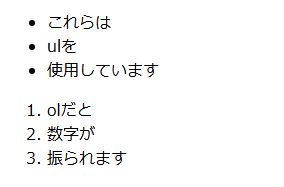

# 4 HTML／CSS

## 目次
+ [フロントエンドにおけるHTMLとCSS](#フロントエンドにおけるhtmlとcss)
  + [HTMLとCSS](#htmlとcss)
+ [HTMLの書き方](#htmlの書き方)  
  + [HTMLの基本構造](#htmlの基本構造)  
  + [HTMLでよく使われるタグ](#htmlでよく使われるタグ)  
  + [HTMLを書いてみよう](#htmlを書いてみよう)  
+ [CSSの書き方](#cssの書き方)  
  + [CSSの基本構造](#cssの基本構造)  
  + [CSSでよく使われるタグ](#cssでよく使われるタグ)  
  + [CSSを書いてみよう](#cssを書いてみよう)

<br>

---

## フロントエンドにおけるHTMLとCSS

### HTMLとCSS

+ **HTMLとは**  
    **HTML**（HyperText Markup Language）は、ウェブページを作成するための**基本的な言語**です。HTMLはページ内の**構造**や**内容**を定義するために使用されます。HTMLを使うことで、**テキスト、リンク、画像、リスト**などの要素をウェブページに組み込むことができます。HTMLは、ページを「**マークアップ**」するためのタグ（`< >`）を使って情報を記述します。

+ **CSSとは**  
    **CSS**（Cascading Style Sheets）は、ウェブページの**デザイン**を担当する言語です。CSSを使うことで、**文字の色やサイズ、配置、背景色**などのスタイルを指定できます。CSSはHTMLで作ったウェブページに視覚的なデザインを加える役割を果たします。

+ **HTMLとCSSの関係**  
    HTMLはページの**骨組み**を作り、CSSはその**見た目**を整えます。例えば、HTMLで「タイトル」を作り、CSSでそのタイトルの**文字色やフォント**を変更するといった使い方をします。このように、**HTMLとCSSは密接に連携**して、ユーザーに魅力的なウェブページを提供します。

---

#### ポイント  

+ **HTML**はウェブページの**構造**と**内容**を定義する言語。  

+ **CSS**はHTMLで作成したウェブページに**デザイン**を加えるための言語。  

+ HTMLはページの**骨組み**を作り、CSSはその**見た目**を整える役割を持つ。  

+ **HTMLとCSSは密接に連携**して、ユーザーに魅力的なウェブページを提供する。  

#### 用語解説

+ **フロントエンド**  
  **フロントエンド**とは、ウェブページやアプリでユーザーが直接触れる部分です。HTML、CSS、JavaScriptを使って、ページの内容やデザイン、動きなどを作ります。ユーザーが見たり、操作したりする部分がフロントエンドの仕事です。

+ **マークアップ**  
  HTMLにおいて、テキストや画像などの要素をタグで囲んで、ページに表示する内容や構造を定義する作業。  
  例えば、`<h1>`タグは見出しを表示するために使用されます。

<br>

---

## HTMLの書き方

### HTMLの基本構造  
HTMLは、ウェブページを作成するための基本的な構造を持っています。HTMLドキュメントは、いくつかの基本的な部分から成り立っています。これを理解することで、ウェブページがどのように構造化されているかがわかります。  

#### 基本的なHTMLの書き方  

```html
<!DOCTYPE html>
<html lang="ja">
<head>
    <meta charset="UTF-8">
    <meta name="viewport" content="width=device-width, initial-scale=1.0">
    <title>ページタイトル</title>
</head>
<body>
    <h1>見出し1</h1>
    <p>これは段落です。</p>
    <a href="https://www.libertyfish.co.jp">リンクテキスト</a>
</body>
</html>
```

上のコードを実際にブラウザ上で表示すると次のような見た目になります。  

  

このコードは、**HTMLの基本的な構造**を示しています。それぞれの部分について説明していきます。  

1. **`<!DOCTYPE html>`**  
  この行は、**HTML5**を使用していることを宣言しています。ウェブブラウザに「このページは**HTML5**で作られているよ」と教える役割があります。

1. **`<html lang="ja">`**  
  `<html>`タグは、**HTML文書全体**を囲むタグです。このタグの中に、ウェブページの全ての内容が入ります。`lang="ja"`は、このページが**日本語**で書かれていることを示しています。

1. **`<head>`**  
  `<head>`タグの中には、ウェブページに関する**情報**を記述します。これにはページの**タイトル**、**文字コード**、**表示設定**などが含まれます。`<head>`の内容は実際のページには表示されませんが、ページを表示するために必要な情報が含まれています。
    + `<meta charset="UTF-8">`  
      この設定はページで使う**文字の種類**を決めます。**UTF-8**は、多くの言語をサポートしている文字コードです。  

    + `<meta name="viewport" content="width=device-width, initial-scale=1.0">`  
      これにより、ページが**スマートフォンやタブレット**などのデバイスに応じて、適切に表示されるようになります。  

    + `<title>ページタイトル</title>`  
      **ブラウザタブ**に表示されるページの**タイトル**を指定します。  

        

1. **`<body>`**  
  `<body>`タグの中には、実際にページに表示される内容が書かれます。この部分が、ウェブページの「**中身**」にあたります。

    + `<h1>見出し1</h1>`  
      `<h1>`タグは、ページの最も重要な**見出し**を表します。番号の大きい見出し（`<h2>`, `<h3>` など）もありますが、`<h1>`は最も重要な見出しです。 

        

    + `<p>これは段落です。</p>`  
      `<p>`タグは、**段落**を作るためのタグです。このタグで囲んだテキストは、改行されて段落として表示されます。  

        

    + `<a href="https://www.libertyfish.co.jp">リンクテキスト</a>`  
      `<a>`タグは**リンク**を作成します。**href属性**にURLを指定すると、クリックした際に指定されたウェブページに移動します。`<a>`タグで囲まれたテキストが、リンクとして表示されます。

        

<br>

---

### HTMLでよく使われるタグ

+ **`<h1>`～`<h6>`**  
  見出しタグ。数字が小さいほど**重要度が高い**。  
    

+ **`<p>`**  
  **段落**タグ。テキストを段落として表示。  
   

+ **`<a href="URL">`**  
  **リンク**タグ。`href`属性でリンク先のURLを指定。  
   

+ **`<ul>`, `<ol>`, `<li>`**   
  **リスト**タグ。`<ul>`は順不同リスト、`<ol>`は順序付きリスト、`<li>`はリスト項目。  
   

+ **``**  
  **画像**タグ。`src`で画像のURL、`alt`で画像の説明を指定。  
   

[このほかにも様々なタグがあります。](04-02_HTMLタグ集.md)

<br>

---

### HTMLを書いてみよう
以下の内容を含むHTMLページを作成してみましょう。
- 見出し（`<h1>`～`<h3>`）
- 段落（`<p>`）
- リスト（`<ul>`または`<ol>`）
- リンク（`<a>`）

#### 完成見本

    

  <details>
  <summary>コード例</summary>

  ```html
  <!DOCTYPE html>
  <html lang="ja">
  <head>
      <meta charset="UTF-8">
      <meta name="viewport" content="width=device-width, initial-scale=1.0">
      <title>サンプルページ</title>
  </head>
  <body>
      <h1>私の趣味</h1>
      <p>私は以下の趣味があります。</p>
      <ul>
          <li>読書</li>
          <li>映画鑑賞</li>
          <li>プログラミング</li>
      </ul>
      <p>詳細については、<a href="https://www.libertyfish.co.jp">こちらのリンク</a>を参照してください。</p>
  </body>
  </html>
  ```

  </details>

<br>

---

## CSSの書き方

### CSSの基本構造
CSSはHTMLの要素にスタイル（デザイン）を適用するために使用されます。基本的な構文は次の通りです。

```css
セレクタ {
    プロパティ: 値;
}
```

- **`セレクタ`**  
  **スタイルを適用したいHTML要素**を指定します。例えば、`h1`タグにスタイルを適用したい場合、セレクタは`h1`になります。

- **`プロパティ`**  
  **どのスタイルを変更したいか**を指定します。例えば、`color`（文字色）、`font-size`（文字サイズ）、`background-color`（背景色）などです。

- **`値`**  
  **プロパティに対して設定する具体的な値**です。例えば、`color`の値には色名（`red`）やカラーコード（`#ff0000`）を指定できます。

例：
```css
h1 {
    color: blue;
    font-size: 2em;
}

p {
    color: gray;
    line-height: 1.5;
}
```

<br>

---

### CSSでよく使われるタグ
| プロパティ | 説明 |
|---|---|
| **`color`** | **文字色** を変更します。 |
| **`font-size`** | **文字の大きさ** を変更します。 |
| **`background-color`**| **背景色** を変更します。 |
| **`text-align`** | **文字の配置** を変更します（左寄せ、中央寄せなど）。 |
| **`margin`** | **外部余白（マージン）** を調整します。 |
| **`padding`** | **内部余白（パディング）** を調整します。 |

[このほかにも様々なタグがあります。](04-03_CSSタグ集.md)

<br>

---

### CSSを書いてみよう
HTMLのページにCSSを追加して、見栄えを整えてみましょう。次の例のように、スタイルを加えてみてください。

```css
h1 {
    color: green;
    font-size: 2.5em;
    text-align: center;
}

ul {
    background-color: lightblue;
    padding: 10px;
}

a {
    color: red;
    text-decoration: none;
}

p {
    font-size: 1.2em;
    margin-bottom: 20px;
}
```

このように、CSSを使ってHTMLにデザインを施すことで、ウェブページがより視覚的に魅力的になります。

---
