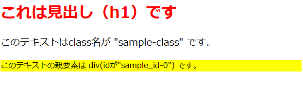

# 4 HTMLとCSS

## 目次
+ [CSSの書き方](#cssの書き方)  
  + [CSSの基本構造](#cssの基本構造)  
  + [CSSでよく使われるプロパティ](#cssでよく使われるプロパティ)  
  + [問題](#問題)  

<br>

---

## CSSの書き方

### CSSの基本構造
CSSはHTMLの要素にスタイル（デザイン）を適用するために使用されます。基本的な構文は次の通りです。

```css
セレクタ {
    プロパティ: 値;
}
```

- **`セレクタ`**  
  **スタイルを適用したいHTML要素**を指定します。例えば、`h1`タグにスタイルを適用したい場合、セレクタは`h1`になります。
  <details>
  <summary>セレクタ一覧(クリックすると開きます)</summary>

  #### 要素セレクタ
  | セレクタ          | 説明                                      | 例                                  |
  |-------------------|-------------------------------------------|-------------------------------------|
  | **要素セレクタ**   | HTMLタグ名で選択                          | `p { color: blue; }`               |
  | **全体セレクタ**   | すべての要素を選択                        | `* { margin: 0; padding: 0; }`     |

  ---

  #### クラスセレクタ
  | セレクタ            | 説明                                      | 例                                      |
  |---------------------|-------------------------------------------|-----------------------------------------|
  | **クラスセレクタ**   | 特定のクラスを持つ要素を選択             | `.sample-class { font-size: 16px; }`   |
  | **グループ化セレクタ** | 複数のセレクタをカンマで区切って一度に指定 | `h1, h2, h3 { font-family: Arial; }`   |

  ---

  #### IDセレクタ
  | セレクタ         | 説明                                       | 例                                      |
  |------------------|--------------------------------------------|-----------------------------------------|
  | **IDセレクタ**   | 特定のIDを持つ要素を選択                  | `#sample-id { background-color: yellow; }` |

  ---

  #### 子孫・子・兄弟セレクタ
  | セレクタ             | 説明                                     | 例                                      |
  |----------------------|------------------------------------------|-----------------------------------------|
  | **子孫セレクタ**     | 親要素の中にある任意の子孫要素を選択     | `div p { color: red; }`                |
  | **子セレクタ**       | 直接の子要素のみを選択                   | `div > p { font-size: 18px; }`         |
  | **隣接兄弟セレクタ** | 同じ親を持つ直後の隣接する兄弟要素を選択 | `h1 + p { color: green; }`             |
  | **一般兄弟セレクタ** | 同じ親を持つすべての兄弟要素を選択       | `h1 ~ p { color: orange; }`            |

  ---

  #### 属性セレクタ
  | セレクタ             | 説明                                      | 例                                         |
  |----------------------|-------------------------------------------|--------------------------------------------|
  | **属性セレクタ**     | 特定の属性を持つ要素を選択                | `a[href] { color: blue; }`                |
  | **部分一致セレクタ** | 属性値が指定した値で始まる、終わる、または含む要素を選択 | `a[href^="https"] { color: green; }`     |

  ---

  #### 擬似クラスセレクタ
  | セレクタ               | 説明                                      | 例                                       |
  |------------------------|-------------------------------------------|------------------------------------------|
  | **:focus**             | 要素がフォーカスされている時に適用       | `input:focus { background-color: lightyellow; }` |
  | **:nth-child()**       | 特定の順番にある子要素を選択            | `li:nth-child(odd) { background-color: lightgray; }` |
  | **:first-child**       | 親要素の最初の子要素を選択               | `p:first-child { font-weight: bold; }`  |
  | **:last-child**        | 親要素の最後の子要素を選択               | `p:last-child { margin-bottom: 0; }`    |
  | **:not()**             | 指定した要素以外を選択                   | `p:not(.highlight) { color: gray; }`    |
  | **:checked**           | チェックボックスやラジオボタンが選択されている要素 | `input:checked { background-color: green; }` |
  | **:disabled**          | 無効な要素を選択                         | `button:disabled { background-color: gray; }` |
  | **:empty**             | 子要素がない要素を選択                   | `div:empty { display: none; }`           |

  ---

  #### 擬似要素セレクタ
  | セレクタ               | 説明                                      | 例                                       |
  |------------------------|-------------------------------------------|------------------------------------------|
  | **::before**           | 要素の前にコンテンツを挿入                | `p::before { content: "※"; color: red; }` |
  | **::after**            | 要素の後にコンテンツを挿入                | `p::after { content: " - 完了"; }`       |
  | **::first-letter**     | 要素の最初の文字を選択                   | `p::first-letter { font-size: 2em; }`    |
  | **::first-line**       | 要素の最初の行を選択                     | `p::first-line { font-weight: bold; }`   |
  | **::selection**        | ユーザーが選択した部分にスタイルを適用   | `::selection { background-color: yellow; }` |

  ---

  #### その他のセレクタ
  | セレクタ         | 説明                                       | 例                                      |
  |------------------|--------------------------------------------|-----------------------------------------|
  | **:root**        | ルート要素（通常は`<html>`）               | `:root { --main-color: #3498db; }`     |
  | **:lang()**      | 特定の言語に対するスタイルを適用           | `p:lang(en) { color: blue; }`          |
  ---
  </details>

- **`プロパティ`**  
  **どのスタイルを変更したいか**を指定します。例えば、`color`（文字色）、`font-size`（文字サイズ）、`background-color`（背景色）などです。

- **`値`**  
  **プロパティに対して設定する具体的な値**です。例えば、`color`の値には色名（`red`）やカラーコード（`#ff0000`）を指定できます。

```css
/* sample.css */

/*h1にスタイルを指定する*/
h1 {
    color: red; /* 文字を赤にする */
}

/*class名"sample-class"にスタイルを指定する*/
.sample-class {
    font-size: 20px;  /* 文字サイズを20pxにする */
}

/*id名"sample_id-0"にスタイルを指定する*/
#sample_id-0 {
    background-color: yellow; /* 背景色を黄色にする */
}
```

また、CSSはHTML上に`<style>`~`</style>`で囲って埋め込むことも、拡張子を`.css`にして1つのファイルとして独立させることもできます。  

例として、上記のCSSを以下のHTMLに適用してみます。  

```html
<!DOCTYPE html>
<html lang="ja">
<head>
    <meta charset="UTF-8">
    <meta name="viewport" content="width=device-width, initial-scale=1.0">
    <title>CSSの適用例</title>
    <link rel="stylesheet" href="style.css">
</head>
<body>

    <h1>これは見出し（h1）です</h1>

    <p class="sample-class">このテキストはclass名が "sample-class" です。</p>

    <div id="sample_id-0">
        <p>このテキストの親要素は div(idが"sample_id-0") です。</p>
    </div>

</body>
</html>
```

プレビューは以下のようになります。  

   

これらを組み合わせて、より魅力的なページに仕上げる事ができます。  

<br>

---

### CSSでよく使われるプロパティ

以下はCSSでよく見かけるプロパティです。

 <details open>
 <summary>基本的なプロパティ</summary>

+ **`color`**  
  **文字色** を変更します。  
  ```css
  .example {
    color: blue; /* 文字色を青に設定 */
  }
  ```

+ **`background-color`**  
  **背景色** を変更します。  
  ```css
  .example {
    background-color: yellow; /* 背景色を黄色に設定 */
  }
  ```

+ **`font-size`**  
  **文字の大きさ** を変更します。  
  ```css
  .example {
    font-size: 18px; /* 文字の大きさを18pxに設定 */
  }
  ```

+ **`text-align`**  
  **文字の配置** を変更します（左寄せ、中央寄せなど）。  
  ```css
  .example {
    text-align: center; /* 文字を中央に配置 */
  }
  ```

+ **`margin`**  
  **外部余白（マージン）** を調整します。  
  ```css
  .example {

    margin: 20px; /* すべての方向に20pxの余白を設定 */
  }
  ```

+ **`border`**  
  **線(ボーダー)** を調整します。  
  ```css
  .example {
    border: 2px solid red; /* 2pxの赤い実線のボーダーを設定 */
  }
  ```

+ **`padding`**  
  **内部余白（パディング）** を調整します。  
  ```css
  .example {
    padding: 15px; /* すべての方向に15pxの余白を設定 */
  }
  ```

+ **`width`**  
  **横幅** を調整します。  
  ```css
  .example {
    width: 300px; /* 横幅を300pxに設定 */
  }
  ```

+ **`height`**  
  **縦幅** を調整します。  
  ```css
  .example {
    height: 200px; /* 縦幅を200pxに設定 */
  }
  ```
</details>


<details>
<summary>背景関連(クリックすると開きます)</summary>

+ **`background-image`**  
  **背景画像** を設定します。  
  ```css
  .example {
    background-image: url('image.jpg'); /* 背景画像を設定 */
  }
  ```

+ **`background-position`**  
  **背景画像の位置** を調整します。  
  ```css
  .example {
    background-position: center; /* 背景画像を中央に配置 */
  }
  ```

+ **`background-size`**  
  **背景画像のサイズ** を調整します。  
  ```css
  .example {
    background-size: cover; /* 背景画像を要素に合わせて拡大または縮小 */
  }
  ```

+ **`background-repeat`**  
  **背景画像の繰り返し** を設定します。  
  ```css
  .example {
    background-repeat: no-repeat; /* 背景画像の繰り返しを無効化 */
  }
  ```

</details>


<details>
<summary>フォント・テキスト関連(クリックすると開きます)</summary>

+ **`font-family`**  
  **フォント** を指定します。  
  ```css
  .example {
    font-family: 'Arial', sans-serif; /* フォントをArialに設定 */
  }
  ```

+ **`font-weight`**  
  **文字の太さ** を調整します。  
  ```css
  .example {
    font-weight: bold; /* 文字を太字に設定 */
  }
  ```

+ **`font-style`**  
  **フォントのスタイル** を変更します。  
  ```css
  .example {
    font-style: italic; /* 文字を斜体に設定 */
  }
  ```

+ **`text-transform`**  
  **テキストの変換** を設定します（大文字、小文字など）。  
  ```css
  .example {
    text-transform: uppercase; /* 文字をすべて大文字に設定 */
  }
  ```

+ **`text-shadow`**  
  **テキストの影** を設定します。  
  ```css
  .example {
    text-shadow: 2px 2px 4px rgba(0, 0, 0, 0.5); /* テキストに影を設定 */
  }
  ```

+ **`line-height`**  
  **行の高さ** を設定します。  
  ```css
  .example {
    line-height: 1.5; /* 行の高さを1.5倍に設定 */
  }
  ```

</details>

<details>
<summary>その他のプロパティ(クリックすると開きます)</summary>

+ **`z-index`**  
  **要素の重なり順序** を設定します。  
  ```css
  .example {
    z-index: 10; /* 要素の重なり順序を設定 */
  }
  ```

+ **`display`**  
  **要素の表示方法** を設定します。  
  ```css
  .example {
    display: block; /* 要素をブロック表示 */
  }
  ```

+ **`position`**  
  **要素の位置指定** を設定します。  
  ```css
  .example {
    position: relative; /* 要素を相対位置で設定 */
  }
  ```

+ **`opacity`**  
  **要素の不透明度** を変更します。  
  ```css
  .example {
    opacity: 0.5; /* 要素の不透明度を50%に設定 */
  }
  ```

</details>

このほかにも沢山のプロパティがあります。検索して調べてみましょう。  

<br>

---

### 問題

HTMLのページにCSSを追加して、見栄えを整えてみましょう。  

1. **h1の文字色を青に変更してください**  

    ```html
    <!DOCTYPE html>
    <html lang="ja">
    <head>
        <meta charset="UTF-8">
        <meta name="viewport" content="width=device-width, initial-scale=1.0">
        <title>CSS練習問題1</title>
        <link rel="stylesheet" href="style.css">
    </head>
    <body>
        <h1>見出しの色を変えよう</h1>
    </body>
    </html>
    ```

    <details>
    <summary>解答例</summary>

    ```css
    h1 {
        color: blue;
    }
    ```
    </details>

1. **p要素の文字サイズを1.5emに変更してください**  

    ```html
    <!DOCTYPE html>
    <html lang="ja">
    <head>
        <meta charset="UTF-8">
        <meta name="viewport" content="width=device-width, initial-scale=1.0">
        <title>CSS練習問題2</title>
        <link rel="stylesheet" href="style.css">
    </head>
    <body>
        <p>この文章の文字を大きくしよう</p>
    </body>
    </html>
    ```

    <details>
    <summary>解答例</summary>

    ```css
    p {
        font-size: 1.5em;
    }
    ```
    </details>

1. **ボタンの背景色を緑に、文字色を白に変更してください**  

    ```html
    <!DOCTYPE html>
    <html lang="ja">
    <head>
        <meta charset="UTF-8">
        <meta name="viewport" content="width=device-width, initial-scale=1.0">
        <title>CSS練習問題3</title>
        <link rel="stylesheet" href="style.css">
    </head>
    <body>
        <button>クリック</button>
    </body>
    </html>
    ```

    <details>
    <summary>解答例</summary>

    ```css
    button {
        background-color: green;
        color: white;
    }
    ```
    </details>

1. **リストの背景色を灰色に、リスト項目の間隔を10pxにしてください**  

    ```html
    <!DOCTYPE html>
    <html lang="ja">
    <head>
        <meta charset="UTF-8">
        <meta name="viewport" content="width=device-width, initial-scale=1.0">
        <title>CSS練習問題4</title>
        <link rel="stylesheet" href="style.css">
    </head>
    <body>
        <ul>
            <li>項目1</li>
            <li>項目2</li>
            <li>項目3</li>
        </ul>
    </body>
    </html>
    ```

    <details>
    <summary>解答例</summary>

    ```css
    ul {
        background-color: gray;
    }

    li {
        margin-bottom: 10px;
    }
    ```
    </details>