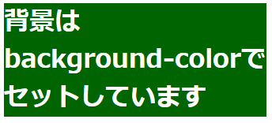
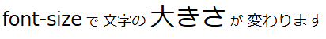
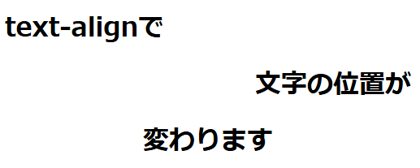

# 4 HTMLとCSS

## 目次
+ [CSSの書き方](#cssの書き方)  
  + [CSSの基本構造](#cssの基本構造)  
  + [CSSでよく使われるタグ](#cssでよく使われるタグ)  
  + [CSSを書いてみよう](#cssを書いてみよう)

<br>

---

## CSSの書き方

### CSSの基本構造
CSSはHTMLの要素にスタイル（デザイン）を適用するために使用されます。基本的な構文は次の通りです。

```css
セレクタ {
    プロパティ: 値;
}
```

- **`セレクタ`**  
  **スタイルを適用したいHTML要素**を指定します。例えば、`h1`タグにスタイルを適用したい場合、セレクタは`h1`になります。

- **`プロパティ`**  
  **どのスタイルを変更したいか**を指定します。例えば、`color`（文字色）、`font-size`（文字サイズ）、`background-color`（背景色）などです。

- **`値`**  
  **プロパティに対して設定する具体的な値**です。例えば、`color`の値には色名（`red`）やカラーコード（`#ff0000`）を指定できます。

例：
```css
h1 {
    color: blue;
    font-size: 2em;
}

p {
    color: gray;
    line-height: 1.5;
}
```

プレビュー:  
  

<br>

---

### CSSでよく使われるタグ

| | |
| **`margin`** | **外部余白（マージン）** を調整します。 |
| **`padding`** | **内部余白（パディング）** を調整します。 |

+ **`color`**  
  **文字色** を変更します。  
    

+ **`background-color`**  
  **背景色** を変更します。  
    

+ **`font-size`**  
   **文字の大きさ** を変更します。  
    

+ **`text-align`**  
  **文字の配置** を変更します（左寄せ、中央寄せなど）。   
    


[このほかにも様々なタグがあります。](04-03_CSSタグ集.md)

<br>

---

### CSSを書いてみよう
HTMLのページにCSSを追加して、見栄えを整えてみましょう。次の例のように、スタイルを加えてみてください。

```css
h1 {
    color: green;
    font-size: 2.5em;
    text-align: center;
}

ul {
    background-color: lightblue;
    padding: 10px;
}

a {
    color: red;
    text-decoration: none;
}

p {
    font-size: 1.2em;
    margin-bottom: 20px;
}
```

このように、CSSを使ってHTMLにデザインを施すことで、ウェブページがより視覚的に魅力的になります。

---
