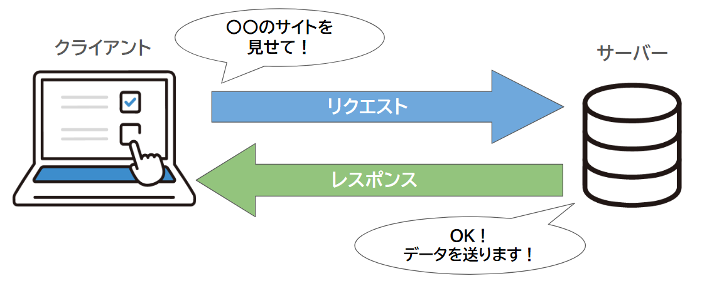
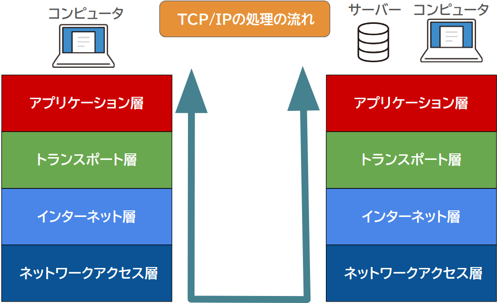
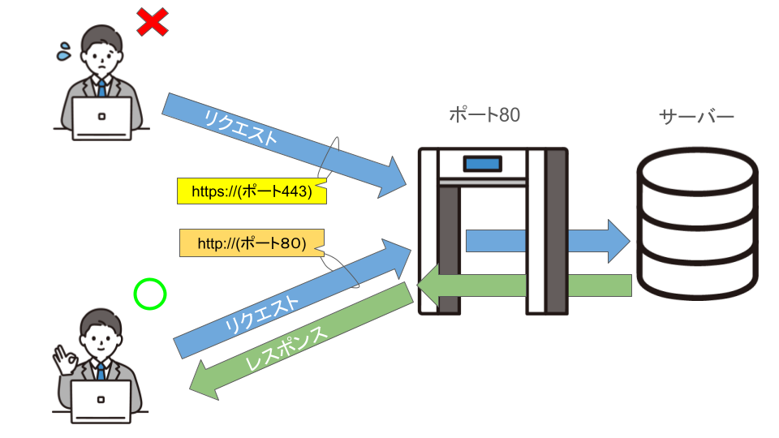
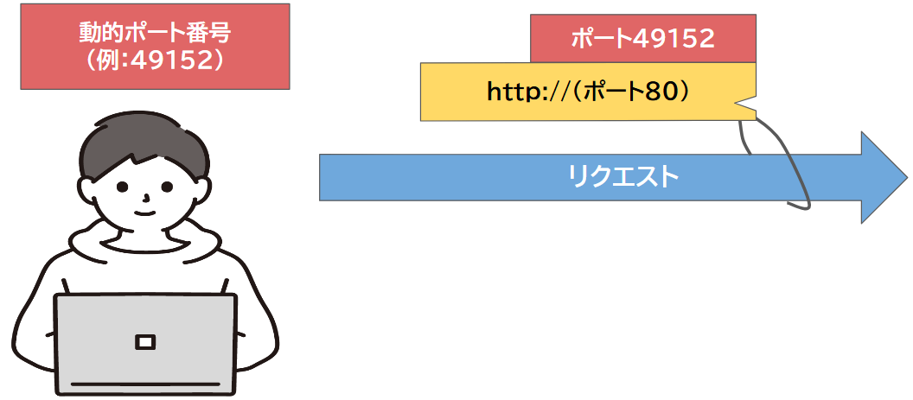
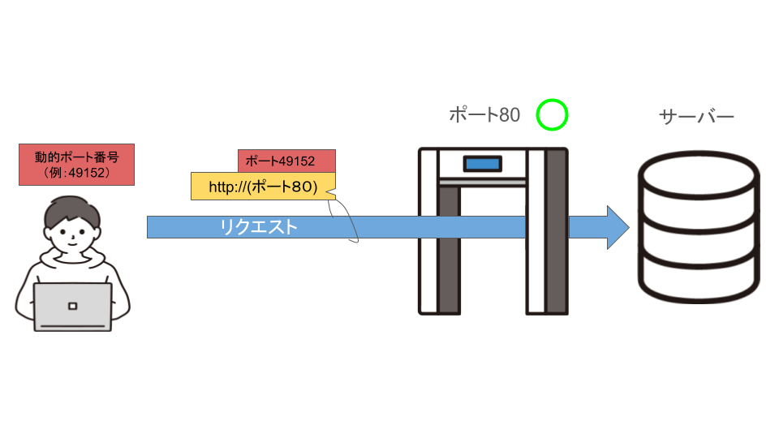
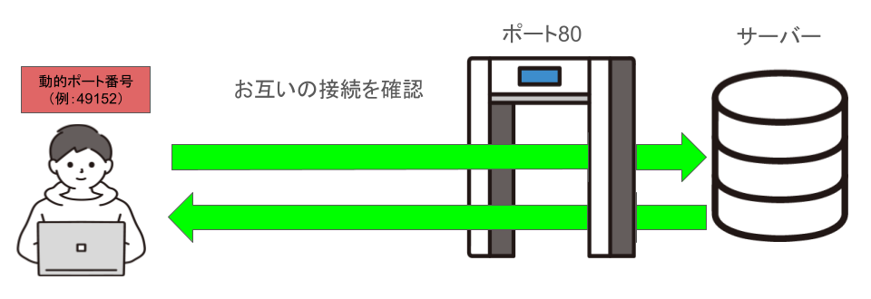
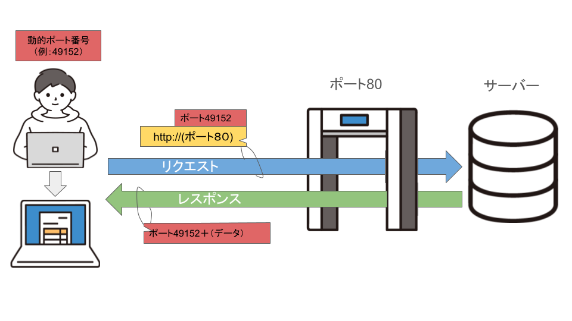

## 11 Ruby on Rails：Webシステム概念

## 目次

- [webシステムの基本的な知識](#webシステムの基本的な知識)  
  - [webシステムとは？](#webシステムとは？)
  - [サーバーとクライアントの関係](#サーバーとクライアントの関係)
  - [インターネットの概要](#インターネット概要)
  - [プロトコルとは？](#プロトコルとは)
  - [TCP/IPとは？](#tcpipとは)
  - [よく使用されるプロトコル](#よく使用されるプロトコル)
       - [HTTP/HTTPS](#httphttps)
       - [FTP](#ftp)
       - [IP](#ip)
       - [TCP](#tcp)
       - [UDP](#udp)
       - [DNS](#dns)
  - [ポート番号とは？](#ポート番号とは)

## webシステムの基本的な知識

### Webシステムとは？

<br>

**【Webシステムとは】**  
   * **インターネット**を利用して、**Webブラウザ**（例えば、Google ChromeやSafariなど）で利用できるシステムとサービスやアプリケーションの事です。  

   <br>

   * **インターネット**に接続されたネットワーク機能を持つ電子機器とWebブラウザがあれば、どこからでもアクセスできます。

<br>

**Webシステムには、大きく分けてWebサイトとWebアプリケーションがあります。**

   * **Webサイト**   
    ・ 基本的に、ページを閲覧することが中心です。  
    ・ 情報提供を主な目的とするもので、例えば企業や個人のホームページ、ニュースサイト、ブログ、ウィキペディアなどがあります。
  
  <br>

   * **Webアプリケーション**  
    ・ ユーザーが操作を行い、特定の機能を使うことができるシステムです。  
    ・ 例えばオンラインショッピングサイトやSNS、Google検索などがこれに当たります。
  

#### **これらはすべて、インターネットを通じて利用できるシステムです**。

***

### サーバーとクライアントの関係
**Webシステムでは、サーバーとクライアントという2つの重要な役割が存在します。**



**【クライアントとは】**  

* `クライアント`とは、**情報を要求する側であり、私たちユーザーです**。  
   ・ Webブラウザ（Chrome、Safariなど）を使用して、Webサーバーに「このページを見せてください」と**リクエスト**を送り、サーバーから返ってきたデータを表示します。  
   ・ クライアントの役割は、サーバーからの情報を受け取り、それを画面に表示したり、ユーザーの入力に基づいてサーバーに再度リクエストを送ったりすることです。

<br>

**【サーバーとは】** 

* `サーバー`とは、**Webシステムでデータを提供する役割を担うコンピュータです**。  
   ・ インターネットを通じて、ユーザーがリクエストしたWebページやアプリケーションのデータ、画像、動画などを返します(**レスポンス**)。  
   ・ Webサーバーに保存されたWebページをリクエストすると、ページの内容が私たちユーザーに送られます。


<br>

サーバーが提供するデータをクライアントがリクエストし、クライアントがそれを表示するという形で、両者は役割分担をしてお互いに連携しています。  
**このように、Webシステムはサーバーとクライアントの間でのデータのやり取りを通じて機能します**。

***

### インターネット概要

**【インターネットとは】**  

* `インターネット`とは**TCP/IP**（プロトコル）などを使用して、コンピュータやスマートフォンなどのネットワーク機能を持つ電子機器が繋がるネットワークです。  
**※基本的には、インターネット上で情報をやり取りするための仕組みとして**、<u>**TCP/IP(プロトコル)**</u>という通信のルールが使われています。

<br>

インターネットに接続することで、遠く離れた場所にあるインターネットに接続されている機器やサービスとも接続をすることができます。   
これは個人ネットワークではなく、世界中の多数のコンピュータや機器がつながる**大規模なネットワーク（The Internet）だからです。**  

**インターネットは便利で多くの情報を提供してくれますが、その規模が大きいため、セキュリティにも十分な配慮が必要です**。  

### インターネット上で提供されるサービスのセキュリティ

* インターネット上で提供されるサービスには、アカウントを持たなくても利用できるサービスと、アカウントが必要なサービスがあります。  
* どちらの場合でも、サービス提供者は利用者のデータやサービスの安全性を守るため、**セキュリティ対策を講じる必要があります**。

### **<u>セキュリティが不十分な場合に起こりうるリスク</u>**

* アカウントが必要なサービスでは  
  ・ ユーザー名やパスワードが不正に取得されると、個人情報や機密情報が第三者に漏洩するリスクがあります。  

<br>

* アカウントを持たないサービスでは  
  ・ コンテンツの改ざんや不正アクセスのリスクがあります。  
  ・ webページの文字や画像、動画が悪意を持った第三者によって変更され、サービス内容が不正に改ざんされる可能性があります。

<br>

### **<u>セキュリティ対策をしっかり行おう</u>**
これらのリスクを防ぐためには、**以下のセキュリティ対策が必要です**。

1. アクセス制御：サービスにアクセスできる権限を制限する。  

1. 暗号化：通信やデータを暗号化して第三者からの盗聴や改ざんを防ぐ。  

1. 二段階認証（2FA）：パスワードに加えて、認証アプリやSMSコードを使用し、不正アクセスを防止する。  

1. セキュリティチェックを定期的に実施: サービスを使い続ける中で、定期的にセキュリティのチェックを行うことも大切です。  


#### インターネットでサービスを安全に提供するためには、これらのセキュリティ対策をきちんと実施することが大切です。そして、サービスを提供する側だけでなく、利用者も自分の情報を守る意識を持ち、注意を払うことが重要です。

***

### プロトコルとは？
**【プロトコルとは】**   
* `プロトコル`とは、**コンピュータやネットワーク機器同士が通信するための共通の「ルール」です。**  
   ・ ルールがあることで異なる機器やシステムが問題なくデータをやり取りできるようになります。  

* 情報の暗号化や認証強化、アクセス制御などが重要ですが、これらを実現するために欠かせないのが「**プロトコル**」です。  
   ・ 重要な情報を送信する際、データを「暗号化」して、第三者に見られないようにします。  
   ・ この暗号化のルールもプロトコルに則って行われ、通信の安全性が保たれます。

**プロトコル**は、このように**インターネット上でデータを守るために重要な役割を果たしています**。

<details><summary>ルール（プロトコル）の歴史</summary>  
   
<br>

昔は、コンピュータやネットワーク機器同士が通信するための共通のルールがなく、同じメーカーの機器同士でしかデータをやり取りできませんでした。  
そのため、異なるメーカーの機器を使ったり、大きなシステムを拡張するのが難しかったのです。  

しかし、通信のルール（プロトコル）が標準化されたことで、異なるメーカーの機器でも問題なく通信できるようになりました。  
特にインターネットの普及により、TCP/IPという標準的なルールが広まり、さまざまな機器やシステムがつながるようになったのです。  
これにより、ネットワークやシステムの規模が大きくなり、より多くの技術が共存できるようになりました。

---

</details>

<br>

さまざまなルール（プロトコル）があり、用途に応じて使い分けられます。  
**今回は、先ほど紹介したインターネットでよく使われる<u>TCP/IP</u>について見ていきます**。


### TCP/IPとは？

**【TCP/IPとは】**  

* `TCP/IP`とは、**インターネットやローカルネットワークでデータ送受信のための基本的なルールです**。  

    ・ 世界で最も使用されているプロトコルの集合体であり、事実上、**インターネット通信での標準の仕組みとなっています**。

   <details><summary>ローカルネットワークついて</summary>

   <br>
   インターネットとは違い家庭やオフィスなどの限られた範囲で使用されるネットワークです。  
      
   例えば、自宅のWi-Fiを使って、パソコンやスマートフォン、プリンターなどがつながっている状態です。  
   このネットワーク内で、ファイルを共有したり、プリンターを使ったりできます。
   
   ローカルネットワークは、インターネットに接続するための「接続機器（ルーターやモデム）」を使います。  
   これにより、インターネットが無くても、同じネットワーク内で機器同士の通信は可能です。

   ---

   </details>
<br>



<br>

* リクエストやデータはアプリケーション層から下へ順に処理をしていきネットワークアクセス層を経て相手に届きます。  
* レスポンスを返す際も同様の処理の流れを使用し、データはネットワークアクセス層を経て相手に届きます。

**この処理の流れは色々な場面で使用されています。**  

（例）
* webページを表示したいとき  
「クライアント（私たち）」ーー＞（リクエスト）ーー＞「サーバー」ーー＞（レスポンス）ーー＞「クライアント（私たち）」  

* メールを送信するとき  
「クライアント（私たち）」ーー＞（リクエスト）ーー＞「コンピューターやネットワーク機器」  

* サーバー間でやり取りするとき  
「サーバー１」ーー＞（リクエスト）ーー＞「サーバー２」ーー＞（レスポンス）ーー＞「サーバー１」

私たちの周りでは、日々TCP/IPを用いて、より複雑で効率的な通信が行われています。

このTCP/IPの仕組みは、インターネットを利用するための「**共通のルール**」です。  
異なるコンピュータやスマートフォン、ネットワーク機器が問題なくデータをやり取りできるようにしてくれています。

**TCP/IPは以下の4つの階層に役割を分類しており、それぞれが異なる機能や目的を持っています。**

| 層 | 名称 | 役割 | 例 | プロトコル |
|:--|:--|:--|:--|:--|
| 4層 | アプリケーション層 | ユーザーが使うアプリケーションが通信するためのルールを決めます。| Webサイトを見る、メールを送る |  HTTP、SMTP、FTP、DNS |
| 3層 | トランスポート層 | データが途中で失われたり、遅延したりしないように管理します。<br>もしデータが届かない場合、再送信して確実に伝えます。| オンライン会議で音声が途切れないようにする| TCP、UDP |
| 2層 | インターネット層 | データがどの経路を通って送られるかを決め、目的地に届くようにします。| 的地の住所を確認して、正しい場所に届ける | IP、ICMP |
| 1層 | ネットワークアクセス層 | データが物理的に送られる部分で、Wi-Fiや有線ネットワークを使ってデータが伝送されます。 | データが通る道路やケーブル、電波 | イーサネット、Wi-Fi、PPP |

<br>

**TCP/IPの各層の役割を紹介します。**

### ｜1.アプリケーション層

**【アプリケーション層とは】**  
`アプリケーション層`とは、**データの内容がどのようなもので、どのようにやり取りするかが決まります**。  

  * ユーザーが直接使用するソフトウェア（webブラウザ、メールソフトなど）とネットワークとの間でデータをやり取りするための層です。

**主なプロトコル: HTTP（web）、SMTP（メール送信）、FTP（ファイル転送）、DNS（ドメイン・ネーム・システム）など**。

**処理の流れ**  
* アプリケーション層では、ユーザーが操作するアプリケーションからデータが生成されます。  
* webサイトを表示するためにHTTPプロトコルが使われ、ユーザーが送信するメールはSMTPプロトコルを使って送信されます。  

***

### ｜2.トランスポート層

**【トランスポート層とは】**   
`トランスポート層`とは、**データが途中で失われたり順番が狂ったりしないようにする役割を持っています**。  

  * アプリケーション層で生成されたデータが正しく相手に届くように管理する層です。

**主なプロトコル: TCP（Transmission Control Protocol）、UDP（User Datagram Protocol）**。

**処理の流れ** 

**【TCP】** 
   * データを小さく分けて送信し、受信側で順番通りに再構成します。  
   * もし途中でデータが失われた場合、再送信を要求して正確にデータを届けます。  

**【UDP】** 
   * データを分けて送信しますが、確認や再送は行いません。  
   * 軽量で高速な通信が求められる場合に使われます（例：オンラインゲームや動画ストリーミング）。

***

### ｜3.インターネット層

__【インターネット層とは】__  
`インターネット層`とは、**送信元から受信先までデータがどのルーターを通るかを判断して、最適なルートで届けられます。**  

  * データがどの経路を通って目的地に届けられるかを決める層です。  

**主なプロトコル: IP（Internet Protocol）、ICMP（Internet Control Message Protocol）**。

**処理の流れ**  
* インターネット層では、データに宛先IPアドレスを付加し、目的地に向けて送信されます。  
* 途中のルーターを通過する際に、データが最適な経路を選ばれて転送されます。  
* IPは、データの宛先を基に経路を決定し、データを次のネットワークに送ります。  

<details>
<summary>ルーターについて</summary>

* **ルーター**は、ネットワーク同士を繋げる機器で、データを送り先に適切に届ける役割を担っています。  
* データに宛先となるIPアドレス（インターネット層のプロトコル（IP））が付けられ、  
ルーターはそのIPアドレスを基にデータを適切なネットワークに転送し、最終的に目的地に到達するようにします。
</details>


***

### ｜4.ネットワークアクセス層

**【ネットワークアクセス層とは】** 
`ネットワークアクセス層`とは、**データを伝送するための「道」や「電波」を提供します**。  
    
  * データを実際に物理的なネットワークで送信する層です。  


**主なプロトコル: イーサネット、Wi-Fi、PPP（Point-to-Point Protocol）**。

**処理の流れ**  
* この層では、ネットワークの物理的なメディア（有線や無線）を通じて、データが送信されます。  
     (例えば、Wi-Fiで接続されている場合、無線電波を使ってデータを送受信します。)  
* この層では、ネットワーク内の機器同士で直接データを送受信し、通信を可能にします。  

***

**これらの層で使用されるプロトコルは、通信の実現において非常に重要です。**


**ポイント**

 * 【各層の役割分担】  
   TCP/IP仕組みの各層は、それぞれ異なる機能を持ち、データが目的地に届くまでに役割を果たしている。  
   ・ アプリケーション層はデータの内容を決定。  
   ・ トランスポート層はデータが正しく相手に届くように管理。  
   ・ インターネット層は最適な経路を選定。  
   ・ ネットワークアクセス層は実際に物理的な通信をします。  

   <br>

 * 【層ごとのプロトコル】  
   ・ 各層で使用されるプロトコルは、データ通信の信頼性、効率性、安全性を確保するために重要です。  
   ・ プロトコルが協力して、ネットワーク通信を支えているかの理解は、仕組みを学ぶ上で非常に有益です。

   <br>

 * 【データ通信の流れ】  
   ・ データは、アプリケーション層からネットワークアクセス層を経て、相手側に届くまで、複数の層を通過します。  
   ・ それぞれの層が専門的な役割を担いながら協力し、データが安全かつ効率的に届けられることを保証します。

  

<br>

 次に、上記で紹介したプロトコルの中で、特に重要でよく使われるものについて詳しく説明します。

## よく使用されるプロトコル

### **HTTP/HTTPS**

***

**【HTTP/HTTPSとは】**  
`HTTP/HTTPS` とは、webブラウザ（クライアント）とwebサーバが通信するための仕組み（プロトコル）です。  

**このプロトコルはwebサイトを表示するために使われますが、最も大きな違いは 通信が安全かどうかです。**  

私たちは普段、「 http://www.xxxx.xxxx/ 」 のような**URL**を見かけますが、  
先頭部分にある「http://」や「https://」が、通信が暗号化されているかどうかを示しています。  


- HTTP は、データを暗号化せずにそのまま送受信します。

<br>

- HTTPS は、通信を 暗号化 して行います。これにより、第三者がデータを盗み見ることが難しくなります。

<br>

**暗号化されるのは、例えば以下のような情報です**  
- ログイン情報（ユーザー名やパスワード）

<br>

- 個人情報（名前、住所、電話番号など）

<br>

- クレジットカード情報（カード番号、期限など）

<br>

- その他の送信されるデータ（メッセージや入力内容など）

<br>

**<u>「http://」はHTTPです。</u>  <u>「https://」はHTTPSです。</u>**  
HTTPSでは、データの安全性を守るために SSL または TLS という技術を使っています。  
この技術はデータを暗号化してやり取りする仕組みで、インターネット上でのやり取りが安全であることを確保します。

**簡単に言えば、<u>HTTPS</u> は <u>HTTP</u> よりもセキュリティが高く、個人情報やパスワードを入力する際などに使われることが多いです。**

<details>
<summary>SSLついて</summary>
<strong>SSL（Secure Sockets Layer）</strong> は、インターネット上で安全に通信するための技術です。<br>
データを暗号化し、通信の途中でデータが盗まれたり改ざんされたりするのを防ぎます。

</details>

<details>
<summary>TLSついて</summary>
<strong>TLS（Transport Layer Security）</strong> は、SSLの後継として使われる技術で、より安全性が高いです。<br>
現在、実際に使用されているのはほとんどがTLSですが、一般的には「SSL」と呼ばれることもあります。
</details>

***

### **FTP**

***
__【FTPとは】__  
`FTP`とは、ファイルを転送するための通信規格です。  

* **クライアント**と**サーバ**間で、ファイルのアップロードやダウンロードを行うときに使用されます。  

* webサイトを作るとき、画像やテキストなどのファイルをwebサーバにアップロードする必要があり  
  そのために、**FTPソフト**（例えば「FileZilla」など）を使います。  
  FTPソフトは、コンピュータとサーバを繋げて、ファイルを簡単に送るためのツール(アプリ)です。

データの安全性を守るための仕組みもあります。  
通常のFTPは、データを暗号化せず送信しますが、FTPS や SFTP を使いデータが暗号化され、安全にファイルを送受信できます。  

**これにより、インターネットを介した通信が他人に見られにくくなり、情報の漏洩を防ぐことができます。**

<details>
<summary>FTPSついて</summary>

**FTPS (FTP Secure)**
は、FTPに暗号化を加えたもので、より安全にデータを転送するための技術です。  
FTPSでは、HTTP/HTTPSで説明を触れたSSL/TLSを使って通信を暗号化します。

</details>

<details>
<summary>SFTPついて</summary>

**SFTP (SSH File Transfer Protocol)** 
は、FTPSとは異なるSSHという技術を使用して、ファイル転送を暗号化して行います。  
これにより、より安全な通信が可能になります。SFTPも安全性の高いプロトコルとして広く利用されています。  
※SSHは、安全なリモート接続を提供する技術で、インターネット経由でサーバに安全にアクセスするために使われます。

</details>

***

### **IP**

***

**【IPとは】** 
`IP`とは、インターネット上でコンピュータやデバイスを識別するための番号で、これを「**IPアドレス**」と呼びます。  

* **IPアドレス**使って、特定の場所にアクセスできます。  
* **インターネットの「住所」のようなもので、数字の組み合わせ（例えば「192.168.0.1」）で表されます。**

普段私たちが見るのは「 https://www.google.com/ 」 のようなwebサイトの名前で、これを「**ドメイン**」と呼びます。  
**ドメイン**名は、実際の住所（**IPアドレス**）をわかりやすくしたものです。

例えば、ブラウザのアドレスバーに「172.217.26.228」と入力すると、Googleのページが表示されます。この数字がGoogleのIPアドレスです。  
「 www.google.com 」などの名前を使ってwebサイトにアクセスしますが、名前が指し示すIPアドレスに繋がっていることになります。

※「172.217.26.228」は2025年1月時点でのGoogleのIPアドレスです。

***

### **TCP**

***

**【TCPとは】**  
`TCP`とは、データ通信で正確に情報を渡すためのプロトコルです。   

* **TCP**では、データを送る前にまず通信をする準備を整え、その後、データを送信します。

* **これにより、データが正しい順序で届き、データが欠けることなく送られることが保証されます。**  
もし途中でデータが失われた場合でも、TCPは再送信を行い、正確にデータを届けます。

**例えばこのような場面で使用されます。**

* webサイトの閲覧：ブラウザがwebページを表示する際に、画像やテキストなどのデータを正確に受け取るためにTCPが使われます。

<br>

* ファイルのダウンロード：例えば、ファイルをインターネットからダウンロードする際にも、TCPがデータの順番や欠落を防ぎ、正確にファイルを受け取ります

<br>

* メールの送受信：メールを送信したり受信したりする際にも、TCPが使われ、メッセージが正確に届くようにします。

<br>

**TCPは、データが確実に届くことを優先するため、通信の正確性が重要な場面で特に役立ちます**。

***

### **UDP**

***

**【UDPとは】**  
`UDP`とは、データを速く送るためのプロトコルです。  
* **TCPと違って、データを送る前に接続を作ることなく、すぐにデータを送信します。**

* **ただし、UDPはデータがちゃんと届いたかどうかを確認したり、もし途中でデータが失われた場合に再送することはありません**。  
    これにより、通信が軽くて速いですが、その分、データが届かないこともあります。

**例えばこのような場面で使用されます。**  

* 音声通話（例：SkypeやZoom）

<br>

* 動画ストリーミング（例：YouTube）

<br>

* オンラインゲーム（例：リアルタイムの対戦ゲーム）

<br>

これらの場面では、**リアルタイムでデータを送る必要があるため、**  
**少しのデータが欠けても大きな影響がなく、すぐに次のデータが届くことで、通信が途切れずにスムーズに行えます。**

***

### **DNS**

***

**【DNSとは】**  
`DNS（ドメインネームシステム）`とは、ドメイン名を対応するIPアドレスに変換する仕組みです。

* webサイトにアクセスする際、「 www.example.com 」のようなドメイン名を入力すると、  
  **DNS**がそれを対応するIPアドレスに変換し、目的のwebサイトに接続します。  

これにより、ユーザーはIPアドレスを直接覚えたり入力したりする必要はなく、簡単にサイトにアクセスできます。  
**インターネット上には膨大な数のドメイン名とIPアドレスが存在しているため、DNSが重要な役割を果たしています。**

***

**ポイント**

**【HTTPとHTTPSの違い】**

* HTTPは、暗号化されていない通信を行うため、セキュリティ面で弱点があります。

* HTTPSは、データを暗号化して送受信し、通信中の情報漏洩を防ぎます。  
  特に、個人情報やクレジットカード情報を送る際はHTTPSが必須です。

**【FTPの役割とセキュリティ】**  

* FTPは、インターネット上でファイルを送受信するために利用されるプロトコルです。  
  特にwebサイトの管理やファイル共有に頻繁に使用されます。

* 通常のFTPは暗号化されていませんが、FTPSやSFTPはセキュリティを強化し、データの暗号化を提供します。  
  これにより、ファイル転送時のデータ保護が強化されます。

**【IPアドレスとドメイン名】**  

* IPアドレスは、インターネット上でデバイスを識別する「住所」のような役割を果たします。

* ドメイン名は、わかりやすい名前でwebサイトを指し示します。  
   DNSは、これらのドメイン名とIPアドレスを対応させ、ユーザーが簡単にwebサイトにアクセスできるようにします。

**【TCPとUDPの使い分け】**  

* TCPは、データが正確に届くことを重視するプロトコルで、webサイトの閲覧やメールの送受信などに使用されます。  
  データの順序や欠落を防ぐため、正確性が重要な場合に使用されます。  

* UDPは、リアルタイム性が重要な通信（音声通話や動画ストリーミング、オンラインゲームなど）で使用されます。  
  少々のデータの欠落が影響を与えない状況で、速度と軽さを優先します。

**【DNSの重要性】**

* DNSは、ユーザーが覚えやすいドメイン名を使ってインターネット上のリソースにアクセスできるようにする仕組みです。  
  これにより、複雑なIPアドレスを気にすることなく、インターネットを簡単に利用することができます。

***

**TCP/IPという仕組みは、インターネットをはじめとするコンピュータネットワークにおける通信の基盤となる設計図です。**

* **通信を行う際に必要なプロトコルを層ごとに分けて構築し、効率的かつ安全にデータの送受信を可能にしている**  

* **異なる機器やネットワークが互換性を持ち、スムーズなデータ通信が可能となり、私たちがインターネットを使う際の基盤を支えています。**

**ですがTCP/IPだけではデータを目的の場所に届ける事はできません。**  
データをどこの届けるべきなのかの目的地を決めるためにポート番号が必要になります。   

**次にデータを受け渡すために必要なポート番号について説明します。**

***

## ポート番号とは？

**【ポート番号とは】**    
* `ポート番号`とは、IPプロトコルの説明であったIPアドレスと組み合わせて使用され、  
   IPアドレスが「住所」のようなものであるなら、**ポート番号はその住所の「部屋番号」にあたります**。  
もしこの情報が間違っていたり、欠けていたりすると、注文した商品が届かないのと同じように、データが正しい場所に届かなくなります。  
ポート番号は、その問題を解決して、データを正しい場所（システム、サービス、アプリケーション）に届けるために必要な情報です。 



### ポート番号の基本的な仕組み

***

* ポート番号の範囲 : 0から65535までの数値があり0から1023が使用用途が決まっていたりなど合計で三つの用途で分けられます。  

     * ウェルノウンポート（Well-Known Ports）  
        ・ 範囲 : 0～1023  
        ・ **使用用途**   
        この範囲のポート番号は、「通信方法（プロトコル）」に割り振られた決まっている数値です。

     * 登録済みポート（Registered Ports）  
        ・ 範囲 : 1024～49151  
        ・ **使用用途** 
        特定のアプリケーションやサービス、システムなどで利用するための数値です。 

     * 動的またはプライベートポート（Dynamic/Private Ports）  
        ・ 範囲 : 49152～65535  
        ・ **使用用途**  
        一時的なポート番号として使用され、特定のアプリケーションに固定されることはありません。  
        主に、クライアントとサーバ間で行われる通信の際に動的に割り当てられる数値です。  
        通信を開始する際、クライアント側が一時的にランダムなポート番号を使用します。

**このように、ポート番号は通信の目的や役割に応じて異なる範囲が設定されており、それぞれの範囲に適した使い方があります。**

### 主なポート番号

* ポート番号一例
   * ポート80 (HTTP)  
      ・ 使用例： webサーバーでのHTTP通信  
      ・ 説明： webサイトを表示するためのポート番号です。    
      ・ 通常、webブラウザでURLに「http://」と入力した際に、サーバはポート80で待機していないといけません。

   * ポート443 (HTTPS)  
      ・ 使用例： webサーバーでのHTTPS通信  
      ・ 暗説明： 号化されたHTTP通信のためのポート番号です。  

   * ポート21 (FTP)  
      ・ 使用例： ファイル転送（FTPサーバー）  
      ・ 説明： ポート21は、FTPサーバが通信を受け入れるために使用されます。  

   * ポート53 (DNS)  
      ・ 使用例： ドメイン・ネーム・システム（DNS）  
      ・ 説明： ポート53は、DNSサーバとクライアントが通信する際に使用されるポート番号です。  

 * サービス、システムなどでの一例
   * ポート3306 (MySQL)  
      ・ 使用例： MySQLデータベースの通信  
      ・ 説明： MySQLは、広く使われているリレーショナルデータベース管理システムです。    
      ・ ポート3306は、MySQLサーバとクライアントがデータをやり取りするために使用されるポート番号です。
   * ポート3389 (RDP)  
      ・ 使用例：リモートデスクトップ接続（RDP）   
      ・ 説明： RDP（Remote Desktop Protocol）は、リモートデスクトップ接続を提供するプロトコルです。    
      ・ ポート3389は、Windowsのリモートデスクトップサービスで使用されます。

**上記のようにポート番号は用途によって決められた数値が使用されています。**

**次にポート番号も交えた処理サイクルを説明します。**



1. クライアント（私たち）がサーバに接続したいとき
   * 例えば、webサイトを見たいとき、ブラウザ（ChromeやFirefoxなど）がインターネットに接続します。   

   * ブラウザは、コンピュータの「動的ポート番号（例えば49152番）」という一時的な番号を使って、  
     サーバ（例えばGoogleなど）にリクエスト（動的ポート番号など）を送ります。この番号は毎回変わり、特定のサービスなどと結びついていません。



2. サーバは「ポート」を待機している

   * サーバは「webサイトを表示するためのポート番号」を待機しています。  
     たとえば、webサイトを表示するために、サーバは通常「80番」ポートを使っています( http:// で送られて来るのを待ってる)。

   * サーバは常に決まったポート番号で「待機」しており、クライアントが接続したいときに、接続を受け入れます。



3. TCP接続の確立（お互いに接続の準備をする）

   * ここでプロトコルの説明で出てきたTCPが登場します。

   * クライアントのブラウザがサーバに接続する準備が整ったら、お互いに接続の確認を行います。

   * これにより、データを安全に送る準備が整います。



4. データの送受信（実際に通信が始まる）

   * 接続が完了すると、クライアントとサーバはデータをやり取りします。

   * クライアントは動的に割り当てられた番号（49152番）を使い、サーバは常にポート番号「80番」でデータを受け取り、  
     サーバからのデータはそのクライアントの動的ポート番号（49152番）に返送されます。

   * これで、クライアント（私たちのブラウザ）は、サーバから送られたデータを受け取り、WEBページを表示します。

5. 通信が終わったら終了

   * すべてのデータのやり取りが終わったら、接続を終了します。
 
<br>

**ポートのセキュリティについて**  

**ここまでポートについてお話ししましたが、ポートはセキュリティと密接に関わり、その一部を担っています。**  
インターネットを利用する際、私たちのコンピュータやスマートフォンは他のコンピュータとデータをやり取りします。  

このとき、どの「ポート番号」を使うかが通信の行き先を決めます。  
しかし、不正にポート番号が取得されると、攻撃者が予測不可能な方法でアクセスしてくる危険があるため、注意が必要です。  

そこで登場するのが、「**ファイアウォール**」や「**ルーター**」というセキュリティ機器です。  
これらはネットワークの「警備員」のように、ポートを監視して不正アクセスを防ぎ、正しい通信だけを通す役割を持っています。  
* webサイトを開くとき、ブラウザ（インターネットを利用するアプリ）は「ポート80」を使ってサーバに接続します。 

* もし攻撃者が不正に他のポートを使ってアクセスしても、セキュリティシステムがポートを「閉じて」通さないようにします。

これにより、私たちのデータやコンピュータを守ることができます。

***

**ポイント**  

1. 【ポート番号とは】  
    * ポート番号は、IPアドレスの「住所」に対して、データを届けるための「部屋番号」にあたります。

1. 【ポート番号の種類】  
    * ウェルノウンポート（0～1023）  
    特定の通信プロトコルに使用（例：HTTP、FTP）。

    * 登録済みポート（1024～49151）  
    特定のアプリケーションやサービス用。

    * 動的ポート（49152～65535）  
    一時的にクライアントが使用するポート。

1. 【主なポート番号】  

    * 80（HTTP）、443（HTTPS）、21（FTP）、53（DNS）、3306（MySQL）、3389（RDP）

1. 【ポートのセキュリティ】

    * 不正なアクセスを防ぐため、ポート番号は重要なセキュリティ要素です。
    * ファイアウォールやルーターがポート番号を監視し、不正なアクセスをブロックします。
    * サービスに必要なポート番号のみを開放し、他のポートは閉じることで、セキュリティを強化します。

***

**ポート番号は、通信が正しく行われるために重要な役割を持っています。**  
**また、セキュリティを守るためには、許可されたポート番号だけを通過させる管理が必要です。**

***

## 次に、HTTPプロトコルを実際に触れて学んでみましょう！

**初めに**、サーバーとクライアントの関係でも触れましたが、  
普段私たちはwebページを閲覧するときクライアント側(私たち)から、
送信されたデータをサーバーがレスポンスとして返す一連の流れがあります。  

ブラウザで実際にHTTPリクエストを送信し、レスポンスを確認する方法にはいくつかの方法があります。  
ここでは、ブラウザの開発者ツールを使う方法と、curlコマンドを使う方法を説明します。

### 1. ブラウザの開発者ツールを使ってHTTPリクエストを確認する
**ブラウザ（Chrome、Edgeなど）には開発者ツールが組み込まれていて、これを使ってHTTPリクエストとレスポンスを確認することができます**。

ブラウザでの手順   
 https://httpbin.org を開いてください。

1. 【開発者ツールを開く】
   * ブラウザで、右上の「メニュー（三点アイコン）」をクリックし、  
   「その他のツール」>「(Chromeならデベロッパーツール)/(Edgeなら開発者ツール)」を選択する。  

   * キーボードショートカット（Ctrl+Shift+I または F12）を押して開きます。


2. 【「ネットワーク」タブに切り替える】  
   * 開発者ツール内で「Network（ネットワーク）」タブを選択します。  

   * このタブは、ブラウザが送受信しているすべてのHTTPリクエストとレスポンスを表示します。

3. 【webページをリロードする】  
   * ネットワークタブが表示されている状態で、ブラウザのページをリロード（Ctrl+R）か左上のリロードボタン押します。

   * ページのロードが始まると、ネットワークタブにリクエストがリストされます。

4. 【リクエストを確認する】  
   * 表示されたリストの中から、webページに関連するHTTPリクエスト（例えば、GET /index.html など）をクリックします。

   * 詳細情報が表示され、リクエストヘッダー、レスポンスヘッダー、レスポンスのボディ（HTMLなど）を見ることができます。

5. 【リクエストの詳細を確認する】  

   * Headers（ヘッダー）タブ：リクエストとレスポンスのヘッダー情報を確認できます。

   * Preview（プレビュー）タブ：レスポンスの内容が表示されます（HTMLページ、画像、JSONなど）。

### 2. curlコマンドを使ってHTTPリクエストを送る
**curlはコマンドでHTTPリクエストを送信するためのツールで、リクエストとレスポンスを簡単に確認できます**。

1. 【使い方 curlのインストール】  

   * curlは多くのLinux、macOS、Windows（最近では標準でインストールされています）に最初からインストールされています。

   * インストールされていない場合は、公式サイトからダウンロードすることができます。

1. 【コマンドプロンプトを開く】  
   * スタートメニュー（画面左下のWindowsアイコン）をクリックします。  

   * 「cmd」と入力します。  

   * 「コマンドプロンプト」または「Command Prompt」が表示されたら、クリックして開きます。

1. 【リクエスト】  

  * 以下のコマンドを使って、指定したURLにリクエストを送信できます。
    ```
    bash

    curl https://httpbin.org
    ```
    これで、https://httpbin.org のレスポンス（HTMLなど）が表示されます。

4. 【リクエストとレスポンス】

  * リクエストやレスポンスを確認するには、`curl -v`を使います。
    ```
    curl -v https://httpbin.org 
    ```
    このコマンドを実行すると、以下のような情報が処理の上部に表示されます。

    ```
    ##リクエスト

    GET / HTTP/2
    Host: httpbin.org
    user-agent: curl/7.81.0
    accept: */*
    
    ```

    * `GET / HTTP/2: GET`は「情報を取得したい」というリクエストを意味します。/は、サーバー上のトップページを意味しています。  

    * `Host: httpbin.org:` どのサーバーにリクエストを送るかを示しています。  

    * `user-agent: curl/7.81.0:` このリクエストがどのソフトウェア（この場合はcurl）から来たかを示しています。  
    
    * `accept: /:` サーバーが返す内容の形式（HTMLやJSONなど）を指定しています。

     <br>

    ```
    
      ##レスポンス

      HTTP/2 200
      date: Fri, 17 Jan 2025 07:04:30 GMT
      content-type: text/html; charset=utf-8
      content-length: 9593
      server: gunicorn/19.9.0
      access-control-allow-origin: *
      access-control-allow-credentials: true  

      ////以下(html)

    ```

    * `HTTP/2 200: HTTP/2`は使用されているプロトコルのバージョン、  
       200はリクエストが正常に処理されたことを示すステータスコードです（200は「成功」を意味します）。  
      
    * `date: Fri, 17 Jan 2025 07:04:30 GMT:` サーバーがレスポンスを返した日時。  
      
    * `content-type: text/html; charset=utf-8:` レスポンスがHTML形式であること、文字コードがUTF-8であることを示しています。  
      
    * `content-length: 9593:` レスポンスの本文（webページ）の長さを示します（バイト数）。  
      
    * `server: gunicorn/19.9.0:` このサーバーがどのソフトウェアを使用しているかを示しています。  

   **リクエストとレスポンスの流れ（HTTPヘッダー(リクエストとレスポンス)、ステータスコード、データ）を確認することができます。**
 
### **ステータスコードについて**  

*  いくつか代表的なステータスコードを紹介します。  
   * 200 OK: リクエストが成功し、正常に処理された。
   * 404 Not Found: リクエストしたページが見つからない。
   * 500 Internal Server Error: サーバー内部でエラーが発生した。
   * 301 Moved Permanently: リクエストしたページが恒久的に移動した。
   * 403 Forbidden: アクセスが禁止されている。

***

**HTTPリクエストとレスポンスの流れを視覚的に確認して、インターネット通信がどのように行われているかを少しでも実感できたのではないでしょうか。ブラウザの開発者ツールやcurlコマンドを使うことで、データのやり取りがどのように行われているのかがより身近に感じられると思います。**


