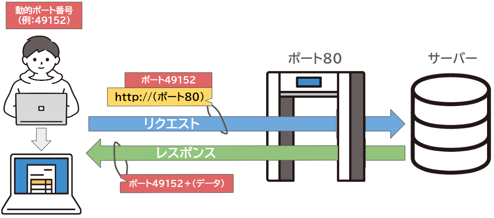
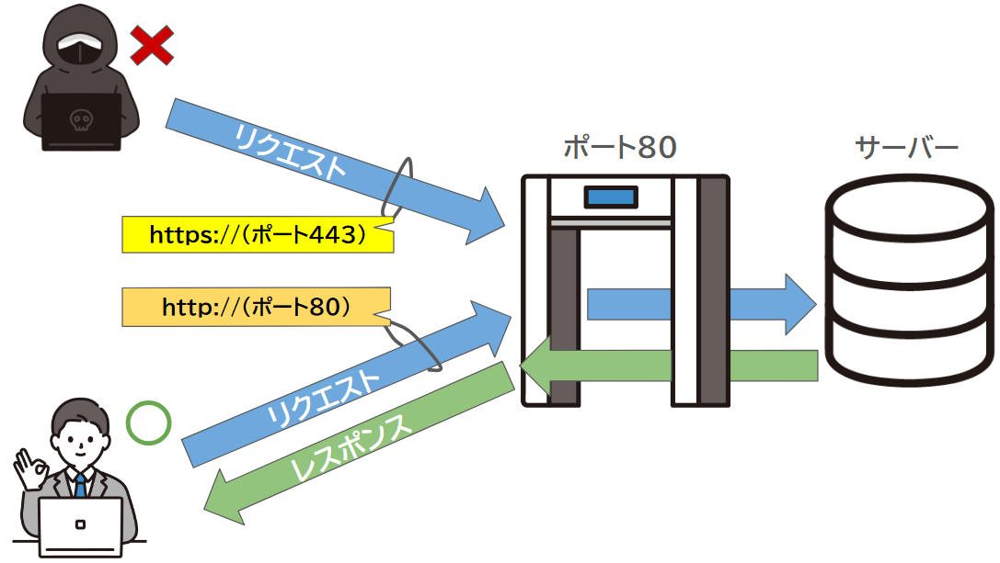
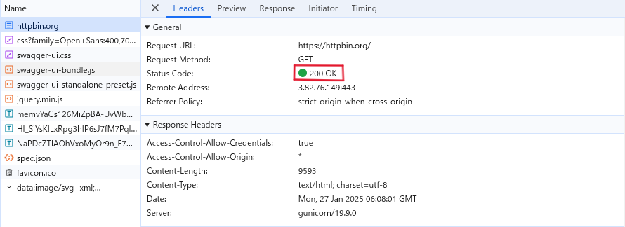

## 11 Ruby on Rails：Webシステム概念

## 目次

- [Webシステムの基本的な知識](#webシステムの基本的な知識)  
  - [ポート番号とは](#ポート番号とは)  
  - [ポート番号の基本的な仕組み](#ポート番号の基本的な仕組み)
  - [ポートを使ったデータのやり取りと通信の流れ](#ポートを使ったデータのやり取りと通信の流れ) 
  - [HTTPプロトコルを実際に触れて学んでみよう](#補足httpプロトコルを実際に触れて学んでみよう)

<br>

***

### ポート番号とは？
  
  

**IPアドレス**と組み合わせて使用され、IPアドレスが「住所」なら、**ポート番号はその住所の「部屋番号」にあたります**。  
もしこの情報が間違っていたり、欠けていたりすると、注文した商品が届かないのと同じように、データが正しい場所に届かなくなります。  

  

**ポート番号**は、データを正しい場所（システム、サービス、アプリケーション）に届けるために必要な情報です。 

***

#### ポート番号の基本的な仕組み

ポート番号には0から65535までの数値があり0から1023が使用用途が決まっていたりなど合計で三つの用途で分けられます。  

| ポート番号の範囲 | 範囲 | 使用用途 |
|---|---|---|
| **ウェルノウンポート** | 0～1023 | 通信プロトコルに割り当てられたポート番号 |
| **登録済みポート** | 1024～49151 | 特定のアプリケーションやサービスで利用されるポート番号 |
| **動的/プライベートポート** | 49152～65535 | クライアントとサーバ間で動的に割り当てられる一時的なポート番号 |

このように、ポート番号は通信の目的や役割に応じて異なる範囲が設定されており、それぞれの**範囲**に適した使い方があります。

***

#### 主なポート番号

* **ポート番号一例**  
   | ポート番号 | 用途 | 説明 |
   |---|---|---|
   | **ポート80** | WebサーバーでのHTTP通信 | ウェブサイト表示用のポート。 |
   | **ポート443** | WebサーバーでのHTTPS通信 | 暗号化されたHTTP通信のポート。 |
   | **ポート21** | ファイル転送（FTPサーバー） | FTPサーバーが通信を受け入れるポート。 |
   | **ポート53** | ドメイン・ネーム・システム(DNS) | DNSサーバーとクライアント間の通信ポート。 |  

 * **サービス、システムなどでの一例**  
   | ポート番号 | 用途 | 説明 |
   |---|---|---|
   | **ポート3306**| MySQLデータベースの通信 | MySQLサーバとクライアント間でデータをやり取りするポート。 |
   | **ポート3389**| リモートデスクトップ接続(RDP)  | Windowsリモートデスクトップ接続用のポート。 |

上記のようにポート番号は**用途によって割り当てられています**。

***

#### ポートを使ったデータのやり取りと通信の流れ

1. **クライアント（私たち）がサーバに接続したいとき**
   * 例えば、Webサイトを見たいとき、ブラウザ（ChromeやFirefoxなど）がインターネットに接続します。   

   * ブラウザは、コンピュータの「動的ポート番号（例えば49152番）」という一時的な番号を使って、  
     サーバ（例えばGoogleなど）にリクエスト（動的ポート番号など）を送ります。この番号は毎回変わり、特定のサービスなどと結びついていません。

        

2. **サーバは「ポート」を待機している**

   * サーバは「Webサイトを表示するためのポート番号」を待機しています。  
     たとえば、Webサイトを表示するために、サーバは通常「80番」ポートを使っています( http:// で送られて来るのを待ってる)。

   * サーバは常に決まったポート番号で「待機」しており、クライアントが接続したいときに、接続を受け入れます。
   
        

3. **TCP接続の確立（お互いに接続の準備をする）**

   * ここでプロトコルの説明で出てきたTCPが登場します。

   * クライアントのブラウザがサーバに接続する準備が整ったら、お互いに接続の確認を行います。

   * これにより、データを安全に送る準備が整います。

        
   

4. **データの送受信（実際に通信が始まる）**

   * 接続が完了すると、クライアントとサーバはデータをやり取りします。

   * クライアントは動的に割り当てられた番号（49152番）を使い、サーバは常にポート番号「80番」でデータを受け取り、  
     サーバからのデータはそのクライアントの動的ポート番号（49152番）に返送されます。

   * これで、クライアント（私たちのブラウザ）は、サーバから送られたデータを受け取り、WEBページを表示します。  
   
        

5. **通信が終わったら終了**

   * すべてのデータのやり取りが終わったら、接続を終了します。  

***
    
#### **ポートのセキュリティについて** 



ここまで**ポート**についてお話ししましたが、ポートは**セキュリティ**と密接に関わり、その一部を担っています。  
インターネットを利用する際、私たちのコンピュータやスマートフォンは他のコンピュータとデータをやり取りします。  

このとき、どの「**ポート番号**」を使うかが通信の行き先を決めます。  
しかし、不正にポート番号が取得されると、攻撃者が予測不可能な方法でアクセスしてくる危険があるため、注意が必要です。  

そこで登場するのが、「**ファイアウォール**」や「**ルーター**」というセキュリティ機器です。  
これらはネットワークの「警備員」のように、ポートを監視して不正アクセスを防ぎ、正しい通信だけを通す役割を持っています。  
* Webサイトを開くとき、ブラウザ（インターネットを利用するアプリ）は「**ポート80**」を使ってサーバに接続します。 

* もし攻撃者が不正に他のポートを使ってアクセスしても、セキュリティシステムがポートを「**閉じて**」通さないようにします。

これにより、私たちのデータやコンピュータを守ることができます。

***

**ポイント**

1. **ポート番号とは**  
    * ポート番号は、**IPアドレス**の「住所」に対して、データを届けるための「**部屋番号**」にあたります。

1. **ポート番号の種類**  
    * **ウェルノウンポート（0～1023）**  
      特定の通信プロトコルに使用（例：**HTTP**、**FTP**）。
  
    * **登録済みポート（1024～49151）**  
      特定のアプリケーションやサービス用。
  
    * **動的ポート（49152～65535）**  
      一時的にクライアントが使用するポート。

1. **主なポート番号**  
    * **80（HTTP）**、**443（HTTPS）**、**21（FTP）**、**53（DNS）**、**3306（MySQL）**、**3389（RDP）**

1. **ポートのセキュリティ**
    * 不正なアクセスを防ぐため、ポート番号は**重要なセキュリティ要素**です。
    * **ファイアウォール**や**ルーター**がポート番号を監視し、不正なアクセスをブロックします。
    * サービスに必要なポート番号のみを開放し、他のポートは閉じることで、**セキュリティ**を強化します。

1. **ポート番号の役割**
    * 通信が**正しく行われる**ために重要な役割を持っています。  
      また、**セキュリティ**を守るためには、許可されたポート番号だけを通過させる管理が必要です。


**用語解説**

* **MySQL**  
  **データ**をテーブルで管理し、**SQL**で操作する**リレーショナルデータベースシステム**です。主にウェブアプリで使用されます。

* **RDP（Remote Desktop Protocol）**  
  **リモートで他のコンピュータを操作**するためのプロトコルで、主に**Windows**で使用され、ポート**3389**を使います。

* **ファイヤーウォール**  
  **ネットワークへの不正アクセス**を防ぐ**セキュリティ機器**です。通信を監視し、許可されたものだけを通過させ、攻撃やウイルスの侵入を防ぎます。

<br>

***

### HTTPステータスコードとは？



開発者ツールというブラウザの機能を使うことで、**ステータスコード**を確認できます。  
**HTTPステータスコード**は、**Webサーバー**がリクエストを処理した結果を示す**3桁の数字**です。  
ブラウザがサーバーから受け取り、リクエストが成功したか、失敗したか、どんな状態かを知ることができます。

**代表的なステータスコードを紹介します** 
 
| ステータスコード | 説明 |
|------------------|--------------------------------------|
| `200 OK` | リクエストが成功し、正常に処理された。 |
| `301 Moved Permanently` | リクエストしたページが永続的に移動した。 |
| `403 Forbidden` | アクセスが禁止されている。 |
| `404 Not Found` | リクエストしたページが見つからない。 |
| `500 Internal Server Error` | サーバー内部でエラーが発生した。 |

以下では、実際のステータスコードやレスポンスの内容を確認できますので、ぜひ試してみてください。

### 【補足】HTTPプロトコルを実際に触れて学んでみよう  
普段私たちはWebページを閲覧するとき、クライアント側（私たち）から、  
送信されたデータをサーバーがレスポンスとして返す一連の流れがあります。  

ブラウザで実際に**HTTPリクエスト**を送信し、**レスポンス**を確認する方法にはいくつかの方法があります。  
ここでは、ブラウザの開発者ツールを使う方法と、curlコマンドを使う方法を説明します。

#### (1) ブラウザの開発者ツールを使ってHTTPリクエストを確認する

ブラウザ（Chrome、Edgeなど）には開発者ツールが組み込まれていて、これを使って**HTTPリクエスト**と**レスポンス**を確認することができます。

**ブラウザでの手順**  
 https://httpbin.org を開いてください。

1. **開発者ツールを開く**
   * ブラウザで、右上の「メニュー（三点アイコン）」をクリックし、  
   「その他のツール」>「(Chromeならデベロッパーツール)/(Edgeなら開発者ツール)」を選択する。  
   * キーボードショートカット（Ctrl+Shift+I または F12）を押して開きます。

1. **「ネットワーク」タブに切り替える**  
   * 開発者ツール内で「**Network（ネットワーク）**」タブを選択します。  
   * このタブは、ブラウザが送受信しているすべての**HTTPリクエスト**と**レスポンス**を表示します。

1. **Webページをリロードする**  
   * ネットワークタブが表示されている状態で、ブラウザのページをリロード（Ctrl+R）か左上のリロードボタン押します。  
   * ページのロードが始まると、ネットワークタブにリクエストがリストされます。

1. **リクエストを確認する**  
   * 表示されたリストの中から、Webページに関連する**HTTPリクエスト**（例えば、GET /index.html など）をクリックします。  
   * 詳細情報が表示され、**リクエストヘッダー**、**レスポンスヘッダー**、**レスポンスのボディ**（HTMLなど）を見ることができます。

1. **リクエストの詳細を確認する**  
   * **Headers（ヘッダー）タブ**  
   リクエストとレスポンスのヘッダー情報を確認できます。  
   * **Preview（プレビュー）タブ**  
   レスポンスの内容が表示されます（HTMLページ、画像、JSONなど）。


#### (2) curlコマンドを使ってHTTPリクエストを送る
**curlはコマンド**は**HTTPリクエスト**を送信するためのツールで、リクエストとレスポンスを簡単に確認できます**。

1. **curlのインストール**  
   * **curlは多くのLinux、macOS、Windows（最近では標準でインストールされています）に最初からインストールされています**。  
   * インストールされていない場合は、公式サイトからダウンロードすることができます。

2. **コマンドプロンプトを開く**  
   * **スタートメニュー（画面左下のWindowsアイコン）をクリックします**。  
   * 「cmd」と入力します。  
   * 「コマンドプロンプト」または「Command Prompt」が表示されたら、クリックして開きます。

3. **リクエスト**  
   * 以下のコマンドを使って、指定したURLにリクエストを送信できます。
     ```cmd
     curl https://httpbin.org
     ```
    これで、**https://httpbin.org のレスポンス（HTMLなど）が表示されます**。

4. **リクエストとレスポンス**  
    * **リクエストやレスポンスを確認するには、`curl -v`を使います**。
      ```
      curl -v https://httpbin.org 
      ```
    * このコマンドを実行すると、以下のような情報が処理の上部に表示されます。

      ```
      ##リクエスト

      GET / HTTP/2
      Host: httpbin.org
      user-agent: curl/7.81.0
      accept: */*

      ```

      * `GET / HTTP/2`  
      **`GET`は「情報を取得したい」というリクエストを意味します**。`/`は、サーバー上のトップページを意味しています。  

      * `Host: httpbin.org`  
      **どのサーバーにリクエストを送るかを示しています**。  

      * `user-agent: curl/7.81.0`  
      **このリクエストがどのソフトウェア（この場合はcurl）から来たかを示しています**。  

      * `accept: /`  
      **サーバーが返す内容の形式（HTMLやJSONなど）を指定しています**。

      ```

      ##レスポンス

      HTTP/2 200
      date: Fri, 17 Jan 2025 07:04:30 GMT
      content-type: text/html; charset=utf-8
      content-length: 9593
      server: gunicorn/19.9.0
      access-control-allow-origin: *
      access-control-allow-credentials: true  

      ////以下(html)

      ```

      * `HTTP/2 200: HTTP/2`は使用されているプロトコルのバージョン、  
       **200はリクエストが正常に処理されたことを示すステータスコードです**（200は「成功」を意味します）。  

      * `date: Fri, 17 Jan 2025 07:04:30 GMT`  
      **サーバーがレスポンスを返した日時**。  

      * `content-type: text/html; charset=utf-8`   
      **レスポンスがHTML形式であること、文字コードがUTF-8であることを示しています**。  

      * `content-length: 9593`  
      **レスポンスの本文（Webページ）の長さを示します（バイト数）**。  

      * `server: gunicorn/19.9.0`  
      **このサーバーがどのソフトウェアを使用しているかを示しています**。  

**リクエストとレスポンスの流れ（HTTPヘッダー(リクエストとレスポンス)、ステータスコード、データ）を確認することができます**。


***

HTTPリクエストとレスポンスの流れを視覚的に確認して、インターネット通信がどのように行われているかを少しでも実感できたのではないでしょうか。ブラウザの開発者ツールやcurlコマンドを使うことで、データのやり取りがどのように行われているのかがより身近に感じられると思います