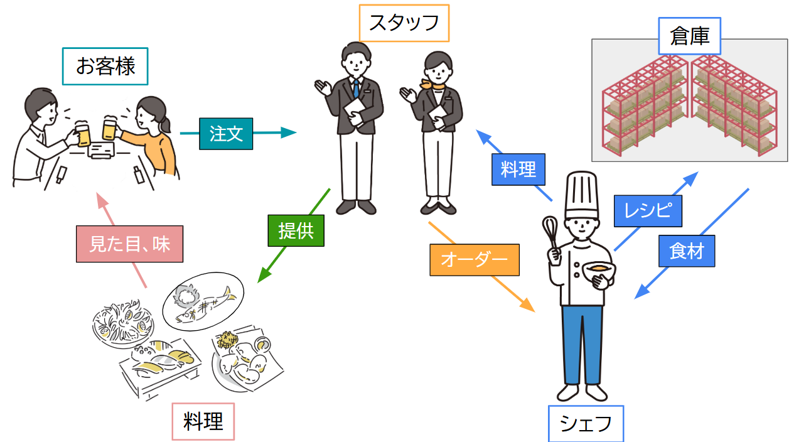

## Ruby on Rails：MVC基礎

## 目次

* [MVCの基本的な知識](#mvcの基本的な知識)  
  * [MVC処理の流れ](#mvc処理の流れ)  
  * [mvcのメリットデメリット](#mvcのメリットデメリット)

## MVCの基本的な知識

### MVCとは？

**Model**（モデル）、**View**（ビュー）、**Controller**（コントローラー）の頭文字を取った言葉です。  
**システム設計**方法の一つで、**データ**（Model）、**表示**（View）、**操作**（Controller）の3つに分けて考える方法です。

以下の図はMVCを飲食店に例えた説明です。

この図で、MVCがどのようなものか少し理解できたのではないでしょうか？

| **MVC**               | **説明**                                                     |
|------------------|-----------------------------------------------------------|
| **Model (モデル)**   | アプリの「**データ**」部分。ユーザー情報や商品データなど。データを保存したり、処理したりします。 |
| **View (ビュー)**    | ユーザーが見る「**表示**」部分。画面に表示される内容やデザインです。データをわかりやすく表示します。 |
| **Controller (コントローラー)** | ユーザーの操作を受け取って、ModelやViewに指示を出す「**操作**」部分。 | 

#### **Model**

**Model**は、アプリケーションの中で「**データを管理する役割**」を持っています。

*  アプリで使用するデータを保存したり、更新したり、**データの管理**をします。

*  必要なデータを**データベース**から取り出したり、保存したり、**データベースとのやり取り**をします。

* **ユーザー**の操作に基づいて、**必要な計算やデータの処理**をします。 

**Controller**がリクエストを受けて、**Model**に情報を渡します。  
Modelは情報をもとに**データベース**を操作したり、計算をしたりして、その結果をControllerに返します。

#### **View**
**View**は、アプリケーションの中で「**ユーザーが見る部分を表示する役割**」を持っています。  

* **ユーザー**が実際に目にする**画面**に表示される**情報**や**内容**を作ります。

* Webページに「**商品名**」、「**価格**」、「**在庫数**」などを表示しています。

* ボタンや入力欄など、**ユーザーが操作するための要素**を画面に配置します。

**Controller**が**Model**から受け取った処理されたデータを**View**は画面に表示しています。

#### **Controller**
**Controller**は、アプリケーションの中で「**ユーザーのリクエストに応じて、処理の流れを管理する役割**」を持っています。

* 購入する商品や入力欄の中身など、**ユーザーが入力したデータ**を、ボタンなどのアクションを通じて**リクエスト**として受け取ります。

* **ユーザーのリクエスト**に基づいて、Modelがどのように**データを処理すべきか**をControllerが決めます。

**Model**から**処理した結果**を受け取り、受け取ったデータを**View**に渡して、ユーザーに画面で表示させます。

#### MVC処理の流れ

例えば、ショッピングサイトでカートに商品を追加するとどのようなMVCの流れになるでしょうか？

1. Userが商品をカートに追加するとControllerがリクエストを受け取る。

1. Controllerはリクエストを処理するためデータをModelに渡す。

1. Modelは処理して（商品の情報をData Baseからとってくる）Controllerに返す。

1. Controllerがデータを受け取ってViewに渡して追加されたカートの中身を表示する画面を作成

1. ユーザーがその画面を見る。

### MVCのメリット、デメリット

#### **メリット**
* **データ、見た目、操作を分けて管理できる**  
  **アプリケーションの役割が明確に分かれ**、どこに何が記述されているのかがすぐに分かる。
  
* **チーム開発に適している**  
  「**データを扱う人**」、「**見た目を作る人**」、「**動きや操作を作る人**」など、役割ごとに作業を分担できるため、チーム開発がしやすくなる。
  
* **変更が容易**  
  例えば「**見た目だけ変えたい**」などの変更があっても、他の部分に影響を与えずに変更が可能。
  
* **テストのしやすさ**  
  アプリの動作をテストする際、**Model**、**View**、**Controller**ごとにテストできるので、原因がどこにあるか探しやすくなる。

#### **デメリット**
* **初めてMVCを使うときの慣れが必要**  
  初めてMVCを使用する場合、**どの部分に何を書けばよいのかなど**、慣れるまで時間がかかることがある。
  
* **コード量が増えがち**  
  アプリがシンプルであれば、**MVCを使うことでコードが多くなり**、複雑に感じることがある。
  
* **規模が大きくなると管理が大変**  
  使用方法を理解すれば便利だが、**開発の規模が大きくなると**コードが多くなり、**管理**や**記述**が複雑になったりすることがある。
  
* **パフォーマンスに影響が出る可能性**  
  MVCの分割により、**Model**、**View**、**Controller**の間でデータのやり取りが多くなり、結果として**処理が遅くなる可能性**がある。

 

***

**まとめ**

### まとめ

**MVC**は、アプリケーションを「データ」「表示」「操作」に分けて作る方法です。これにより、それぞれの役割が明確になり、開発がスムーズになります。

| **役割**           | **説明**                                                                                           |
|--------------------|---------------------------------------------------------------------------------------------------|
| **Model (モデル)** | アプリケーションの「データ」を管理します。データベースから情報を取り出したり、保存したりします。アプリの中でデータのやり取りをする部分です。 |
| **View (ビュー)**  | ユーザーが見る「画面」を作ります。商品の名前や価格などを表示する部分です。ユーザーに見える部分を担当します。 |
| **Controller (コントローラー)** | ユーザーがボタンを押したり、入力したりしたときに「操作」を受け取って処理します。必要なデータをModelから取得し、結果をViewに渡して画面に表示します。 |

#### メリット:
  * アプリの役割が分かれているので、どこに何を書けばいいのかがわかりやすい

  * チームで作業を分けやすく、作業がしやすい
  
  * アプリの一部だけを変更しても、他の部分に影響を与えにくい
  
  * **テストがしやすい**: Model、View、Controllerごとにテストを行えるので、問題がどこにあるかを見つけやすくなる

#### デメリット:
  * 初めて使うときには、どこに何を書くか迷うことがある
  
  * 小さなアプリでは、かえってコードが多くなることがある
  
  * アプリが大きくなると、管理が少し大変になることがある
  
  * 複雑な処理をする場合、速度が遅くなることがある

