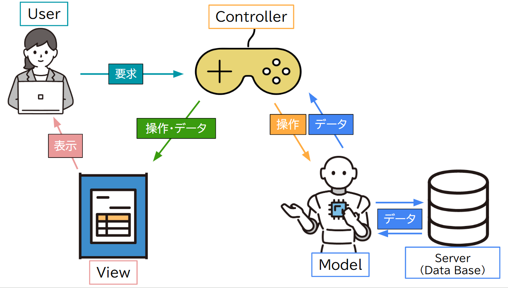
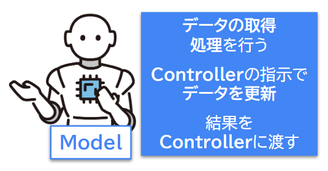
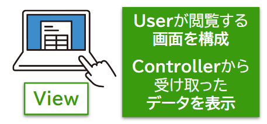
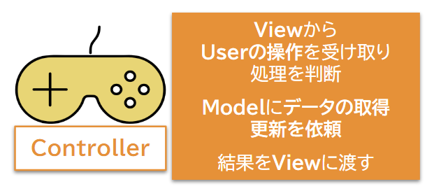
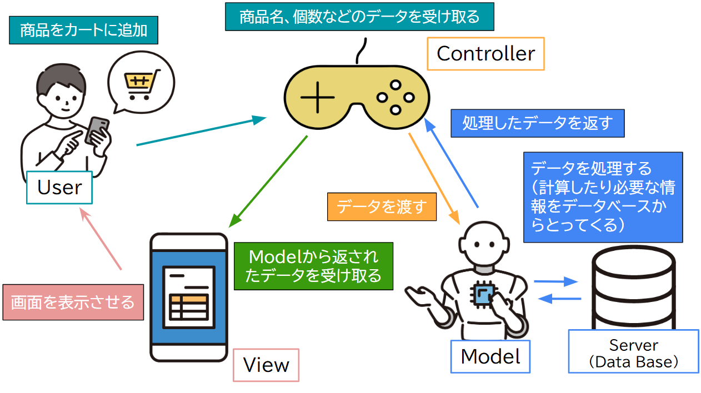

## MVC基礎

## 目次

* [MVCの基本的な知識](#mvcの基本的な知識)  
  * [MVCとは？](#mvcとは)  
  * [MVC処理の流れ](#mvc処理の流れ)  
  * [なぜMVCを使うのか？](#なぜMVCを使うのか)

## MVCの基本的な知識

### MVCとは？  

  

MVCは、アプリを作るときの「設計の仕方」のひとつです。  
**Model**（モデル）、**View**（ビュー）、**Controller**（コントローラー）の頭文字を取った言葉です。  
**MVC**の各役割を紹介します。  

* **Model**  
    

  **Model** はデータを管理し、処理を行いますが、**View** とは基本的にやり取りをしません。  
  **Controller** が間に立ち、**Model** から受け取ったデータを **View** に渡して、ユーザーに表示します。  
  これにより、**Model** と **View** は独立しており、変更があっても互いに影響しにくくなります。

* **View**  
    

  **View** はアプリケーションの中で「**ユーザーが見る部分**」を担当します。  
  具体的には、**ユーザーが目にする情報**や **内容** を表示し、**操作できる要素**（ボタンや入力欄など）を配置します。  
  **Controller** が **Model** から受け取ったデータを基に、画面に情報を表示します。

* **Controller**  
    

  **Controller** はユーザーのリクエストを受け取り、そのリクエストに基づいて **Model** にデータの処理を依頼し、処理結果を **View** に渡して画面に表示させます。  
  例えば、ユーザーがボタンをクリックすると、Controllerがそのアクションを受け取り、**Model** に商品情報を取得させ、そのデータを**View**に渡して表示します。

***

### MVC処理の流れ

例えば、ユーザーがショッピングサイトで商品をカートに追加する場合、次のようなMVCの流れが発生します。  
ユーザーが商品を選んで「カートに追加」ボタンをクリックすると、**Controller** はそのリクエストを受け取り、**Model** に商品情報を渡して、データベースに保存し、結果を**View** に表示します。  

  

|  | 担当 | プロセス |
|--:|---|---|
| 1 | ユーザー | **User**が商品名と数量を**View**に入力する。 |
| 2 | View | **View**が商品をカートに追加する要求を**Controller**に送る。 |
| 3 | Controller | **Controller**が商品名と数量を**Model**に渡す。 |
| 4 | Model | **Model**がデータをデータベースに登録できる形式に変換し、**データベース**に送信する。 |
| 5 | データベース | **データベース**がカートに商品を登録し、最新のカート内データを**Model**に返す。 |
| 6 | Model | **Model**が受け取ったデータを**Controller**に渡す。 |
| 7 | Controller | **Controller**がデータを**View**に渡す。 |
| 8 | View | **View**がカートの内容をユーザーに表示する。 |

***

### なぜMVCを使うのか？

MVCは、**コードの管理**や**チーム開発**を効率化し、**変更**や**テスト**をしやすくするために使います。役割を分けることで、柔軟でスケーラブルなアプリケーションの開発が可能になります。

***

#### メリット

MVCを使うと、次のようなメリットがあります。

+ **役割が分かれていて管理しやすい**  

  **Model**、**View**、**Controller**の役割を分けることで、コードが整理されやすくなります。  
  例えば、**Model**はデータ処理、**View**は画面表示、**Controller**は処理の流れを管理します。これにより、各部分の責任が明確になり、保守や変更が簡単に行えます。

+ **チーム開発に適している**  

  役割ごとに作業を分担できるため、複数の開発者が並行して作業できます。  
  例えば、**Model**を担当する開発者がデータ処理を進めている間に、**View**のデザイン担当者がUIを作成し、**Controller**担当者が処理を組み立てることができます。  
  これにより、効率的に開発が進みます。

***

#### デメリット

一方で、次のようなデメリットもあります。

+ **コード量が増えがち**  

  MVCでは、各役割を分けるためにそれぞれのクラスにコードを書く必要があり、結果としてコード量が増えることがあります。  
  例えば、同じデータ処理を**Model**と**Controller**に書かなければならないことがあります。  
  このような重複を避けるためには、共通の処理をまとめて再利用することが大切です。

+ **規模が大きくなると管理が大変**  

  大規模なプロジェクトでは、**Model**や**Controller**のクラスが増えてコードの管理が難しくなることがあります。  
  これに対処するためには、**命名規則**を統一したり、**フォルダ構成**を整理したりすることが重要です。  
  また、共通の処理を抽象化して重複を減らす工夫が求められます。

***

**MVC** は多くの利点を持つ設計パターンですが、すべてのプロジェクトで必須ではありません。  
小規模なアプリケーションやシンプルな構造では、**MVC** を使わずともコードがシンプルで管理しやすい場合があります。  
過剰に導入すると、逆に**複雑化**し、**開発効率**が低下することもあります。  
状況に応じて**適切なアーキテクチャ**を選ぶことが重要です。  

***

#### ポイント
- **MVCの目的**  
  MVCは、**コードの管理**や**チーム開発**を効率化し、**変更**や**テスト**をしやすくするために使う。

- **Model**  
  アプリの「**データ**」部分。ユーザー情報や商品データなど。データを保存したり、処理したりする。   

- **View**  
  ユーザーが見る「**表示**」部分。画面に表示される内容やデザインです。データをわかりやすく表示する。

- **Controller**  
  ユーザーの操作を受け取って、ModelやViewに指示を出す「**操作**」部分。

- **MVCの処理の流れ**  
  1. **ユーザー**が操作する（例：ボタンをクリック）。
  1. **Controller**がその操作を受け取り、**Model**にデータ処理を依頼する。
  1. **Model**がデータを処理して、**Controller**に結果を返す。
  1. **Controller**がその結果を**View**に渡し、画面に表示する。
  1. **View**がユーザーに情報を表示する。