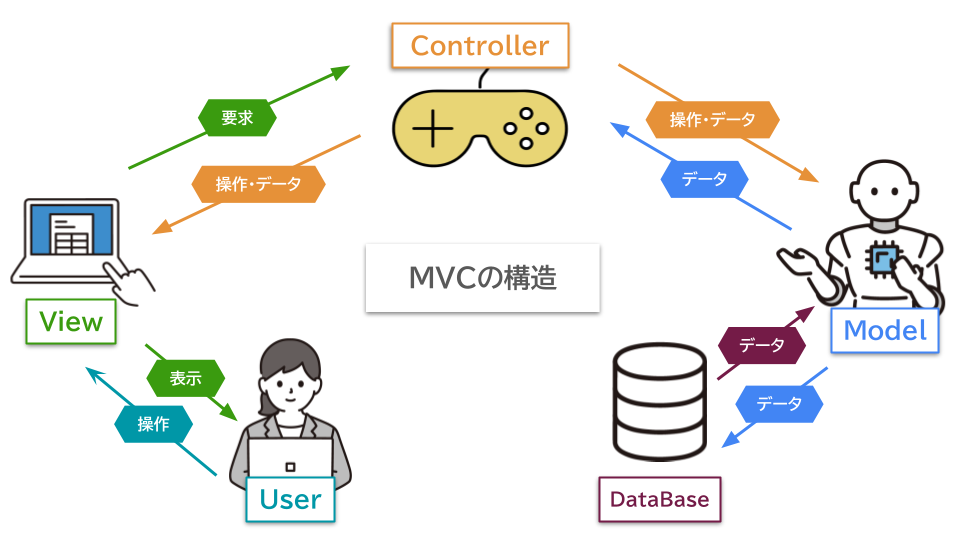
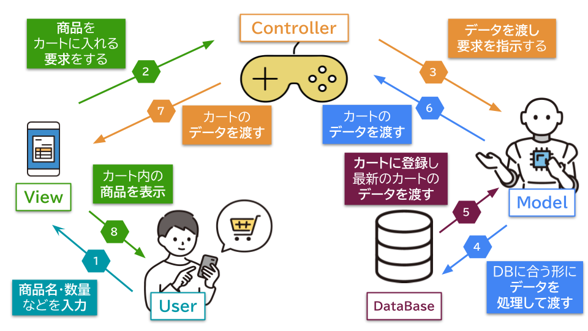

## MVC基礎

## 目次

* [MVCの基本的な知識](#mvcの基本的な知識)  
  * [MVCとは？](#mvcとは)  
  * [MVC処理の流れ](#mvc処理の流れ)  
  * [MVCのメリットデメリット](#mvcのメリットデメリット)

## MVCの基本的な知識

### MVCとは？

MVC（エムブイシー）は、アプリを作るときの「設計のしかた」のひとつです。  
**Model**（モデル）、**View**（ビュー）、**Controller**（コントローラー）の頭文字を取った言葉です。  

  
 
**MVC**の各役割を紹介します。

* **Model**
   * アプリケーションの中で「**データを管理する役割**」を持っています。

   * アプリで使用するデータを保存したり、更新したり、**データの管理**をします。

   * 必要なデータを**データベース**から取り出したり、保存したり、**データベースとのやり取り**をします。

   * **ユーザー**の操作に基づいて、**必要な計算やデータの処理**をします。 

   * **Controller**がリクエストを受けて、**Model**に情報を渡します。  
     Modelは情報をもとに**データベース**を操作したり、計算をしたりして、その結果をControllerに返します。

* **View**
  * アプリケーションの中で「**ユーザーが見る部分を表示する役割**」を持っています。  

  * **ユーザー**が実際に目にする**画面**に表示される**情報**や**内容**を作ります。

  * Webページに「**商品名**」、「**価格**」、「**在庫数**」などを表示しています。

  * ボタンや入力欄など、**ユーザーが操作するための要素**を画面に配置します。

  * **Controller**が**Model**から受け取った処理されたデータを**View**は画面に表示しています。

* **Controller**

  * アプリケーションの中で「**ユーザーのリクエストに応じて、処理の流れを管理する役割**」を持っています。

  * 購入する商品や入力欄の中身など、**ユーザーが入力したデータ**を、ボタンなどのアクションを通じて**リクエスト**として受け取ります。

  * **ユーザーのリクエスト**に基づいて、Modelがどのように**データを処理すべきか**をControllerが決めます。

  * **Model**から**処理した結果**を受け取り、受け取ったデータを**View**に渡して、ユーザーに画面で表示させます。

***

### MVC処理の流れ

例えば、ショッピングサイトでカートに商品を追加すると、MVCの流れは以下のようになります。

  

1. **ユーザー**がカートに入れる**商品名**と**数量**を**View**に入力する。

1. **View**が商品をカートに追加する**要求**を**Controller**に飛ばす。  

1. **Controller**が**商品名**と**数量**を**Model**に渡す。  

1. **Model**がデータを**データベース**に登録できる形式に変換し、**データベース**に送る。  

1. **データベース**がカートに商品を登録し、最新の**カート内データ**を**Model**に返す。  

1. **Model**が受け取ったデータを**Controller**に渡す。  

1. **Controller**がデータを**View**に渡す。  

1. **View**がカートの内容を**ユーザー**に表示する。

**Controllerはデータの橋渡しを行い、Modelはデータを処理・管理し、Viewは画面に表示する**という仕組みを理解することが、MVCの基本を押さえる第一歩となります。  

***

### なぜMVCを使うのか？

MVCは、**コードの管理**や**チーム開発**を効率化し、**変更**や**テスト**をしやすくするために使います。役割を分けることで、柔軟でスケーラブルなアプリケーションの開発が可能になります。

#### メリット

MVCを使うと、次のようなメリットがあります。

| メリット | 内容 |
|---|---|
| **役割が分かれていて管理しやすい** | **Model**、**View**、**Controller**の役割を明確に分けることで、コードが整理しやすくなる。 |
| **チーム開発に適している** | 役割ごとに作業を分担でき、チーム開発が効率的に進められる。 |
| **変更が容易** | 見た目などの変更を、他の部分に影響を与えずに行える。 |
| **テストがしやすい** | 各部品ごとにテストを分けて実施でき、問題の原因を特定しやすくなる。 |

#### デメリット

デメリットもありますが、対策として以下のようなものがあります。

| デメリット | 対策 |
|---|---|
| **初めてMVCを使うときの慣れが必要** | シンプルなサンプルアプリを作り、役割を意識して学ぶ。 |
| **コード量が増えがち** | 共通処理をメソッドやクラスでまとめ、再利用して重複を減らす。 |
| **規模が大きくなると管理が大変** | フォルダ構成を整理し、命名規則を統一する。 |
| **パフォーマンスに影響が出る可能性** | 処理を最適化し、不要なデータのやり取りを減らす。 |

---

#### ポイント
- **MVCの目的**  
  MVCは、**コードの管理**や**チーム開発**を効率化し、**変更**や**テスト**をしやすくするために使います。

- **Model**  
  アプリの「**データ**」部分。ユーザー情報や商品データなど。データを保存したり、処理したりする。   

- **View**  
  ユーザーが見る「**表示**」部分。画面に表示される内容やデザインです。データをわかりやすく表示します。

- **Controller**  
  ユーザーの操作を受け取って、ModelやViewに指示を出す「**操作**」部分。
