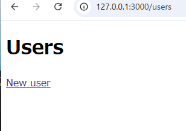
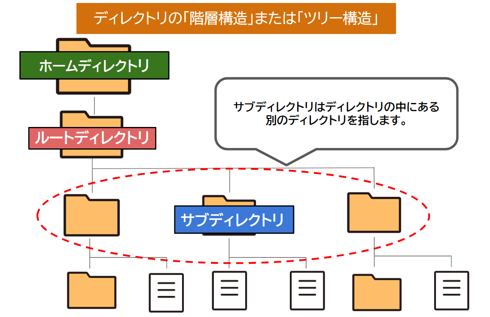
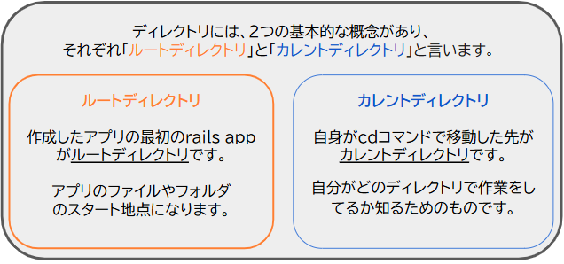
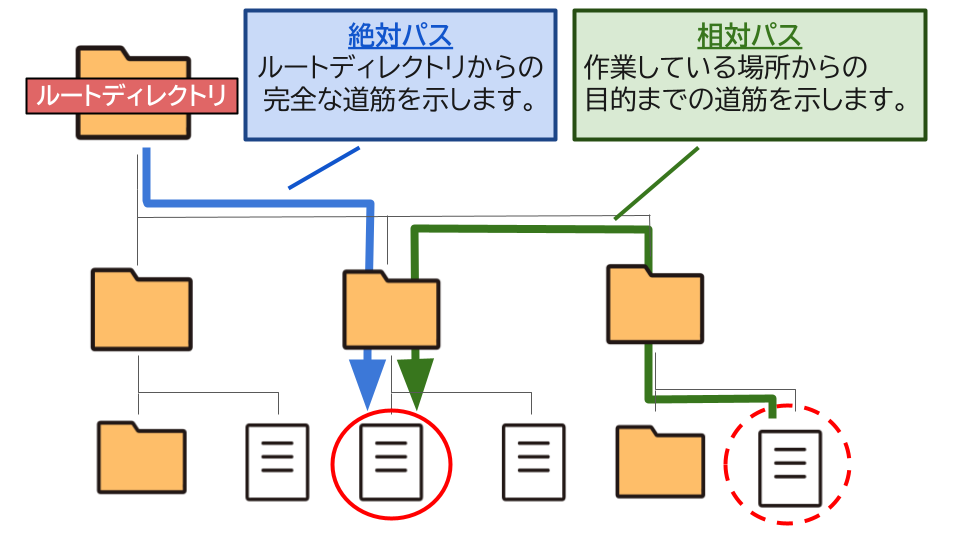
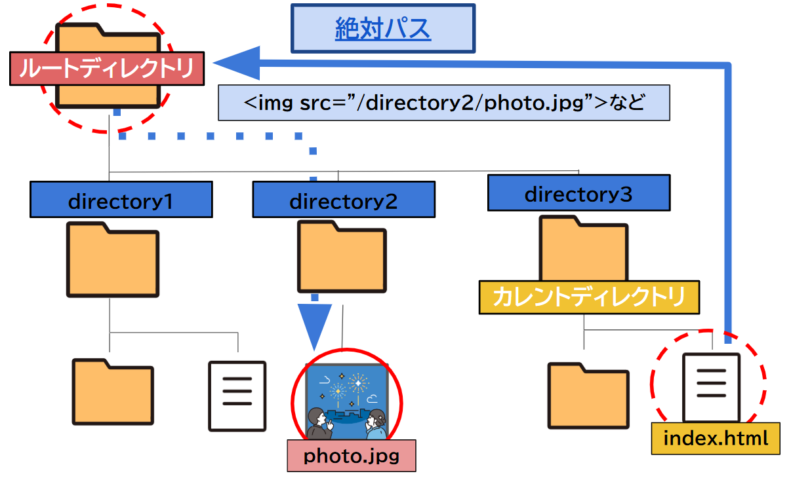
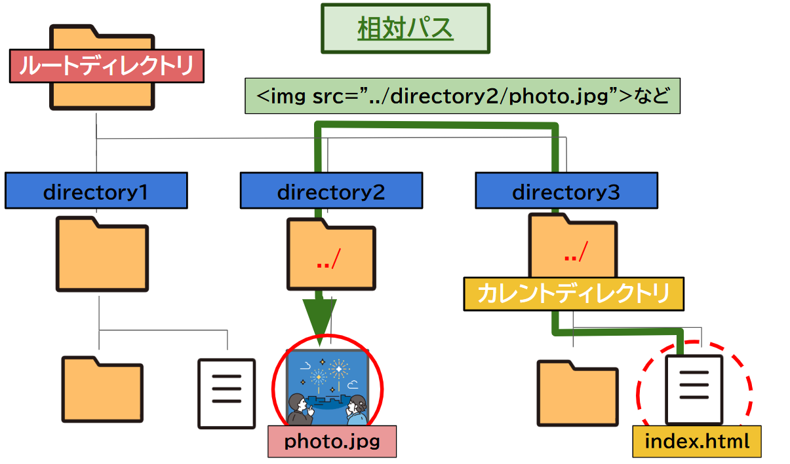
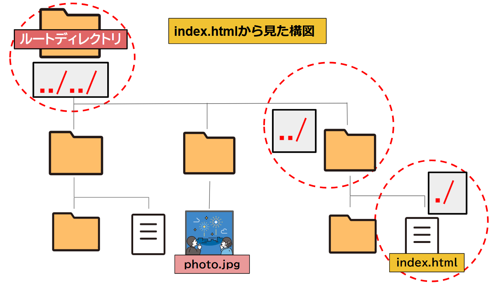

## 4.6 Ruby on Rails：Rails基礎 1

## 目次

- [Railsの基本的な知識](#railsの基本的な知識)  
  - [Railsとは？](#railsとは)
  - [フレームワークとは？](#フレームワークとは)
  - [Railsを使ったアプリケーションの作成](#railsを使ってアプリケーションを作成しましょう)
  - [プロトコルとは？](#プロトコルとは)
  - [よく使用されるプロトコル](#よく使用されるプロトコル)


## Railsの基本的な知識

### Railsとは？


Railsは、デンマークのプログラマーでデビッド・ハイネマイヤー・ハンソン氏（通称DHH）が作った、Rubyでの開発を簡単にするツールです。

#### Railsの特徴は？

- **Rubyで作られた開発ツール**  
  Rubyを使って作られた、Ruby専用の**フレームワーク**です。  
  開発を簡単にしてくれるツールで、効率よくWebアプリを作ることができます。
  > メモ：フレームワークについては後ほど説明します。

- **MVC構造に基づいて設計されている**  
  アプリケーションの構成を「**データ**」、「**表示**」、「**操作**」に分けて管理します。  
  これにより、開発が効率的になり、コードの整理や管理がしやすくなります。

- **簡単にプログラミングできる**  
   アプリの開発を**速く**、**簡単**に、**効率的**にするためのツールをたくさん提供しています。  
   そのため、初心者にとって学びやすい**フレームワーク**とされています。


#### どんな考えで動くの？
Railsは「**Convention over Configuration**（設定より規約）」  
「**決められたルールに従えば、特別な設定なしで自動的に動作する**」という考え方です。  

例えば、お店で商品を注文したときをイメージしてください。  

**「1.メニューから料理を選び」**、**「2.店員さんに料理を頼む」**と、あとは**自動的に料理が作られて提供**されますよね。

Railsも同じように、「**1.決まった名前**」や「**2.ルール**」に従うだけで、**自動で必要な処理**が行われます。  
この仕組みにより、開発者は余計な作業や手間を考えずに、スムーズに開発を進められます。

---

#### ポイント

1. **Railsとは**
   - Railsは、デビッド・ハイネマイヤー・ハンソン（David Heinemeier Hansson）が作ったツールです。
   - Rubyでの開発を簡単にしてくれます。

1. **Railsの特徴**
   - **Rubyで作られた開発ツール**：Ruby専用のフレームワークです。
   - **MVC構造に基づいて設計されている**： 「データ」、「表示」、「操作」に分けて管理します。
   - **簡単にプログラミングできる**：初心者にとって学びやすいフレームワークとされています。

1. **Railsの動きの考え方**
   
   - Railsは決められた「ルール」にしたがって動作します。現実での「飲食店」のように、メニューを選び、店員に頼むと、決められたルールに従って処理が自動で実行されます。
   
<br>

---

### フレームワークとは？

**Ruby**などの**プログラミング言語**でアプリケーションを作成する際に使用される、**Rail**sをはじめとする**便利なツール**たちを指します。

#### フレームワークってどういうもの？

* **開発の土台を作ってくれる**  
フレームワークは、家で言う「地盤の基礎」や「骨組み」にあたる部分を作ってくれます。

* **見た目や機能を作るだけ**  
  開発者は、基本的な構造や機能が整った状態から始め、家でいう「外装（デザイン）」や「内装（機能）」を作るだけなので、効率よく開発を進めることができます。

#### 使用する上での注意点
   
   * **学習コストと制限**  
     フレームワークごとに独自の書き方を覚える必要があり、カスタマイズが難しいこともあります。

  * **パフォーマンス問題**  
    フレームワークの多機能が原因で、アプリが重くなったり、動作が遅くなることがあります。

  * **依存リスク**  
    フレームワークに頼りすぎると、プログラミング言語やその仕組みを理解しにくくなることがあります。

***

ポイント

* **開発の基盤を整える**  
  アプリケーションを作るための基本的な構造や機能を提供してくれる。

* **効率化**  
   繰り返し作業を減らし、開発スピードを速くする。

* **便利なツールを提供**  
   開発に必要な機能や設定をが用意され、作業を簡単にする。

<br>

***

### Railsを使ってアプリケーションを作成しましょう！

それではRailsを使って実際に簡単なアプリケーションを作成してみましょう。

#### Railsの機能を使った ： アプリケーション作成 

1. **gitでリポジトリの作成**     
   プロジェクト名はrails_basisにしてください。
  
1. **リポジトリをクローンして環境を構築しましょう**  
   git基礎の（○○の章）を見返してください。

   > メモ : gitの基礎を見返して１と２を進めてください。

1. **ターミナルで cd <リポジトリフォルダ名> へ移動しよう**  
 
   「`cd rails_basis`」このコマンドをターミナルで実行してください。

1. **ターミナルでrails new <アプリケーション名> コマンドでアプリケーション枠組みの作成**    
   
   「`rails new rails_app`」このコマンドをターミナルで実行してください。
    
1. **rails db:createコマンドを実行**  

    「`rails db:create`」このコマンドをターミナルで実行してください。
    
    アプリケーションで必要なデータを保存するデータベースを作成するコマンドです。

1. **rails g scaffold コマンドで必要なファイルを一括作成**  
     
     「`rails g scaffold User name:string email:string`」このコマンドをターミナルで実行してください。

     
     アプリケーションで**必要なファイル**や**MVC**(構成)を自動的に生成するコマンドです。  
     
1. **rails db:migrate**  
    
    「`rails db:migrate`」このコマンドをターミナルで実行してください。

 
     
    先ほど作成したデータベースをアプリケーションに適用するために使用します。

1. **rails sコマンドでアプリを起動しましょう**  

   「`rails s`」このコマンドをターミナルで実行してください。

    
    
    Railsアプリケーションをローカルサーバーで起動するコマンドです。

1. **ブラウザで「 http://localhost:3000 」にアクセス**  
   ブラウザ（chromeなど）を開いてURL「 http://localhost:3000 」を検索欄に貼り付けてください

   

   この画面が表示されたら成功です。  
   
1. **URLに「/Users」を入れて一覧ページを開こう**  
   URLを「 http://127.0.0.1:3000/Users 」と変更してください。

   
   
   簡単なページが出来上がっています。  
   他にも「**/Users/new**」でユーザーの登録ページに移動できます。

1. **ターミナル上で Ctrl キー + C キーを押してアプリケーションを停止しよう**   

   無事にアプリケーションを終了できましたか？   
   アプリケーションを閉じるためのショートカットキーでよく使用しますのでぜひ覚えてください。

これで、便利なコマンドを使って、簡単なアプリケーションが作成できました。

思っていたより簡単すぎて、少し拍子抜けしたかもしれませんね。  
このシンプルさが**Rails**の**強力な特徴であり**、まだほんの一部に過ぎません。

****

#### 用語解説

- **データベース**  
  アプリケーションで使用するデータを保存・管理するためのシステムです。

- **ローカルサーバー**  
  自分のコンピュータ上で動作するサーバーで、開発中のアプリケーションをテストするために使います。

- **ショートカットキー**  
  特定の操作を素早く実行できるようにするため機能です。

<br>

***

### アプリケーション構成について

`rails new`コマンドを実行すると、Railsはアプリケーションに必要な  **ディレクトリ（フォルダ）**  や**ファイル**を自動的に作成し、開発環境を整えてくれます。

 

まず、作成したアプリケーションの中身を見てみましょう。


このようにディレクトリ構成が作成され、各ディレクトリやファイルにはそれぞれ役割があることがわかりますね。  
普通は手動で一つ一つ作成する必要があるところを、Railsが自動で整えてくれています。すごく便利ですよね。

以下ではRuby on Rails で頻繁に使用するディレクトリ/ファイルを紹介します。

| ディレクトリ/ファイル       | 説明                                |
|--------------------------|-----------------------------------|
| **app/**                  | アプリのコードが入っている場所（MVC）        |
| **app/models/**           | データを扱う場所（データベースとのやりとり）  |
| **app/controllers/**      | ユーザーからのリクエストの処理を書く場所        |
| **app/views/**            | ユーザーに表示するページや画面を作る場所    |
| **config/**               | アプリの設定ファイルが入っている場所           |
| **config/routes.rb**      | アプリのURLと、それに対応する処理を決める場所   |
| **config/database.yml**   | データベースの設定ファイル                   |
| **db/**                   | データベースに関するファイル                   |
| **db/migrate/**           | データベースの構造を変更するためのファイル      |
| **db/seeds.rb**           | アプリを使うための初期データを入れる場所      |
| **Gemfile**               | 必要なライブラリ（Gem）を管理するファイル       |
| **public/**               | ユーザーに見せる静的ファイル（画像、CSS、JSなど）|
| **test/**                 | アプリをテストするためのコード               |
| **test/models/**          | モデル（データ）のテスト                     |
| **test/controllers/**     | コントローラ（処理）のテスト                   |
| **Rakefile**              | 便利な作業を自動化するタスクを定義するファイル   |
| **README.md**             | アプリの説明や使い方が書かれたファイル         |

**app/** ディレクトリは特に触る部分だと思いますので憶えておきましょう！

#### 用語解説

- **Docker**  
  アプリケーションをコンテナという独立した環境で起動するためのツールです。  
  これにより、開発環境や本番環境の違いを気にせず、どこでも同じ環境でアプリケーションを起動できます。

- **ライブラリ**  
   特定の機能を実現するために事前に作られたコードの集まりです。  
   データベースとやり取りするためのライブラリや、画像を処理するライブラリなどがあります。  
   開発者はそのコードを再利用することで、ゼロから書かずに効率的にアプリケーションを開発できます。  

- **ジェム（Gem）**  
   Rubyで使用できるライブラリやツールのことで、アプリケーションに機能を追加するために使います。  
   Railsアプリケーションでも、データベースの操作や、フォームの検証など、様々な機能をジェムを使って追加できます。

<br>

***

### ディレクトリとは？


アプリケーションを構成する重要な要素で、**ファイル**や他の **ディレクトリ（サブディレクトリ）** を整理・格納するための「**フォルダ**」のことで、フォルダが集まりアプリケーションの全体像を作っています。

  

#### 階層構造ってなに？
階層構造では**親ディレクトリ**と **子ディレクトリ(サブディレクトリ)**  と言う関係があります。  
ディレクトリの中に新たなディレクトリを作って分類し管理する方法を「**階層構造**または**ツリー構造**」と呼びます。   


**親ディレクトリと子ディレクトリ（サブディレクトリ）**

親ディレクトリは、その中には子ディレクトリを持ち、子ディレクトリの中にもさらに別のディレクトリを作ることができ、これを繰り返すことで**階層構造**が深くなります。ディレクトリが重なっていくことで、システム内でファイルやディレクトリの位置関係がツリーのように表現され、**整理**・**管理**しやすくなります。

#### ディレクトリの位置を示す2つの概念



+ `cd` コマンドはディレクトリ間を移動するためのコマンドです。
+ ルートディレクトリはターミナル上で通常、`/`（スラッシュ）で表現されます。

**できれば憶えてほしい位置を示す概念**

【**ホームディレクトリ**】  
ユーザー専用の作業スペースで、/home/ユーザー名 がホームディレクトリです。  
ターミナルでは、**~（チルダ）** で表示されていて、 /home/ユーザー名 と同じ意味で、アプリのルートディレクトリも、このホームディレクトリ内に作られることが多いです。

ホームディレクトリやルートディレクトリなどはファイルやディレクトリの位置をわかりやすく示したものですが、他にもファイルやディレクトリまでの**経路**を示す「**パス**」という概念があります。

### パスとは？

「**経路**」のことで、使用したいファイルやディレクトリがどの場所にあるのかを示すものです。



Webシステム開発では、**アプリ内で画像を使用するとき**、**外部ライブラリの管理**、**ディレクトリ移動**、**プログラム内のファイル操作**など、他にもさまざまな場面で**パス**を意識する必要があります。重要ですので必ず覚えておきましょう。




| 特徴                                           | 説明                                                 |
|------------------------------------------------|------------------------------------------------------|
|  `/directory3index.html`で絶対パス使用する場合   | ルートディレクトリから見て経路を決める   |
| ルートディレクトリからの完全な経路             | 最も上のディレクトリ **（ `/` または `C:\`）** から始まる |
| システム内で決まった場所を指す場合に使用     | どのディレクトリからでも変わらず同じ位置から指定できる |

| 使用例                                           | 説明                                                 |
|-------------------------------------------------|------------------------------------------------------|
 | インターネット上にある画像を表示する場合に使用           | ``|
| **システム内での使用例**                             | **ルートディレクトリからの完全なパス** |
|Windowsシステムでファイル指定などで使用                              |（`C:\directory2\photo.jpg`）|
|ファイル指定などで使用                              |(`ルートディレクトリ名/directory2/photo.jpg`)|
|ファイル指定などで使用                    | （`/directory2/photo.jpg`）|

***




| 特徴                                           | 説明                                                 |
|------------------------------------------------|------------------------------------------------------|
|`/directory3/index.html`で使用する場合    | カレントディレクトリから相対的に経路を決める         |
| カレントディレクトリに依存するため、移動先によって変わる | 現在の位置からの経路は、ディレクトリ移動で変わることがある |
| 同じディレクトリ内でのファイルアクセスに便利    | 同じディレクトリ内でのファイルへのアクセスが簡単にできる   |

| 使用例                                           | 説明                                                 |
|-------------------------------------------------|------------------------------------------------------|
| カレントディレクトリからの相対的な経路     | 現在のディレクトリが `/directory3/index.html` の場合、`../directory2/photo.jpg` で `/directory2/photo.jpg` にアクセス |

#### パス記号について
相対パスでの説明で出てきた`./`や`../`などがあったと思います。
このパス記号を使用してパス（経路）の指定をするので憶えておくと便利ですよ。



| 記号  | 意味                                             |
|-------|--------------------------------------------------|
| `.`   | 現在の作業場所                               |
| `./`  | `.`と同じで現在作業中の場所。                       |
| `../` | 親ディレクトリ（現在の場所の1つ上）。   |
| `../../` | さらにその1階層上に移動することを意味します（2階層上のディレクトリ）。   |
| `~/`  | ログイン中のユーザーのホームディレクトリ         |
| `/`   | ルートディレクトリ |

``の書き方は、親ディレクトリの位置に移動して`directory2/photo.jpg`を指定している形で理解してもらえたらと思います。

#### ポイント

1. ディレクトリとは？

    * ディレクトリは、ファイルや他のディレクトリ（サブディレクトリ）を整理・格納する「フォルダ」のこと。
  
    * ディレクトリは階層構造を持っており、親ディレクトリと子ディレクトリが相互に関連しながら構築され、ツリー構造として表現される。

1. 階層構造

    * 親ディレクトリは子ディレクトリを持ち、さらにその中にディレクトリを作ることで、システム内でファイルやディレクトリの位置関係を管理しやすくする。

1. 絶対パスの指定
    * ルートディレクトリからの目的地のファイルやディレクトリへの完全な経路を示す。
    
    * 絶対パスは常に同じ場所を指すため、作業しているディレクトリに関係なく使用できます。

1. 相対パスの指定
    * 現在作業しているカレントディレクトリを基準に、目的のファイルやディレクトリまでの経路を指定します。

    * 相対パスは、カレントディレクトリによって変わるため、作業場所によってパスが変わります。

1. パス記号  
    * （./、 ../ など）を使用して、簡単にディレクトリ内を移動することができる。

### コマンドとは？

コンピュータを**文字入力で操作**する方法です。  
**ターミナル**や**コマンドプロンプト**でコマンドを使って**ファイル**や**ディレクトリ**の管理、**アプリの設定**などを効率よく行います。

**CLI 「コマンドラインインターフェース（Command Line Interface）」** を使って作業します。  
* コマンドを使用して以下のような作業をしていきます。 

    * ディレクトリを移動する
      ```
      cd /directory1/new.html #ディレクトリの移動
      ```
    * 新しいディレクトリやファイルを作成する
      
      ```
      mkdir new_directory #ディレクトリの作成
      touch new_file.rb`` #ファイルの作成
      ```
    
    * 必要に応じてファイルの編集や削除を行う
      ```
      rm unwanted_file.rb #ファイルの削除
      nano my_file.rb #ファイルエディタの起動
      ```
これからアプリケーションを作成する際には、こうした作業が増えて行くと思いますので構造の意識をしながら作業を進めていきましょう。

#### よく使うコマンド

| **コマンド**                                  | **説明**                                   |
|---------------------------------------------|--------------------------------------------|
| `mkdir ディレクトリ名`                       | 新しいディレクトリを作成                   |
| `cd ディレクトリ名`                          | 指定したディレクトリに移動                 |
| `touch ファイル名`                           | 新しいファイルを作成                       |
| `cat ファイル名`                             | ファイルの内容を表示                       |
| `cp 元ファイル名 コピー先`                   | ファイルをコピーする                       |
| `rm ファイル名`                             | ファイルを削除する                         |
| `mv 元の名前 新しい名前`                    | ファイルやディレクトリの名前を変更         |                     |
| `find ディレクトリ名 -name "ファイル名"`      | 特定のファイルを検索                       |
| `grep "検索文字列" ファイル名`               | ファイル内で文字列を検索                   |              |                         |
| `ls -al`                                     | ディレクトリ内の全ファイルリストを表示     |

#### Railsのコマンド

| **コマンド**                                   | **説明**                               |
|----------------------------------------------|----------------------------------------|
| `rails new アプリ名`                          | 新しいRailsアプリケーション(プロジェクト)を作成     |
| `rails server` または `rails s`              | サーバーの起動                         |
| `rails generate controller コントローラー名`  | 新しいコントローラーを作成             |
| `rails generate model モデル名 属性名:型`     | 新しいモデルを作成                     |
| `rails db:migrate`                            | マイグレーションの実行                 |
| `rails db:rollback`                           | マイグレーションのロールバック         |
| `rails generate migration マイグレーション名` | 新しいマイグレーションファイルを作成   |
| `rails db:create`                             | データベースの作成                     |
| `rails db:seed`                               | シードデータの投入                     |
| `rails console` または `rails c`              | Railsコンソールの起動                  |
| `rails test`                                  | テストの実行                           |
| `rails generate helper ヘルパー名`             | 新しいヘルパーを作成                   |
| `rails generate system_test テスト名`          | 新しいシステムテストを作成             |
| `bundle install`                              | Gemの依存関係をインストール             |

これらのコマンドはこの後の章でアプリケーション作成していきますので


ルーティングとか


### 謎
【DRY】
  `DRY`とは、"Don’t Repeat Yourself"の略称です。
  プログラミングを行う際に心がける理念の１つであり、
  "同じような記述を繰り返してはいけない"といった意味になります。

全く同じコードや似たようなコードがあちこちに散らばっていると、後々メンテナンスをする際に、全て変更するのに時間がかかったり、カバー漏れで不具合が出てしまうことになりかねません。
  そうならないためにも、出来るだけまとめられるものは一箇所にまとめて管理しておこう、という考え方です。
  <br>

【CoC】
`CoC`とは、"Convention over Configuration"の略称です。
意味は"設定より規約"で、従来のフレームワークのように設定を大量に記述するのではなく、
個々の設定に悩むより規約をあらかじめ決めておいて、開発者はロジックを考えることに専念できるようにしよう、というアプリ開発の思想の１つです。

#### 謎からここまでを書いて自身で先につくった物を真似して作成に入って行く。

作成フェーズが終わったらポイントでまとめて終了。


具体的に言えば、Railsでは、あらかじめ名前付けのルールが用意されています。
例えば、次のコマンドを実行すると、ModelはUser(単数形)、DBのテーブル名はusers(複数形)で作成されるルールがあります。

```sh
$ rails generate model user
```

このような厳格なルールがあるため、命名規則等を熟考をしなくてよくなるだけでなく、
アプリの構造自体がシンプルになったり、他の開発者との意思疎通が容易になったりと、良い面が多くあります。
<br>

Railsにはこれらを補助する機能が備わっています。
活用していけば、とても心強い味方になってくれるでしょう。

### 4.6.2 Cloud9上でRailsアプリケーションを作成

#### 4.6.2.1 作業フォルダの作成
まずは作業場所となるフォルダを作成しましょう。

作業フォルダが出来たら、続いてRailsのインストールに移りましょう。

#### 4.6.2.2 Railsアプリの作成
それでは早速、インストールしたRailsを使用してアプリを作成しましょう。
アプリの作成は以下のコマンドで行います。
```sh
$ rails new <アプリケーション名>
```

実際にコマンドを実行してみましょう。
```sh
$ rails new railsbasic
```

これで"railsbasic"という名前のアプリ（プロジェクト）の雛形が出来上がります。
コマンドを実行すると以下のように、フォルダやファイルが大量に生成されているはずです。

 

こう見ると何だかややこしそうですが、初めからこの全てを理解する必要はありません。
必要な部分や重要な部分は後ほど解説します。

今後の操作はアプリの中で行いたいので、以下のコマンドでディレクトリを移動しておきましょう。
```sh
$ cd railsbasic
```

次に以下のコマンドを実行してみてください。
```sh
$ rails db:create
```

`rails`はRailsで使えるコマンドで、DB操作やテストの一括実施等が出来ます。
上記のコマンドはDB操作で、一番最初のDBを作成するコマンドです。
まだ中身は空っぽですが、これで一応接続先のDBが作成できました。

実はこの状態で、もう既にアプリとして最低限の機能は使えるようになっています。
試しに以下のコマンドを実行してみてください。
```sh
$ rails server
```

`rails server`がRailsアプリを起動するコマンドです。  
ブラウザのアドレスバーに`http://localhost:3000`と入力することでブラウザで画面が表示されます。  
まだデフォルトの画面が表示されるだけですが、きちんと表示されましたか？  
ここをベースにアプリを作成していくことになります。  
`ctrl + c`で起動しているアプリを終了できます。  
後ろに部分はオプションを付けることができます。以下のコマンドを実行してみましょう。  
また、`rails server`は`rails s`と省略することができます。  

```sh
$ rails s -b 0.0.0.0 -p 8080
```

`-b 0.0.0.0`はbindオプションで、IPアドレス等を制御します。
`-p 8080`はportオプションで、アクセスポート番号を指定します。

こちらはブラウザのアドレスバーに`http://localhost:8080`と入力することでブラウザで画面が表示されます。

ここで、`rails`コマンドについてもう少し調べてみましょう。
以下のコマンドを実行してみてください。
```sh
$ rails --help
```

次の一覧が表示されます。

```sh
about
action_mailbox:ingress:exim
action_mailbox:ingress:postfix
action_mailbox:ingress:qmail
action_mailbox:install
action_mailbox:install:migrations
action_text:install
action_text:install:migrations
active_storage:install
app:template
app:update
assets:clean[keep]
assets:clobber
assets:environment
assets:precompile
cache_digests:dependencies
cache_digests:nested_dependencies
credentials:diff
credentials:edit
credentials:show
db:create
・
・
・
```
