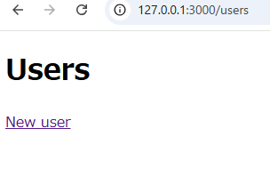

### アプリケーション作成2

scaffoldという**モデル**、**ビュー**、**コントローラー**を一括で作成してくれるコマンド使って、アプリケーションの作成してみましょう。
前章で作成したアプリと同じでユーザーの名前を登録できるアプリの作成をしていきます。

#### Railsの機能を使った ： アプリケーション作成 2

1. **作成したいリポジトリを開こう**     
  
   VS codeで**rails_basis**を開いてください。

1. **ターミナルで cd <リポジトリフォルダ名> へ移動しよう**  
 
   ```
   cd rails_basis 
   ```
   コマンドをターミナルで実行してください。

1. **ターミナルでrails new <アプリケーション名> コマンドでアプリケーション枠組みの作成**    
   ```
   rails new rails_app2
   ```
   コマンドをターミナルで実行してください。


1. **ターミナルで cd <アプリケーション名> へ移動しよう**  
 
   ```
   cd rails_app
   ```
   コマンドをターミナルで実行してください。

1. **rails db:createコマンドを実行**  

    ```
    rails db:create
    ```
    コマンドをターミナルで実行してください。
    
    アプリケーションで必要なデータを保存するデータベースを作成するコマンドです。

1. **rails g scaffold コマンドで必要なファイルを一括作成**  
     
     ```
     rails g scaffold User first_name:string family_name:string
     ```
     コマンドをターミナルで実行してください。

     アプリケーションで**必要なファイル**や**MVC**(構成)を自動的に生成するコマンドです。  
     
1. **rails db:migrate**  
    
    ```
    rails db:migrate
    ```
    コマンドをターミナルで実行してください。
 
    先ほど作成したデータベースをアプリケーションに適用するために使用します。

1. **rails sコマンドでアプリを起動しましょう**  

   ```
   rails s
   ```
   コマンドをターミナルで実行してください。
 
   Railsアプリケーションをローカルサーバーで起動するコマンドです。

1. **ブラウザで「 http://localhost:3000 」にアクセス**  
   ブラウザ（chromeなど）を開いてURL「 http://localhost:3000 」を検索欄に貼り付けてください

   

   この画面が表示されたら成功です。  
   
1. **URLに「/Users」を入れて一覧ページを開こう**  
   URLを「 http://127.0.0.1:3000/Users 」と変更してください。

   
   
   簡単なページが出来上がっています。  
   他にも「**/Users/new**」でユーザーの登録ページに移動できます。

1. **ターミナル上で Ctrl キー + C キーを押してアプリケーションを停止しよう**   

   無事にアプリケーションを終了できましたか？   
   アプリケーションを閉じるためのショートカットキーでよく使用しますのでぜひ覚えてください。

これで、便利なコマンドを使って、簡単なアプリケーションが作成できました。

思っていたより簡単すぎて、少し拍子抜けしたかもしれませんね。  
このシンプルさが**Rails**の**強力な特徴であり**、まだほんの一部に過ぎません。

# 作成されたページを触ってみようの項目をついか。

****

#### 用語解説

- **データベース**  
  アプリケーションで使用するデータを保存・管理するためのシステムです。

- **ローカルサーバー**  
  自分のコンピュータ上で動作するサーバーで、開発中のアプリケーションをテストするために使います。

- **ショートカットキー**  
  特定の操作を素早く実行できるようにするため機能です。

<br>

***


## 5.2 Ruby on Rails：Rails基礎 3

次は、呼び出されたControllerのアクションメソッドがどういう働きをしているか見てみましょう。  

__【users_controller.rb】__  
今回使用されているControllerは、`/app/controllers/`の配下にある`users_controller.rb`です。  
この中身を確認してみましょう。  

```rb
# app/controllers/users_controller.rb
class UsersController < ApplicationController
  before_action :set_user, only: %i[ show edit update destroy ]

  # GET /users or /users.json
  def index
    @users = User.all
  end

  # GET /users/1 or /users/1.json
  def show
  end

  # GET /users/new
  def new
    @user = User.new
  end

  # GET /users/1/edit
  def edit
  end

  # POST /users or /users.json
  def create
    @user = User.new(user_params)

    respond_to do |format|
      if @user.save
        format.html { redirect_to user_url(@user), notice: "User was successfully created." }
        format.json { render :show, status: :created, location: @user }
      else
        format.html { render :new, status: :unprocessable_entity }
        format.json { render json: @user.errors, status: :unprocessable_entity }
      end
    end
  end

  # PATCH/PUT /users/1 or /users/1.json
  def update
    respond_to do |format|
      if @user.update(user_params)
        format.html { redirect_to user_url(@user), notice: "User was successfully updated." }
        format.json { render :show, status: :ok, location: @user }
      else
        format.html { render :edit, status: :unprocessable_entity }
        format.json { render json: @user.errors, status: :unprocessable_entity }
      end
    end
  end

  # DELETE /users/1 or /users/1.json
  def destroy
    @user.destroy!

    respond_to do |format|
      format.html { redirect_to users_url, notice: "User was successfully destroyed." }
      format.json { head :no_content }
    end
  end

  private
    # Use callbacks to share common setup or constraints between actions.
    def set_user
      @user = User.find(params[:id])
    end

    # Only allow a list of trusted parameters through.
    def user_params
      params.require(:user).permit(:name, :email)
    end
end
```

scaffoldで生成すると、親切にもメソッドに対応するURLをコメントで記載してくれています。  
最初にアクセスした時は`/users`だったので、実行されたのは`index`メソッドになります。  

メソッドの中身には`@users = User.all`しか書かれていませんが、このメソッドで行っていることは他にもあります。  
実はアクションメソッドには、「メソッドの最後に特定の場所にあるViewを表示する」という特徴があります。  
そのViewとは、「Controller名と同じ名前のフォルダ内にある、メソッド名と同じ名前のView」のことです。  
例えばindexメソッドなら、usersフォルダ内にあるindex.html.erbというファイルが表示されることになります。  

そして、`@users = User.all`では何をやっているかというと、  
usersテーブルのレコードを全て取ってきてインスタンス変数に代入しています。  
`User`がModelに該当し、これに対してallメソッドを使用するとテーブルの全件取得が出来ます。  
それをなぜインスタンス変数に代入しているかというと、Controller内で定義されたインスタンス変数は、  
同じController内のアクションメソッドから表示されるViewでも参照が出来るようになるからです。

以上をまとめると、呼び出されたindexメソッドでは、  
「`/views/users/index.html.erb`はusersテーブルのレコードを全て取ってきた結果を渡した状態で表示する」  
という処理を行っていることになります。  
<br>

他にも、Controllerにはいくつか特徴があります。  

__【Controllerの定義】__  

先ほどの`UsersController`を確認してみましょう。
確認してみると、Controllerはクラスとして定義されていることが分かります。  
更に、`ApplicationController`というクラスを継承していることも分かります。  
```rb
class UsersController < ApplicationController
```
この`ApplicationController`は、あらかじめController用に用意されているクラスで、  
Controller全体で共通の処理等を書いておく場所になっています。
この辺りは、前に述べたDRYの理念に則った構造と言えるでしょう。  

ちなみに、`ApplicationController`は`ActionController::Base`というクラスを継承していますが、  
実はこの`ActionController::Base`を継承していることが、Controllerとして認識される条件になっています。  
なので、Controllerクラスを定義する際には、直接`ActionController::Base`を継承するか、  
`ApplicationController`のような、継承しているクラスを更に継承する必要があります。  
<br>

__【StrongParameter】__   

StrongParameter(ストロングパラメータ)は、Railsで使用されるセキュリティ機能の一つです。画面上の操作で送られてきたデータを安全に受け取る仕組みです。  
StrongParameterを使うことで、どのパラメータが許可されているかを明示的に指定することができ、アプリの作成者が意図していない値を受け取らないように、  
アプリのプログラム内で受け取ることのできる値に制限を設けます。  
上記のController内であれば、以下の部分が該当します。  
```rb
# app/controllers/users_controller.rb

private
・
・
・
def user_params
  params.require(:user).permit(:name, :email)
end
```
この`permit`メソッドで指定された値のみが扱えるようになります。  
scaffoldで生成した場合はこのように自動で追加してくれますが、  
自分で何か追加した時にはpermitメソッドを使用して指定しなくてはいけません。 

このStrongParameterは`private`メソッドというところに定義します。  
`private`メソッドはそのクラスのインスタンスからのみ呼び出すことができます。  
同じクラスからのみアクセスができ、外部からはアクセスができないようになっています。  
このように`private`メソッドを使用することでクラス内部の処理を隠蔽し、安全性と抽象化を高めることができます。

実際にどのように使われているか確認してみましょう。　　
```rb
# app/controllers/users_controller.rb

def create
  @user = User.new(user_params)

  respond_to do |format|
    if @user.save
      format.html { redirect_to user_url(@user), notice: "User was successfully created." }
      format.json { render :show, status: :created, location: @user }
    else
      format.html { render :new, status: :unprocessable_entity }
      format.json { render json: @user.errors, status: :unprocessable_entity }
    end
  end
end
```

`@user = User.new(user_params)`ではStrongParameterを使用しています。  
StrongParameterを使用しない場合は以下のように定義できます。
```rb
# app/controllers/users_controller.rb

@user = User.new(params[:users])
```
このコードは、`params[:user]`に含まれるすべての属性を一括でUserモデルに反映させます。  
しかし、意図しないパラメータが送られてきた場合に本来登録するべきではないものも登録されてしまう可能性があります。  

`params.require(:user).permit(:name, :email)`を使って、`user`キーの中の`name`と`email`のみを許可します。  
これにより、他の不正なパラメータが受け入れられなくなります。
<br>

__【Viewファイル】__  
今度は実際に表示されているViewファイルの中身を見てみましょう。  
```html
<!-- app/views/users/index.html.erb -->

<p style="color: green"><%= notice %></p>

<h1>Users</h1>

<div id="users">
  <% @users.each do |user| %>
    <%= render user %>
    <p>
      <%= link_to "Show this user", user %>
    </p>
  <% end %>
</div>

<%= link_to "New user", new_user_path %>
```
HTMLの知識がある人なら、このファイルを見た時違和感があったと思います。  
上記のファイルには、通常のHTMLの構造でいうbodyの部分しか書かれていません。  
それ以外の部分はどこに書かれているかというと、`/views/layouts/application.html.erb`というファイルに書かれています。  
```html
<!-- app/views/layouts/application.html.erb -->

<!DOCTYPE html>
<html>
  <head>
    <title>Railsbasic</title>
    <meta name="viewport" content="width=device-width,initial-scale=1">
    <%= csrf_meta_tags %>
    <%= csp_meta_tag %>

    <%= stylesheet_link_tag "application", "data-turbo-track": "reload" %>
    <%= javascript_importmap_tags %>
  </head>

  <body>
    <%= yield %>
  </body>
</html>
```
表示される時にはこの二つが組み合わさって表示されます。  
`application.html.erb`の中に`<%= yield %>`というRailsで特殊なタグがあります。  
`<%= yield %>`は、レイアウトファイル（通常は`app/views/layouts/application.html.erb`）内に置かれています。  
Railsでは、このレイアウトファイルは全てのビューファイルに適用される共通の構造を定義するために使用されます。  
`<%= yield %>`は、ビューファイルの特定の位置にレイアウトファイル内のコンテンツを挿入するために使用されます。  
`<%= yield %>`は`<body>`タグ内に置かれています。  
そのため、`app/views/users/index.html.erb`で`<%= yield %>`が呼び出されると、そのビューファイル内のコンテンツが`<body>`タグ内に挿入されます。  

またこれらのViewファイルには、`<%= yield %>`のように`<%= %>`や`<% %>`を使うことでHTMLの中にRubyのコードが書けるようになっています。  
これを利用して、Rubyの繰り返し文を使ってHTMLの要素を生成する事も出来ます。  
<br>

__【Model】__  
最後に、データの取得や登録時にはModelが使用されているのでそちらを確認してみましょう。  
```rb
# app/models/user.rb

class User < ApplicationRecord
end
```
現在はデータに対しての操作が何もないので、Modelの中身には何も書かれていません。  
実際にアプリを作成していくと、ここにメソッドを定義してデータの操作が出来るようにしていきます。  

Modelにはいくつか特徴的な機能があります。  
せっかくなので、今回のアプリもよりWEBアプリらしい形になるように機能を追加してみましょう。  

現在の状態では、登録されるデータに対して制限が何もありません。  
例えば、名前が空白のまま登録されたりすると困るので、空白が入力された時は登録出来ないようにしたいですね。  

制限をかける時には`バリデーション`という機能が使用されます。  
実際にバリデーションを使用して、上記の処理が出来るようにしてみましょう。  
```rb
# app/models/user.rb

class User < ApplicationRecord
  validates :name, presence: true
end
```
`presence: true`とすることで、画面上から登録する時に、名前が空白だと登録が出来ずに警告が出るようになっているはずです。  

また、もしメールアドレスをログインのID代わりにするなら、二つ同じものがあっては困ります。  
そういう時には`uniqueness: true`を使用します。  
以下のようにしてみましょう。  
```rb
# app/models/user.rb

class User < ApplicationRecord
  validates :name, presence: true
  validates :email, uniqueness: true
end
```
これで、一度登録したメールアドレスを使って登録しようとした時には警告が出るようになります。  

このように、Modelへコードを追加していくことで、色々なデータの操作が出来るようになります。  
<br>

ここまでで紹介したものが、Railsの基本的な作り方です。  
今回のものではまだ簡単な登録だけだったり、デザインも何もついていないので、  
次の章からはその辺りも考慮しながら、よりWEBアプリらしいものを作成してみましょう。

### 5.2.1 練習

新しいRailsのアプリケーションを'library'という名前で作成してみましょう。
テーブルBookは以下のようなカラムを持っているとする。
- title(string) 空白チェック有
- author(string)
- pages(integer)

### 5.2.1 解答(練習)

以下を実行
```sh
rails new library
cd library
rails g scaffold Book title:string author:string pages:integer
rails db:migrate
```

app/models/book.rbに以下を追加
```rb
# app/models/book.rb

class Book < ApplicationRecord
    validates :title, presence: true # 追加
end
```