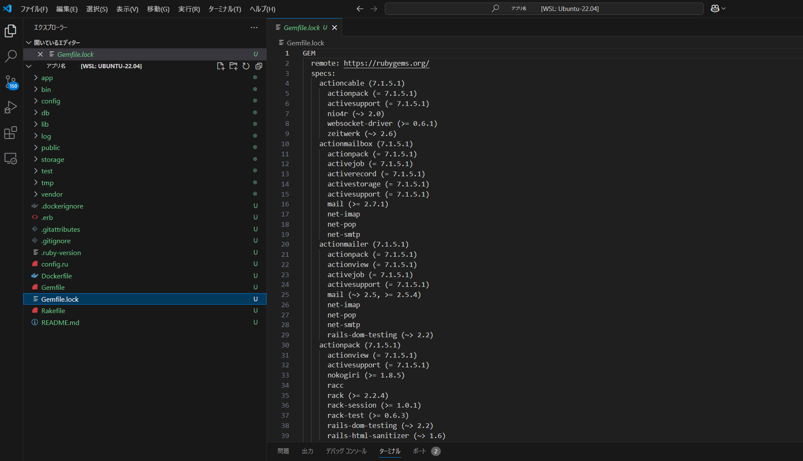

## 5 Ruby on Rails：Gemの機能

## 目次
- [Gemとは](#gemとは)
- [bundler](#bundler)
- [Gemの構成とコードリーディング](#gemの構成とコードリーディング)


--- 

### Gemとは
 
**Gem** とは、Ruby で作られたライブラリやプログラムのパッケージのことです。  
Ruby や Ruby on Rails（以降 Rails） の機能を拡張するために使われ、Gem を利用することで開発を効率的に進めることができます。   
Gem を使った場合でどれくらい開発効率が上がるのか、ログイン機能のコントローラー部分で見比べてみましょう。   
> ※ ログイン機能実装する場合は Gem の1つである **devise** がよく使われます。後の章で詳しく説明していますので、今はそんな Gem があることだけ覚えておいてください。

devise を使わずにログイン機能を作った場合のコントローラー処理は下のようになります。  
  ```rb
  class SessionsController < ApplicationController
    def new
    end

    def create
      user = User.find_by(email: params[:session][:email])

      if user && user.password == params[:session][:password]
        session[:user_id] = user.id
        redirect_to root_path, notice: "ログインしました"
      else
        flash.now[:alert] = "メールアドレスまたはパスワードが間違っています"
        render :new
      end
    end

    def destroy
      session[:user_id] = nil
      redirect_to login_path, notice: "ログアウトしました"
    end
  end
  ```

反対に devise を使ってログイン機能を実装した場合のコントローラー処理は次のようになります。  
  ```rb
  class ApplicationController < ActionController::Base
    before_action :configure_permitted_parameters, if: :devise_controller?

    private

    def configure_permitted_parameters
      devise_parameter_sanitizer.permit(:sign_up, keys: [:name])
    end
  end
  ```

このようにGemを使うことで、実装をより簡単にして開発のスピードを各段に上げてくれます。

繰り返しになりますが、Gem はとても便利な機能です。  
Gem を使う場合、GitHub に公式のリポジトリがあるため、該当 Gem の README を読んで使い方を学び、Gem のソースコードを読むことでさらに深い理解が得られます。

deviseのソースコード：https://github.com/heartcombo/devise  

---

####　ポイント

* **Gemを利用**することで、**機能をより簡単に実装**することが可能

* Gemを使う時、**使いたいGemのREADME**などで使い方を学び、さらに深い理解を得たいときはソースコードを確認

---

### bundler

Gem を使う上では、バージョン管理と依存関係について注意が必要です。  
Gemfile の Gem とインストールされた Gem のバージョンが違ったり、Gem 同士がどちらかを必要としている際、に Gem がインストールされていないと問題が発生します。  
そのような時、Gem のバージョン管理と依存関係を解決した環境を提供してくれるとても便利なツールが **bundler** です。  
bundler 自体も Gem として提供されています。

下のコマンドで bundler をインストールします。  
```sh
$ gem install bundler
```
  
bundler をインストールした後は、`Gemfile`ファイルに開いて使用したい Gem を記述します。もしコメントアウトされている Gem を使用したい場合、使いたい Gem についている # を外してください。  
  
  
  
記述が終わったら下のコマンドで Gem をプロジェクトにインストールします。
```sh
$ bundle install
```
これだけで、このプロジェクトで Gem を使った機能を組み込むことができます。

また、上のコマンドを行うとRailsが Gemfile.lock を作成してくれます。  
Gemfile.lock とは、Gemfile をもとに実際にインストールされた gem の一覧とバージョンが記載されたファイルです。  
 

複数人で開発を進める場合、Gemfile.lock の状態を一致させることですべての開発者が一致した環境で作業できます。そのため、デプロイの際に予期せぬ Gem での不具合を避けることができます。  

bundler に関して、以下の2点は押さえておきましょう。  

---

__bundle execコマンド__
例えば、料理を作るときに特定のレシピを使いたいときがあるとします。  
しかし、キッチンの中には同じ名前の材料が複数あり、形の悪いものや腐ったものがあるかもしれません。  
間違った食材を使ってしまったら、味や質に影響が出ます。  
 
そこで`bundle exec`を使うことで正しい材料を選択することができます。  

例ターミナル等で rspec という Gem を実行する時、下記のとおりコマンドの前に書いて実行すると、Gemfile.lock に沿ったバージョンの rspec を実行してくれます。
```sh
$ bundle exec rspec
```
railsコマンドを実行するときも間違った材料を選択することが起きやすいので、気をつけてください。  
bundlerでインストールしたGemに対するものは、`bundle exec`で実行するようにして、意図したGemが使えるようにしましょう。

---

#### Gemfileの書き方
`Gemfile`にはGemの名前はもちろん、いろいろな情報を設定することができます。以下の項目を参考に、関わっているプロジェクトのGemfileをチェックしてみましょう。  
書き方の一部を紹介します。  

- バージョン
  1. `>=`：以上(`>= 1.0.0`となっていれば1.0.0以上のすべての範囲)
  2. `<`：未満(`< 1.0.0`となっていれば1.0.0未満のすべての範囲)
  3. `~>`：推定範囲(`~> 1.5`となっていれば1.5～2.0の範囲、`~> 1.5.3`となっていれば1.5.3～1.5.6の範囲)
- 参照先
  1. source：Gemを取得するためのリモートリポジトリを指定
  2. git：GemをGitリポジトリから直接取得する場合に使用
  3. path：ローカルファイルシステム上のパスからGemを取得する場合に使用
- グループ設定
  1. development：開発環境でのみインストール
  2. test：テスト環境でのみインストール
  3. production：本番環境でのみインストール

また、Rubyのバージョンを明記しておくこともできます。記入しておくとログにワーニングが出力されて間違いも防げますので、最近は設定しておくプロジェクトが多いです。

そのほかのbundlerの機能については、マニュアルを参照ください。シンプルで読みやすい英語ですので、下記のReference(Primary Commands,Utilities)は一通り目を通すことをおすすめします。  

<http://bundler.io/docs.html>  

---

#### ポイント  

* Gemfile.lockをメンバーで一致させておき、デプロイ時のGemでのエラーを未然に防ぐ

* `bundle exec`コマンドで Gemfile.lock通り（正しいバージョン）にコマンドを実行できる

* Gemfileには、Gemの名前とバージョンを書き、明示的にバージョンを指定する


#### 用語解説  

* **Gemfile**：Railsアプリケーションで使用する Gem を記述しておくファイル  

* **bundler**：Gem の**バージョン管理と依存関係を解決した環境**を提供してくれる便利なツール

* **Gemfile.lock**：プロジェクトにインストールされた Gem の一覧とバージョンが記載されたファイル

---

### よく使われるGemの紹介
以下に業務システムで使いやすいGemをあげます。基本的にはGithubにREADMEとコードが存在しますので、気になるものはどんどん試していってください。(順不同)

#### __デバッグ系__  
  
| gem名 | 機能 |
|:---|:---|
| gem 'pry' | 標準搭載のirb(interactive ruby shell)の代替、ハイライトなどでコードが見やすくする、プラグインでさらに拡張可能 |
| gem 'pry-rails' | pryをRailsで使用する場合 |
| gem 'awesome_print' | pryと同様にコンソールの出力でコードを見やすくする |
| gem 'hirb' | DBテーブルの内容をASCIIテーブルで表示するなど見やすくする|
| gem 'letter_opener' | メールサーバーの代わりにブラウザへメール内容を表示 |
| gem 'simplecov' | コードがどれだけテストされているか割合を分析 |

#### __デザイン系__  
  
| gem名 | 機能 |
|:---|:---|
| gem 'html2slim' | htmlからslimへの変換 |
| gem 'html2haml' | htmlからhamlへの変換 |
| gem 'kaminari' | ページ分割(**ページネーション**) |

#### __認証・権限系__  
  
| gem名 | 機能 |
|:---|:---|
| gem 'devise' | 認証設定 |
| gem 'koala' | Facebook向けライブラリ |
| gem 'cancancan' | 権限設定 |
| gem 'pundit' | ポリシー設定 |

#### __インフラ系__  
  
| gem名 | 機能 |
|:---|:---|
| gem 'net-ssh' | ssh接続 |
| gem 'whenever' | cron作成 |
| gem 'dotenv' | 環境変数管理 |
| gem 'sidekiq' | jobキュー:ActiveJobのバックエンド |

#### __ドキュメント系__  
  
| gem名 | 機能 |
|:---|:---|
| gem 'prawn' | pdf出力(Ruby記述) |
| gem 'pdfkit' | pdf出力(html記述) |
| gem 'thinreports' | pdf出力(GUI) |
| gem 'docx_templater' | docxテンプレート文書の出力 |
| gem 'axlsx' | xlsxファイルの生成、出力 |
| gem 'rubyzip' | zipファイルの作成、出力 |

##### __その他機能追加__
| gem名 | 機能 |
|:---|:---|
| gem 'carrierwave' | ファイルアップロード機能を提供 |
| gem 'simple_form' | html入力フォームの作成を支援 |

---

### 【補足】Gemの構成
最近は`bundler gem`コマンドでGemを作成するのがデファクトスタンダードになってきましたので、Gemの構成はだいたい以下のとおりです。
```
gem_name/
├.git/
├bin/
├lib/
├test/
├.gitignore
├Gemfile
├LICENSE.txt
├Rakefile
└gem_name.gemspec
```
Gem自体もRailsアプリと同様にgitで管理し、テストも実装されています。特徴としては、Gemのライセンスを示すファイル(上記の場合は`LICENSE.txt`)とそのGemについての情報がまとめられている`*.gemspec`があります。Gemをrubygems.orgへ公開したとき、この`*.gemspec`の内容が詳細ページの情報として使用されます。Gemのメインのコードはlibフォルダに保存されています。