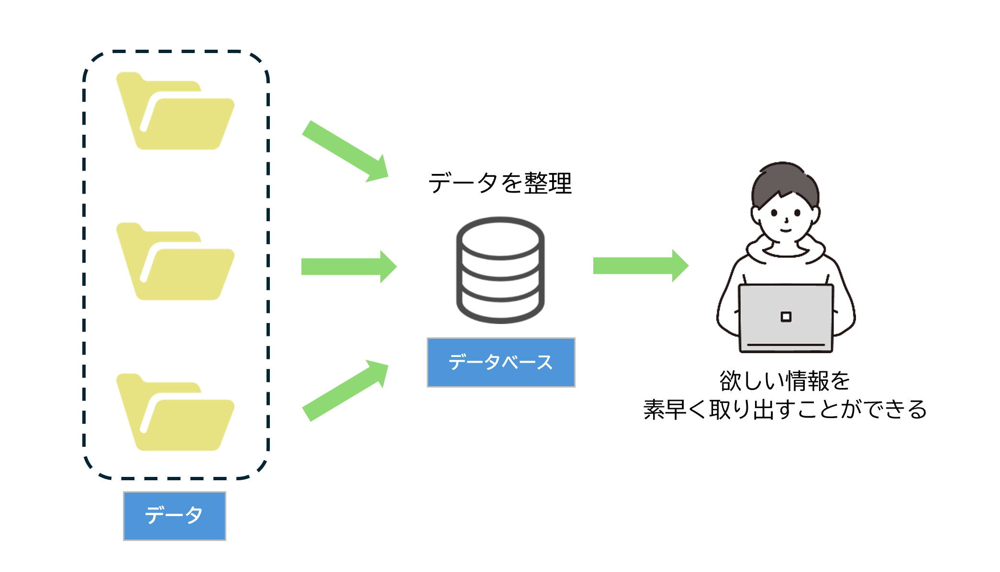
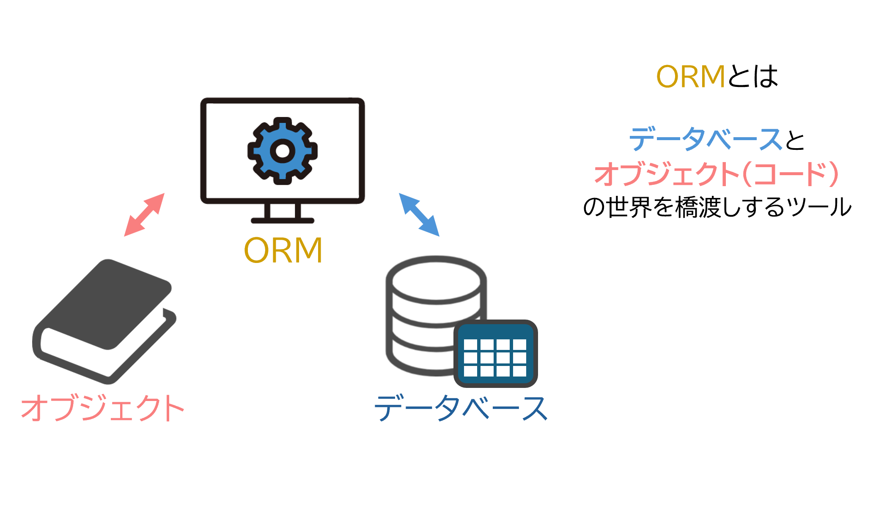
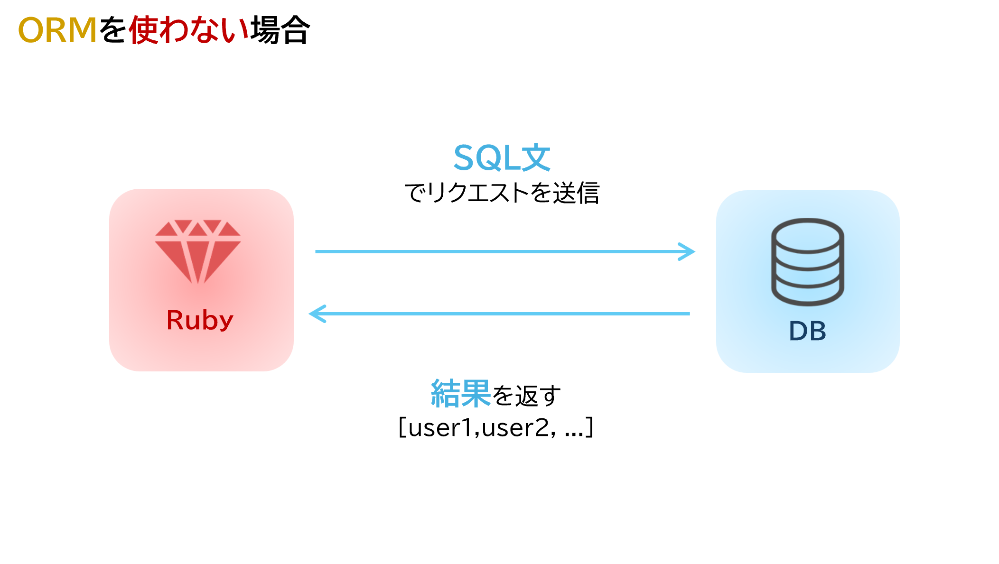
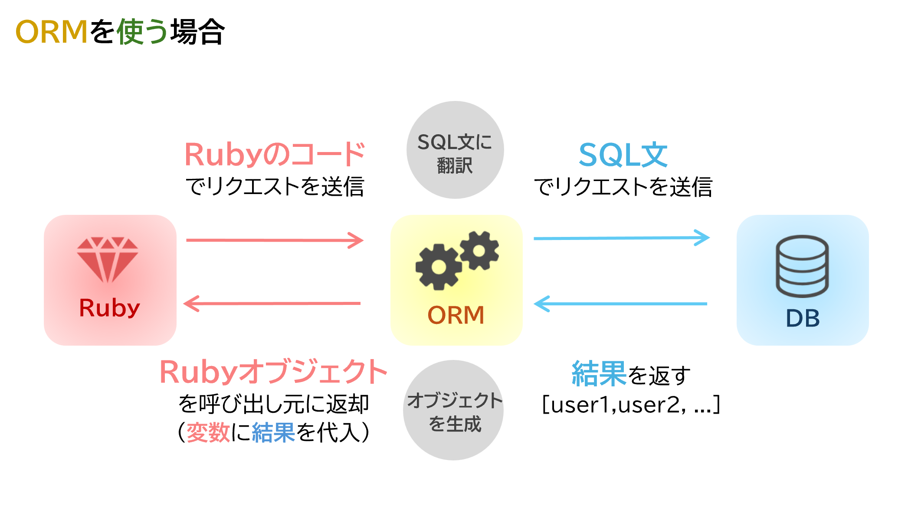

# 6 Ruby on Rails：データベース基礎
## 目次  

- [6 Ruby on Rails：データベース基礎](#6-ruby-on-railsデータベース基礎)
  - [目次](#目次)
  - [データベースの基本的な知識](#データベースの基本的な知識)
    - [(1) データベースとは](#1-データベースとは)
    - [(2) データベースの基礎](#2-データベースの基礎)
    - [(3) ActiveRecordについて](#3-activerecordについて)
    - [(4) SQLとActiveRecordの比較](#4-sqlとactiverecordの比較)
    - [(5) ActiveRecordの代表的なメソッド](#5-activerecordの代表的なメソッド)
    - [まとめ](#まとめ)
    - [例題](#例題)
    - [問題](#問題)

## データベースの基本的な知識
### (1) データベースとは

「データベース（Database）」とは、簡単に言えば「データの保管庫」です。日常生活では、電話帳や住所録、図書館の目録などがデータベースの一例です。それらは膨大な情報を整理して効率的に利用するための仕組みと言えます。

    

### IT分野におけるデータベース
IT分野で「データベース」といえば、「データベース管理システム（DBMS: Database Management System）」を指します。DBMSは、データを安全かつ効率的に保存し、必要なときに素早く取り出せるアプリケーションです。以下のようなシステムに利用されます。

- 顧客管理システム（顧客情報の保存・検索）
- 商品管理システム（在庫や価格情報の管理）
- 受発注管理システム（注文履歴や出荷状況の追跡）

たとえば、ECサイトでは、顧客の名前や住所、注文履歴といったデータがデータベースに保存されています。これにより、迅速に注文を処理したり、顧客ごとにパーソナライズされたサービスを提供できます。

### データベースの重要性
データベースは、現代のソフトウェアシステムにとって欠かせない基盤技術です。正確なデータが効率よく管理されていなければ、業務に支障が出たり、サービスの品質が低下したりすることもあります。そのため、DBMSを用いてデータを安全に管理することが重要です。

> **メモ**: Rubyでは、データベースを扱う際に「ActiveRecord」というライブラリを用いることが一般的です。ActiveRecordは、Ruby on Railsフレームワークに含まれるデータベース操作ツールで、後の章で詳しく解説します。

<br>

---

### ポイント
1. __データベースとは__  
データを効率的に管理・検索するための「保管庫」です。日常生活では電話帳や図書館の目録が該当します。

1. __ITでの活用例__  
顧客管理や商品管理、受発注システムなど、さまざまな業務で活用されます。例えば、ECサイトでは顧客情報や注文履歴を管理し、迅速なサービス提供を可能にしています。

1. __重要性__  
正確かつ安全にデータを管理することで、業務の効率化やサービス品質の向上につながります。

1. __Rubyでの操作__  
ActiveRecordを使えば、Rubyのコードで簡単にデータベースを操作できます。

<br>

---

### (2) データベースの基礎

### データベースの特徴
DBMSには以下のような特徴があります。

1. **膨大なデータの管理**  
   紙媒体では扱いきれない膨大なデータを効率的に管理できます。

1. **高速な検索・操作**  
   数千万件のデータからでも、数秒で必要な情報を検索・更新できます。

1. **同時アクセス**  
   複数のユーザーが同時にデータを利用可能です。

1. **トランザクション管理**  
   データ操作の一貫性を保つ仕組みがあります。これにより、操作中にエラーが発生してもデータの整合性が守られます。

1. **セキュリティ**  
   ユーザーごとにアクセス制限を設けることで、重要なデータを守ります。

<br>

---

### リレーショナル・データベースとは
DBMSにはさまざまな種類があります。このDBMSの種類は一般的に「データモデル」に基づいて分類されて
います。データモデルとは、「データを論理的にどのように扱うのか」を定めた概念であり、代表的なデータ
モデルとして以下のようなものがあります。
- 階層型データモデル
- ネットワーク型データモデル
- リレーショナル･データモデル
- オブジェクト指向データモデル
- XMLデータモデル

このうち、リレーショナル･データモデルを実装したデータベースのことを「RDB（Relational Database
）」あるいは「RDBMS（RDB Management System）」と呼び、現在データベースといえば、一般的にはリレーショナル･データベースのことを指しています。ここではリレーショナルデータベースを中心に説明します。

### リレーショナル・データベースの特徴  
リレーショナル・データベース（RDB）は、データをExcelのような表形式（テーブル形式）で管理するための仕組みを持つデータベースです。この形式には、以下のような特徴があります。

1. **データを表（テーブル）で管理**  
リレーショナル・データベースでは、データを表（テーブル）で整理して保存します。  
例えば、顧客情報をまとめた表を作り、1行に1人の情報を記録します。この方法ならデータが見やすく、追加・検索・更新が簡単にできます。

1. **データ同士をつなげられる**  
別々の表（テーブル）でも、共通する項目（例: 顧客ID）を使ってデータをつなげることができます。  
例えば、「顧客の情報」と「その人が注文した商品」の情報を関連付けて、一緒に活用できるのがリレーショナル・データベースの特徴です。

1. **正確で安全なデータ管理**  
データが重複しないようにしたり、データが間違わないように制約をかけたりできます。  
また、SQLという共通の操作方法で、データの登録や検索を簡単に行える仕組みがあります。これにより、誰でも正確にデータを扱うことができます。

  

### データベースの構造
データベースで情報を管理する際、データは「テーブル」という単位で整理・保存されます。
テーブルは表形式の構造を持ち、データを効率よく扱うための基本的な枠組みです。

例えば、ユーザー情報を管理する場合を考えてみましょう。
ユーザーの名前、メールアドレス、登録日などの情報を記録しておく必要があります。
これらの情報を表形式で整理したものがテーブルです。

  

- **行（レコード）**: テーブルの横1行のことを指します。  
レコードには、1つのまとまったデータ（例えば、1人のユーザーに関する情報）が含まれています。  
各レコードは、カラムごとに1つの値を持つため、1行が1人分の情報に対応します。

- **列（カラム）**: テーブルの縦1列のことを指します。各カラムには特定の種類のデータを格納します。  
例えば、「名前」「メールアドレス」「登録日」はそれぞれ独自のカラムに保存されます。  
カラムの一番上には「カラム名」が設定され、これが項目名に相当します。


### (3) ActiveRecordについて

### ActiveRecordとは

ActiveRecordは、Railsに付属する重要なライブラリの1つで、MVCのM(モデル)に相当します。  
ActiveRecordは、ORM (Object-Relational Mapping) で実装されています。

### ORMとは
ORM (Object-Relational Mapping) とは、アプリケーションが持つオブジェクトとリレーショナルデータベース(RDBMS)を繋ぐプログラミング技法です。  
ActiveRecordを利用することで、データベースのテーブルをRubyのオブジェクトとしてモデル化し、データベース操作をオブジェクト指向の方法で行うことができます。



#### ActiveRecordの主な機能

- **データベースのテーブルをモデル化**: テーブルと対応するクラスを簡単に定義できる。
- **テーブル間の関連性の表現**: 関連するデータの取得や保存が容易になる。
- **データの検証**: バリデーションルールをモデル内に定義することで不正データを防止できる。
- **オブジェクト指向によるデータベース操作**: Rubyのコードで直感的にデータベース操作を記述できる。

以下はActiveRecordの特に重要な仕組みです:
- モデルとそのデータを表す仕組み
- モデル間の関連性を表す仕組み
- 関連するモデルを通した階層の継承を表す仕組み
- DBに保存する前に検証する仕組み
- オブジェクト指向の手法でDB操作を実行する仕組み

<br>

---

### ポイント
1. __ActiveRecordとは__  
Railsのモデル部分で、ORM（Object-Relational Mapping）を使い、Rubyでデータベース操作を簡単にします。

1. __ORMとは__  
アプリケーションのオブジェクトとデータベースのテーブルをつなぐ技術。ActiveRecordを使うと、データベース操作が直感的にできます。

1. __主な機能__  
   - テーブルをモデル化し、クラスとして扱う
   - モデル間の関連を設定して関連データを扱う
   - バリデーションでデータの正当性を確認
   - オブジェクト指向でデータベース操作

2. __重要な仕組み__
   - モデルの定義と関連性
   - 保存前の検証
   - オブジェクト指向のDB操作  

<br>

---

### (4) SQLとActiveRecordの比較
データベースを操作するにはSQLが必要ですが、ActiveRecordを使用することでRubyのコードで操作できます。

#### SQLでの例



SQL (Structured Query Language) は、データベースに対する命令を記述するための言語です。  
例えば、すべてのユーザー情報を取得するSQL文は次のようになります

```sql
SELECT * FROM users;
```

#### SQLの仕組み
SQL (Structured Query Language) は、データベースに対する命令を記述するための言語です。  
上記のSQL文は、以下のような意味を持ちます:
- **SELECT**: データを取得する。
- **\***: すべての列(カラム)を選択する。
- **FROM users**: "users" テーブルからデータを取得する。

SQLは柔軟で強力なツールですが、特定のデータベース構造に依存しやすく、記述が煩雑になりがちです。

### ActiveRecordでの例



ActiveRecordを使用すると、同じ操作を以下のように記述できます。

```ruby
User.all
```

ActiveRecordでは、Rubyコードとして同様の操作を簡潔に表現できます。  
上記のActiveRecordコードでは、次のような内容を表しています:

- **User**: "users" テーブルに対応するモデルクラス。このクラスはActiveRecordを継承して作成されています。

- **all**: テーブル内のすべてのレコードを取得するメソッド。

これを実行することで、データベースからすべてのユーザー情報が取得され、Rubyオブジェクトとして扱えるようになります。

実際の使用例
全ユーザーの情報を取得して、名前を表示させる機能を実装するならば、以下のように記述できます。

```ruby
users = User.all  # users テーブルの全レコードを取得
users.each do |user|  # 取得したレコードをuserに1つずつ格納
  puts user.name  # ユーザー名を出力
end
```
#### 解説
- User.all でデータベースからすべてのレコードを取得します。
- each メソッドを使って、取得したレコードを1件ずつ取り出します。
- user.name で、各ユーザーの名前を取得して表示します。


### ActiveRecordの利点
ActiveRecordを使用すると、以下の利便性が得られます:
1. **コードが短くてわかりやすい**: SQL文を書く代わりにRubyのコードで操作ができるため、記述がシンプルになります。  
→ SQL文のように細かい構文を覚える必要がなく、直感的に使えます。
1. **データベースの種類に依存しない**: ActiveRecordは、MySQLやPostgreSQLなど、さまざまなデータベースで動作します。　　
→ データベースを変更しても、User.allのようなActiveRecordのコードをそのまま使えます。
1. **安全性の向上**: ユーザーからの入力をそのままSQL文に渡すと、悪意ある攻撃（SQLインジェクション）を受ける可能性がありますが、ActiveRecordはこれを防ぎます。
→ 内部で自動的に安全なSQL文に変換してくれるため、安心して使えます。

このように、ActiveRecordは初心者でも扱いやすいツールとなっています。

<br>

---

### ポイント  
1. __SQLとは__  
 SQL（Structured Query Language）は、データベースを操作するための言語です。具体的には、データの取得、挿入、更新、削除などを行うための命令を記述します。

1. __ITでの活用例__  
 SQLは、顧客管理や商品管理、売上分析など、データベースを用いるさまざまな業務で活用されます。例えば、ECサイトでは商品情報を管理し、ユーザーの注文履歴を処理するためにSQLが使用されます。

1. __重要性__  
 SQLを使いこなすことで、大量のデータを効率的に管理・処理でき、業務のスピードや精度が向上します。また、データベースの設計を適切に行うことが、システム全体のパフォーマンスにも大きく影響します。

1. __Rubyでの操作__  
 ActiveRecordを使うことで、SQLの知識がなくてもRubyのコードだけでデータベース操作が簡単にできます


<br>

---

### (5) ActiveRecordの代表的なメソッド

ここでは、以下のモデルを例にActiveRecordの代表的なメソッドを簡潔に説明していきます。

`モデル User:ユーザー`

| field名      | 名称           | 型      |
| :----------- | :------------- | :------ |
| id           | ID             | integer |
| name         | 名前           | string  |
| mail_address | メールアドレス | string  |


`ActiveRecordの代表的なメソッド一覧`  
※表の発行SQLは、わかりやすさのため、テーブル名は省略してカラム名のみ記述しています。

| メソッド | 説明                 | 使用例                                                 | 発行SQL                                                                                       |
| :------- | :------------------- | :----------------------------------------------------- | :-------------------------------------------------------------------------------------------- |
| all      | 全件取得(全カラム)   | User.all                                               | SELECT * FROM users                                                                           |
| select   | 全件取得(カラム指定) | User.select(:name)<br>User.select('name,mail_address') | SELECT name FROM users<br>SELECT name,mail_address FROM users                                 |
| find     | 検索(id指定)         | User.find(1)                                           | SELECT * FROM users WHERE id = 1                                                              |
| find_by  | 検索(条件指定)       | User.find_by(id:1)<br>User.find_by('id > 1')           | SELECT \* FROM users WHERE id = 1 LIMIT 1<br>SELECT * FROM users WHERE id > 1 LIMIT 1         |
| where    | 検索(条件指定)       | User.where(id:1)<br>User.where('id > 1')               | SELECT \* FROM users WHERE id = 1<br>SELECT * FROM users WHERE id > 1                         |
| first    | 最初のデータをとる   | User.first<br>User.first(2)                            | SELECT \* FROM users ORDER BY id ASC LIMIT 1<br>SELECT \* FROM users ORDER BY id ASC LIMIT 2  |
| last     | 最後のデータをとる   | User.last<br>User.last(2)                              | SELECT \* FROM users ORDER BY id DESC LIMIT 1<br>SELECT * FROM users ORDER BY id DESC LIMIT 2 |
| order    | ソート               | User.order(:name)<br>User.order(name: :DESC)           | SELECT \* FROM users ORDER BY name ASC<br>SELECT \* FROM users ORDER BY name DESC             |
| limit    | 制限                 | User.limit(2)                                          | SELECT * FROM users LIMIT 2                                                                   |

`各メソッドの詳細`

- all
  - レコードを全件取得します
- select
  - カラムを指定し、レコードを取得します。引数の値がカラムとなります。
- find
  - 指定したidのレコードを取得します。引数の値が指定するidとなります。
  - findは、該当するデータが見つからない場合は例外（RecordNotFound）が発生します。
- find_by
  - 特定のカラムの条件を指定し、該当する1件を取得します。引数の値が条件となります。
  - find_byは該当するデータが見つからない場合は、nilを返します。
- where
  - 特定のカラムの条件を指定し、該当する全件を取得します。引数の値が条件となります。
  - whereは、該当するデータが見つからない場合は空の`ActiveRecord::Relation`を返します。
- first
  - レコードの最初の1件を取得します。引数を渡すと最初のn件と指定することもできます。
- last
  - レコードの最後の1件を取得します。引数を渡すと最後のn件と指定することもできます。
- order
  - レコードを引数に指定したカラムで並び変えます。デフォルトの並び順はASC(昇順)になっています。
  - 降順で並び変える場合は`User.order(name: :DESC)`とします。
- limit
  - 特定のレコード件数を取得します。引数の値が最大取得行数となります。


### まとめ
  
- **データベースの役割と重要性**  
データベースは、膨大な情報を効率的に管理し、必要な情報を迅速に取得できる仕組みです。リレーショナル・データベースは、表形式でデータを管理し、関連性を持たせることで、柔軟なデータ操作を可能にします。

- **ActiveRecordとその利便性**  
Ruby on RailsのActiveRecordは、データベースをオブジェクトとして操作するためのライブラリです。SQLに比べて簡潔なコードで操作でき、移植性や安全性が高い点が特徴です。

- **SQLとActiveRecordの違い**  
SQLはデータベース操作に必要な言語で、強力ですが記述が複雑になりがちです。一方、ActiveRecordはRubyの直感的な記法を活用して、簡潔かつ安全にデータベース操作を行えます。

- **ActiveRecordメソッド**  
ActiveRecordには、データの取得や検索、更新、削除などの操作を簡単に行える便利なメソッドが多数用意されています。これにより、Ruby初心者でも容易にデータベースを扱うことができます。

<br>

---

###  例題 

先生と授業(科目)のテーブルを作成し、先生と授業の多対多で関連付けしていきます。
先生は複数の授業(科目)を担当し、授業(科目)からも複数の先生が受け持っているという多対多の関連付けとして実装します。
データベース構成は以下の通りとします。

Teacher : 先生テーブル

| field名 | 名称 | 型     |
| :------ | :--- | :----- |
| name    | 名前 | string |

Lesson : 授業テーブル

| field名 | 名称   | 型     |
| :------ | :----- | :----- |
| name    | 授業名 | string |

TeacherLesson : 中間テーブル

| field名    | 名称 | 型         |
| :--------- | :--- | :--------- |
| teacher_id | 先生 | references |
| lesson_id  | 授業 | references |


#### ①　アプリケーションの作成

まずは、例題用のRailsアプリケーションを作成します。

```sh
$ rails new teacher_sample
```

#### ②　Teacherモデルの作成

次に必要なモデルを作成してきます。  
今回はCRUD操作をしないので`rails g model`でモデルを作成します。  

```sh
$ rails g model Teacher name:string
```

#### ③　Lessonモデルの作成

```sh
$ rails g model Lesson name:string
```

#### ③　TeacherLessonモデルの作成

中間テーブルとなるモデルです。
teacherとlessonを参照するように設定して、モデルを生成します。

```sh
$ rails g model TeacherLesson teacher:references lesson:references
```
データ型を`references`にすることで中間テーブルで自動的に関連付けを定義してくれます。  
teacher、lessonとteacher_lessonのモデルが作成できたので、テーブルを作成するためにマイグレーションも実行しましょう。

```sh
$ rails db:migrate
```

各モデルの関係を設定するために、以下の内容を追記してください。  
has_many :throughは、teacher_lessonをショートカットして、teacherもしくはlessonを参照できるようにします。

```rb
# app/models/teacher.rb

class Teacher < ApplicationRecord
  has_many :teacher_lessons
  has_many :lessons, through: :teacher_lessons
end
```

```rb
# app/models/lesson.rb

class Lesson < ApplicationRecord
  has_many :teacher_lessons
  has_many :teachers, through: :teacher_lessons
end
```

teacher_lessonモデルはteacherとlessonを参照するように生成したため、既に下記のソースコードとなっています。

```rb
# app/models/teacher_lesson.rb

class TeacherLesson < ApplicationRecord
  belongs_to :teacher
  belongs_to :lesson
end
```

<br>

---

### 問題

今回のECサイトのデータベース構成は、以下のようにします。  
この構成通りに、モデルを作成してみましょう。BookとTagはscaffold、Taggingはmodelで作成しましょう。
また、各モデルの関係を設定しましょう。本と商品は多対多の関係になることに注意して下さい。  


アプリケーション名：ec_site  
Book : 本 テーブル

| field名      | 名称     | 型      |
| :----------- | :------- | :------ |
| title        | タイトル | string  |
| author       | 著者     | string  |
| published_on | 出版日   | date    |
| showing      | 商品表示 | boolean |
| price        | 価格     | integer |

Tag : 商品タグ テーブル

| field名 | 名称   | 型     |
| :------ | :----- | :----- |
| name    | タグ名 | string |

Tagging : タグ付け テーブル

| field名 | 名称     | 型         |
| :------ | :------- | :--------- |
| book_id | 本       | references |
| tag_id  | 商品タグ | references |
