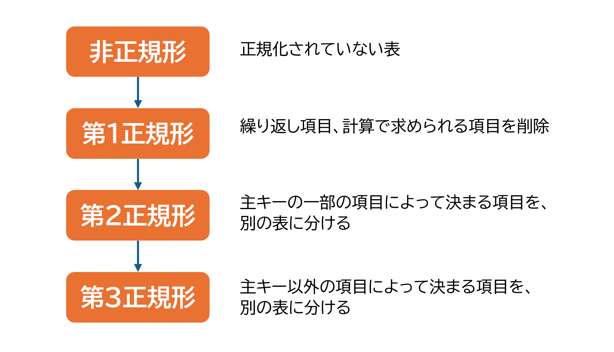
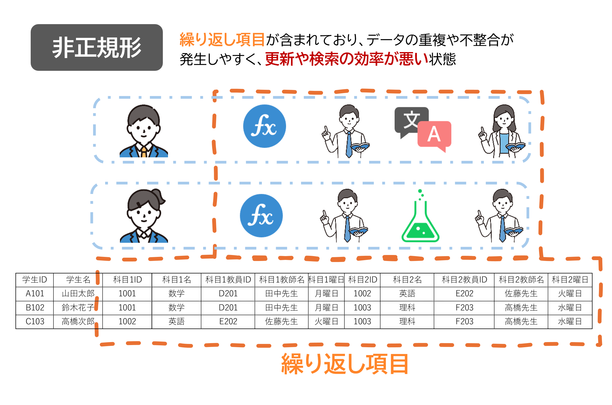
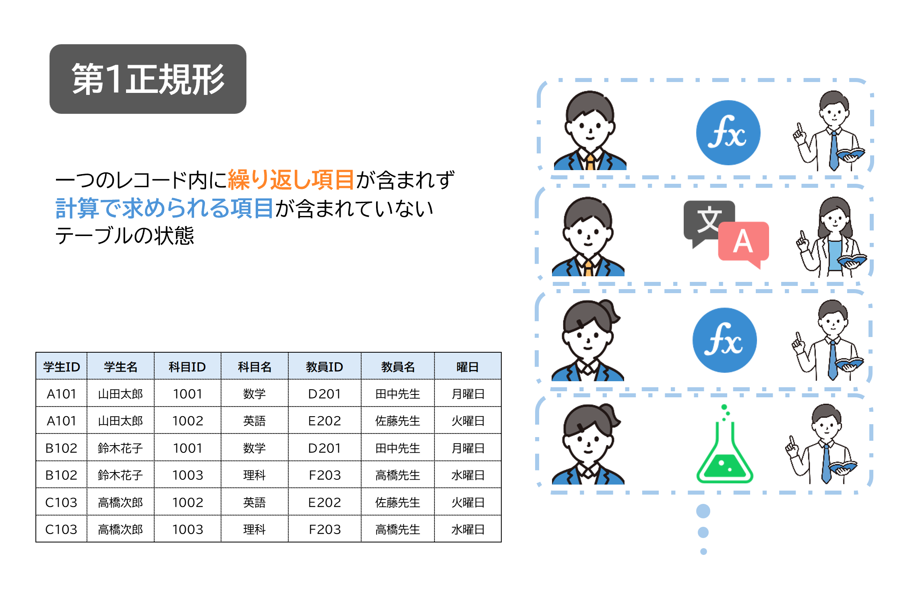
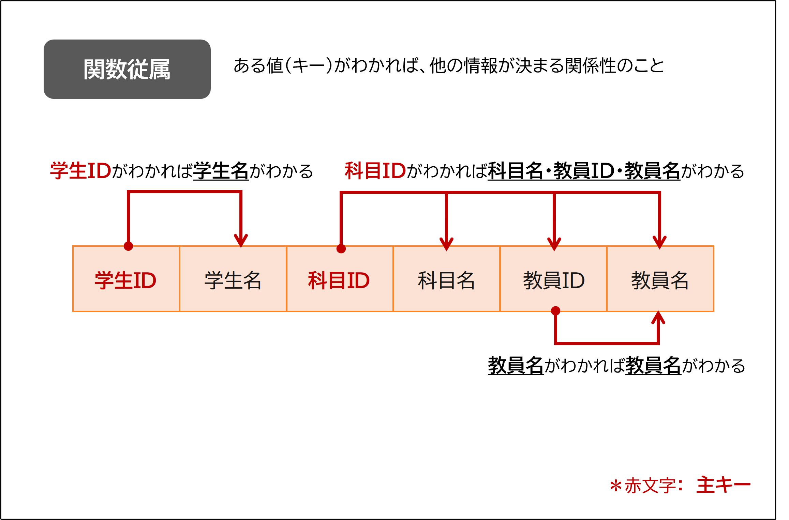
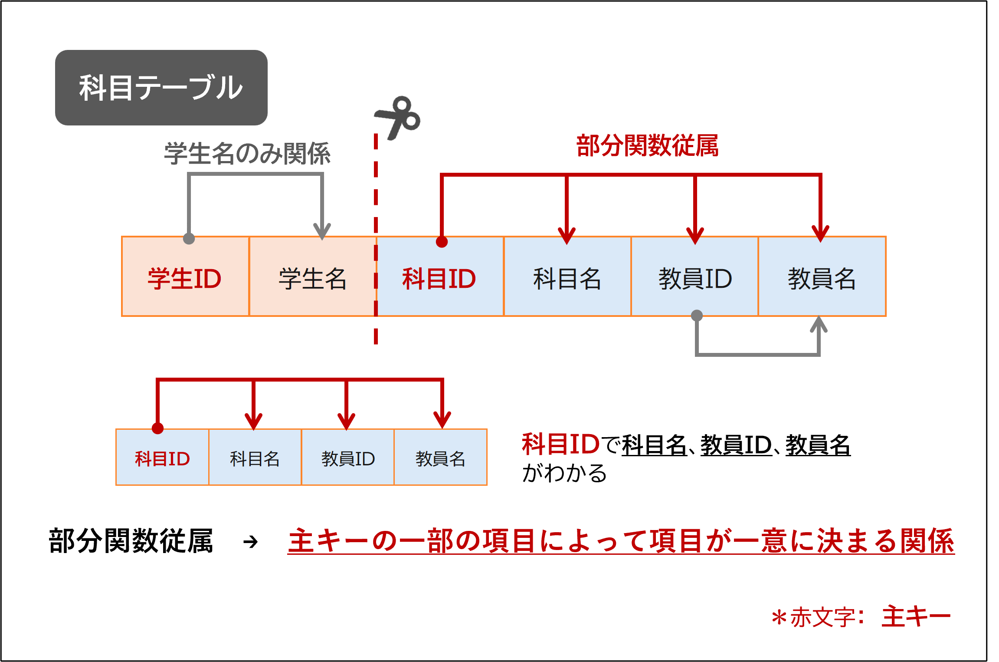
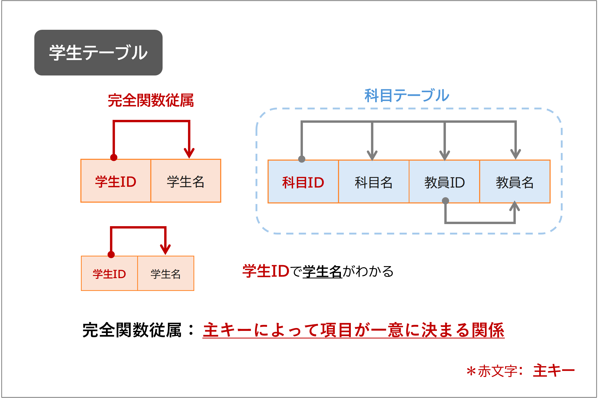
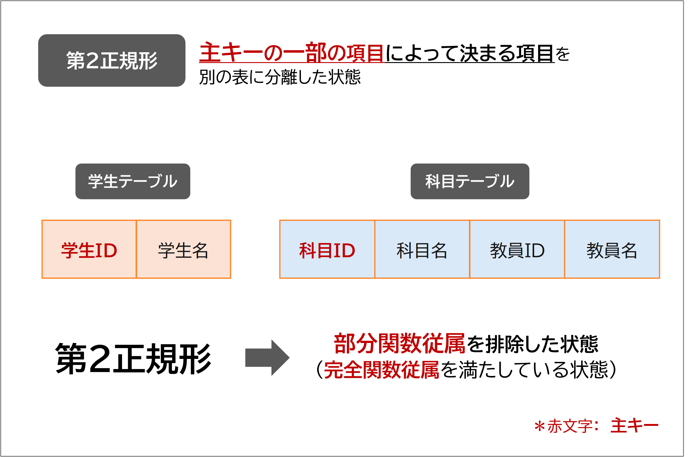
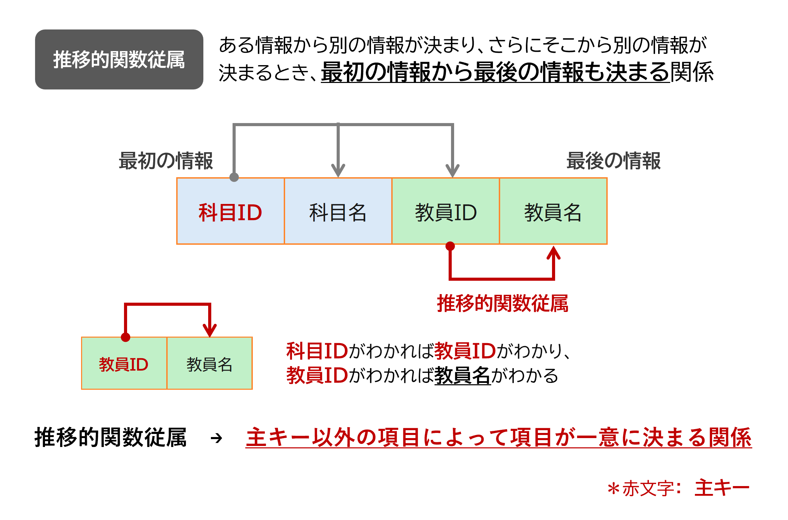
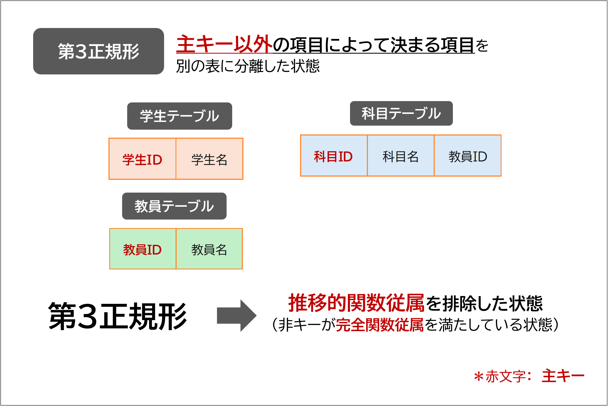

# 6 Ruby on Rails：データベース設計

## 目次

- [データベース設計とは](#データベース設計とは)
- [データベース設計を行う](#データベース設計を行う)
- [データベースの基本構成](#データベースの基本構成)
- [繰り返し項目を削除する](#繰り返し項目を削除する)
   - [正規化](#正規化)
   - [正規化のプロセス](#正規化のプロセス)
- [初期設計-非正規形](#初期設計-非正規形)
- [第1正規形（繰り返し項目の排除）](#第1正規形-繰り返し項目の排除)
- [第2正規形（部分関数従属の排除）](#第2正規形-部分関数従属の排除)
- [第3正規形（推移的関数従属の排除）](#第3正規形-推移的関数従属の排除)
- [最終形のデータベース設計](#最終形のデータベース設計)  
  - [データ型を決める](#データ型を決める)  
  - [フィールド名を決める](#フィールド名を決める)  

--- 

 

ここからは、サイトアプリケーションの開発を例に各実装を解説していきます。
まず、この章では、データベース設計の解説を行います。
設計のために、データベース設計の基礎、正規化について簡単に説明します。

## データベース設計とは

データベースは、アプリケーションが正しく動作するための「**土台**」の役割を果たします。  
アプリケーションを開発する際に、「**どんなデータを、どのように保存すればよいか**」を事前に計画しないと、以下のような問題が発生する可能性があります：

- データを処理するのに無駄な時間がかかる  
- 必要な機能を実現できなくなる  
- データベース全体を作り直す必要が出てくる  

 

例えば、データベース設計を「**家づくり**」に例えるとイメージしやすいです。  
家を建てるとき、間取りや配管、水道、電気の位置を考えずに工事を始めたらどうなるでしょう？  
建てた後で「キッチンが遠すぎる」「コンセントが全然足りない」「水道が使えない！」といった問題が出て、最悪の場合、家を壊して作り直さなければならなくなるかもしれません。

データベース設計でも同じことが言えます。設計を怠ると、必要な機能が追加できなかったり、複雑なデータ処理が必要になったりして、大きなコストが発生してしまいます。さらに、使い勝手の悪いアプリケーションになってしまうこともあります。

そのため、アプリケーションを作る初期段階で、必要なデータを整理し、それをどのような形で保存するかを慎重に検討する必要があります。このように、データベースの構造を事前に計画する作業を「**データベース設計（database design）**」と呼びます。

### データベース設計が重要な理由

データベース設計は、アプリケーションを建てる「設計図」に相当します。  
適切な設計を行うことで、以下のようなメリットが得られます：

 1. **効率的なデータ管理**  
無駄なデータの重複を避け、スムーズな処理を実現します。

 1. **将来的な変更や拡張への対応**  
新しい機能を追加する際も、スムーズに対応できます。

 1. **アプリケーションのパフォーマンス向上**  
適切に設計されたデータベースは、処理速度の向上にも寄与します。

データベース設計は、アプリケーションの**土台を構築する重要なプロセス**です。  
最初にしっかりと設計することで、長く安心して使える「住み心地の良い家（アプリケーション）」を作ることができます。

## データベース設計を行う

それでは、実際にデータベース設計のプロセスを見ていきましょう。

今回は、「メモアプリ」を例にして、データベース設計の手順をご紹介します。以下の手順に従って設計を進めていきます。

### データベース設計の手順

1. **必要なデータ項目をまとめる**： 各画面で必要な情報をリストアップします。
2. **カラム名を決める**： データ項目に対応するカラム名を決定します。
3. **「列の繰り返し項目」を削除する**： 同じ種類のデータが複数列に分かれる場合、それらを1つの列に統合します。
4. **「行の繰り返し項目」を削除する**： 繰り返しデータが複数行に分かれる場合、別のテーブルに分割して管理します。
5. **テーブルにIDカラムを追加する**： 各テーブルに一意の識別子（IDカラム）を設けます。
6. **共通利用のデータをテーブル化する**： 他のテーブルで共通して使用されるデータを独立したテーブルにまとめます。
7. **テーブルの構造を考える**： テーブル間の関係性や参照方法を設計します。

## データベースの基本構成

データベースは、「テーブル」と「カラム」で構成されています。
データベース設計では、まず、「どのようなテーブルが必要になるか」を考えることが出発点です。

例えば、「メモアプリ」では、以下のようなテーブルが必要になるかもしれません:
- ユーザー情報を保存するテーブル
- 投稿内容を保存するテーブル
- コメントやレビューを保存するテーブル

### テーブル間の関係性
テーブルは、アプリケーション内でデータの関連性を持っています。  
例えば、以下のような関係性が考えられます:
- **ユーザーと投稿**: ユーザーが投稿を作成する（一対多の関係）。
- **投稿とコメント**: 各投稿に複数のコメントが付く（一対多の関係）。
- **投稿と飲食店情報**: 各投稿が特定の飲食店に紐付く（一対一または一対多の関係）。

これらの関係性を明確にすることで、テーブル設計がスムーズに進みます。

## 繰り返し項目を削除する

### 正規化
正規化（Normalization）は、リレーショナルデータベース（RDBMS）において、データの構造を最適化し、データの冗長性を排除するための手法です。これにより、データの更新異常を防ぎ、データの整合性を保つことができます。以下では、正規化のプロセスを詳しく説明します。

正規化の目的
正規化の主な目的は次の2つです。

- **データの冗長性を排除する**  
重複したデータが存在することで、データの管理が複雑になります。正規化により、冗長なデータを減らし、効率的なデータの管理が可能になります。

- **データの更新異常を防ぎ、整合性を保つ**    
更新異常とは、データを変更する際に不整合が生じることです。正規化により、データの更新時に不整合が発生しないようにします。

## 正規化のプロセス

 

#### 第1正規化（1NF）  
**目的：1つのマスに1つのデータだけ入れる**  
データが1つのマス（セル）に複数入っていると管理しにくくなります。例えば、商品に複数のタグがある場合、それらを1つのセルにまとめるのではなく、1つずつ分けて登録します。こうすることで、検索や集計がしやすくなります。  

#### 第2正規化（2NF）  
**目的：関係ない情報を分けてスッキリさせる**  
1つのテーブルに、特定の情報にしか関係しないデータが混ざっていると、管理が大変になります。例えば、商品の情報とカテゴリ名が同じテーブルにあると、同じカテゴリ名が何度も出てきてしまいます。これを防ぐために、カテゴリの情報を別のテーブルに分けると、データの重複がなくなり、修正や追加が簡単になります。  

#### 第3正規化（3NF）  
**目的：変更しやすくするために、影響を減らす**  
あるデータが他のデータをもとに決まる場合、それらを一緒に管理すると、変更が大変になります。例えば、ユーザーIDとユーザー名を商品データと一緒に記録すると、同じユーザーが別の商品を買うたびに名前を入力しなければなりません。これを防ぐために、ユーザー情報を別のテーブルに分け、IDだけを参照するようにすると、データの修正や管理が楽になります。  

#### 第4正規化（4NF）  
**目的：データの矛盾を防ぐために、1つのデータに対する複数の関係を整理する**  
1つのデータに対して複数の関連情報がある場合、それらを適切に分けないと矛盾が発生しやすくなります。例えば、1人の講師が複数の授業を担当し、1つの授業に複数の生徒がいる場合、これらを1つのテーブルで管理すると重複が発生しやすくなります。このような場合、講師・授業・生徒を別々のテーブルに分け

## 初期設計 (非正規形)

#### **現在の状態の説明**
学生の履修科目情報を1つのテーブルにまとめた設計を考えます。このテーブルでは、1人の学生が履修する複数の科目を1つの行にまとめています。

#### **画像**

#### **表: 履修科目テーブル (非正規形)**
| 学生ID  | 学生名   | 科目1ID | 科目1名   | 科目1教員ID | 科目1教師名 | 科目2ID | 科目2名   | 科目2教員ID | 科目2教師名 |
|--------|----------|---------|-----------|-------------|-------------|---------|-----------|-------------|-------------|
| A101   | 山田太郎 | 1001    | 数学      | 2001        | 田中先生    | 1002    | 英語      | 2002        | 佐藤先生    |
| B102   | 鈴木花子 | 1001    | 数学      | 2001        | 田中先生    | 1003    | 理科      | 2003        | 高橋先生    |
| C103   | 高橋次郎 | 1002    | 英語      | 2002        | 佐藤先生    | 1003    | 理科      | 2003        | 高橋先生    |

#### **改善点**
このテーブルでは、1人の学生が履修する科目が列として増えていくため、以下のような問題が発生します。

#### **問題点**
1. **データの冗長性**  
   - 例えば、「田中先生」は複数回記録されており、無駄なデータの繰り返しが発生している。

2. **更新・削除の非効率性**  
   - 例えば、教員の名前を変更する場合、複数のレコードを更新しなければならない。

3. **検索の複雑化**  
   - 例えば、「数学を履修している学生を検索する」場合、`科目1名` や `科目2名` などの複数のカラムをチェックする必要があり、検索条件が複雑になる。

#### **解決法**
この問題を解決するために、繰り返し項目を別のテーブルとして分割し、**「学生」「科目」「履修情報」**のような関連テーブルを作成します。  
次のステップでは、このテーブルを**第1正規化**し、より管理しやすい形に整理します。

## 第1正規形 (繰り返し項目の排除)

#### **現在の状態**
非正規形の状態では、1人の学生が履修する複数の科目が1つのレコード内に含まれていました。そのため、データの管理が難しくなり、冗長性が発生していました。  
第1正規形では、このような繰り返し項目を排除し、1つのセルに1つの値のみを記録する形に整理します。

#### **第1正規形後の履修科目テーブル**
| 学生ID | 学生名   | 科目ID | 科目名   | 教員ID | 教員名   |
| ------ | -------- | ------ | -------- | ------ | -------- |
| A101   | 山田太郎 | 1001   | 数学     | D201   | 田中先生 |
| A101   | 山田太郎 | 1002   | 英語     | E202   | 佐藤先生 |
| B102   | 鈴木花子 | 1001   | 数学     | D201   | 田中先生 |
| B102   | 鈴木花子 | 1003   | 理科     | F203   | 高橋先生 |
| C103   | 高橋次郎 | 1002   | 英語     | E202   | 佐藤先生 |
| C103   | 高橋次郎 | 1003   | 理科     | F203   | 高橋先生 |

#### **改善点**
第1正規形にすることで、1つのセルに複数の値が入ることなく、データが整然と整理されました。  
これにより、データの一貫性が向上し、検索や集計がしやすくなります。

#### **問題点**
1. **データの冗長性**
   - 例えば、1人の学生が複数の科目を履修している場合、**学生名が繰り返し記録**される。
   - 同様に、**教員名も重複**して保存されるため、データの無駄が生じる。

2. **更新や削除の非効率性**
   - 例えば、ある教員の名前を変更する場合、データベース内の**すべてのレコードを更新**しなければならない。
   - これは管理コストを増大させ、**データの整合性が崩れるリスク**を生む。

#### **解決法**
この問題を解決するためには、繰り返し発生するデータを適切に分割し、それぞれを **「学生」「科目」「教員」「履修情報」** といったテーブルに整理する必要があります。  
次のステップでは、第2正規形に進み、さらにデータの整理を行います。

---

#### **ポイント**  
- **1NFの目的**  
 1NF（第一正規形）は、データの繰り返しや複雑な構造を排除し、各カラムに単一の値のみを格納することを目的としています。これにより、データがよりシンプルで管理しやすくなります。

- **具体例**  
 例えば、顧客の情報を管理するテーブルに「電話番号」が複数の値を持つカラムとして存在している場合、それを分割して1つのカラムに1つの電話番号のみを格納することが求められます。

- **重要性**  
 1NFを満たすことにより、データが整然と整理され、後の正規化を進めやすくなります。また、データの一貫性が高まり、データベース操作がより簡単になります。

---

## 第2正規形 (部分関数従属の排除)

#### **現在の状態の説明**
第1正規形では、データの繰り返しを排除しましたが、まだ**主キーの一部にのみ依存するデータ**（部分関数従属）が存在しています。  
これにより、データの冗長性が残り、管理が難しい状態です。

#### **関数従属についての説明**
関数従属とは、ある列（属性）の値が、特定の列（キー）によって一意に決定される関係のことです。  
第2正規形では、主キーの一部にのみ依存する属性（部分関数従属）を排除し、**すべての属性が主キー全体に依存するように**整理します。

---
#### **科目テーブルの分け方**
科目に関連する情報（科目ID、科目名、教員ID、教員名）を独立した**「科目テーブル」**に分けます。  
これにより、科目ごとに一意の情報を持ち、冗長性を削減できます。

#### **科目テーブル**
| 科目ID | 科目名   | 教員ID | 教員名   |
| ------ | -------- | ------ | -------- |
| 1001   | 数学     | D201   | 田中先生 |
| 1002   | 英語     | E202   | 佐藤先生 |
| 1003   | 理科     | F203   | 高橋先生 |

---

#### **部分関数従属について**
> **メモ**: **部分関数従属**とは、主キーの一部にのみ依存する属性のことを指します。例えば、
> 「学生ID, 科目ID」を主キーとする場合、**学生名は学生IDのみに依存**し、科目情報とは関係がありません。  
> これが原因でデータの冗長性が生じるため、第2正規形ではこの問題を解決します。

---

#### **学生テーブルの分け方**
学生に関する情報（学生ID、学生名）を独立した**「学生テーブル」**に分けます。  
これにより、各学生の情報が一意になり、重複を防ぐことができます。

#### **学生テーブル**
| 学生ID | 学生名   |
| ------ | -------- |
| A101   | 山田太郎 |
| B102   | 鈴木花子 |
| C103   | 高橋次郎 |

---

### **完全関数従属について**
> **メモ**： **完全関数従属**とは、すべての非キー属性が主キー全体に依存する状態を指します。  
> 第2正規形に移行することで、すべての属性が主キーの全体に依存するように整理されます。

---

### **第2正規形について**
第2正規形では、主キーの一部にのみ依存するデータ（部分関数従属）を分割し、適切なテーブルに整理しました。  
これにより、データの一貫性が向上し、変更時の負担が軽減されました。

#### **改善点**
1. **データの冗長性を削減**
   - 学生名や科目情報が繰り返し保存されることがなくなり、データが整理された。

2. **更新・削除が容易に**
   - 例えば、教員の名前を変更する場合、科目テーブルの1つのレコードを変更するだけで済む。

3. **検索の効率化**
   - 学生・科目・履修情報が分かれているため、特定の情報に素早くアクセス可能。

---

#### **問題点**
- **まだ冗長なデータが存在する可能性**  
  例えば、教員情報が科目テーブル内に含まれており、同じ教員が複数の科目を担当する場合、データが繰り返される。

#### **解決法**
- **第3正規形への移行**  
  教員情報を独立したテーブルとして管理し、教員IDをキーとして関連付けることで、さらなる最適化を行う。

---
 

次のステップでは、第3正規形に進み、さらなるデータの整理を行います。

---

#### ポイント  
- **2NFの目的**  
 2NF（第二正規形）は、主キーの一部に依存している属性（部分関数従属）を排除し、主キーに完全に依存する属性だけを保持します。これにより、データが冗長にならず、更新時の不整合を防ぐことができます。

- **具体例**  
 例えば、「社員」テーブルに「社員ID」と「部署ID」を主キーとして「部署名」を格納している場合、「部署名」は「部署ID」に依存しています。この場合、「部署名」は別のテーブルに移動させる必要があります。

- **重要性**  
 2NFを適用することで、データの冗長性を排除し、主キーに完全に依存する情報だけを残すことができます-。これにより、データの更新や削除が効率的になり、管理が簡単になります。

---

## 第3正規形 (推移的関数従属の排除)

### 現在の状態

第2正規形までの正規化により、冗長なデータは排除され、データの整合性が向上しました。しかし、まだ問題が残っている場合があります。それが**推移的関数従属**と呼ばれるものです。

 

> **メモ:**  
> **推移的関数従属**とは、あるフィールドが別のフィールドに直接依存し、そのフィールドがさらに別のフィールドに依存している状態を指します。  
> この状態は、データの更新時に矛盾を引き起こす可能性があります。

### 教員テーブルの例

次に、**教員テーブル**の例を考えてみます。

| 科目ID | 科目名   | 教員ID | 教員名   |
| ------ | -------- | ------ | -------- |
| 1001   | 数学     | D201   | 田中先生 |
| 1002   | 英語     | E202   | 佐藤先生 |
| 1003   | 理科     | F203   | 高橋先生 |

このテーブルでは、**教員名**が**教員ID**に依存し、さらに**科目名**に依存している状態が推移的関数従属の問題を引き起こすことになります。

### 推移的関数従属の解消

この推移的関数従属を排除するためには、**教員ID**と**教員名**に関する情報を独立したテーブルに分割する必要があります。

#### **教員テーブル**

| 教員ID | 教員名   |
| ------ | -------- |
| D201   | 田中先生 |
| E202   | 佐藤先生 |
| F203   | 高橋先生 |

#### **科目テーブル**

| 科目ID | 科目名   | 教員ID |
| ------ | -------- | ------ |
| 1001   | 数学     | D201   |
| 1002   | 英語     | E202   |
| 1003   | 理科     | F203   |

これにより、推移的関数従属が解消され、**教員名**は**教員テーブル**で一元管理されるようになります。

 

---

#### 改善点

- データの重複がなくなり、更新時に矛盾が起こるリスクが減りました。
- データが整理され、整合性が向上しました。

#### 問題点と解決法

- テーブルが増えたことで、データを組み合わせるために**結合**が必要になりました。
- 結合を行う際には少し手間がかかりますが、この問題は改善できます。

#### 解決法

- 結合処理の速度を速くするために、**インデックス**を設定することで、データを素早く取り出せるようになります。
- 正規化の方法は、システムが求める要件に合わせて調整することが大切です。

---

#### まとめ

第3正規形は、**推移的関数従属を排除**して**データを整理**し、**データの整合性を高める**ための重要なステップです。テーブルの分割によって、**冗長なデータを減らし、整合性を保つ**ことができます。  
ただし、正規化の過度な進行は、結合処理の手間が増え、パフォーマンスに影響を与えることがあります。そのため、**第3正規形までの正規化が基本的には十分**とされます。  
システムのニーズに応じて、必要に応じてデータの非正規化を行うことも選択肢の一つです。

---

#### ポイント  
- **3NFの目的**  
 3NF（第三正規形）は、テーブル内の非キー属性が他の非キー属性に依存しないようにします。これにより、推移的関数従属を排除し、データの冗長性と不整合をさらに減らします。

- **具体例**  
 例えば、「社員」テーブルに「社員ID」「社員名」「部署名」を含めている場合、「部署名」は「部署ID」に依存しています。この場合、「部署名」を「部署テーブル」に分け、社員テーブルには「部署ID」を格納する形に変更する必要があります。

- **重要性**  
 3NFを適用することで、データの整合性を保ちつつ、効率的にデータを管理できます。非キー属性同士が依存しないため、データ更新や参照が簡単かつ高速になります。

---

 

**第4正規化（4NF）および第5正規化（5NF）**  
第4正規化および第5正規化では、さらに複雑なデータの整合性を確保しますが、実際には第3正規化まで行えば多くの場合十分です。

このように、正規化を行うことで、データの一貫性を保ちつつ、冗長性を削減することができます。

---

#### ポイント  
- **正規化の目的**  
 正規化は、データベース内で冗長な情報を排除し、一貫性と効率的なデータ管理を実現するための手法です。正規化を行うことで、データが整然と整理され、矛盾や重複が減ります。

- **効果的なデータ管理**  
 正規化により、テーブルの設計がシンプルになり、データの一貫性が向上します。これにより、データベースを操作する際のエラーが減り、メンテナンスが容易になります。

- **総まとめ**  
 第1正規形から第3正規形を順に適用することで、データベース設計が整理され、効率的でスケーラブルなシステムを作成することができます。正規化は、システムのパフォーマンス向上や運用コスト削減に役立ちます。

---

 

## 最終形のデータベース設計

## データ型を決める

データ型について簡単に説明します。データ型は、データベースにどのようなデータを保存するかを決める重要な要素です。以下は主なデータ型の例です。

- **文字列型 (String)**: 名前やタイトルなどの短い文字列を保存します。  
  例: 学生名や科目名  
  データベースの型: `string`

- **整数型 (Integer)**: 数字を保存します。  
  例: IDや数量  
  データベースの型: `integer`

- **日付型 (Date/Datetime)**: 日付や日時を保存します。  
  例: 登録日  
  データベースの型: `date` または `datetime`

- **テキスト型 (Text)**: 長い文章を保存します。  
  例: 説明文やメモ  
  データベースの型: `text`

- **真偽値型 (Boolean)**: 「はい」か「いいえ」のデータを保存します。  
  例: 登録状態  
  データベースの型: `boolean`

## フィールド名を決める

データベースのフィールド名（列名）は、データの内容がわかりやすいように名前を付けます。一般的にスネークケース（単語の間をアンダースコア `_` で区切る）を使います。

## 学生・科目・教員テーブルの設計

以下は、学生、科目、教員のデータベースを設計した例です。

### 学生テーブル

学生情報を保存するテーブルです。

| フィールド名     | データ型  | 意味               | 備考   |
|------------------|-----------|--------------------|--------|
| student_id       | Integer   | 学生の識別ID       | 主キー |
| student_name     | String    | 学生名             |        |

### 教員テーブル

教員情報を保存するテーブルです。

| フィールド名     | データ型  | 意味               | 備考   |
|------------------|-----------|--------------------|--------|
| teacher_id       | Integer   | 教員の識別ID       | 主キー |
| teacher_name     | String    | 教員名             |        |

### 科目テーブル

科目情報を保存するテーブルです。

| フィールド名     | データ型  | 意味               | 備考   |
|------------------|-----------|--------------------|--------|
| subject_id       | Integer   | 科目の識別ID       | 主キー |
| subject_name     | String    | 科目名             |        |
| teacher_id       | Integer   | 教員の識別ID       | 外部キー |

## テーブルのデータ例

### 学生テーブル

| student_id | student_name |
|------------|--------------|
| A101       | 山田太郎     |
| B102       | 鈴木花子     |
| C103       | 高橋次郎     |

### 教員テーブル

| teacher_id | teacher_name |
|------------|--------------|
| D201       | 田中先生     |
| E202       | 佐藤先生     |
| F203       | 高橋先生     |

### 科目テーブル

| subject_id | subject_name | teacher_id |
|------------|--------------|------------|
| 1001       | 数学         | D201       |
| 1002       | 英語         | E202       |
| 1003       | 理科         | F203       |

---

#### ポイント

- **使いやすい名前を考える**  
  フィールド名やテーブル名は、データの意味が直感的にわかるようにします。

- **スネークケースを使う**  
  名前の統一感を持たせ、コードが読みやすくなります。

- **データの関係性を明確にする**  
  「学生」と「科目」や「教員」のように、関連するデータは外部キーを使って結びつけます。
