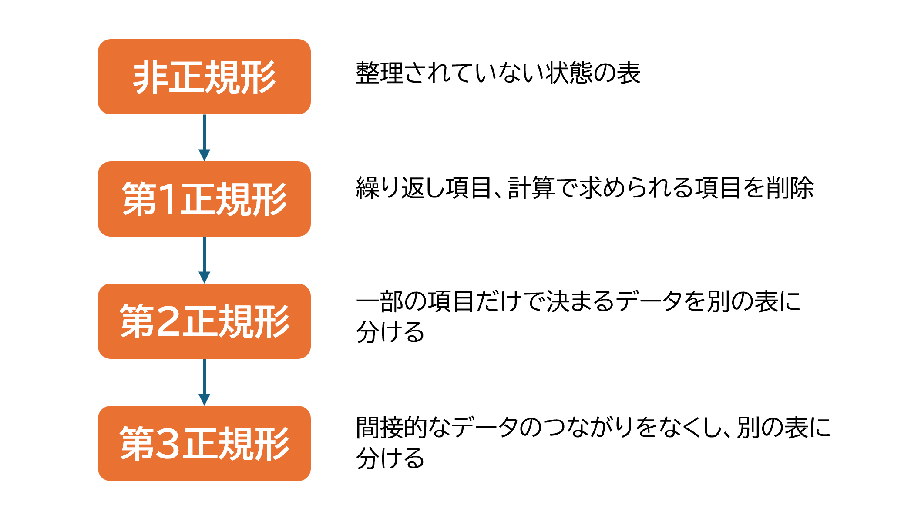

## 6.3 Ruby on Rails：データベース設計

## 目次

- [データベース設計とは](#データベース設計とは)
- [データベース設計を行う](#データベース設計を行う)
- [データベースの基本構成](#データベースの基本構成)
- [データベース設計の重要性](#データベース設計の重要性)
- [繰り返し項目を削除する](#繰り返し項目を削除する)
   - [正規化](#正規化)
   - [正規化のプロセス](#正規化のプロセス)
- [メモアプリのデータベース設計](#メモアプリのデータベース設計)
- [ポイント](#ポイント)

ここからは、サイトアプリケーションの開発を例に各実装を解説していきます。
まず、この章では、メモアプリを例にのデータベース設計の解説を行います。
設計のために、データベース設計の基礎、多対多の関連付けについて簡単に説明します。

## データベース設計とは

データベースは、アプリケーションが正しく動作するための「土台」の役割を果たします。  
アプリケーションを開発する際に、「どんなデータを、どのように保存すればよいか」を事前に計画しないと、以下のような問題が発生する可能性があります：

- データを処理するのに無駄な時間がかかる  
- 必要な機能を実現できなくなる  
- データベース全体を作り直す必要が出てくる  

 

例えば、データベース設計を「家づくり」に例えるとイメージしやすいです。  
家を建てるとき、間取りや配管、水道、電気の位置を考えずに工事を始めたらどうなるでしょう？  
建てた後で「キッチンが遠すぎる」「コンセントが全然足りない」「水道が使えない！」といった問題が出て、最悪の場合、家を壊して作り直さなければならなくなるかもしれません。

データベース設計でも同じことが言えます。設計を怠ると、必要な機能が追加できなかったり、複雑なデータ処理が必要になったりして、大きなコストが発生してしまいます。さらに、使い勝手の悪いアプリケーションになってしまうこともあります。

そのため、アプリケーションを作る初期段階で、必要なデータを整理し、それをどのような形で保存するかを慎重に検討する必要があります。このように、データベースの構造を事前に計画する作業を「データベース設計（database design）」と呼びます。

### データベース設計が重要な理由

データベース設計は、アプリケーションを建てる「設計図」に相当します。  
適切な設計を行うことで、以下のようなメリットが得られます：

 1. 効率的なデータ管理
無駄なデータの重複を避け、スムーズな処理を実現します。

 1. 将来的な変更や拡張への対応
新しい機能を追加する際も、スムーズに対応できます。

 1. アプリケーションのパフォーマンス向上
適切に設計されたデータベースは、処理速度の向上にも寄与します。

データベース設計は、アプリケーションの土台を構築する重要なプロセスです。  
最初にしっかりと設計することで、長く安心して使える「住み心地の良い家（アプリケーション）」を作ることができます。

## データベース設計を行う

それでは、実際にデータベース設計のプロセスを見ていきましょう。

今回は、「メモアプリ」を例にして、データベース設計の手順をご紹介します。以下の手順に従って設計を進めていきます。

### データベース設計の手順

1. **必要なデータ項目をまとめる**: 各画面で必要な情報をリストアップします。
2. **カラム名を決める**: データ項目に対応するカラム名を決定します。
3. **「列の繰り返し項目」を削除する**: 同じ種類のデータが複数列に分かれる場合、それらを1つの列に統合します。
4. **「行の繰り返し項目」を削除する**: 繰り返しデータが複数行に分かれる場合、別のテーブルに分割して管理します。
5. **テーブルにIDカラムを追加する**: 各テーブルに一意の識別子（IDカラム）を設けます。
6. **共通利用のデータをテーブル化する**: 他のテーブルで共通して使用されるデータを独立したテーブルにまとめます。
7. **テーブルの構造を考える**: テーブル間の関係性や参照方法を設計します。

## データベースの基本構成

データベースは、「テーブル」と「カラム」で構成されています。
データベース設計では、まず、「どのようなテーブルが必要になるか」を考えることが出発点です。

例えば、「メモアプリ」では、以下のようなテーブルが必要になるかもしれません:
- ユーザー情報を保存するテーブル
- 投稿内容を保存するテーブル
- コメントやレビューを保存するテーブル

### テーブル間の関係性
テーブルは、アプリケーション内でデータの関連性を持っています。  
例えば、以下のような関係性が考えられます:
- **ユーザーと投稿**: ユーザーが投稿を作成する（一対多の関係）。
- **投稿とコメント**: 各投稿に複数のコメントが付く（一対多の関係）。
- **投稿と飲食店情報**: 各投稿が特定の飲食店に紐付く（一対一または一対多の関係）。

これらの関係性を明確にすることで、テーブル設計がスムーズに進みます。

## 繰り返し項目を削除する

### 正規化
正規化（Normalization）は、リレーショナルデータベース（RDBMS）において、データの構造を最適化し、データの冗長性を排除するための手法です。これにより、データの更新異常を防ぎ、データの整合性を保つことができます。以下では、正規化のプロセスを詳しく説明します。

正規化の目的
正規化の主な目的は次の2つです。

- **データの冗長性を排除する**  
重複したデータが存在することで、データの管理が複雑になります。正規化により、冗長なデータを減らし、効率的なデータの管理が可能になります。

- **データの更新異常を防ぎ、整合性を保つ**    
更新異常とは、データを変更する際に不整合が生じることです。正規化により、データの更新時に不整合が発生しないようにします。

## 正規化のプロセス

 

### 第1正規化（1NF）
- **目的**: 繰り返し項目を排除し、各セルに単一の値を格納。
- **例**: 一つの行に複数の値を持つ「タグ」カラムを別テーブルに分割。

### 第2正規化（2NF）
- **目的**: 主キーの一部にのみ依存する属性を分離。
- **例**: 「カテゴリ名」を「カテゴリID」として別のカテゴリテーブルで管理。

### 第3正規化（3NF）
- **目的**: 推移的関数従属を排除。
- **例**: 「ユーザー名」を「ユーザーID」で管理し、ユーザーテーブルを分離。

### 第4正規化・第5正規化
さらに複雑な整合性を確保。ただし、実務では第3正規化までで十分な場合が多いです。

第1正規化（1NF）
第1正規化では、「繰り返し項目」が存在しないことが求められます。繰り返し項目とは、複数の値を一つのフィールドに格納するようなデータ構造を指します。
## ステップ 1: 初期設計 (非正規形)

以下のような非正規形のテーブルを考えます。

### 履修科目テーブル (非正規形)
学生ID  | 学生名   | 科目1ID | 科目1名   | 科目1教員ID | 科目1教師名   | 科目2ID | 科目2名   | 科目2教員ID | 科目2教師名
--------|----------|---------|-----------|-------------|---------------|---------|-----------|-------------|---------------
A101    | 山田太郎 | 1001    | 数学      | 2001        | 田中先生      | 1002    | 英語      | 2002        | 佐藤先生
B102    | 鈴木花子 | 1001    | 数学      | 2001        | 田中先生      | 1003    | 理科      | 2003        | 高橋先生
C103    | 高橋次郎 | 1002    | 英語      | 2002        | 佐藤先生      | 1003    | 理科      | 2003        | 高橋先生

 

履修科目テーブルでは、**1つの学生に対して複数の科目情報が1つのレコード内に繰り返し記録されている状態**になっています。このような構造では、以下の問題が発生します。

- **データの冗長性**: 同じ情報（学生名や教員情報など）が繰り返し記録される。
- **更新・削除の非効率性**: 例えば、教員の名前を変更する場合、複数のレコードを更新する必要がある。
- **検索の複雑化**: 特定の科目を履修している学生を探す際、各列を個別に指定する必要がある。

#### 解決策
繰り返し項目を別のテーブルとして分割し、**「学生」「科目」「履修情報」**のような関連テーブルを作成します。こうすることで、データの整合性を保ち、管理しやすくなります。

## ステップ 2: 第1正規形 (繰り返し項目の排除)

以下は、繰り返し項目を排除した履修科目テーブルの例です。

| 学生ID | 学生名   | 科目ID | 科目名   | 教員ID | 教員名   |
| ------ | -------- | ------ | -------- | ------ | -------- |
| A101   | 山田太郎 | 1001   | 数学     | D201   | 田中先生 |
| A101   | 山田太郎 | 1002   | 英語     | E202   | 佐藤先生 |
| B102   | 鈴木花子 | 1001   | 数学     | D201   | 田中先生 |
| B102   | 鈴木花子 | 1003   | 理科     | F203   | 高橋先生 |
| C103   | 高橋次郎 | 1002   | 英語     | E202   | 佐藤先生 |
| C103   | 高橋次郎 | 1003   | 理科     | F203   | 高橋先生 |

 

### 第一正規化後の状態と問題点

第一正規化では、1つのセルに1つの値しか記録されていない状態が確立されています。この時点では、データが繰り返し項目を持たない形で整理され、整然と管理されています。しかし、次のような問題が残ります。

- **データの冗長性**: 例えば、1人の学生が複数の科目を履修している場合、学生名や教員名が繰り返し記録され、同じ情報が何度もデータベースに保存されることになります。
- **冗長性**: 教員名や科目名などの情報が毎回繰り返されるため、データ量が無駄に増加し、効率的に管理できません。
- **更新や削除の非効率性**: 例えば、教員名が変更された場合、その変更をデータベース内で複数回行う必要があり、手間と時間がかかります。

### 解決策

この問題を解決するためには、繰り返し項目を別のテーブルに分け、関連情報を整理することが必要です。例えば、「学生」「科目」「履修情報」のような個別のテーブルを作成し、各テーブル間で適切に関連を持たせることで、冗長性を減らし、データ管理の効率化を図ります。

## ステップ 3: 第2正規形 (部分関数従属の排除)

### 第2正規化（2NF）
第2正規化は、第1正規化を満たした上で、すべての非キー属性が主キーに対して完全関数従属していることを要求します。

#### 関数従属

非正規形から第1正規形の段階まで  
第1正規化により、繰り返し項目を排除し、学生と履修科目を別のテーブルに分割しました。

#### 科目テーブルの分け方

第2正規化では、主キーの一部に依存する非キー属性を別テーブルに移動することで、データの冗長性を排除します。

#### 部分関数従属
履修科目テーブルでは、以下の構造に部分関数従属の問題が存在します：
- 「科目名」と「教員名」は「科目ID」や「教員ID」に依存しており、履修ごとに重複が発生する可能性があります。

#### 学生テーブルの分け方

主キーの一部に依存する非キー属性を別テーブルに移動します。この例では、「科目名」と「教員名」が「科目ID」や「教員ID」に依存していますが、それぞれの情報をマスタテーブルとして分けることで対応します。

#### 完全関数従属

### 履修テーブル
| 学生ID | 科目ID | 教員ID |
| ------ | ------ | ------ |
| A101   | 1001   | D201   |
| A101   | 1002   | E202   |
| B102   | 1001   | D201   |
| B102   | 1003   | F203   |
| C103   | 1002   | E202   |
| C103   | 1003   | F203   |

### 学生テーブル
| 学生ID | 学生名   |
| ------ | -------- |
| A101   | 山田太郎 |
| B102   | 鈴木花子 |
| C103   | 高橋次郎 |

### 科目テーブル
| 科目ID | 科目名 |
| ------ | ------ |
| 1001   | 数学   |
| 1002   | 英語   |
| 1003   | 理科   |

### 教員テーブル
| 教員ID | 教員名   |
| ------ | -------- |
| D201   | 田中先生 |
| E202   | 佐藤先生 |
| F203   | 高橋先生 |

---

## ステップ 4: 第3正規形 (推移的関数従属の排除)

第3正規化（3NF）
第3正規化では、推移的関数従属を排除します。推移的関数従属とは、あるフィールドが他のフィールドに間接的に依存している場合を指します。

例:
貸出テーブルにおいて、貸出番号が決まると利用者コードが決まり、さらに利用者コードが決まると利用者名が決まるという依存関係が存在します。このような推移的関数従属を解消するために、利用者マスターテーブルを作成し、利用者コードと利用者名を分離します。

 

推移的関数従属を排除するため、ユーザー情報を別テーブルに移動します。

### メモテーブル
| メモID | ユーザーID | メモ内容     | 作成日     | カテゴリID |
| ------ | ---------- | ------------ | ---------- | ---------- |
| 1      | 1          | 会議の議事録 | 2025/01/01 | 1          |
| 2      | 2          | 買い物リスト | 2025/01/02 | 2          |
| 3      | 1          | 旅行計画     | 2025/01/03 | 2          |

### ユーザーテーブル
| ユーザーID | ユーザー名 |
| ---------- | ---------- |
| 1          | 山田太郎   |
| 2          | 鈴木花子   |

### カテゴリテーブル
| カテゴリID | カテゴリ名   |
| ---------- | ------------ |
| 1          | 仕事         |
| 2          | プライベート |

### タグテーブル
| タグID | メモID | タグ名 |
| ------ | ------ | ------ |
| 1      | 1      | 会議   |
| 2      | 1      | 議事録 |
| 3      | 2      | 買い物 |
| 4      | 2      | 食品   |
| 5      | 3      | 旅行   |
| 6      | 3      | 予定   |

 

---

第4正規化（4NF）および第5正規化（5NF）
第4正規化および第5正規化では、さらに複雑なデータの整合性を確保しますが、実際には第3正規化まで行えば多くの場合十分です。

このように、正規化を行うことで、データの一貫性を保ちつつ、冗長性を削減することができます。

# メモアプリのデータベース設計

メモアプリでは、ユーザーが複数のメモを持ち、それぞれのメモにはカテゴリやタグを設定できるとします。また、メモの内容や作成日なども記録します。

## 最終形のデータベース設計  

## データ型を決める  

まず、データ型について簡単に説明します。データ型は、データベースにどのようなデータを保存するかを決める重要な要素です。以下は主なデータ型の例です。

1. **文字列型 (String)**: 名前やタイトルなどの短い文字列を保存します。  
   例: ユーザー名やカテゴリ名  
   - データベースの型: `string`
2. **整数型 (Integer)**: 数字を保存します。  
   例: IDや数量  
   - データベースの型: `integer`
3. **日付型 (Date/Datetime)**: 日付や日時を保存します。  
   例: メモの作成日  
   - データベースの型: `date` または `datetime`
4. **テキスト型 (Text)**: 長い文章を保存します。  
   例: メモの内容  
   - データベースの型: `text`
5. **真偽値型 (Boolean)**: 「はい」か「いいえ」のデータを保存します。  
   例: タスクが完了したかどうか  
   - データベースの型: `boolean`

---

## フィールド名を決める  

データベースのフィールド名（列名）は、データの内容がわかりやすいように名前を付けます。一般的に **スネークケース**（単語の間をアンダースコア _ で区切る）を使います。

---

## メモアプリのデータベース設計  

以下は、メモアプリのデータベースを設計した例です。

### 1. メモテーブル  
メモの基本情報を保存するテーブルです。  

| フィールド名   | データ型 | 意味             | 備考         |
| -------------- | -------- | ---------------- | ------------ |
| `memo_id`      | Integer  | メモの識別ID     | 主キー       |
| `user_name`    | String   | ユーザー名       |              |
| `memo_content` | Text     | メモの内容       |              |
| `created_at`   | Datetime | メモの作成日時   | 自動生成可能 |
| `category_id`  | Integer  | カテゴリの識別ID | 外部キー     |

---

### 2. カテゴリテーブル  
メモに関連付けられるカテゴリを保存するテーブルです。

| フィールド名    | データ型 | 意味             | 備考   |
| --------------- | -------- | ---------------- | ------ |
| `category_id`   | Integer  | カテゴリの識別ID | 主キー |
| `category_name` | String   | カテゴリ名       |        |

---

### 3. タグテーブル  
メモに設定されるタグを保存するテーブルです。

| フィールド名 | データ型 | 意味         | 備考     |
| ------------ | -------- | ------------ | -------- |
| `tag_id`     | Integer  | タグの識別ID | 主キー   |
| `memo_id`    | Integer  | メモの識別ID | 外部キー |
| `tag_name`   | String   | タグ名       |          |

---

### テーブルのデータ例  

#### メモテーブル  
| memo_id | user_name | memo_content | created_at       | category_id |
| ------- | --------- | ------------ | ---------------- | ----------- |
| 1       | 山田太郎  | 会議の議事録 | 2025-01-01 10:00 | 1           |
| 2       | 鈴木花子  | 買い物リスト | 2025-01-02 14:30 | 2           |
| 3       | 山田太郎  | 旅行計画     | 2025-01-03 09:15 | 2           |

#### カテゴリテーブル  
| category_id | category_name |
| ----------- | ------------- |
| 1           | 仕事          |
| 2           | プライベート  |

#### タグテーブル  
| tag_id | memo_id | tag_name |
| ------ | ------- | -------- |
| 1      | 1       | 会議     |
| 2      | 1       | 議事録   |
| 3      | 2       | 買い物   |
| 4      | 2       | 食品     |
| 5      | 3       | 旅行     |
| 6      | 3       | 計画     |

---

## ポイント  
1. **使いやすい名前を考える**  
   フィールド名やテーブル名は、データの意味が直感的にわかるようにします。  
2. **スネークケースを使う**  
   名前の統一感を持たせ、コードが読みやすくなります。  
3. **データの関係性を明確にする**  
   「メモ」と「カテゴリ」や「タグ」のように、関連するデータは外部キーを使って結びつけます。

---
