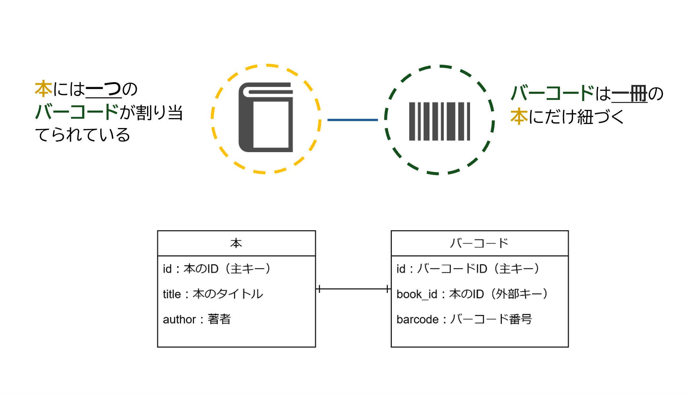
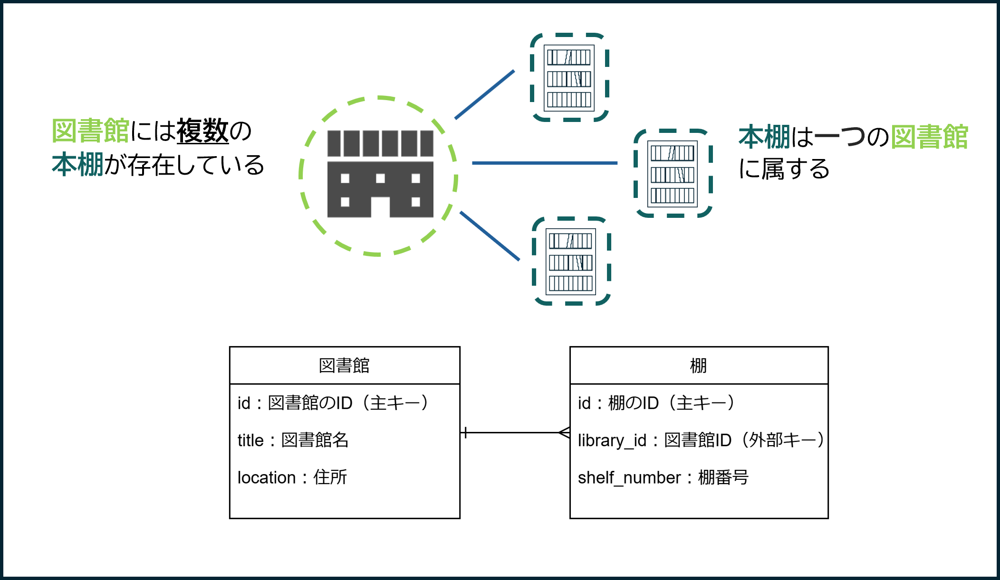
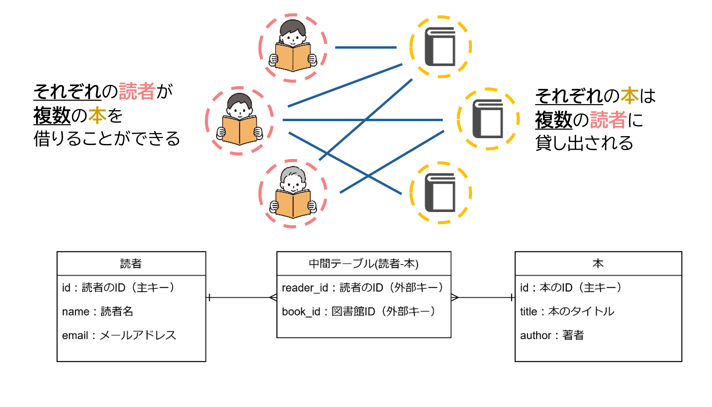

# 6 Ruby on Rails：データベース基礎

## 目次

  - [多対多の関連付け](#多対多の関連付け)
    - [(1) 1対1の関連付け](#1-1対1の関連付け)
    - [(2) 多対1の関連付け](#2-多対1の関連付け)
    - [(3) 多対多の関連付け](#3-多対多の関連付け)
    - [(4) 中間テーブルの役割と必要性](#4-中間テーブルの役割と必要性)
    - [実装例: Railsでの関連付け](#実装例-railsでの関連付け)

## 多対多の関連付け  

データベースの設計において、「1対1」「多対1」「多対多」という3つの主要な関連付けがあります。これらの関連付けは、データベース内のテーブル間でどのようにデータが結びつくかを表します。今回はそれぞれの特徴と「多対多」の関係を初心者にもわかりやすく解説します。  

---

## (1) 1対1の関連付け

### 特徴
一方のテーブルの1つのレコードが、もう一方のテーブルの1つのレコードに関連付けられる関係です。

    

<br>

### 例
本とバーコードの関係。1つの本には1つのバーコードが関連付けられ、各バーコードは特定の本に紐づいています。  
バーコードは一意で、特定の本にのみ関連付けられ、他の本とは共有されません。逆に、バーコードも一つの本にのみ関連しており、他の本に使用されることはありません。

- 本テーブル (books): 本の情報を保存  
- バーコードテーブル (barcodes): バーコードの情報を保存  

| 図書テーブル  | バーコードテーブル   |
| ------------- | -------------------- |
| id: 本のID  | id: バーコードID     |
| title: 本のタイトル | book_id: 本のID      |
| author: 著者  | barcode: バーコード番号 |

### 実際の設計
本テーブルにバーコードIDを外部キーとして追加し、各本に1つのバーコードを関連付けます。これにより、本とバーコードの1対1の関係が確立します。

---

## (2) 1対多の関連付け

### 特徴
一方のテーブルの1つのレコードが、もう一方のテーブルの複数のレコードに関連付けられる関係です。

    

<br>

### 例
図書館と棚の関係。1つの図書館には複数の棚が存在し、それぞれの棚は1つの図書館に属します。

- 図書館テーブル (libraries): 図書館の情報を保存  
- 棚テーブル (shelves): 棚の情報を保存  

| 図書館テーブル  | 棚テーブル       |
| --------------- | --------------- |
| id: 図書館のID  | id: 棚のID      |
| name: 図書館名  | shelf_number: 棚番号 |
| location: 住所  | library_id: 図書館ID |

### 実際の設計
棚テーブルに`library_id`という外部キーを追加して、どの棚がどの図書館に属しているかを管理します。これにより、1つの図書館に複数の棚が関連付けられます。

---

## (3) 多対多の関連付け

### 特徴
多対多の関連付けでは、一方のテーブルの複数のレコードが、もう一方のテーブルの複数のレコードと関連付けられる関係が成立します。この関係を管理するためには、「中間テーブル」という特別なテーブルを用意する必要があります。

多対多の関係の重要なポイントは、1つのレコードが複数のレコードに関連し、逆にもう一方のレコードも複数のレコードに関連するということです。この場合、データを効率的に管理するために、中間テーブルを使って両方のテーブルの関連を管理します。

    

<br>

### 例
図書館と読者、本の関係を例に見てみましょう。図書館では複数の読者が複数の本を借りることができ、1冊の本にも複数の読者が借りていることがあります。ここでの「読者」と「本」は、まさに多対多の関係です。

- **読者テーブル (readers)**: 読者の情報を保存  
- **読者-本中間テーブル (reader_books)**: 読者と本の関連を保存  
- **本テーブル (books)**: 本の情報を保存  

| 読者テーブル     | 読者-本中間テーブル  | 本テーブル         |
| ---------------- | -------------------- | ------------------ |
| id: 読者のID     | reader_id: 読者ID    | id: 本のID         |
| name: 読者名     | book_id: 本ID        | title: 本のタイトル |
| email: メールアドレス |                    | author: 著者      |


### 実際の設計
「読者-本中間テーブル」に、`reader_id`と`book_id`を外部キーとして持たせます。この中間テーブルは、どの読者がどの本を借りているか、またどの本がどの読者に借りられているかを管理する役割を担います。これにより、読者と本の間で多対多の関係が実現され、効率的なデータ管理が可能になります。

例えば、以下のようなデータがあったとします。

- 読者テーブルには、読者ID 1が「山田太郎」、読者ID 2が「鈴木花子」、読者ID 3が「高橋一郎」といった情報が記録されています。
- 本テーブルには、本ID 1が「Ruby入門」、本ID 2が「Railsガイド」といった情報が記録されています。
- 読者-本中間テーブルには、読者ID 1が本ID 1を借りており、読者ID 2が本ID 2を借りているという情報が保存されます。

このようにして、複数の読者と複数の本の間で効率的に関係を管理することができます。

---

## (4) 中間テーブルの役割と必要性

多対多の関係を扱うためには、直接テーブル間で関連を定義することができません。そのため、「中間テーブル」を使用して、2つのテーブル間の関連を管理します。中間テーブルは、両テーブル間の関係を表現するための橋渡し役を担います。

### 例: 図書館と本の貸し出し関係

- **読者は複数の本を借りることができます**。
- **1冊の本には複数の読者が借りている場合があります**。

このような多対多の関係を中間テーブルを使って管理することが重要です。

#### 中間テーブルを使用しない場合の問題点
もし中間テーブルを使わずに多対多の関係を管理しようとすると、次のような問題が生じます。

- 各本に借りている読者IDをカラムに追加すると、カラム数が増えていき、管理が複雑になります。また、空白の値（NULL値）が増える可能性もあります。
- 新しい本や読者を追加するたびに、テーブル構造を変更する必要があり、データベース設計が不安定になります。

### 中間テーブルを導入した場合

中間テーブルを使うことで、これらの問題を回避し、柔軟で効率的に多対多の関係を管理できます。次のように3つのテーブルを作成します。

1. **読者テーブル (readers)**: 読者の情報を保存  
2. **本テーブル (books)**: 本の情報を保存  
3. **中間テーブル (reader_books)**: 読者と本の関係を保存

#### 読者テーブル

| id  | 読者名   |
| --- | -------- |
| 1   | 山田太郎 |
| 2   | 鈴木花子 |
| 3   | 高橋一郎 |

#### 本テーブル

| id  | 本のタイトル   |
| --- | --------------- |
| 1   | Ruby入門        |
| 2   | Railsガイド     |

#### 中間テーブル

| id  | 読者ID | 本ID |
| --- | ------ | ---- |
| 1   | 1      | 1    |
| 2   | 1      | 2    |
| 3   | 2      | 2    |
| 4   | 3      | 1    |

中間テーブルを使用することで、次のような利点があります。

- **柔軟性が向上**: 新しい読者や本を追加しても、テーブルの構造を変更する必要がありません。
- **検索が効率的**: 特定の読者が借りている本や、ある本がどの読者に借りられているかを簡単に検索できます。
- **保守性が向上**: テーブルを柔軟に管理できるため、データベースの保守が容易になります。

中間テーブルを導入することで、データベース設計がシンプルで効率的になり、柔軟性と拡張性も高まります。これが、複雑な多対多の関係を管理するためのベストプラクティスです。

---

### 実装例: Railsでの関連付け  

Railsでは、多対多の関連付けを`has_many :through`を使って簡単に設定できます。  

```ruby
class Student < ApplicationRecord
  has_many :club_students
  has_many :clubs, through: :club_students
end

class Club < ApplicationRecord
  has_many :club_students
  has_many :students, through: :club_students
end

class ClubStudent < ApplicationRecord
  belongs_to :student
  belongs_to :club
end
```

