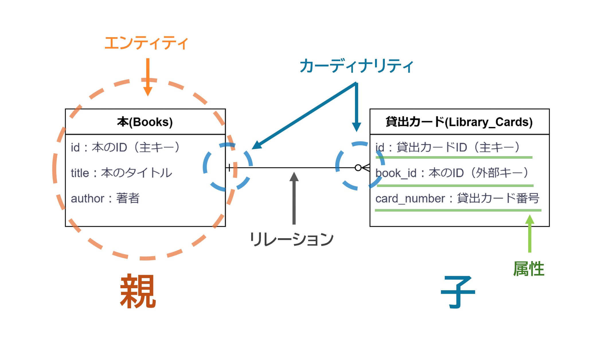
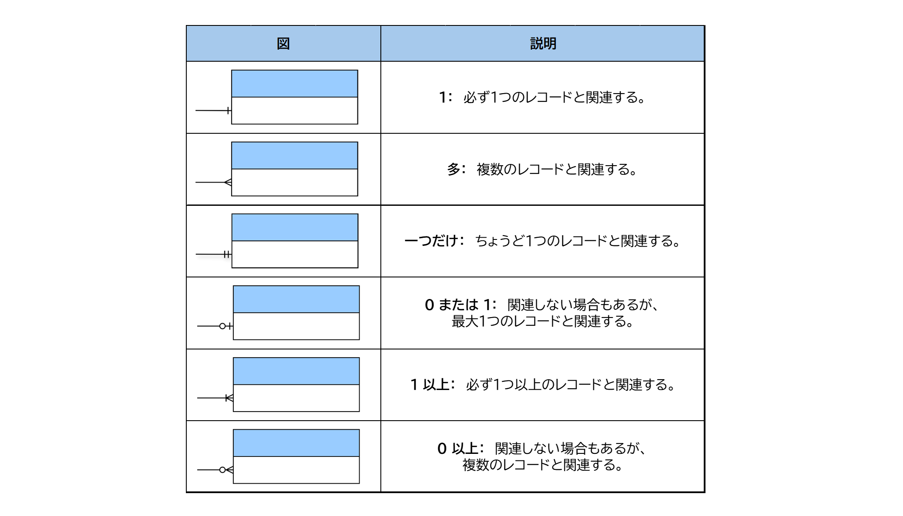
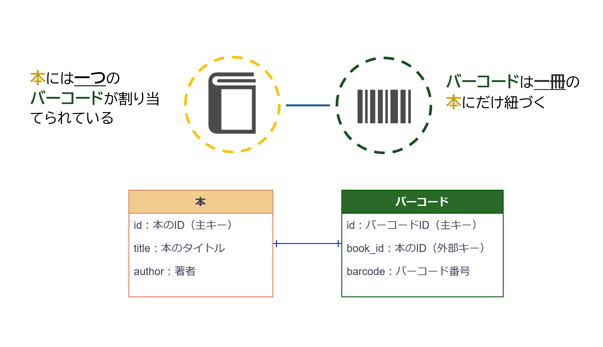
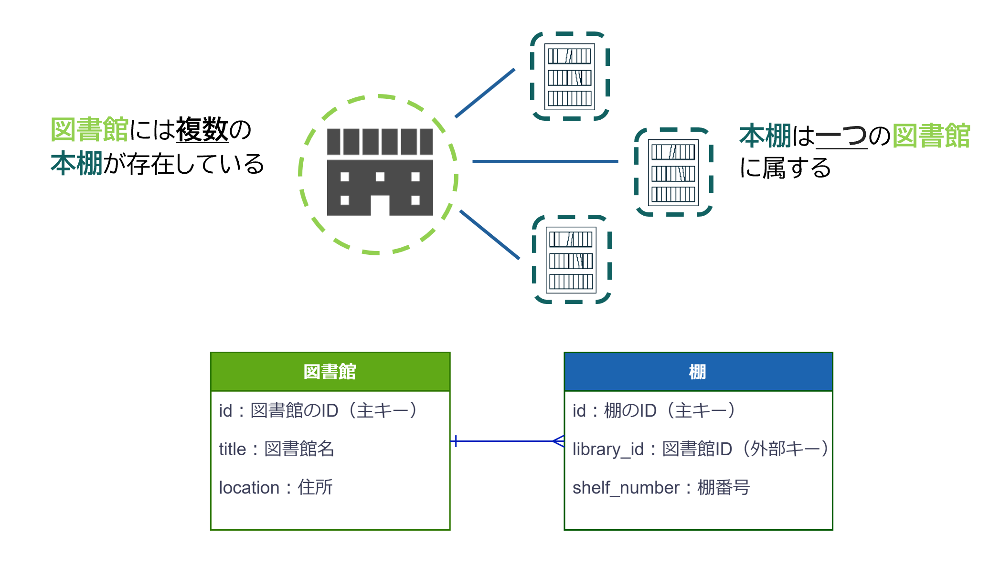
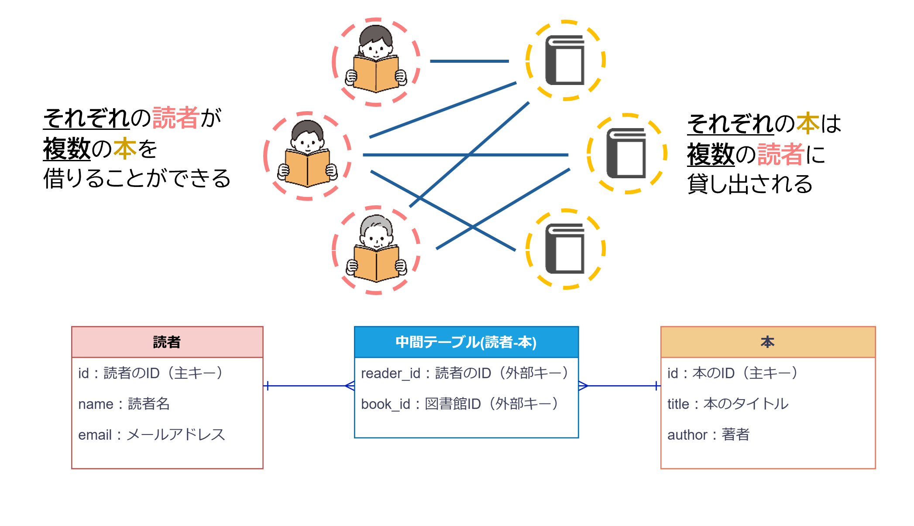

# 6 Ruby on Rails：データベース設計

## 目次

- [ER図](#er図)
  - [ER図の基本概念](#er図の基本概念)
  - [ER図の記法](#er図の記法)
- [多対多の関連付け](#多対多の関連付け)
  - [1対1の関連付け](#1対1の関連付け)
  - [1対多の関連付け](#1対多の関連付け)
  - [多対多の関連付け](#多対多の関連付け-1)
  - [中間テーブルの役割と必要性](#中間テーブルの役割と必要性)
- [実装例: Railsでの関連付け](#実装例-railsでの関連付け)

---

<br>

<!-- このセクションでは、ER図の基本概念とデータの関連付けを学び、具体例を通して理解を深めます。 -->


##  ER図

### 特徴

**ER図（Entity Relationship Diagram）** は、**エンティティ（実体）とそのリレーション（関係）を視覚的に表現した図**です。リレーショナルデータベース設計において、エンティティはテーブル、リレーションはテーブル間の関連を示します。ER図を用いることで、データベース内でどのような情報がどのように結びついているのかを明確にし、全体像を理解しやすくなります。

### 例：図書館のシステムにおける本と貸出カードの関係

図書館では、貸出カードを通じて本の管理を行うことがあります。これをER図で表すと、以下のように考えます。
 
- **本は複数の貸出カードと関連している**  
- **貸出カードは1つの本と紐づいている**

この関係は、ER図で1対多（1:N）および多対多（M:N）と表現されます。




### テーブル設計

| 図書テーブル (books) | 貸出カードテーブル (library_cards) |
| --------------------- | --------------------------------- |
| id: 本のID            | id: 貸出カードID                 |
| title: 本のタイトル  | book_id: 本のID                  |
| author: 著者         | card_number: 貸出カード番号      |


### 主キーと外部キー

データベースのテーブルでは、それぞれのデータを一意に識別するために **主キー（Primary Key, PK）** を設定します。また、他のテーブルと関連付けるために **外部キー（Foreign Key, FK）** を使用します。

- **主キー（PK）**：各レコードを一意に識別するためのカラム。テーブル内で重複することはなく、必ず値が存在する必要があります。
- **外部キー（FK）**：別のテーブルの主キーを参照し、テーブル間の関係を確立するためのカラム。

このER図では、以下のように主キーと外部キーを設定します。

| 図書テーブル (books) | 貸出カードテーブル (library_cards) |
| --------------------- | --------------------------------- |
| **id: 本のID (PK)**  | **id: 貸出カードID (PK)**         |
| title: 本のタイトル  | **book_id: 本のID (FK)**          |
| author: 著者         | card_number: 貸出カード番号      |

この設計では、**貸出カードテーブル（library_cards）の `book_id` が `books` テーブルの `id` を参照する外部キー（FK）** となります。  
このようにすることで、「どの本がどの貸出カードに関連しているか」をデータベース上で管理できます。


---

### ER図の基本概念

#### **エンティティ**

エンティティとは、データベースで管理する対象のことです。通常、これらはテーブルとして表現され、その中で情報が格納されます。

#### **リレーション**

リレーションは、2つ以上のエンティティ間でデータがどのように関連しているかを示します。たとえば、「本」と「貸出カード」などの関連を示します。

#### **属性**

属性は、エンティティが持つ情報を指します。例えば、本を管理するエンティティには「タイトル」や「著者」などの属性が含まれます。


#### **キー**

各エンティティには、1つ以上の属性がキーとして設定されます。主キーは、エンティティ内で一意にレコードを識別するために使用され、外部キーは他のエンティティと関連付けるために用います。


---

#### ポイント  
- **ER図の基本要素**  
  ER図では、**エンティティ（実体）**、**リレーション（関係）**、**属性（情報）** を視覚的に表現し、データベース設計を明確にします。

- **主キー（PK）と外部キー（FK）**  
  各エンティティに設定された**主キー（PK）** は一意にレコードを識別し、**外部キー（FK）** はテーブル間の関連を確立するために使用します。これにより、エンティティ間のリレーションが明確に表現されます。

- **リレーションの種類**  
  リレーションの種類として、**1対1（1:1）**、**1対多（1:N）**、**多対多（M:N）** の関係を適切に設定することが重要です。これにより、エンティティ間の関係が正確に反映され、データの整合性を保つことができます。

- **具体例**  
  「本」と「貸出カード」の関係をER図で表すと、**貸出カードが1:Nの関係で本に関連する**ことが示されます。これにより、どの本がどの貸出カードに関連しているかが明確になります。

- **データベース設計の重要性**  
  ER図を使用することで、データベース内の情報がどのように関連しているかを可視化し、**データの整合性**を保ちながら**効率的な管理**を実現できます。

<br>

---

## ER図の記法

### カーディナリティ

カーディナリティは、エンティティ同士の関連数を示します。代表的な記法には以下の種類があります




<br>

---

## 多対多の関連付け  

データベースの設計において、「1対1」「多対1」「多対多」という3つの主要な関連付けがあります。これらの関連付けは、データベース内のテーブル間でどのようにデータが結びつくかを表します。今回はそれぞれの特徴と「多対多」の関係を解説します。  


## 1対1の関連付け

### 特徴
1対1のリレーションとは、一方のテーブルの1つのレコードが、もう一方のテーブルの1つのレコードにのみ関連付けられる関係です。  
この関係では、データの一意性が保証され、各レコードが1つの対応するレコードを持つことになります。




### 例：図書館における本と貸出カードの関係
図書館では、本の管理のために貸出カードを使用することがあります。

- **1冊の本には1枚の貸出カードが割り当てられる**
- **貸出カードは特定の本と紐づいており、他の本と共有されない**

この関係は、1対1のリレーションの典型例です。  
本と貸出カードは常にペアになっており、1冊の本ごとに1枚の貸出カードが存在します。

### テーブル設計

| 図書テーブル (books) | 貸出カードテーブル (library_cards) |
| --------------------- | --------------------------------- |
| id: 本のID            | id: 貸出カードID                 |
| title: 本のタイトル  | book_id: 本のID                  |
| author: 著者         | card_number: 貸出カード番号      |

---

#### ポイント
- 1対1の関係では、**各レコードが唯一のレコードと結びつく**
- 本と貸出カードのように、**一方のデータが他方のデータと一対一で対応する**ケースに適用される
- 設計時には、外部キー (`book_id`) を貸出カードテーブルに設定し、**1冊の本に対して1つの貸出カードのみが紐づく**ようにする

---

## 1対多の関連付け

### 特徴
1対多のリレーションとは、一方のテーブルの1つのレコードが、もう一方のテーブルの複数のレコードに関連付けられる関係です。  
この関係では、**親テーブル（1側）**に対して、**子テーブル（多側）が複数存在**する形になります。



### 例：図書館と本の関係
図書館には多数の本が保管されています。  
- **1つの図書館には複数の本が存在する**
- **各本は1つの図書館に属する**

この関係は、1対多のリレーションの典型例です。  
図書館ごとに管理される本があり、本ごとにどの図書館に属しているかが決まっています。

### テーブル設計

| 図書館テーブル (libraries) | 本テーブル (books) |
| --------------------------- | ------------------ |
| id: 図書館のID              | id: 本のID         |
| name: 図書館名              | title: 本のタイトル |
| location: 住所              | author: 著者       |
|                             | library_id: 図書館ID |

---

#### ポイント
- **1つの図書館**に対して、**複数の本**が存在する
- 各本は1つの図書館にのみ属する（本は複数の図書館で共有されない）
- 設計時には、本テーブルに外部キー (`library_id`) を設定し、本がどの図書館に属しているかを管理する

---

##  多対多の関連付け

### 特徴
多対多のリレーションとは、**一方のテーブルの複数のレコード**が、**もう一方のテーブルの複数のレコードに関連付けられる**関係です。  
この関係を適切に管理するためには、**「中間テーブル」** を使用する必要があります。

> **メモ：中間テーブル**  
> **中間テーブル**とは、**多対多の関係を管理するための橋渡し役**となる特別なテーブルです。  
> 中間テーブルには、主に以下の役割があります。  
>  
> * **多対多の関係の整理**  
>  例えば、図書館の読者と本の関係では、1人の読者が複数の本を借りることができ、1冊の本も複数の読者に借りられます。  
>  こうした関係を直接管理するのは難しいため、中間テーブルを用いて適切に整理します。  
>  
> * **データの一貫性の維持**  
>  各レコードを一意に管理し、不要な重複やデータの不整合を防ぐことができます。  
>  
> * **検索や管理の効率化**  
>  中間テーブルを活用することで、読者が借りた本や本を借りた読者を簡単に取得でき、データベースの操作が効率的になります。  

<br>



### 例：読者と本の関係
図書館では、**多くの読者が本を借りる**ことができ、**同じ本を複数の読者が借りる**場合もあります。  
この関係は、多対多の典型的な例です。

- **1人の読者は複数の本を借りることができる**
- **1冊の本も複数の読者に貸し出されることがある**

### テーブル設計

| 読者テーブル (readers) | 読者-本中間テーブル (reader_books) | 本テーブル (books) |
| ---------------------- | --------------------------------- | ------------------ |
| id: 読者のID          | id: 中間テーブルのID             | id: 本のID         |
| name: 読者名          | reader_id: 読者ID                | title: 本のタイトル |
| email: メールアドレス | book_id: 本ID                    | author: 著者      |


---

#### ポイント
- **中間テーブル (`reader_books`) に `reader_id` と `book_id` を外部キーとして持たせる**
- **この中間テーブルにより、多対多の関係を適切に管理できる**
- **読者が借りた本や、本を借りた読者を簡単に検索できる**

---

##  中間テーブルの役割と必要性

多対多の関係を扱うためには、**直接テーブル間で関連を定義することができません。** そのため、「中間テーブル」を使用して、2つのテーブル間の関連を管理します。  
中間テーブルは、両テーブル間の関係を表現するための**橋渡し役**を担います。

### 中間テーブルを使用しない場合の問題点
- **各本に借りている読者IDを直接持たせると、カラム数が増えて管理が煩雑になる**
- **読者や本を追加するたびに、テーブル構造を変更する必要がある**
- **検索やデータ管理が非効率になる**

### 中間テーブルを導入した場合
中間テーブルを使うことで、これらの問題を回避し、柔軟で効率的に多対多の関係を管理できます。

#### 中間テーブルのデータ例

| 読者テーブル | 本テーブル | 中間テーブル (reader_books) |
| ----------- | -------- | -------------------------- |
| id: 1, 山田太郎 | id: 1, Ruby入門 | id: 1, reader_id: 1, book_id: 1 |
| id: 2, 鈴木花子 | id: 2, Railsガイド | id: 2, reader_id: 1, book_id: 2 |
| id: 3, 高橋一郎 | | id: 3, reader_id: 2, book_id: 2 |

### 中間テーブルの利点
- **柔軟性が向上**: 読者や本の追加が容易
- **検索が効率的**: 読者が借りた本や、本を借りた読者を簡単に取得できる
- **保守性が向上**: データベース設計がシンプルで拡張しやすい

中間テーブルを導入することで、データベース設計の**効率化**と**柔軟性**を高めることができます。

---

### 実装例: Railsでの関連付け  

Railsでは、多対多の関連付けを`has_many :through`を使って簡単に設定できます。  

```ruby
class Student < ApplicationRecord
  has_many :club_students
  has_many :clubs, through: :club_students
end

class Club < ApplicationRecord
  has_many :club_students
  has_many :students, through: :club_students
end

class ClubStudent < ApplicationRecord
  belongs_to :student
  belongs_to :club
end
```

