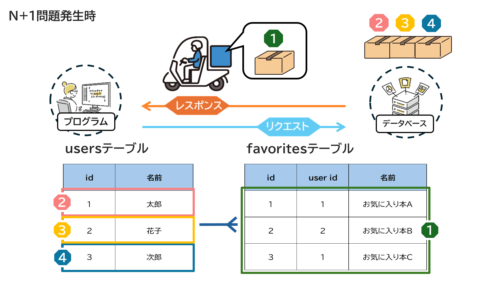
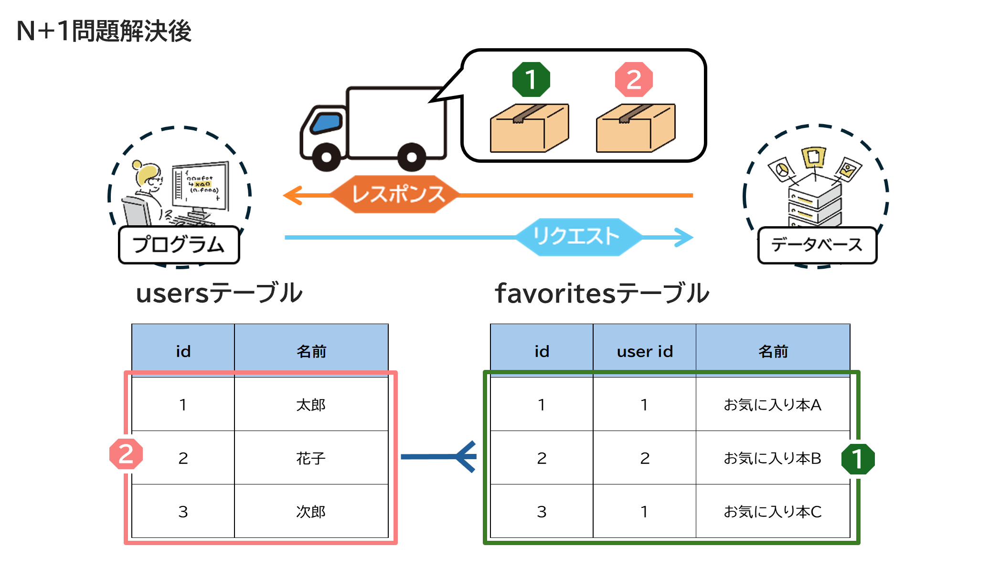

# 6 Ruby on Rails：データベース基礎

## 目次

- [ActiveRecordでの効率的なデータ取得](#activerecordでの効率的なデータ取得)
  - [N+1問題とは](#n1問題とは)
  - [N+1問題が発生するコード](#n1問題が発生するコード)
  - [N+1問題の発生](#n1問題の発生)
  - [「N+1問題」解消方法](#n1問題解消方法)
    - [includesを使用する](#includesを使用する)
    - [preloadを使用する](#preloadを使用する)
    - [eager_loadを使用する](#eager_loadを使用する)
    - [joinsを使用する](#joinsを使用する)
  - [N+1問題の解決例（SQLとRailsの比較）](#n1問題の解決例sqlとrailsの比較)
  - [サブクエリの作り方](#サブクエリの作り方)
- [練習](#練習)

---

## ActiveRecordでの効率的なデータ取得

ここではActiveRecordの応用的な利用方法「N+1問題について」「サブクエリの作り方」について学習します。

### N+1問題とは

一覧画面などに表示するデータを取得するとき、SQLのクエリが「データ量(N) + 1」発行され、データ量が多くなるにつれてパフォーマンスを低下させてしまう問題です。  
1つのクエリでデータを取得する際に、その取得したデータに関連する別のデータを取得するために、複数の追加のクエリが発生することを指します。

例えばデータの数だけ `SELECT` 文を発行すると、1回が1msでも、データの数が増えるとその数だけ `SELECT` 文を発行することになり、パフォーマンスが悪化していきます。



では、N+1問題について具体的なコードを見ながら考えてみましょう。

---

### N+1問題が発生するコード

#### モデルの定義

`User` と `Favorite` のテーブルがあり、ユーザーは複数のお気に入りを登録できる「1対多」の関係を持ちます。

```rb
# app/models/user.rb
class User < ApplicationRecord
  has_many :favorites  # Userは多くのFavoriteを持つ
end
```

```rb
# app/models/favorite.rb
class Favorite < ApplicationRecord
  belongs_to :user  # Favoriteは1つのUserに属する
end
```

#### コントローラーでのデータ取得

```rb
# app/controllers/favorites_controller.rb
class FavoritesController < ApplicationController
  def index
    # FavoriteをID順に取得
    @favorites = Favorite.order(:id)
  end
end
```

#### ビューでのデータ表示

```erb
<!-- app/views/favorites/index.html.erb -->

<h1>お気に入り一覧</h1>
<% @favorites.each do |fav| %>
  <div><%= fav.user.name %></div>  <!-- 各Favoriteに紐づくUserのnameを取得 -->
<% end %>
```

---

### N+1問題の発生

このコードでは、お気に入りの一覧を表示する際に、各 `Favorite` ごとに `User` を取得するため `SELECT` クエリが発行されます。  
例えば、お気に入りのレコードが100件ある場合、`favorites` テーブルの取得で1回、`users` テーブルの取得で100回（合計101回）クエリが発行されてしまいます。

#### 実際のSQLログ（例）

```sh
Favorite Load (0.5ms)  SELECT "favorites".* FROM "favorites" ORDER BY "favorites"."id" ASC
  User Load (0.2ms)  SELECT  "users".* FROM "users" WHERE "users"."id" = ? LIMIT ?  [["id", 1], ["LIMIT", 1]]
  CACHE User Load (0.0ms)  SELECT  "users".* FROM "users" WHERE "users"."id" = ? LIMIT ?  [["id", 2], ["LIMIT", 1]]
  CACHE User Load (0.1ms)  SELECT  "users".* FROM "users" WHERE "users"."id" = ? LIMIT ?  [["id", 3], ["LIMIT", 1]]
  CACHE User Load (0.0ms)  SELECT  "users".* FROM "users" WHERE "users"."id" = ? LIMIT ?  [["id", 4], ["LIMIT", 1]]
```

このように、`User` のデータを取得するために `Favorite` の件数分だけSQLが発行されてしまい、これがN+1問題の原因になります。

---

#### **ポイント**

 **N+1問題とは**  
  - 1回のデータ取得につき関連データを取得する追加クエリ（N回）が発生する問題。  
  - データ量が増えるほどSQLの発行回数が増加し、パフォーマンスが低下する。

 **発生原因**  
  - `each` などで関連オブジェクト（`user.name` など）をループ処理すると、関連するデータごとに `SELECT` クエリが発行される。

 **SQLログの確認**  
  - `SELECT` クエリの発行回数が「1 + N」になっているかどうかを確認する。

 **対策方法（次の章で解説）**  
  - `includes`: 事前に関連データを取得（Eager Loading）
  - `preload`: JOINを使わず関連データを別クエリで取得
  - `eager_load`: `LEFT OUTER JOIN` により一度のクエリで取得
  - `joins`: `INNER JOIN` により関連テーブルを結合（N+1解消にはならないがフィルタリングに有効）

---

次の章では、N+1問題を解決する方法について解説します


### 「N+1問題」解消方法

N+1問題を解消するためには、データベースへのクエリ発行回数を減らし、一括でデータを取得する方法を採用することが重要です。



<br>

解決方法としては、以下の4つのメソッドを使用するのが一般的です。これらのメソッドは組み合わせて使うこともできます。

#### includesを使用する

`includes` メソッドを使うことで、関連するデータを事前に取得し、個別のクエリ発行を防ぐことができます。

```rb
def index
  @favorites = Favorite.order(:id).includes(:user)
end
```

これにより、最初のクエリで `favorites` を取得し、次のクエリで関連する `users` をまとめて取得します。

<details>
  <summary>SQLログ</summary>
  
  ```sh
  Favorite Load (1.0ms)  SELECT "favorites".* FROM "favorites" ORDER BY "favorites"."id" ASC
  User Load (0.1ms)  SELECT "users".* FROM "users" WHERE "users"."id" IN (?, ?, ?)  # 一括取得
  ```
</details>

#### preloadを使用する

`preload` は `includes` に似ていますが、JOINを使用せずに、関連データを別クエリで取得します。

```rb
def index
  @favorites = Favorite.preload(:user).order(:id)
end
```

<details>
  <summary>SQLログ</summary>

  ```sh
  Favorite Load (11.2ms)  SELECT "favorites".* FROM "favorites" ORDER BY "favorites"."id" ASC
  User Load (0.3ms)  SELECT "users".* FROM "users" WHERE "users"."id" IN (?, ?, ?)
  ```
</details>


#### eager_loadを使用する

`eager_load` は `LEFT OUTER JOIN` を使用し、一度のクエリで全データを取得します。

```rb
def index
  @favorites = Favorite.eager_load(:user).order(:id)
end
```

<details>
  <summary>SQL</summary>

  ```sql
  SELECT
      "favorites".*, "users".*
  FROM 
      "favorites" 
      LEFT OUTER JOIN "users" ON "users"."id" = "favorites"."user_id" 
  ORDER BY 
      "favorites"."id" ASC;
  ```
</details>


#### joinsを使用する

`joins` は `INNER JOIN` を行います。N+1問題の解消には直接関与しませんが、フィルタリングに有効です。

```rb
def index
  @favorites = Favorite.joins(:user).where(users: {id: 1})
end
```
<details>
  <summary>SQLログ</summary>
  
  ```sh
  Favorite Load (0.2ms)  SELECT "favorites".* FROM "favorites" INNER JOIN "users" ON "users"."id" = "favorites"."user_id" WHERE "users"."id" = ?
  ```
</details>


### N+1問題の解決例（SQLとRailsの比較）

#### 例: ユーザーごとの投稿を取得する

**N+1問題が発生するケース**

```rb
def index
  @users = User.all
  @users.each do |user|
    puts user.posts.count  # 各ユーザーごとにクエリ発行
  end
end
```

<details>
  <summary>SQL</summary>

  ```sql
  SELECT * FROM users;
  SELECT COUNT(*) FROM posts WHERE user_id = 1;
  SELECT COUNT(*) FROM posts WHERE user_id = 2;
  SELECT COUNT(*) FROM posts WHERE user_id = 3;
  ```
</details>

<br>

**解決策: includesを使用する**

```rb
def index
  @users = User.includes(:posts)
  @users.each do |user|
    puts user.posts.size  # 事前に取得したデータを利用
  end
end
```

<details>
  <summary>SQL</summary>

  ```sql
  SELECT * FROM users;
  SELECT * FROM posts WHERE user_id IN (1, 2, 3);
  ```
</details>  

<br>

`includes` を使用することで、ユーザーごとの `posts` データを一括取得し、N+1問題を解消できます。

### サブクエリの作り方

サブクエリを使用すると、特定の条件に基づいたデータ取得を効率化できます。

```sql
SELECT name FROM users WHERE id IN (
    SELECT user_id FROM orders WHERE total_amount > 1000
);
```

**Railsで書く場合**

```rb
User.where(id: Order.where("total_amount > ?", 1000).select(:user_id))
```

---

#### **ポイント**

 **発生原因**
- `each` などで関連オブジェクト（`user.name` など）をループ処理すると、関連するデータごとに `SELECT` クエリが発行される。

 **解決方法**
- **`includes`**: 事前に関連データを取得（Eager Loading）
- **`preload`**: JOINを使わず関連データを別クエリで取得
- **`eager_load`**: `LEFT OUTER JOIN` により一度のクエリで取得
- **`joins`**: `INNER JOIN` により関連テーブルを結合（N+1解消にはならないがフィルタリングに有効）

---

### 練習

railsで以下の要件をもつshop_appという名前のアプリケーションを作成しましょう。
- 以下のような店舗テーブルと商品テーブルを持つ。

`Shop: 店舗テーブル`

| field名 | 名称 | 型 |
|---|---|---|
| id | ID | integer |
| name | 店舗名 | string |

`Products: 商品テーブル`

| field名 | 名称 | 型 |
|---|---|---|
| id | ID | integer |
| shop_id | 店舗ID | integer |
| name | 商品名 | string |

- 初期データとして商品数が10未満、10以上の店舗を持つ。
- /shops/indexにアクセスした際に商品数が10以上の店舗を一覧で表示する。

####  解答(練習)

```sh
$ rails new shop_app
$ cd shop_app
$ rails g model Shop name:string
$ rails g model Product shop:references name:string
$ rails db:migrate
$ rails g controller Shops index
```

```rb
# app/models/shop.rb

Class Shop <ApplicationRecord
  has_many :products
end
```

```rb
# app/models/product.rb

Class Product < ApplicationRecord
  belongs_to :shop
end
```

```rb
# app/views/shop/index.html.erb

<h1>商品数10以上の店舗一覧</h1>
  <% @shops.each do |shop| %>
    <div>・店舗名：<%= shop.name %>　商品数：<%= shop.products.count %></div>
  <% end %>
```

```rb
# app/controller/shops_controller.rb

class ShopsController < ApplicationController
  def index
    @shops = Shop.joins(:products)
                 .group('shops.id')
                 .having('COUNT(products.id) >= 10')
  end
end
```

```rb
# /db/seeds.rb

・
・
# 店舗を作成
5.times do |i|
    shop = Shop.create(name: "店舗#{i + 1}")
  
    # 商品を作成
    (i + 8).times do |j|
      shop.products.create(name: "商品#{j + 1}")
    end
end
```
