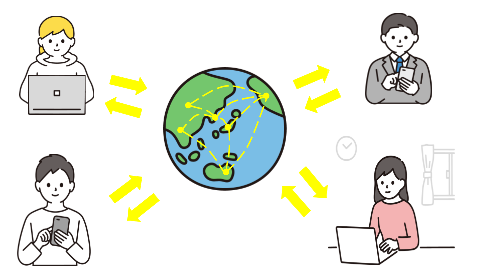
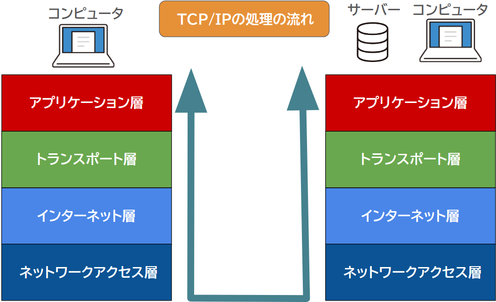
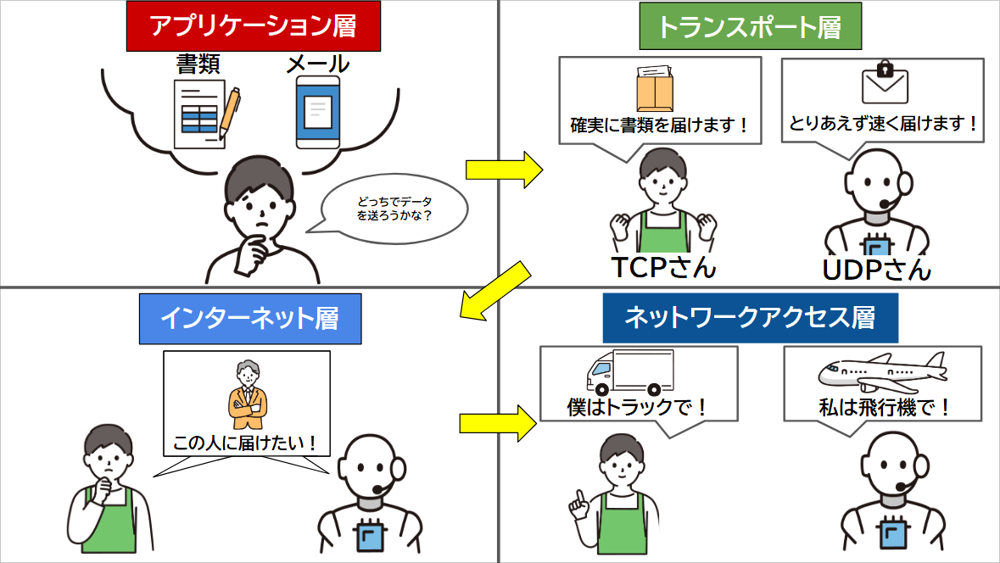
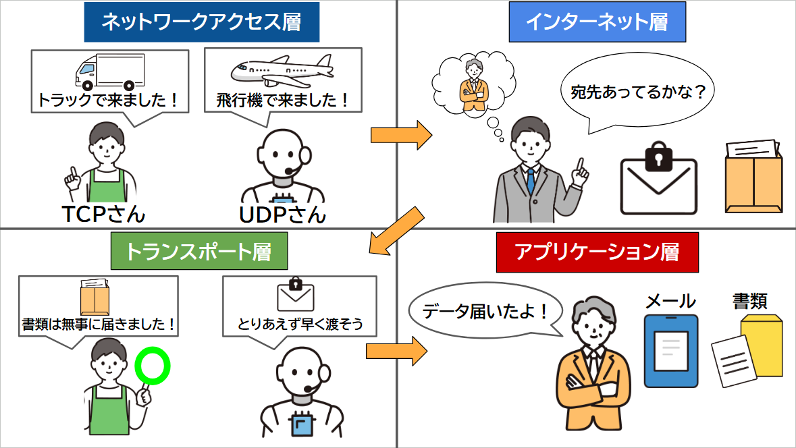

## 11 Ruby on Rails：Webシステム概念

## 目次

- [Webシステムの基本的な知識](#Webシステムの基本的な知識)  
  - [Webシステムとは？](#Webシステムとは？)
  - [サーバーとクライアントの関係](#サーバーとクライアントの関係)
  - [インターネットの概要](#インターネット概要)
  - [プロトコルとは？](#プロトコルとは)
  - [よく使用されるプロトコル](#よく使用されるプロトコル)

## Webシステムの基本的な知識

### Webシステムとは？

**インターネット**を使って、**Webブラウザ**（例えば、Google ChromeやSafariなど）で利用できるシステムとサービスやアプリケーションの事です。インターネットに接続できる機器とWebブラウザがあれば、どこからでもアクセスできます。  

Webシステムには、大きく分けて**Webサイト**と**Webアプリケーション**があります。

   * **Webサイト**   
      * 基本的に、ページを閲覧することが中心です。  
      * 情報提供を主な目的とするもので、例えば企業や個人のホームページ、ニュースサイト、ブログ、ウィキペディアなどがあります。

   * **Webアプリケーション**  
      * ユーザーが操作を行い、特定の機能を使うことができるシステムです。  
      * 例えば、オンラインショッピングサイトやSNS、Google検索などがこれに当たります。
  
これらはすべて、インターネットを通じて利用できるシステムです。

 

***

### サーバーとクライアントの関係
Webシステムでは、**サーバー**と**クライアント**という2つの重要な役割が存在します。

* **サーバー**  

  * **サーバー**とは、**Webシステムでデータを提供する役割を担うコンピュータ**です。  

  * インターネットを通じて、ユーザーが依頼（**リクエスト**）したWebページやアプリケーションの**データ、画像、動画**などを返します（**レスポンス**）。  
  
  * Webサーバーに保存されたWebページをリクエストすると、ページの内容が私たちユーザーに送られます。

* **クライアント**

  * **クライアント**とは、**情報を要求する側であり、私たちユーザー**です。  
  
  * Webブラウザ（Chrome、Safariなど）を使用して、Webサーバーに「**このページを見せてください**」とリクエストを送り、サーバーから返ってきたデータを表示します。  
  
  * クライアントの役割は、サーバーからの情報を受け取り、それを画面に表示したり、ユーザーの入力に基づいてサーバーに再度リクエストを送ったりすることです。

Webシステムは、サーバーがデータを渡し、クライアントがそれをリクエストして表示することで、互いに連携して動きます。

 

***

### インターネット概要

* **インターネット**  

  * **インターネット**とは**TCP/IP**（プロトコル）などを使用して、コンピュータやスマートフォンなどのネットワーク機能を持つ電子機器が繋がるネットワークです。  
     > メモ：基本的には、インターネット上で情報をやり取りするための仕組みとして、**TCP/IP**という通信のルールが使われています。詳しくは後ほど解説します。

   * インターネットに接続することで、遠く離れた場所にある機器やサービスとも接続をすることができます。これは個人ネットワークではなく、世界中の多数のコンピュータや機器がつながる**大規模なネットワーク**（**The Internet**）だからです。    

#### インターネット上で提供されるサービスのセキュリティ

インターネット上で提供されるサービスには、「アカウントを持たなくても利用できるサービス」と、「アカウントが必要なサービス」があります。
どちらの場合でも、サービス提供者は利用者の**データ**や**サービス**の安全性を守るため、セキュリティ対策を講じる必要があります。

#### セキュリティが不十分な場合に起こりうるリスク

* **アカウントが必要なサービスでは**  
  * ユーザー名やパスワードが不正に取得されると、個人情報や機密情報が**第三者に漏洩するリスク**があります。  

* **アカウントを持たないサービスでは**
  * コンテンツの**改ざんや不正アクセスのリスク**があります。
  * Webページの内容が**第三者によって書き換えられる**ことで、サービスに影響を与える可能性があります。

インターネットは便利で多くの情報を提供してくれますが、その規模が大きいため、セキュリティにも十分な配慮が必要です。

#### セキュリティ対策をしっかり行おう

これらのリスクを防ぐためには、以下の**セキュリティ対策**が必要です。

| セキュリティ対策 | 内容 |
| --- | --- |
| **アクセス制御** | サービスにアクセスできる権限を制限する。 |
| **暗号化** | 通信やデータを暗号化して第三者からの盗聴や改ざんを防ぐ。 |
| **二段階認証（2FA）** | パスワードに加えて、認証アプリやSMSコードを使用し、不正アクセスを防止する。 |
| **セキュリティチェックを定期的に実施** | サービスを使い続ける中で、定期的にセキュリティのチェックを行うことも大切です。 |

インターネットでサービスを安全に提供するためには、これらの**セキュリティ対策**をきちんと実施することが大切です。そして、サービスを提供する側だけでなく、利用者も自分の情報を守る意識を持ち、注意を払うことが重要です。

 

***

### プロトコルとは？

コンピュータやネットワーク機器同士が通信するための「**ルール**」です。  
昔は異なるメーカーの機器同士でデータ交換ができませんでした。しかし、**TCP/IP**が標準になり普及したことで、異なる機器やシステムが問題なく接続できるようになり、大きな開発が可能になりました。また、**プロトコル**は通信の安全性を保つためにも大切です。情報を暗号化したり、認証やアクセス制御を行う際にも、データを守るため重要な役割を果たしています。

プロトコルは様々あり、用途に応じて使い分けられます。  
ここではインターネットでよく使われる**TCP/IP**について見ていきましょう。

### TCP/IPとは？ 

**TCP/IP**とは「**Transmission Control Protocol/Internet Protocol**」の略称です。

**インターネット**や**ローカルネットワーク**でデータ送受信のための基本的なルールです。  
世界で最も使用されているプロトコルの集合体であり、事実上、インターネット通信での**標準の仕組み**となっています。

1. リクエストやデータはアプリケーション層から下へ順に処理をしていきネットワークアクセス層を経て相手に届きます。  
1. レスポンスを返す際も同様の処理の流れを使用し、データはネットワークアクセス層を経て相手に届きます。

* この処理の流れは色々な場面で使用されています。 

  （例）

  1. **Webページを表示するとき**  
    クライアント（ユーザー）が**リクエスト**を送信  → サーバーが受信 → サーバーが**レスポンス**を返す → クライアント（ユーザー）が**レスポンス**を受信し、ページが見られる

  1. **メールを送信するとき**  
    クライアント（ユーザー）がメール（**リクエスト**）を送信 → クライアント（宛先のユーザー）がメール（**レスポンス**）を受信

  1. **サーバー間でやり取りするとき**  
    サーバー1が**リクエスト**を送信する → サーバー2が**リクエスト**を受信 → サーバー2が**レスポンス**を送信 → サーバー1が**レスポンス**を受信

私たちの周りでは、日々TCP/IPを用いて、より複雑で効率的な通信が行われています。

TCP/IPの仕組みは、インターネットを利用するための「**共通のルール**」です。  
異なるコンピュータやスマートフォン、ネットワーク機器が問題なくデータをやり取りできるようにしてくれています。

* **送信側**  

    

* **受信側**  

    

**TCP/IP**は以下の**4つの階層**に役割を分類しており、それぞれが**異なる機能**や**目的**を持っています。

| 層 | 名称 | 役割 | 主な利用例 | プロトコル |
|:----|:--------------------|:-----------------------------------------------------------------------------------------|:------------------------------------------|:-------------------------|
| **4層** | **アプリケーション層** | ユーザーが使う**アプリケーション**が通信するための**ルール**を決めます。 | Webサイト閲覧、メール、ファイル転送など | **HTTP**、**SMTP**、**FTP**、**DNS** |
| **3層** | **トランスポート層**   | アプリケーション層で生成された**データ**が相手に届くように**管理**します。 | TCP/UDP（データを適切なアプリケーションへ振り分け） | **TCP**、**UDP** |
| **2層** | **インターネット層**   | データがどの**経路**を通って送られるかを決め、**目的地**に届くようにします。 | ルーティング、エンドツーエンド通信   | **IP**、**ICMP** |
| **1層** | **ネットワークアクセス層** | データが**物理的**に送られる部分で、**Wi-Fi**や**有線ネットワーク**を使ってデータが伝送されます。 | LAN | **イーサネット**、**Wi-Fi**、**PPP** |
| **1層** | **ネットワークアクセス層** | データが**物理的**に送られる部分で、**Wi-Fi**や**有線ネットワーク**を使ってデータが伝送されます。 | LAN | **イーサネット**、**Wi-Fi**、**PPP** |

**TCP/IP**の各層の役割を紹介します。

***

#### 【4層目】 アプリケーション層
* **アプリケーション層**とは  
   * データの**内容**がどのようなもので、どのように**やり取り**するかが決まります。  

   * 私たちが利用する**アプリケーション**（例：**ウェブブラウザ**や**メール**）でデータを**送受信**する層です。  

* **主なプロトコル**  
   * **HTTP**、**SMTP**、**FTP**、**DNS**など。  

* **処理の流れ**  
   * アプリケーション層では、ユーザーが操作する**アプリケーション**から**データ**が生成されます。  

   * **Webサイト**を表示するために**HTTPプロトコル**が使われ、ユーザーが送信する**メール**は**SMTPプロトコル**を使って送信されます。  

***

#### 【3層目】 トランスポート層

* **トランスポート層**とは  
  * データが**途中で失われたり順番が狂ったりしない**ようにする役割を持っています。  

  * **アプリケーション層**で生成されたデータが**相手に届く**ように管理する層です。  

* **主なプロトコル**  
  * **TCP**、**UDP**。  

* **処理の流れ**  
  * **TCP**  
    * データを**小さく分けて送信**し、受信側で**順番通りに再構成**します。  
    * もし途中でデータが**失われた場合**、再送信を要求して**正確にデータを届けます**。  

  * **UDP**  
    * データを**分けて送信**しますが、**確認や再送は行いません**。  
    * **軽量で高速な通信**が求められる場合に使われます（例：**オンラインゲーム**や**動画ストリーミング**）。  

***

#### 【2層目】 インターネット層

* **インターネット層**とは  
  * 送信元から受信先まで、データがどの**ルーター**を通るかを判断し、**最適なルート**で届けます。  

  * 送られてきたデータが**正しい宛先**かどうかを**確認**します。  

  * データがどの**経路**を通って**目的地**に届けられるかを決める層です。  

* **主なプロトコル**  
  * **IP**、**ICMP**。  

* **処理の流れ**  
  * インターネット層では、データに宛先の**IPアドレス**を付加し、**目的地**に向けて送信されます。  

  * 途中の**ルーター**を通過する際に、データが**最適な経路**を選んで転送されます。  
  
  * **IP**はデータの宛先を基に**経路を決定**し、次のネットワークにデータを送ります。  

  * 受信側では、データに含まれる**IPアドレス**を確認し、自分宛てのデータであることを**確認**します。  

***

#### 【1層目】 ネットワークアクセス層

* **ネットワークアクセス層とは**  
  * データを伝送するための「**道**」や「**電波**」を提供します。  

  * データを実際に**物理的なネットワーク**で送信する層です。  

* **主なプロトコル**  
  * **イーサネット**、**Wi-Fi**、**PPP**。  

* **処理の流れ**  
   * この層では、ネットワークの**物理的なメディア**（**有線**や**無線**）を通じてデータが送信されます。  
     (例えば、**Wi-Fi**で接続されている場合、**無線電波**を使ってデータを送受信します。)  

   * この層では、**ネットワーク内の機器同士**で直接データを送受信し、**通信**を可能にします。  

***

#### ポイント

* **各層の役割分担**  
   **TCP/IP仕組み**の各層は、それぞれ異なる機能を持ち、データが目的地に届くまでに役割を果たしています。  

   * **アプリケーション層**は**データの内容**を決定。  

   * **トランスポート層**はデータが**相手に届く**ように管理。  

   * **インターネット層**は**最適な経路**を選定。  

   * **ネットワークアクセス層**は実際に**物理的な通信**をします。  

* **層ごとのプロトコル**  
   * 各層で使用される**プロトコル**は、データ通信の**信頼性**、**効率性**、**安全性**を確保するために重要です。  
   * **プロトコル**が協力して、ネットワーク通信を支えているかの理解は、仕組みを学ぶ上で非常に有益です。  

* **データ通信の流れ**  
   * データは、**アプリケーション層**から**ネットワークアクセス層**を経て、相手側に届くまで、複数の層を通過します。  
   * それぞれの層が専門的な役割を担いながら協力し、データが**安全かつ効率的**に届けられることを保証します。  

 

**用語解説**

* **ローカルネットワーク**  
   **インターネット**とは違い、**家庭**や**オフィス**などの限られた範囲で使用されるネットワークです。  
   自宅の**Wi-Fi**を使って、**パソコン**や**スマートフォン**、**プリンター**などがつながっている状態です。  

* **ルーター**  
   **ネットワーク同士**を繋げる機器で、データを送り先に適切に届ける役割を担っています。  
   データに宛先となる**IPアドレス**（インターネット層のプロトコル（**IP**））が付けられ、ルーターはそのIPアドレスを基にデータを適切なネットワークに転送し、最終的に目的地に到達するようにします。  

* **SMTP（Simple Mail Transfer Protocol）**  
   **電子メール**を送信するためのプロトコルで、主に**メールサーバ間**でメッセージをやり取りします。  
   ユーザーが送信したメールは、**SMTP**を使って宛先のメールサーバに届けられます。  

* **ICMP（Internet Control Message Protocol）**  
    **ネットワークのエラーチェック**や**診断**を行うための通信プロトコルです。  
    データの送受信時に問題が発生した場合、その**エラー情報**を送信元に通知するために使用されます。  

* **イーサネット（Ethernet）**  
    **コンピュータ**や**ネットワーク機器**を接続するための通信技術で、主に**ローカルエリアネットワーク**（**LAN**）で使用されます。  
    データは**パケット**に分割され、高速に送受信され、家庭やオフィスなどで広く利用されています。  

* **Wi-Fi**  
    **無線**を使って**インターネット**や**ネットワーク**に接続する技術です。  
    **デバイス**は**電波**でルーターと繋がり、インターネット通信が可能になります。家庭や公共の場で広く利用されています。  

* **PPP（Point-to-Point Protocol）**  
    2つの**ネットワーク機器**間でデータ通信を行うプロトコルで、**エラーチェック**や**暗号化**をサポートします。主に専用線接続などで使用されます。  

 

***

### よく使用されるプロトコル

#### HTTPとHTTPSについて

**HTTP** とは「**HyperText Transfer Protocol**」の略称です。  
  
  * 「**HTTP**」は、データを**暗号化せず**にそのまま送受信します。
  
  * WebブラウザとWebサーバが通信するためのプロトコルで、主にWebサイト表示に使われます。 

   

 **HTTPS**とは「**HyperText Transfer Protocol Secure**」の略称です。  

  * 「**HTTPS**」は、通信を**暗号化**して行います。これにより、第三者がデータを盗み見ることが難しくなります。  

  * HTTPSでは、データの安全性を守るために **SSL** または **TLS** という技術を使っています。   
       この技術はデータを暗号化してやり取りする仕組みで、インターネット上でのやり取りが安全であることを確保します。 

  * **暗号化されるのは、例えば以下のような情報です**   

    * ログイン情報（ユーザー名やパスワード）

    * 個人情報（名前、住所、電話番号など）

    * クレジットカード情報（カード番号、期限など）

    * その他の送信されるデータ（メッセージや入力内容など）

URLの「**http://**」は暗号化されていない通信、そして「**https://**」は暗号化されていることを示します。
簡単に言えば、**HTTPS**は **HTTP** よりもセキュリティが高く、個人情報やパスワードを入力する際などに使われることが多いです。

***

#### FTPについて

**FTP**とは 「**File Transfer Protocol**」の略称です。

* **ファイル**を転送するための通信規格です。  

* **クライアント**と**サーバ**間で**ファイルのアップロード**や**ダウンロード**を行うために、FTPが使用されます。  
  **Webサイト作成**時に画像やテキストをサーバにアップロードする際、**FTPソフト**（例: **FileZilla**）を使って簡単にファイルを送信できます。  

* **データの安全性**を守るための仕組みもあります。  
  通常のFTPは、データを**暗号化せず**送信しますが、**FTPS** や **SFTP** を使いデータが**暗号化**され、安全にファイルを送受信できます。  

これにより、インターネットを介した通信が他人に見られにくくなり、**情報の漏洩**を防ぐことができます。

***

#### IPについて

**IP**とは「**Internet Protocol**」の略称です。

* インターネット上で**コンピュータ**や**デバイス**を識別するための番号で、これを「**IPアドレス**」と呼びます。  

* **IPアドレス**を使って、特定の場所にアクセスできます。  

* インターネットの「**住所**」のようなもので、数字の組み合わせ（**例えば「192.168.0.1」**）で表されます。  

* 普段私たちが見るのは「 https://www.google.com/ 」 のような**Webサイトの名前**で、これを「**ドメイン**」と呼びます。  
  **ドメイン**名は、実際の住所（**IPアドレス**）をわかりやすくしたものです。  

ブラウザのアドレスバーに「`172.217.26.228`」と入力すると、Googleのページが表示されます。この数字が**GoogleのIPアドレス**です。  
「 www.google.com 」などの名前を使ってWebサイトにアクセスしますが、名前が指し示す**IPアドレス**に繋がっていることになります。

> メモ： 「172.217.26.228」は2025年1月時点でのGoogleのIPアドレスです。

***

#### TCPについて

**TCP**とは「**Transmission Control Protocol**」の略称です。

  * データ通信で正確に情報を渡すためのプロトコルです。   

  * **TCP**では、データを送る前にまず通信をする準備を整え、その後、データを送信します。

  * データが正しい順序で届き、データが欠けることなく送られることが保証されます。  
    もし途中でデータが失われた場合でも、TCPは再送信を行い、正確にデータを届けます。

**例えばこのような場面で使用されます**

| 場面 | 詳細 |
|---|---|
| **Webサイトの閲覧** | ブラウザがWebページを表示する際、画像やテキストなどのデータを正確に受け取るためにTCPが使われます。|
| **ファイルのダウンロード** | ファイルをインターネットからダウンロードする際、TCPがデータの順番や欠落を防ぎ、正確にファイルを受け取ります。|
| **メールの送受信** | メールの送受信時にTCPが使用され、メッセージが正確に届くようにします。|

TCPは、**データが確実に届くことを優先するため**、通信の正確性が重要な場面で特に役立ちます。

***

#### UDPについて

**UDP**とは「**User Datagram Protocol**」の略称です。

  * データを速く送るためのプロトコルです。  
  
  * TCPと違って、データを送る前に接続を作ることなく、**すぐにデータを送信します**。

  * UDPはデータがちゃんと届いたかどうかを確認したり、もし途中でデータが失われた場合に**再送することはありません**。  
    これにより、通信が軽くて速いですが、その分、データが届かないこともあります。

**例えばこのような場面で使用されます**  

| 場面 | 詳細 |
|---|---|
| **音声通話** | Skype、Zoomなどの通話アプリ。リアルタイムでの音声通信が求められ、少しのデータ損失があっても通信が途切れないことが重視される。 |
| **動画ストリーミング** | YouTube、Netflixなど。動画をリアルタイムで再生しながらデータを受信し、スムーズな視聴体験を提供。データ損失があっても、再生を続けることができる。 |
| **オンラインゲーム** | リアルタイム対戦ゲーム、FPSなど。ゲームの進行に影響を与えず、迅速なデータ送信が重要。少しのデータ欠落でも、ゲームが途切れることなく進行することが求められる。 |

これらの場面では、**リアルタイム**でデータを送る必要があるため、**少しのデータが欠けても大きな影響がなく**、すぐに次のデータが届くことで、**通信が途切れずにスムーズ**に行えます。

***

#### DNSについて

* **DNS**とは「**Domain Name System**」の略称です。

  * DNSとは、ドメイン名を対応するIPアドレスに変換する仕組みです。

  * Webサイトにアクセスする際、「 www.example.com 」のようなドメイン名を入力すると、  
  **DNS**がそれを対応するIPアドレスに変換し、目的のWebサイトに接続します。  

  * これにより、ユーザーはIPアドレスを直接覚えたり入力したりする必要はなく、簡単にサイトにアクセスできます。  

インターネット上には**膨大な数のドメイン名**と**IPアドレス**が存在しているため、DNSが重要な役割を果たしています。

***

#### **ポイント**

* **HTTPとHTTPSの違い**

  * **HTTP**は、暗号化されていない通信を行うため、**セキュリティ面で弱点**があります。

  * **HTTPS**は、データを**暗号化**して送受信し、通信中の**情報漏洩**を防ぎます。  
    特に、**個人情報**や**クレジットカード情報**を送る際はHTTPSが必須です。

* **FTPの役割とセキュリティ**  

  * **FTP**は、インターネット上でファイルを送受信するために利用されるプロトコルです。  
    特に**Webサイトの管理**や**ファイル共有**に頻繁に使用されます。

  * 通常の**FTP**は**暗号化されていません**が、**FTPS**や**SFTP**は**セキュリティ**を強化し、**データの暗号化**を提供します。  
    これにより、ファイル転送時の**データ保護**が強化されます。

* **IPアドレスとドメイン名**  

  * **IPアドレス**は、インターネット上でデバイスを識別する「**住所**」のような役割を果たします。

  * **ドメイン名**は、**IPアドレス**をわかりやすく名前にしたものです。  
    **DNS**は、**ドメイン名**と**IPアドレス**を対応させ、ユーザーが簡単にWebサイトにアクセスできるようにします。

* **TCPとUDPの使い分け**  

  * **TCP**は、**データが正確に届くことを重視**するプロトコルで、Webサイトの閲覧やメールの送受信などに使用されます。  
    データの順序や欠落を防ぐため、**正確性**が重要な場合に使用されます。  

  * **UDP**は、**リアルタイム性が重要な通信**（音声通話や動画ストリーミング、オンラインゲームなど）で使用されます。  
    少々のデータの欠落が影響を与えない状況で、**速度**と**軽さ**を優先します。

* **DNSの重要性**

  * **DNS**は、ユーザーが覚えやすい**ドメイン名**を使ってWebサイトにアクセスできるようにする仕組みです。  
    これにより、複雑な**IPアドレス**を気にすることなく、インターネットを簡単に利用することができます。

* **TCP/IPという仕組み**

   * **インターネット**をはじめとするコンピュータネットワークにおける通信の**基盤**となる設計図です。

   * 通信を行う際に必要な**プロトコル**を層ごとに分けて構築し、効率的かつ安全にデータの送受信を可能にしている  

   * 異なる機器やネットワークが**互換性**を持ち、スムーズなデータ通信が可能となり、私たちがインターネットを使う際の**基盤**を支えています。

 

**用語解説**

* **SSL（Secure Sockets Layer）**  
  インターネット上で**安全に通信**するための技術です。  
  **データ**を暗号化し、通信の途中でデータが**盗まれたり改ざんされたりする**のを防ぎます。

* **TLS（Transport Layer Security）**  
  **SSL**の後継として使われる技術で、より**安全性**が高いです。  
  現在、実際に使用されているのはほとんどが**TLS**ですが、一般的には「**SSL**」と呼ばれることもあります。

* **FTPS (FTP Secure)**  
  **FTP**に暗号化を加えたもので、より**安全にデータを転送**するための技術です。  
  FTPSでは、**HTTP/HTTPS**で説明を触れた**SSL/TLS**を使って通信を**暗号化**します。

* **SFTP (SSH File Transfer Protocol)**  
  **FTPS**とは異なる**SSH**という技術を使用して、ファイル転送を**暗号化**して行います。  
  これにより、より**安全な通信**が可能になります。**SFTP**も**安全性の高いプロトコル**として広く利用されています。  
  ※**SSH**は、**安全なリモート接続**を提供する技術で、インターネット経由で**サーバ**に安全にアクセスするために使われます。