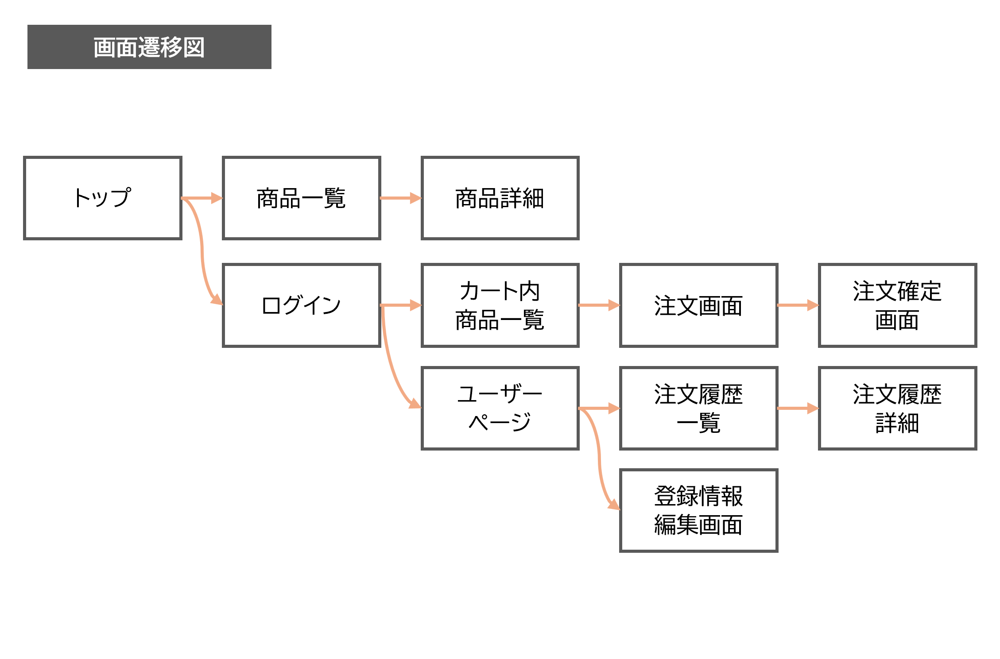
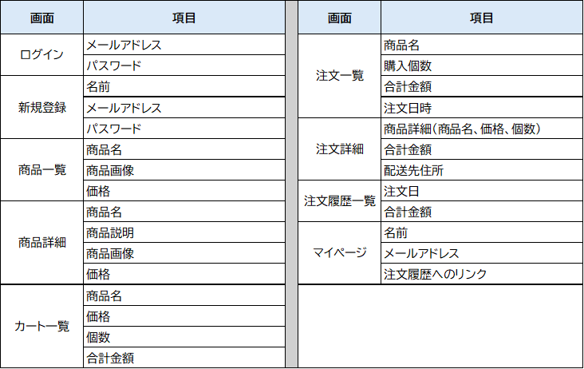

# FruiteShopアプリ開発：データベース設計

## 目次
- [データベース設計を行う](#データベース設計を行う)
- [ワイヤーフレームを描く](#ワイヤーフレームを描く)
- [必要なデータ項目を表にまとめる](#必要なデータ項目を表にまとめる)
- [カラム名を決める](#カラム名を決める)
- [テーブルの構造を考える](#テーブルの構造を考える)
- [データ内容を制限する](#データ内容を制限する)
- [データ型を使い分ける](#データ型を使い分ける)
- [その他の制約](#その他の制約)
- [まとめ](#まとめ)

---

## データベース設計を行う
この章では、FruiteShopアプリのデータベース設計について学びます。具体的には、以下の内容を取り扱います。

* FruiteShopアプリに必要なテーブルとカラムの設計方法
* 適切なデータ型と制約の選択方法

それでは、実際に、FruiteShopアプリのデータベース設計を行ってみましょう。

以下の手順で行います。

1. 画面の遷移を考える
1. 必要なデータ項目を表にまとめる
1. カラム名を決める
1. テーブルの構造を考える
1. データ内容を制限する
1. データ型を使い分ける
1. その他の制約

### 画面の遷移を考える
データベース設計の前に、まず **「画面遷移図」** を描いて、アプリの画面間の流れを明確にします。

**画面遷移図** は、ユーザーがアプリ内でどの画面をどのように遷移するかを視覚的に表現したものです。FruiteShopアプリの場合、例えば、ユーザーがトップページから商品詳細ページ、カートページへと遷移する流れを図に示します。この画面遷移図を元に、必要なデータ項目を把握し、データベース設計を進めます。

> **補足**  
> 画面設計の初期段階では、ワイヤーフレームを使用して画面のレイアウトや要素配置を考えることもあります。  
> ワイヤーフレームとは、ボタンやテキスト、画像などのUI要素をどのように配置するかを示した設計図のようなものです。
> ワイヤーフレームを作成することで、どの情報がどの画面に必要かを整理できますが、ここでは主に画面間の遷移に焦点を当てて、データベース設計の基礎を固めていきます。

### 必要なデータ項目を表にまとめる

画面遷移図が完成したら、必要な項目を明確にします。

例えば、商品詳細ページには、商品の名前、価格、説明文、画像などの情報が必要です。

### カラム名を決める

各データ項目に対応するカラム名を決定します。

カラム名は、データの意味を表す簡潔な名前であることが望ましいです。例えば、商品の名前であれば「name」、価格であれば「price」といった具合です。

### テーブルの構造を考える

どのようなテーブルが必要になるかを考えます。

FruiteShopアプリでは、少なくとも以下のテーブルが必要になるでしょう。

* `products`テーブル：商品の情報を格納する
* `users`テーブル：顧客情報を格納する
* `orders`テーブル：注文情報を格納する
* `order_items`テーブル：注文に含まれる商品の情報を格納する

各テーブルに必要なカラムを洗い出し、テーブル間の関係性を定義します。

#### テーブルの構造を考える根拠

テーブルの構造を考える際には、アプリケーションの機能やユーザーの操作を元に、どのようなデータが必要になるかを明確にします。

#### `products`テーブル
**productsテーブル**は、**アプリ内で取り扱う商品の情報**を格納します。例えば、商品名、価格、説明、画像URLなどが含まれます。これらの情報は、**ユーザーが商品を閲覧したり購入したりする際に必要**です。

#### `users`テーブル
**usersテーブル**は、**アプリを利用する顧客の情報**を格納します。例えば、ユーザー名、メールアドレス、パスワードなどが含まれます。これらの情報は、**ユーザーがアカウントを作成したり、ログインしたりする際に必要**です。

#### `orders`テーブル
**ordersテーブル**は、**ユーザーが行った注文の情報**を格納します。例えば、注文日時、ユーザーID、合計金額などが含まれます。これらの情報は、**ユーザーが注文履歴を確認したり、注文の詳細を確認したりする際に必要**です。

#### `order_items`テーブル
**order_itemsテーブル**は、**各注文に含まれる商品の情報**を格納します。例えば、注文ID、商品ID、数量、価格などが含まれます。これらの情報は、**特定の注文にどの商品が含まれているかを管理するために必要**です。

これらのテーブルを設計することで、FruiteShopアプリの基本的な機能を実現するために必要なデータを効率的に管理できます。各テーブルは、それぞれの役割に応じてデータを整理し、アプリケーションの動作を支えます。

### データ内容を制限する

各カラムにどのようなデータが格納されるかを制限します。カラムに入るデータは、想定されたとおりの内容が入る必要があります。例えば、数値データが欲しいのに、文字データが入ってしまったら、正しく機能しなくなります。カラムに制限を設定しておくと、そぐわないデータが挿入されることを防げます。

例えば、商品の価格は数値であることを確実にするために、`integer`や`decimal`といったデータ型を使用します。

### データ型を使い分ける

各カラムに適したデータ型を選びます。

データベースにデータを保存する場合、データの形式を理解しておく必要があります。このようなデータ形式のことを、「データ型」といいます。代表的なデータ型には、以下のようなものがあります。

| データ型 | 種類 |
|---|---|
| integer | 数値（整数） |
| decimal | 数値（精度の高い小数） |
| float | 数値（浮動小数） |
| string | 文字（短い文字列） |
| text | 文字（長い文字列） |
| date | 日付 |
| datetime | 日時 |
| time | 時刻 |
| timestamp | タイムスタンプ |
| binary | バイナリ |
| boolean | 真偽 |

例えば、商品の名前は`string`、価格は`decimal`、商品の画像は`string`（URL）などです。適切なデータ型を選ぶことで、データの整合性が保たれます。

例として、`users`テーブルの設計を考えてみましょう。

| カラム名 | データ型 |
|---|---|
| id | integer |
| username | text |
| userimage | string |
| email | text |
| password | text |

このテーブル設計の場合、下記のようなデータ制限が必要になります。

* idには、整数のみ入れたい。
* username、userimage、email、passwordには文字列を入れたい。

整数を保存するカラムに`integer`、文字列を保存するカラムに`string`、または`text`を指定することで、データベースに制限をかけられます。つまり、そのカラムには、指定した条件以外のデータを入れることができなくなるわけです。

ここではidに`integer`の制限を設定したので、このカラムには整数だけを保存できます。アルファベットや記号、日本語などは保存できません。その他のカラムには`string`、`text`を指定したので、アルファベットや数字も入れることができます。

なお、`string`、`text`に指定したカラムに数値を保存した場合と、`integer`に指定したカラムに数値を保存した場合とでは、厳密には違いがあります。ここでは詳しくは触れませんが、興味があったら調べてみてください。

### その他の制約

データ型以外にも、カラムに設定できる機能には制約があります。データの整合性を保つために、`NOT NULL`や`UNIQUE`などの制約を適用します。

* **NOT NULL制約**：空欄を禁止する制約です。例えば、商品名は必須であるため、`NOT NULL`制約を設定します。`NOT NULL`制約がかかっているカラムに、NULL（何も入っていない状態）のまま登録や更新しようとすると、エラーになります。
* **UNIQUE制約**：重複を禁止する制約です。例えば、emailカラムのように、同じデータを重複して登録させたくない場合に設定します。
* **AUTO_INCREMENT**：自動的に連番を割り振る機能です。Railsでモデルを作成すると、自動的に「id」カラムが作成され、レコードを追加するたびに1ずつ追加されていきます。これは、idカラムにAUTO_INCREMENTが設定されているからです。
* **DEFAULT**：データの初期値を設定する機能です。テーブルにレコードが登録されると、自動的にカラムに値が設定されます。データの初期値が決まっている場合に設定します。
* **PRIMARY KEY（主キー）**：テーブルのレコードを一意に特定するカラムです。例えば、`id`カラムは主キーです。「id1番の商品」、「id2番の商品」のように、特定して判別できます。主キーは、1つのテーブルに対して1つ（1カラムまたは1セット）しか設定できません。

### まとめ

- データベース設計は、テーブルの構造を考えながら行う
- アプリケーションの機能を元に、必要なデータを明確にして整理する
- 整理されたデータを元に、テーブル設計を行う
- カラムに「id」を設定することで、複数のテーブルの関連付けを行える

- **画面遷移図の作成**：アプリの画面間の流れを明確にする。
- **必要なデータ項目の洗い出し**：各画面に必要なデータ項目を表にまとめる。
- **カラム名の決定**：データ項目に対応する簡潔なカラム名を決める。
- **テーブル構造の設計**：必要なテーブルとそのカラムを設計し、テーブル間の関係性を定義する。
- **データ内容の制限**：各カラムに適切なデータ型を設定し、データの整合性を保つ。
- **その他の制約**：`NOT NULL`、`UNIQUE`、`AUTO_INCREMENT`、`DEFAULT`、`PRIMARY KEY`などの制約を適用する。

