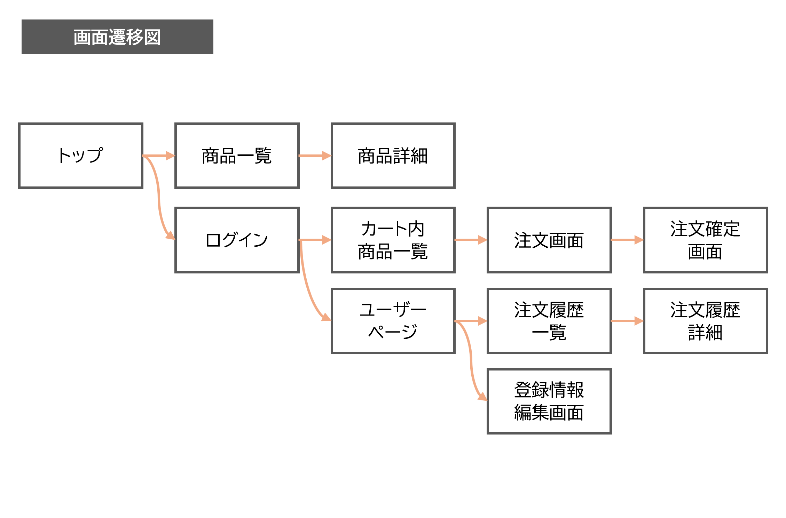

### テーブル: products
| カラム名      | 日本語訳 | データ型  | 制約                      |
|--------------|----------|-----------|---------------------------|
| id           | ID       | integer   | 主キー (PRIMARY KEY)      |
| name         | 商品名   | string    | NOT NULL, UNIQUE          |
| price        | 価格     | decimal   | NOT NULL                  |
| details      | 説明     | text      | (任意)                    |
| created_at   | 作成日時 | datetime  | NOT NULL                  |
| updated_at   | 更新日時 | datetime  | NOT NULL                  |

---

### テーブル: users
| カラム名    | 日本語訳       | データ型   | 制約                           |
|-------------|----------------|------------|--------------------------------|
| id          | ID             | integer    | PRIMARY KEY                   |
| name        | ユーザー名     | string     | NOT NULL                      |
| email       | メールアドレス | string     | NOT NULL, UNIQUE              |
| password    | パスワード     | string     | NOT NULL                      |
| admin_flg   | 管理者フラグ   | boolean    | NOT NULL, DEFAULT FALSE       |
| created_at  | 作成日時       | datetime   | NOT NULL                      |
| updated_at  | 更新日時       | datetime   | NOT NULL                      |

---

### テーブル: orders
| カラム名      | 日本語訳 | データ型  | 制約                      |
|--------------|----------|-----------|---------------------------|
| id           | ID       | integer   | PRIMARY KEY               |
| user_id      | ユーザーID| integer   | FOREIGN KEY(users.id)     |
| total_price  | 合計金額 | decimal   | NOT NULL                  |
| created_at   | 作成日時 | datetime  | NOT NULL                  |
| updated_at   | 更新日時 | datetime  | NOT NULL                  |

---

### テーブル: order_items
| カラム名      | 日本語訳 | データ型  | 制約                      |
|--------------|----------|-----------|---------------------------|
| id           | ID       | integer   | PRIMARY KEY               |
| order_id     | 注文ID   | integer   | FOREIGN KEY(orders.id)    |
| product_id   | 商品ID   | integer   | FOREIGN KEY(products.id)  |
| quantity     | 数量     | integer   | NOT NULL                  |
| price        | 価格     | decimal   | NOT NULL                  |
| created_at   | 作成日時 | datetime  | NOT NULL                  |
| updated_at   | 更新日時 | datetime  | NOT NULL                  |

