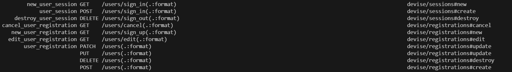
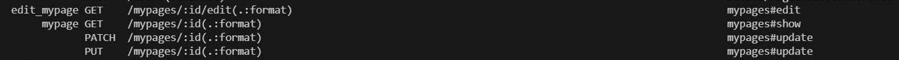
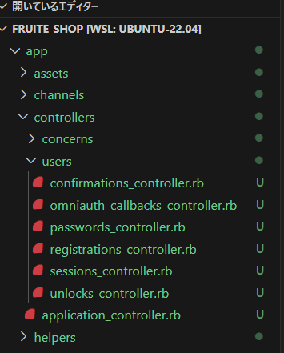
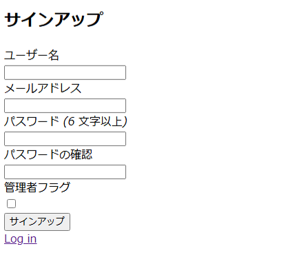
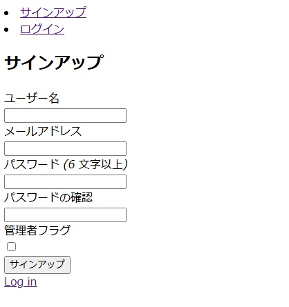
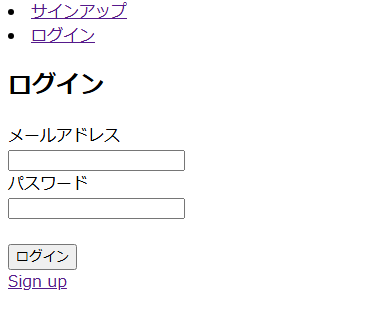
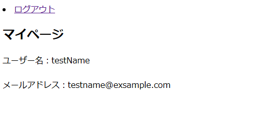

# アプリ開発　実装　ユーザー認証機能

## 目次
- [ユーザー認証機能](#ユーザー認証機能)
  - [ユーザー認証機能のメリット](#ユーザー認証機能のメリット)
  - [devise](#devise)
  - [FruiteShopにdeviseをインストール](#fruiteshopにdeviseをインストール)
  - [ユーザー認証機能の実装](#ユーザー認証機能の実装)
  - [確認問題](#確認問題)

---

## ユーザー認証機能
この章では、ユーザーの認証機能について学びます。Web アプリケーション開発ではとても重要な機能ですので、しっかりと身に着けていきましょう。  

### ユーザー認証機能のメリット  
今現在、皆さんがウェブ上に存在するサービスを利用しようとした場合、サインアップやログインを行っていると思います。  
その理由はユーザー認証を実装することで、様々なメリットが存在するからです。  
例えば、今回作成していくFruiteShopアプリのようなECサイトで考えると以下のような点が挙げられます。  

- __顧客情報の集約__  
顧客の情報（例：年齢、性別、購買履歴）を集約し、管理することができます。これによって顧客の好みや行動パターンを把握し、ターゲティングされたマーケティング戦略を展開することができます。  
  
- __パーソナライズされたサービス提供__  
顧客ごとに異なるサービスや特典を提供することができます。例えば、過去の購買履歴や興味、関心に基づいて商品のレコメンデーションを行ったり、特定のユーザーに割引クーポンを提供することが可能です。  
  
- __セキュリティの向上__  
顧客の個人情報（例：住所、支払い情報）を安全に保管することができます。また、アカウントごとにアクセス権を管理することで、不正なアクセスや情報漏洩を防止することができます。  
  
- __顧客満足度の向上__  
顧客が注文履歴を追跡したり、配送状況を確認したりすることができます。これによって顧客の利便性が向上し、顧客体験が向上します。  
  

他にもメリットが存在しますが、ユーザー認証機能を実装することで、より広いマーケティング戦略を展開していくことができます。

----

### devise
今回はFruiteShopに Gem を使ってユーザー認証機能を実装していきます。使う Gem は以前学んだ「Gemの機能」に出てきていました **devise** です。
実装する前に1度、簡単に説明していきます。  
  
- **devise**とは
devise は Rails アプリケーションに認証機能を簡単に実装してくれる Gem であり、認証機能を追加するための Gem の中で一番使用されています。  
devise を使うことでユーザー承認やパスワードのリセット、セッション管理などの機能を迅速かつ安全に実装することができます。
下の表に記載している10のモジュールで構成されています。  

|モジュール名|説明|
|---|---|
|Database Authenticatable|ログインのためのパスワードをデータベースに暗号化して保存する。|
|Omniauthable|OmniAuthをサポートする|
|Confirmable|確認フロー中にメールを送信し、サインインの際にアカウントが確認済みか否かをチェックする|
|Recoverble|パスワードを忘れた際にパスワードをリセットし、再登録用のURLをメールで送信する|
|Registerable|ログインするためのアカウントを登録する|
|Rememberable|ログイン状態を保持する|
|Trackable|ログインした回数や日時、IPアドレスなどを保存する|
|Timeoutable|一定期間操作がない場合に、自動的にログアウトする|
|Validatable|メールアドレスとパスワードのバリデーションを設定する|
|Lockable|一定回数ログインに失敗した場合、そのアカウントをロックする| 

今回は上記の機能全てを詳しく説明できないので、詳しく知りたい方は下記を参照してみてください。

https://github.com/plataformatec/devise/wiki

---

### FruiteShopにdeviseをインストール
それでは、実際にFruiteShopアプリにユーザー認証機能を実装していきます。  

__deviseの導入__  
まず devise を導入していきます。  
FruiteShopアプリを開いたら、Gemfile を開いて最後の1行へ次のように追記しましょう。  
ここで注意しておきたいのは、まだインストールはされていないという点です。Gemfileに記述しただけでは、実際にインストールは行われません。  

__Gemfile__
   ```rb
   source "https://rubygems.org"

   # 省略
 
   gem 'devise'
   ```

上記の追記を終えたら、再度`bundle install`をターミナルで実行します。その後、ターミナルで下記のコマンドを実行します。  
devise の場合は、 Gem をインストールした後に改めてインストールの手順が必要となりますので、覚えておきましょう。
     
   ```bash
   rails g devise:install
   ```
   
完了すると以下のように表示されます。

   ```bash
      create  config/initializers/devise.rb
      create  config/locales/devise.en.yml
   ===============================================================================

   Depending on your application's configuration some manual setup may be required:

   1. Ensure you have defined default url options in your environments files. Here
       is an example of default_url_options appropriate for a development environment
       in config/environments/development.rb:

       config.action_mailer.default_url_options = { host: 'localhost', port: 3000 }

       In production, :host should be set to the actual host of your application.

       * Required for all applications. *

   2. Ensure you have defined root_url to *something* in your config/routes.rb.
       For example:

       root to: "home#index"
        
       * Not required for API-only Applications *

   3. Ensure you have flash messages in app/views/layouts/application.html.erb.
       For example:

       <p class="notice"><%= notice %></p>
       <p class="alert"><%= alert %></p>

       * Not required for API-only Applications *

   4. You can copy Devise views (for customization) to your app by running:

       rails g devise:views
        
       * Not required *

    ===============================================================================
   ```  

内容の説明としては次のようになります。

| 該当箇所 | 説明 |
|---|---|
| create | config 内に devise 関連のファイルを作成しています。 |
| 1. デフォルトの URL オプションの設定 | 開発環境や本番環境などに応じて、アプリケーションの URL オプションを設定します。開発環境の例が記載されており、ポート番号やホスト名などが含まれます。|
| 2. root_url の定義 | アプリケーションのルート URL を設定します。これは、ルーティングの設定に関連しています。 |  
| 3. フラッシュメッセージの設定 | ユーザーに通知を表示するためのフラッシュメッセージをレイアウトに追加します。 |
| 4. devise の View のコピー | カスタマイズや変更が必要な場合、devise の View をアプリケーションにコピーします。 |


これで devise の設定ファイルの作成が完了し、使用する準備が整いました。

--- 

#### ポイント

 - __ユーザー認証__
   ユーザー認証は Web アプリケーションに機能実装することで、顧客情報の集約、セキュリティの向上など様々なメリットがあります。

 - __devise__  
   devise は Rails アプリケーションに認証機能を簡単に実装してくれる Gem であります

 - __devise の導入__  
   devise を使用するためには、Gem のインストール後に改めて **devise 自体のインストールが必要**です。  

#### 用語解説

 - __フラッシュメッセージ__  
   ユーザーに対して一時的な通知を表示するための機能です。
   処理を行った時に「処理結果は成功しました（または失敗しました）」というような情報を知らせるために使用します。

---

### ユーザー認証機能の実装
ここからユーザー認証機能の実装を行っていきます。1つずつ順に説明していきます。  

#### Userモデル
今回はユーザー情報として「ユーザー名」「メールアドレス」「パスワード」「管理者フラグ」を登録するため、まずはモデルから用意していきます。  

devise を利用するとユーザーテーブルを自動的に作成してくれます。
devise を使ってモデルを作成するときは独自のルールに従って作成します。  
ただ、ルールといっても難しいものでは無く、今まで使っていたコマンドを次のように変更するだけです。  

```bash
# devise を使わない場合
rails g model User
rails g scaffold User

        ↓

# devise を使う場合
rails g devise User
```
`rails g devise User`を行って、ファイルが正しく作成されるとターミナルで次のように出ます。

```bash
invoke  active_record
create    db/migrate/xxxxxxxxxxxxxx_devise_create_users.rb
create    app/models/user.rb
invoke    test_unit
create      test/models/user_test.rb
create      test/fixtures/users.yml
insert    app/models/user.rb
 route  devise_for :users
```
これで、「User」という名のモデルと、users テーブル用のマイグレーションファイルが作成されました。

- User モデル（ユーザ情報を操作する）
- users テーブルのマイグレーションファイル（ユーザ情報を保存する）

ここで1度、作成されたモデルファイルを確認してみましょう。  
app/models フォルダに user.rb が自動作成されて、User モデルが定義されています。  
このモデルには devise で利用する機能が記述されています。  

__app/models/users.rb__
```rb
class User < ApplicationRecord
  # Include default devise modules. Others available are:
  # :confirmable, :lockable, :timeoutable, :trackable and :omniauthable
  devise :database_authenticatable, :registerable,
         :recoverable, :rememberable, :validatable
end
```

「:database_authenticatable, :registerable,」のように、devise の後ろに :（コロン）で始まる部分が devise の機能名です。今回利用するのは下記の5つです。  

| 機能名 | 説明 |
|---|---|
| database_authenticatable | DB上のパスワードの正確性を検証 |
| registerable |ユーザー登録、編集、削除機能を作成 |
| trackable | ログイン回数やログイン時間など、ユーザー情報を保存 |
| rememberable | ログインユーザーの情報を保存 |
| validatable | email のフォーマットなどのバリデーション |

デフォルトの状態から trackable を有効化しましょう。反対に recoverable をコメントアウトしましょう。
以下のようにできていれば編集完了です。

__app/models/users.rb__
```rb
class User < ApplicationRecord
  # Include default devise modules. Others available are:
  # :confirmable, :lockable, :timeoutable, :recoverable and :omniauthable
  devise :database_authenticatable, :registerable,
         :trackable, :rememberable, :validatable
end
```

---
  
続いてマイグレーションファイルを確認していきましょう。
マイグレーションファイルは、db/migrate フォルダ内にある 年月日時分秒_devise_create_users.rbファイルです。

__db/migrate/年月日時分秒_devise_create_users.rb__
```rb
# frozen_string_literal: true

class DeviseCreateUsers < ActiveRecord::Migration[7.1]
  def change
    create_table :users do |t|
      ## Database authenticatable
      t.string :email,              null: false, default: ""
      t.string :encrypted_password, null: false, default: ""

      ## Recoverable
      t.string   :reset_password_token
      t.datetime :reset_password_sent_at

      ## Rememberable
      t.datetime :remember_created_at

      ## Trackable
      # t.integer  :sign_in_count, default: 0, null: false
      # t.datetime :current_sign_in_at
      # t.datetime :last_sign_in_at
      # t.string   :current_sign_in_ip
      # t.string   :last_sign_in_ip

      ## Confirmable
      # t.string   :confirmation_token
      # t.datetime :confirmed_at
      # t.datetime :confirmation_sent_at
      # t.string   :unconfirmed_email # Only if using reconfirmable

      ## Lockable
      # t.integer  :failed_attempts, default: 0, null: false # Only if lock strategy is :failed_attempts
      # t.string   :unlock_token # Only if unlock strategy is :email or :both
      # t.datetime :locked_at


      t.timestamps null: false
    end

    add_index :users, :email,                unique: true
    add_index :users, :reset_password_token, unique: true
    # add_index :users, :confirmation_token,   unique: true
    # add_index :users, :unlock_token,         unique: true
  end
end
```

利用するモジュールに必要なカラムが記載されています。
今回利用する4つのモジュールの内、Trackable のみコメントアウトされているため、＃を外します。  
また、devise の用意するテーブルですとデフォルトではメールアドレスと暗号化されたパスワードしかカラムが存在しません。usersテーブルに存在するユーザー名、管理者フラグを保存するカラムを追加しましょう。

__db/migrate/年月日時分秒_devise_create_users.rb__
```rb
# frozen_string_literal: true

class DeviseCreateUsers < ActiveRecord::Migration[7.1]
  def change
    create_table :users do |t|
      ## Database authenticatable
      t.string :email,              null: false, default: ""
      t.string :encrypted_password, null: false, default: ""
      t.string :name,               null: false                  # 追加　ユーザー名
      t.boolean :admin_flg,         null: false, default: false  # 追加　管理者フラグ

      ## Recoverable
      t.string   :reset_password_token
      t.datetime :reset_password_sent_at

      ## Rememberable
      t.datetime :remember_created_at

      ## Trackable
      t.integer  :sign_in_count, default: 0, null: false         # #を外す
      t.datetime :current_sign_in_at                             # #を外す
      t.datetime :last_sign_in_at                                # #を外す
      t.string   :current_sign_in_ip                             # #を外す
      t.string   :last_sign_in_ip                                # #を外す

      ## Confirmable
      # t.string   :confirmation_token
      # t.datetime :confirmed_at
      # t.datetime :confirmation_sent_at
      # t.string   :unconfirmed_email # Only if using reconfirmable

      ## Lockable
      # t.integer  :failed_attempts, default: 0, null: false # Only if lock strategy is :failed_attempts
      # t.string   :unlock_token # Only if unlock strategy is :email or :both
      # t.datetime :locked_at


      t.timestamps null: false
    end

    add_index :users, :email,                unique: true
    add_index :users, :reset_password_token, unique: true
    # add_index :users, :confirmation_token,   unique: true
    # add_index :users, :unlock_token,         unique: true
  end
end
```

作業が終わったら、ターミナルでマイグレーションを実行しましょう。
```bash
rails db:migrate
```

マイグレーションが成功すれば db フォルダ内に schame.rb ファイルが作成されて、データベースの構造が反映されます。  

__db/Schema.rb__
```rb
# 省略

ActiveRecord::Schema[7.1].define(version: xxxx_xx_xx_xxxxxx) do
  create_table "users", force: :cascade do |t|
    t.string "email", default: "", null: false
    t.string "encrypted_password", default: "", null: false
    t.string "name", null: false
    t.boolean "admin_flg", default: false, null: false
    t.string "reset_password_token"
    t.datetime "reset_password_sent_at"
    t.datetime "remember_created_at"
    t.integer "sign_in_count", default: 0, null: false
    t.datetime "current_sign_in_at"
    t.datetime "last_sign_in_at"
    t.string "current_sign_in_ip"
    t.string "last_sign_in_ip"
    t.datetime "created_at", null: false
    t.datetime "updated_at", null: false
    t.index ["email"], name: "index_users_on_email", unique: true
    t.index ["reset_password_token"], name: "index_users_on_reset_password_token", unique: true
  end

end
```

これで、ユーザー情報の管理ができる準備が整いました。   

---
#### ポイント
 - devise でモデルを作成する場合、`rails g devise <モデル名>` に**モデル作成コマンドが変わる**ため、注意が必要

 - app/models内に作成される**deviseモデル名.rb**を編集し、 devise の利用する機能を有効化する

 - devise によって自動作成されたマイグレーションファイルに**ユーザーモデルの必要なカラムを追加**する

--- 

#### ルーティング
続いて Routing を設定していきましょう。devise で Model を作成したことで、 configフォルダ内の routes.rb ファイルに自動追加されています。  

__routes.rb__
```rb
Rails.application.routes.draw do
  root to: "homes#top"
  resources :products, only: [:index]

  devise_for :users # この部分

  # Define your application routes per the DSL in https://guides.rubyonrails.org/routing.html

  # Reveal health status on /up that returns 200 if the app boots with no exceptions, otherwise 500.
  # Can be used by load balancers and uptime monitors to verify that the app is live.
  get "up" => "rails/health#show", as: :rails_health_check

  # Defines the root path route ("/")
  # root "posts#index"
end
```

devise_for :users は、devise を使用する際に URL として users を含むことを示しています。ターミナルで`rails routes`を行うと次の部分が追加されています。  
  
  

devise は、ユーザー認証に必要なルーティングを色々と自動で設定してくれていることがわかります。  

<br>

次に、ユーザー情報の詳細表示を行うためのルーティングを追加します。今回はユーザー情報を扱うページをマイページと命名しますので、以下のように routes.rb を編集しましょう。  

__routes.rb__
```rb
Rails.application.routes.draw do
  root to: "homes#top"
  resources :products, only: [:index]

  devise_for :users
  resources :mypage, only: [:show] # ユーザー情報の詳細表示

  # Define your application routes per the DSL in https://guides.rubyonrails.org/routing.html

  # Reveal health status on /up that returns 200 if the app boots with no exceptions, otherwise 500.
  # Can be used by load balancers and uptime monitors to verify that the app is live.
  get "up" => "rails/health#show", as: :rails_health_check

  # Defines the root path route ("/")
  # root "posts#index"
end
```

追記したら再度、ターミナルで`rails routes`を行ってみましょう。下の部分が追加されているはずです。  
  
  
これでルーティングの設定は完了です。  
  
---

#### ポイント
 - devise でモデルを作成すると `devise_for :<モデル名>s` が`rails routes`に追加される 
 - **registration**とついているパスが**サインアップ**関係のパス
 - **session**とついているパスが**ログイン**関係のパス

---

#### コントローラー

今度は コントローラーの設定をしていきましょう。  
まず devise 関係の設定を行います。初期状態の devise はサインアップおよびログインの際に「email」「パスワード」しか受け取ることを許可されていません。  
したがって現状では name、admin_flg を入力、選択してもデータを保存できない状態になっています。  

設定を追加して、データを保存できるように許可を与える必要があります。  
devise のストロングパラメータを編集する場合、application_controller.rb に記述していきます。  
以下のように記述しましょう。  

__app/controllers/application_controller.rb__
```rb
class ApplicationController < ActionController::Base
  # devise利用の機能（ユーザ登録、ログイン認証など）が使われる前に
  # configure_permitted_parametersメソッドが実行される
  before_action :configure_permitted_parameters, if: :devise_controller?

  protected

  # devise_parameter_sanitizer.permitメソッドを使うことでユーザー登録(sign_up)の際に、
  # ユーザー名(name)および管理者フラグ(admin_flg)のデータ操作を許可している
  def configure_permitted_parameters
    devise_parameter_sanitizer.permit(:sign_up, keys: [:name, :admin_flg])
  end
end
```

protected の上に追加してあるコードは、 devise の機能（サインアップ、ログイン認証など）が使われる前に configure_permitted_parameters メソッドが実行されるようにするコードです。

反対に protected の下に追加したコードは、中に存在する devise_parameter_sanitizer メソッドを使って、サインアップの際にユーザー名、管理者フラグのデータ操作を許可しています。

これでユーザー名、管理者フラグについてもデータを保持することができるようになりました。
  
---

続いて、ユーザー情報を詳細表示するための Controller を作成していきます。次のコマンドをターミナルで行います。  

```bash
rails g controller mypage show
```

作成後、mypage_controller.rb を以下のように追記します。  
__app/controllers/mypage_controller.rb__
```rb
class MypageController < ApplicationController

  before_action :authenticate_user! # 追加

  def show
    @user = User.find(params[:id])  # 追加　ユーザーIDを取得
  end

  # 追加 ここから
  private
  
  def user_params
    params.require(:user).permit(:name, :email, :admin_flg)
  end
  # 追加 ここまで

end
```

一番上に追加した `before_action :authenticate_user!` は、ログイン認証をかけるために記述するコードです。 
：(コロン)右側の**authenticate_user**は devise 側が用意しているメソッドです。**:authenticate_user!** とすることで、「ログインしていなければ、ログイン画面へリダイレクトする」機能が実装できます。

mypage_controller.rb の記述はこれで完了です。  

---

次に devise 機能に対する設定をしていきます。devise 関係の Controller を作成するために下のコマンドを実行しましょう。  
```bash
rails g devise:controllers users
```

作成すると下のように users フォルダが作成されて、中に各 devise 機能の Controller.rb が作成されます。  
  

今回はサインアップ、ログイン後は自身の詳細ページへ、ログアウト後はログインページに遷移できるようにしましょう。編集する Controller は2つです。  

1つ目はサインアップに関係する registrations_controller.rb です。下側に存在する atfer_sign_up_path_for メソッドがコメントアウトされているため、 # を外します。その後、path を以下のように変更します。   

__app/controllers/users/registrations_controller.rb__
```rb
# frozen_string_literal: true

class Users::RegistrationsController < Devise::RegistrationsController
  # 省略

  # The path used after sign up.
  def after_sign_up_path_for(resource)
    mypage_path(resource)
  end

  # The path used after sign up for inactive accounts.
  # def after_inactive_sign_up_path_for(resource)
  #   super(resource)
  # end
end
```

2つ目は最初に編集した application_controller.rb です。このコントローラーにログイン後、ログアウト後の遷移先を設定します。以下のように記述しましょう。  

__app/controllers/application_controller.rb__
```rb
class ApplicationController < ActionController::Base
    before_action :configure_permitted_parameters, if: :devise_controller?

   # 追加　ここから
    def after_sign_in_path_for(resource)   # ログイン後の遷移先を設定
      mypage_path(resource)
    end

    def after_sign_out_path_for(resource)  # ログアウト後の遷移先を設定
      root_path
    end
  # 追加　ここまで

    protected
  
    def configure_permitted_parameters
      devise_parameter_sanitizer.permit(:sign_up, keys: [:name, :admin_flg])
    end
    
end
```

追加したメソッドは devise が用意しているメソッドです。簡単な説明としては以下の通りです。

- **after_sign_in_path_for**
  - ログイン後にどこへ遷移するかを設定するメソッド
  - 初期設定では`root_path`に設定されている
  - 遷移したい場所へパスの上書き可能

- **after_sign_out_path_for**
  - ログアウト後にどこへ遷移するかを設定するメソッド
  - **after_sign_in_path_for**と同様、初期設定は`root_path`に設定されており、上書き可能

また、メソッドの後ろにある`(resource)`という引数には、ログインを行ったモデルデータ、今回の場合ですとログインした User のインスタンスが格納されている状態です。
そのため、ログイン後にマイページなどのログインしたユーザーに関連するようなページ遷移を実装したい場合は、この`resource`を活用して実装します。
  
これでコントローラーの設定は完了です。  

---

#### ポイント
 - **before_action**を使用して認証をかける

 - 認証の記述は**認証をかける必要があるコントローラー**へ全て記述する

 - サインアップ後、ログイン後、ログイン後の表示ページを**自身で変更**できる

---

#### ビュー
最後にページの設定をしていきたいと思います。
すでに devise の初期画面は表示できますが、実は devise で準備された基本的なビューは devise の機能を使ってビューファイルを作成することで、上書きしてカスタマイズすることができます。  
次のコマンドを実行します。  

```bash 
rails g devise:views
```

まずはサインアップ画面の編集をしていきます。初期状態だと、メールアドレス、パスワードしか入力欄がありません。名前、管理者フラグを登録できるよう、app/views/devise 内にある registrations.html.erb を次のように編集していきましょう。  
__app/views/devise/registrations.html.erb__
```html
<h2>サインアップ</h2> <!-- 編集 -->

<%= form_with Model: @user, url: new_user_registration_path do |f| %>
  <%= render "devise/shared/error_messages", resource: resource %>

  <!-- 追加　ここから -->
  <div class="field">
    <%= f.label :ユーザー名 %><br>
    <%= f.text_field :name, autocomplete: "name" %>
  </div>
  <!-- 追加　ここまで -->

  <div class="field">
    <%= f.label :メールアドレス %><br>                  <!-- 編集 -->
    <%= f.email_field :email, autocomplete: "email" %>
  </div>

  <div class="field">
    <%= f.label :パスワード %>                          <!-- 編集 -->
    <% if @minimum_password_length %>
    <em>(<%= @minimum_password_length %> 文字以上)</em> <!-- 編集 -->
    <% end %><br />
    <%= f.password_field :password, autocomplete: "new-password" %>
  </div>

  <div class="field">
    <%= f.label :パスワードの確認 %>                    <!-- 編集 -->
    <%= f.password_field :password_confirmation, autocomplete: "new-password" %>
  </div>

  <!-- 追加　ここから -->
  <div class="field">
    <%= f.label :管理者フラグ %><br>
    <%= f.check_box :adimn_flg %>
  </div>
  <!-- 追加　ここまで -->

  <div class="actions">
    <%= f.submit "サインアップ" %>                      <!-- 編集 -->
  </div>
<% end %>

<%= render "devise/shared/links" %>
```

サーバーを起動して、url欄に http://127.0.0.1:3000/users/sign_up と入力すると次のようになるはずです。
  
  
  
  
ちなみに `<%= f.label :email %>` などですが、上記のように：（コロン）の後ろを編集することで、表示させたい項目名を変更することができます。  

---

次は、ログアウトできるようにしていきます。今の状態では、ログアウトすることができません。登録やログイン、ログアウトなどはサイトの上側（ヘッダー）部分にまとめて存在することが多いです。今回は全てのページに表示させるため、`application.html.erb` を次のように編集していきます。  

__app/views/layouts/application.html.erb__
```html
<!DOCTYPE html>
<html>

  <head>
    <title>FruiteShop</title>
    <meta name="viewport" content="width=device-width,initial-scale=1">
    <%= csrf_meta_tags %>
    <%= csp_meta_tag %>

    <%= stylesheet_link_tag "application", "data-turbo-track": "reload" %>
    <%= javascript_importmap_tags %>
  </head>

  <body>

    <!-- 追加　ここから -->
    <header>
      <% if user_signed_in? %>
        <li>
          <%= link_to "ログアウト", destroy_user_session_path, data: { turbo_method: :delete } %>
        </li>
      <% else %>
        <li>
          <%= link_to "サインアップ", new_user_registration_path %>
        </li>
        <li>
          <%= link_to "ログイン", new_user_session_path %>
        </li>
      <% end %>
    </header>
    <!-- 追加　ここまで -->
 
    <%= yield %>
  </body>

</html>
```

追加したコードの内、`<% if user_signed_in? %>` は、これも devise が用意しているメソッドです。devise 機能でログインしているか、していないかを判断して、表示する内容を変更してくれます。
今回の場合はサインアップ、ログインしていたら「ログアウト」が、ログアウトしていたら「サインアップ」と「ログイン」が表示されるようにしています。  
  
画面で確認してみましょう。  

  

画面上部にサインアップとログインのリンクが表示されたはずです。これでどのページでもこのリンクを表示することができます。  

---

続いてログイン画面を編集していきます。今回はメールアドレスとパスワードでログインさせるように実装します。`app/views/sessions/new.html.erb` を下のように編集していきます。  

__app/views/sessions/new.html.erb__
```html
<h2>ログイン</h2>  <!-- 編集 -->

<%= form_with model: @user, url: user_session_path do |f| %>  <!-- 編集 -->
  <div class="field">
    <%= f.label :メールアドレス %><br />  <!-- 編集 -->
    <%= f.email_field :email, autofocus: true, autocomplete: "email" %>
  </div>

  <div class="field">
    <%= f.label :パスワード %><br />  <!-- 編集 -->
    <%= f.password_field :password, autocomplete: "current-password" %>
  </div>

  <!-- 削除　ここから -->
  <% if devise_mapping.rememberable? %>
    <div class="field">
      <%= f.check_box :remember_me %>
      <%= f.label :remember_me %>
    </div>
  <% end %>
  <!-- 削除　ここまで -->

  <br />                       <!-- 追加 -->

  <div class="actions">
    <%= f.submit "ログイン" %>  <!-- 編集 -->
  </div>
<% end %>

<%= render "devise/shared/links" %>
```

編集が終わったら確認してみましょう。  



---

次にユーザーの詳細ページを編集していきます。
__app/views/layouts/application.html.erb__
```html
<h2>マイページ</h2> <!-- 編集 -->
<p>Find me in app/views/mypage/show.html.erb</p> <!-- 削除 -->

<!-- 追加　ここから -->

<div>
  ユーザー名：<%= current_user.name %>
</div>

<br />

<div>
  メールアドレス：<%= current_user.email %>
</div>

<!-- 追加　ここまで -->
```

これでユーザー名とメールアドレスがユーザー詳細ページに表示されるはずです。  
サインアップページから登録して、マイページに遷移してみましょう。  
なお、テストユーザーを登録する際は、メールアドレスのドメインに十分注意しましょう。使用しない方が良いドメインは以下の通りです。
- aaa.com
- abc.com
- dummy.com
- hoge.com
- sample.com
- test.com

サインアップが完了すると下のページに遷移します。



また、ここで初めて出てきた`current_user`ですが、これは devise のヘルパーメソッドです。devise をインストールすることで使用でき、ログイン中のユーザー情報を取得することができます。  

これでビューの設定が完了しました。

---
#### ポイント
 - devise の初期登録ページでは、メールアドレスとパスワードのみ入力欄が存在するため、**必要な入力欄を自身で追加**する必要がある

 - `application.html.erb` に記述したものは、**全てのページに影響**する

---

###  まとめ

本章では、以下の内容を実装しました。

- **devise** によるユーザー認証機能の実装
- ルーティングの設定
- devise 用コントローラー、マイページ用コントローラーの追加
- devise 用のページ、マイページの作成

これにより、FruitShop にログイン機能の実装、マイページの表示ができるようになりました。

--- 

### 確認問題

本章で学んだことを振り返りましょう。  

問1．ユーザー認証機能のメリットは次の内、どれが当てはまるでしょうか？  
  
選択肢  
1：多くの顧客の情報を集約できる。  
2：顧客にあったサービスを提供できる。  
3：第三者が他人の情報を編集するのを防ぐ。  
  
<details>
  <summary>答え</summary>
  **全て**  
  
  1人1人が登録するため、顧客情報を集約することができます。(1)  
  顧客の閲覧履歴や興味、関心を基に顧客にあったサービスを提供できます。(2)  
  また、顧客のアカウントごとにアクセス権を管理することで、不正なアクセスを防止することができます。(3)  

</details>
  
<br />

問2．devise をインストールする手順として正しい順番は次の選択肢の内、どれでしょうか？  

実行作業  
A：ターミナルで`bundle install`を実行  
B：Gemfile に`gem 'devise'`を記述  
C：ターミナルで`rails g devise:install`を実行  

選択肢  
1：A → B → C  
2：B → C → A  
3：B → A → C  
   
<details>
  <summary>答え</summary>
  **3**  
      
  Gemfile に追記してから、`bundle install`、`rails g devise:install`を行います。
</details>

<br />

問3．devise 使ってモデルを作成する際のコマンドは次の選択肢の内、どれでしょうか？  
  
選択肢  
1：`rails g model モデル名`
2：`rails g devise モデル名`
3：`rails g モデル名 devise`
   
<details>
  <summary>答え</summary>
  **2**  
      
  モデルを作成する場合、通常は 1 番のコマンドで行いますが、devise を使う場合は独自のコマンドになるため、注意しましょう。  
</details>