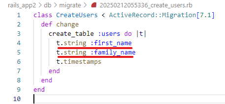

## 5.1 Ruby on Rails：Rails基礎 2  

## 目次

- [Railsの基本的な知識](#railsの基本的な知識)  
  - [Railsとは？](#railsとは)
  - [フレームワークとは？](#フレームワークとは)
  - [Railsを使ったアプリケーションの作成](#railsを使ってアプリケーションを作成しましょう)
  - [プロトコルとは？](#プロトコルとは)
  - [よく使用されるプロトコル](#よく使用されるプロトコル)


### Railsアプリ作成知識を深めよう

ここまででアプリケーションの作成に必要な知識を学習していきました。
次はアプリを作成した際に触ったファイルや記述について説明したいと思います。

#### dbディレクトリ・内部ファイルについて

`db`ディレクトリには、アプリケーションで扱うデータを管理するためのファイルが格納されています。  
内部のマイグレーションファイルを基に、SQLによるテーブルの操作やデータベースのスキーマ変更を行います。

**`migrate/（作成日時）_create_テーブル名.rb`**

```
rails g model （テーブル名）
```
このコマンドでmodelの作成と一緒に自動的に作られます。
このファイルには、自分が作成したテーブル（なにのデータを格納するか）に追加したいカラム（データ列）を記述します。テーブルとカラムについてはこれから学ぶDB基礎のカリキュラムの学習で詳しく触れていくのでここではザックりと説明します。



アプリで作成したマイグレーションファイルを確認してみましょう。  
userがテーブル名、t.stringはデータ型、first_nameはカラム名です。

**ActiveRecord**というライブラリを使用してデータベースとのやり取りをしています。  
> メモ ： ActiveRecordについてもＤＢ基礎のカリキュラムで詳しく説明します。  

この中身説明を少しすると以下になります。

```
class Createuser < ActiveRecord::Migration[7.1]
```
`Createuser`   
クラス名で、「ユーザーテーブルを作成する」マイグレーションを意味します。  

`< ActiveRecord::Migration[7.1]`   
Railsバージョン7.1 のマイグレーション機能を継承して使用することを示します。

```
create_table :user do |t|
```
`create_table :user`  
テーブルの作成をしてくださいと言う命令が書かれています。  
create(作成)_table(テーブル) ：user(テーブル名) 言葉のままですね。
`create_table`はRails特有のマイグレーションで使用できるメソッドの一つです。

`do |t|`では`end`までの中で使用できる変数を定義しています。
**| |** で囲われている部分をブロック変数といいここではテーブルにカラムを追加する目的で使用されています。このブロック変数はruby特有のもので別の使い方をされていますのでまた、後ほど紹介しますね。

```
t.string :first_name
t.string :family_name
```
この部分はカラムを追加してもらうために記述した部分ですね。  
`t.string :first_name`は(ブロック変数).(データ型) :(カラム名)になります。  
「first_name という名前の文字列型カラムをテーブルに追加してください」という命令です。

```
 t.timestamps
```
この部分は、Railsのマイグレーションで使われる 便利なメソッド で、作成日時 と 更新日時 のカラムを一度に追加するために使用されます。

`created_at`  
 レコードが作成された日時を自動的に保存します。  

`updated_at`  
レコードが最後に更新された日時を自動的に保存します。

この２つのカラムが自動的に作られます。

マイグレーションファイルの中身はこのようになっていて`rails db:migrate`コマンドでデータベースにカラムの追加がされます。

**`db/schema.rb`**   
アプリケーション作成しているときは開いていませんでしたが、実はschema.rbというファイルが存在し、ここでは実行したマイグレーションの内容が反映され、データベースのスキーマ（構造）が記録されています。

   

このファイルを確認することで、データベースに保存されているテーブルやカラムを簡単に確認することができます。

**マイグレーションで使用できるコマンド**
| コマンド                            | 説明                                                                 |
|-------------------------------------|----------------------------------------------------------------------|
| `rails db:migrate`                  | 未実行のマイグレーションを実行して、データベーススキーマを更新します。        |
| `rails db:rollback`                 | 直前に実行したマイグレーションを取り消します。                             |
| `rails db:rollback STEP=n`          | `n`回分のマイグレーションを戻します。                                     |
| `rails db:reset`                    | データベースを初期化し、全てのマイグレーションを取り消します。             |
| `rails db:migrate:status`           | マイグレーションが実行済みかUpとdownで表されます                         |
| `rails generate migration <name>`   | 新しいマイグレーションファイルを生成します。`<name>`は追加したいテーブル名 |
| `rails db:migrate:down VERSION=<id>`| 特定のマイグレーションを取り消します。`<id>`はマイグレーションファイルの日付です|

マイグレーションファイルの取り消しや追加はコマンドを使用しないと適切に行えません。テーブル名を間違えた場合など、ファイルは削除せずに記録として残しておき、コマンドで対応しましょう。ぜひ覚えておいてください。

**テーブル名の変更・テーブル名のカラム追加、編集、削除**  
テーブル名を間違えてしまった場合は削除することができない（デメリットがあるので）ので以下の方法で変更できます。
1. マイグレーションファイルを作成します。
     ```
     rails g migration <テーブルを変更したことがわかる名前>
     ```
1. マイグレーションファイルの中身を書きます。`rename_table`メソッドを使います。 
     ```rb
     class (マイグレーションファイル名) < ActiveRecord::Migration[7.1]
       def change
          rename_table :（変更したいテーブル名）, :（新しいテーブル名）
       end
     end
     ```
1. `rails db:migrate`コマンドの実行したら完了です。
> テーブル名を変えると記述を変更しないといけない部分がでたりするので気をつけてください


**カラムの追加**、**変更**、**削除**したい場合は少し特殊やり方になり2つ方法があります。

**1つ目**
1. データベースを初期化、マイグレーションを取り消しします。
     ```
     rails db:reset 
     ```

1. カラムを追加したいテーブルに記述します。
     ```rb
     class CreateUser < ActiveRecord::Migration[7.1]
       def change
         create_table :user do |t|
            t.string :first_name
            t.string :family_name
            (新しいカラムを追加)
            t.timestamps
         end
       end
     end
     ```
1. `rails db:migrate`コマンドの実行したら完了です。  

ですがこの方法を使用すると**レコード**も一緒消えてしまいます。  
**あまり推奨されるやり方ではない**ので基本的には2つ目を使いましょう。

**2つ目**
1. マイグレーションファイルを作成します。
     ```
     rails g migration <追加・変更・削除したことがわかる名前>
     ```
1. マイグレーションファイルの中身を書きます。  
`add_column`（追加）や`change_column`(変更)や` remove_column `（削除）メソッドを使います。
     ```rb
     class (マイグレーションファイル名) < ActiveRecord::Migration[7.1]
       def change
         （メソッド） :（追加、変更、削除したいテーブル名）, :（カラム名）, :（データ型）
       end
     end
     ```
1. `rails db:migrate`コマンドの実行したら完了です。  

(メソッド)を`add_column`（追加）、`change_column`(変更)、` remove_column `（削除）のどれかにするとそれぞれの処理がされます。`db/schema.rb`を確認することで結果の確認ができます。

***

**用語解説**

**レコード**
| first_name | family_name | created_at           | updated_at           |
|------------|-------------|----------------------|----------------------|
| 太郎       | リバティ    | 2025-02-14 12:34:56  | 2025-02-14 12:34:56  |

保存されたデータのこと「太郎」「リバティ」「作成日時」「更新日時」がレコードにあたります。  
詳しくはカリキュラムのＤＢ基礎で説明します。

<br>

***

#### appディレクトリ・modelsについて

Railsにおいて、modelはデータベースとアプリケーションの間でデータをやり取りするための重要な部分です。  
rails g model user コマンドを実行すると、マイグレーションファイルとともに、app/models ディレクトリ内に user.rb というmodelファイルが作成されます。

**modelを作成するコマンド**  

```
rails g model user
```
Railsの慣習により、model名は単数形（user）で記述します。複数形（users）で作成すると、マイグレーションファイルのテーブル名は複数形になりますが、modelは単数形になるため、混乱を避けるためにも単数形を使用する方が良いです。

* modelは、主に以下の役割を担います。

  * データの保存・取得
  * バリデーション（データの検証）
  * アソシエーション

  modelファイルは、データベースとやり取りをしたり、controllerでできなかった処理を記述するために使われます。

1. **データの保存・取得**

    modelを通じて、データベースにデータを保存したり、保存されているデータを取得したりします。

    ```rb
    # controllerでユーザーを新規作成して保存
    user = User.create(name: 'John', email: 'john@example.com')
    # このコードでは、name と email を指定して新しいユーザーが作成され、保存されます。

    # controllerでユーザーをIDで検索
    user = User.find(1)
    ```
    User.create や User.find のように、**model名**の後に**メソッド**を使うと、Railsはそのメソッドを通じてデータベースとやり取りをします。

2. **バリデーション（データの検証）**
  
    **バリデーション**とは、**データが正しいかを確認し、不正なデータの保存を防ぐ仕組み**です。  
    例えば、名前やメールアドレスが**空のまま登録されること**や、**同じメールアドレスが何度も登録されること**を防ぎます。  

    バリデーションには、主に以下のようなオプションがあります。  
    * **presence: true**  
      属性が**空でないこと**を確認します。  
    * **uniqueness: true**  
      属性の値が**一意であること**を確認します。  
    * **length**  
      属性の**文字数**に制限を設けます。  

    バリデーションを設定しないと、**不完全なデータや重複データが登録される原因**になり、**アプリの不具合**につながる可能性があります。  
    **データの信頼性を守るために重要**な仕組みです。

1. **アソシエーション (Associations)**  

    **アソシエーション**とは、**異なるモデル同士を関連付けて管理する仕組み**です。  
    例えば、**一人のユーザーが複数の投稿を持つ関係**や、**投稿が一人のユーザーに属する関係**などを表現できます。  
    アソシエーションを利用すると、**関連するデータをまとめて扱える**ため、データ管理が効率的になります。  

    代表的なアソシエーションには、以下のものがあります。  
    * **has_many**  
        一つのモデルが**複数のレコードを持つ**場合に使用します。  
        例：ユーザーが複数の投稿を持つ。  
    * **belongs_to**  
      一つのモデルが**他のモデルに属する**場合に使用します。  
      例：投稿が一人のユーザーに属する。  
    * **has_one**  
      一つのモデルが**一つのレコードと結びつく**場合に使用します。  
      例：ユーザーが一つのプロフィールを持つ。  
    * **has_and_belongs_to_many**  
      **多対多の関係**を表します。  
      例：ユーザーとグループが多対多の関係。  

    アソシエーションを活用すると、**関連データの取得や更新が簡単**になり、**効率よくデータを操作できる**ようになります。

#### appディレクトリ・viewについて

**<%で始まるタグ**
これからRubyで使われるタグで、viewやcontrollerの記述を見るにあたり  **<%タグ** は頻繁に出てくるので覚えておきましょう。

**<% %>**  
基本的にcontrollerで使われることが多いです。  
タグ内でRubyコードを実行して（条件分岐、繰り返し処理）を行いますが、その結果をHTMLに変換する必要がないものに使用されます。  

```rb
例

【実行】

<% if @user %>
  <p>User exists!</p>
<% end %>

条件分岐を行っており、ビューに@userが存在する場合は <p>User exists!</p> が出力されます。
HTMLには変換しません。

```
**<%= %>**  
ビューで使用されることが多いです。  
タグ内で実行されたRubyコードの結果がHTMLとして表示されます。  
主に、変数の値や動的に生成された内容をviewで表示したい場合に使われます。

```rb
【結果】

<html>
  <%= @user %>  #ここには<p>User exists!</p>が出力されます。
</html>

@userの内容（<p>User exists!</p>）がそのままHTMLとして表示されます。
```

***

**レイアウトファイル（Layout files）**  
`app/views/layouts/application.html.erb`がレイアウトファイルです。  
`rails new (アプリケーション名)`で他ディレクトリやファイルと一緒に作成されます。  
アプリケーション全体で共通する部分（外部のライブラリ使用・ヘッダー、フッター、ナビゲーションバーなど）を管理するために使います。  
このファイルを使用することで、ページ全体のレイアウトや使用できるライブラリを統一することができ、ビューでの共通部分を繰り返し書く手間を省けます。

```rb
<!DOCTYPE html>
<html>
  <head>
    <title>MyApp</title>
    <%= csrf_meta_tags %>
    <%= csp_meta_tag %>
    <%= stylesheet_link_tag 'application', media: 'all' %>
    <%= javascript_pack_tag 'application' %>
  </head>
  <body>
    <%= yield %> 
  </body>
</html>
```
> < !DOCTYPE html > や < html >, < head > などは、ページ全体のHTMLの構造です。

**<%= yield %> メソッド**   
<%= yield %>は、レイアウトファイル内で各viewのコンテンツを挿入するためのメソッドです。

`application.html.erb`レイアウトファイルには **<%= yield %>** が記述されています。この部分に各viewの内容が挿入されます。

```rb
<!DOCTYPE html>
<html>
  <head>
    <title>MyApp</title>
  </head>
  <body>
    <header>
      <h1>MyApp</h1>
    </header>

    <div class="content">
      <%= yield %> <!-- ここに各viewの内容が挿入されます -->
    </div>
  </body>
</html>
```

言葉では伝わりづらいので、実際に作成したアプリの`views/user/○○.html.erb`を見に行きましょう。

```rb
# index.html.erb

<h1>一覧ページ</h1>
<% @users.each do |user| %>

 
  <p>名前</p>
  <span><%= user.first_name %></span>
  
    <p>苗字</p>
  <span><%= user.family_name %></span>

  <br>
  
  <%= link_to "詳細ページ", user_path(user.id) %>

  <br>
  ===========

<% end %>

<br>
 <%= link_to "登録ページ", users_new_path %>
```
何か違和感を感じませんか？
htmlを記述する際は< !DOCTYPE html > などの宣言があったと思いますがこのviewページには書いていません。

これは <%= yield %> メソッドを使って、レイアウトファイル内にこのviewが挿入される仕組みです。  
viewの内容は、レイアウトファイルの < body > タグ部分に組み込まれ画面に表示されます。

この仕組みにより、ページ全体のレイアウトを共通化しつつ、各viewを表示できます。


**部分テンプレート**
部分テンプレートは、viewの一部を分けて再利用するための仕組みです。
同じ内容の部分（フォーム、リスト、エラーメッセージなど）を複数のviewで使いたい場合、部分テンプレートを利用します。

部分テンプレートは、_（アンダースコア）で始めるファイル名を作成して適応させます。
`_header.html.erb`と`_footer.html.erb`ファイルを作成してアプリに適用してみましょう。
> メモ : cd コマンドでapp/views/layoutsに移動してから touch _header.html.erb 

`_header.html.erb`

```rb
<h1>ヘッダーです</h1>
```

このパーシャルを他のviewで再利用するには、次のようにrenderメソッドを使います。

```rb
<%= render 'form' %>
```
render 'form'は、_form.html.erbパーシャルをその位置に挿入します。この方法で、フォーム部分などの再利用が簡単にできます。


#### appディレクトリ・controllerについて

before_action
`private`メソッドやpublicメソッドも
#### パラメータ
ストロングパラメータ

#### ルーティング`routes.rb`について


---

# ここから参考

Rails アプリケーションでリクエストされたURLに対応するcontrollerやアクション、そしてデータの送受信方法（HTTPメソッド）を定義します。  
このファイルを通じて、特定のviewを表示するためのパスや、どのように通信を処理するかが決まります。


`root to
ルーティングまとめる

__【routes.rb】__  
まず初めに、ルーティングの確認をしてみましょう。  
先程URLの末尾に`/users`を付け足して、きちんとページが表示されたということは、  
そのURLにアプリが対応できるようになったということです。  
その設定は`/config/routes.rb`のファイルに書かれているはずなので、そのファイルを確認してみましょう。  

```rb
# config/routes.rb
Rails.application.routes.draw do
  resources :users
  ・
  ・
  ・
end
```

記述の中に`resources :users`と書かれている部分がありますね。  
実はこの一行のコードで、8個分のルーティングが設定できるようになっています。  

このルーティングの設定は、以下のコマンドで確認できます。  
Railsアプリを実行中の場合は、もう一つターミナルを立ち上げて実行してみてください。  

```sh
$ rails routes
```

実行すると以下のような内容が表示されるはずです。  

```sh
   Prefix Verb   URI Pattern               Controller#Action
    users GET    /users(.:format)          users#index
          POST   /users(.:format)          users#create
 new_user GET    /users/new(.:format)      users#new
edit_user GET    /users/:id/edit(.:format) users#edit
     user GET    /users/:id(.:format)      users#show
          PATCH  /users/:id(.:format)      users#update
          PUT    /users/:id(.:format)      users#update
          DELETE /users/:id(.:format)      users#destroy
```

右端の列にあるのは、アクションメソッドと呼ばれるControllerに定義されたメソッドです。  
上記の一覧では、「特定のURLにアクセスすると、それに対応したControllerのメソッドが呼び出される」  
ということが表されています。このアクションメソッドを`CRUD`に当てはめると下記のようになります。  

|CRUD|アクション|
|:--|:--|
|Create|新規作成(new, create)|
|Read|データ一覧・個別の表示(index, show)|
|Update|データの編集・更新(edit, update)|
|Delete|データの削除(destroy)|


## **1. ルーティング（routes.rb）**
Rails の `config/routes.rb` は、アプリケーション内のURLと対応するcontroller・アクションを決めるファイルです。  
適切なルーティングを設定することで、リクエストされたURLに対する処理が正しく実行されます。

### **(1) `root` の設定（ホームページを指定）**
アプリのトップページを設定するには、以下のように記述します。

```ruby
root to: 'home#index'  # / にアクセスすると home#index を実行

(2) resources を使う（基本的な CRUD）
resources を使うと、1 行で CRUD に必要なルートを自動生成できます。
ruby
コピーする
resources :users

この 1 行だけで、以下のようなルートが設定されます。
HTTPメソッド
パス
controller#アクション
用途
GET
/users
users#index
一覧表示
GET
/users/:id
users#show
詳細表示
GET
/users/new
users#new
新規作成フォーム
POST
/users
users#create
ユーザー作成
GET
/users/:id/edit
users#edit
編集フォーム
PATCH/PUT
/users/:id
users#update
更新
DELETE
/users/:id
users#destroy
削除


3. controller（controller）
controllerは、リクエストを処理し、modelやviewと連携して適切なレスポンスを返します。
(1) controllerの作成
bash
コピーする
rails generate controller Users

これにより、app/controllers/users_controller.rb が作成されます。
(2) 基本的なアクション
controllerには、index や show などのアクションを定義します。
ruby
コピーする
class UsersController < ApplicationController
  def index
    @users = User.all  # すべてのユーザーを取得
  end

  def show
    @user = User.find(params[:id])  # 特定のユーザーを取得
  end

  def new
    @user = User.new
  end

  def create
    @user = User.new(user_params)
    if @user.save
      redirect_to @user, notice: "ユーザーを作成しました"
    else
      render :new
    end
  end

  private

  def user_params
    params.require(:user).permit(:name, :email)  # ストロングパラメータ
  end
end


4. view（view）
viewは、HTML を生成し、ユーザーに表示される部分です。
(1) index.html.erb（一覧表示ページ）
erb
コピーする
<h1>ユーザー一覧</h1>
<%= link_to "新規作成", new_user_path %>
<ul>
  <% @users.each do |user| %>
    <li>
      <%= link_to user.name, user_path(user) %>
    </li>
  <% end %>
</ul>

(2) show.html.erb（詳細ページ）
erb
コピーする
<h1><%= @user.name %></h1>
<p>Email: <%= @user.email %></p>
<%= link_to "編集", edit_user_path(@user) %> |
<%= link_to "削除", user_path(@user), method: :delete, data: { confirm: "本当に削除しますか？" } %>

(3) フォームの作成
new.html.erb
erb
コピーする
<h1>新規ユーザー作成</h1>
<%= form_with model: @user, local: true do |f| %>
  <p>
    <%= f.label :name %>
    <%= f.text_field :name %>
  </p>
  <p>
    <%= f.label :email %>
    <%= f.email_field :email %>
  </p>
  <p>
    <%= f.submit "登録" %>
  </p>
<% end %>


### 5.1.2 Railsの基本
__【scaffoldコマンド】__   
自前でページを作成するには、必要なものが多くあります。  
例えば画面に表示するViewであったり、登録処理をするならそのためのテーブルも必要ですし、  
テーブルを操作するためのModelや、それらを制御するControllerも必要です。  
また、WEBページにアクセスした時に画面表示等の処理を行うには、  
ブラウザで入力したURLとアプリの処理を連動できるようにしなければいけません。  
そのためには、routes.rbというファイルに設定を書き込む必要があります。（ルーティング）  

この、WEBページで何か機能を使用するために必要なものの塊を`リソース`と呼びます。  
リソースを全て1から作るのは中々大変ですが、Railsではこのリソースを一括で作成できる  
`scaffold`という機能があります。早速この機能を使用してみましょう。  
前回作成した`railsbasic`のアプリに移動しましょう。  

```sh
$ cd railsbasic
```

```sh
$ rails generate scaffold User name:string email:string
```

`rails generate`がファイルを作成するコマンドで、`scaffold`はそのうちのモードの1つです。  
`User`は生成されるファイルの名前のベースになります。  
生成されるファイルは大体命名規則があるので、それに則ってファイルの名前を付けてくれます。  
あとの`name:string email:string`は、テーブルで使用するカラムを予約しておくためのものです。  
このscaffoldをした段階では、まだテーブルだけは生成されていないので後でも大丈夫なのですが、  
この時点で予約しておくとちょっと便利なことがあるので、オプションとして付けておきます。  
また、`rails generate`は`rails g`と省略できます。    

このコマンドを実行すると、また新たにファイルやフォルダが生成されていると思います。  
万が一間違えて作成してしまった場合は`rails d`とすることで削除できますので覚えておきましょう。  
それらについては、また後ほど個別に解説していきます。  
<br>

__【CRUDについて】__   
Webアプリケーションには、基本となる新規作成 (Create)、表示 (Read)、更新 (Update)、削除 (Delete) の
4つの機能があります。これらの頭文字を取って `CRUD` と呼ばれています。
`scaffold`では、新規作成、表示、更新、削除の各機能も一括で作成されています。

__【テーブルの作成】__    
先に話した通り、DBのテーブルだけはまだ生成されていません。  
ただし、実はテーブルを生成するための準備はもう出来ています。  

そもそもテーブルを作るためには、本来ならDBのコマンドを直接実行してDBを操作しなくてはいけません。  
しかし、Railsではアプリ側からDBを操作することが出来ます。  
そのDBの操作に使われるのが、`migration`という機能です。  
このmigrationでは、テーブルを生成したり、テーブルのカラムを変更したりすることが出来ます。  

「準備が出来ている」と言ったのは、先程scaffoldを使用した時に、  
このmigrationの機能を使うためのファイルが出来ているからです。  
そのファイルは`/db/migrate/`の配下にあり、ファイル名は`日時_create_users.rb`になっています。  
中身を見てみると、以下のようになっています。  

```rb    
class CreateUsers < ActiveRecord::Migration[7.1]
  def change
    create_table :users do |t|
      t.string :name
      t.string :email

      t.timestamps
    end
  end
end
```

コマンドのオプションとして付けておいたカラムが入っていますね。  
他にも`timestamps`という記述がありますが、これはscaffoldで生成すると自動で書き込まれるものです。  
この記述を入れておくと、テーブルにレコードの作成日時と更新日時を記録するためのカラムが追加されます。  
この2つの日時は、登録・更新時に勝手に記録してくれる等、Rails側で管理してくれるようになっています。  

このファイルを使用してmigrationを行うには、以下のコマンドを実行します。  

```sh
$ rails db:migrate
```

これでテーブルが生成されるので、リソースが機能として使用出来るようになりました。  

試しにRailsアプリを起動して、ブラウザでページを開いたあと、URLの末尾に`/users`と付け足してみて下さい。  
そのURLでページを移動すると、ほぼ真っ白なUsersと書かれたページが表示されていると思います。  
これはテーブルの情報を一覧で表示するページで、「New User」のリンクを押すと新規登録ページに移動します。  
新規登録したあとには一覧ページに登録したデータが表示され、そこから編集等の操作が出来るようになっています。

このように、まだデザインもシンプルで機能も最低限に留まってはいますが、  
WEBページとして欲しい機能の基礎が出来上がりました。  

これはどういう仕組みで動いているのでしょうか？  
具体的な仕組みや構造を、生成された各ファイルを見ながら辿ってみましょう。  

