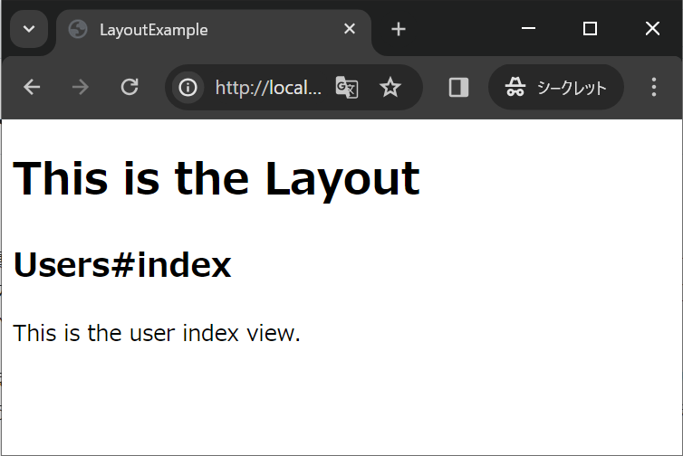
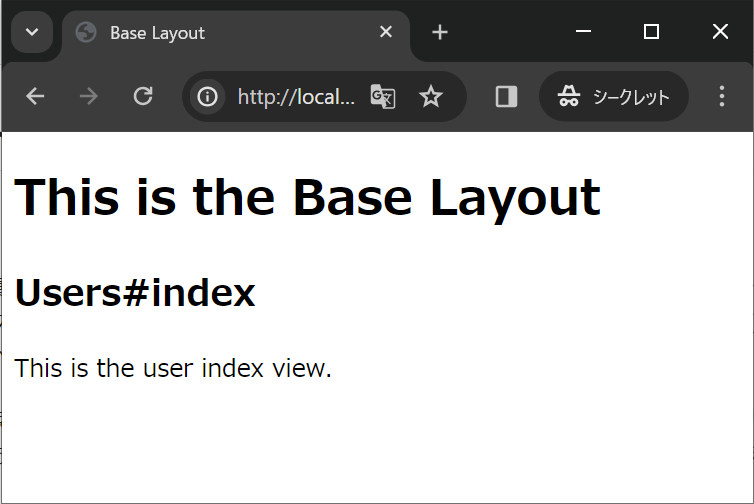
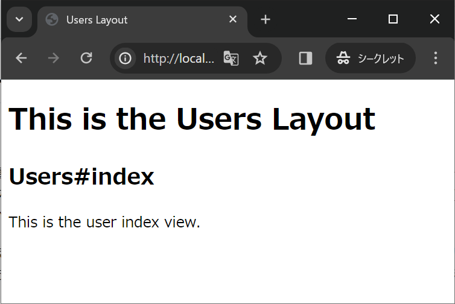

## 10.3 Ruby on Rails：ECサイトの開発 注文2

### 10.3.1 例題(つづき)

#### 入力画面の作成
入力画面を作成します。

Controllerを作成しましょう。
今回使用するViewは`index`と`new`を使うので一緒に作成しましょう。

```sh
rails g controller articles index new
```

先ほど設定したルーティングを使用するので、`show`と新しくできたルーティングは削除します。

```rb
resources :articles, only: [:index, :new, :create] do
  collection do
    post :confirm
  end
end
```

Controllerに入力画面のアクションを追加します。

```sh
# app/controllers/articles_controller.rb

class ArticlesController < ApplicationController
  ・
  ・
  def new
    @article = Article.new
  end
  ・
  ・
end
```

次にviewを作成します。

```html
<!-- app/views/articles/new.html.erb -->

<h1>New Article</h1>

<%= form_with(model: @article, local: true, url: confirm_articles_path, data: { turbo: false }) do |form| %>
    <% if @article.errors.any? %>
        <div id="error_explanation">
          <h2><%= pluralize(@article.errors.count, "error") %> prohibited this article from being saved:</h2>

          <ul>
            <% @article.errors.full_messages.each do |message| %>
                <li><%= message %></li>
            <% end %>
          </ul>
        </div>
    <% end %>

    <div class="field">
      <%= form.label :title %>
      <%= form.text_field :title, id: :article_title %>
    </div>

    <div class="field">
      <%= form.label :content %>
      <%= form.text_area :content, id: :article_content %>
    </div>

    <div class="actions">
      <%= form.submit %>
    </div>
<% end %>

<%= link_to 'Back', articles_path %>
```

scaffoldで作成した場合の`form_with`は自動的に完了画面に遷移するようになっていました。今回は確認画面に遷移させたいので`url: confirm_articles_path`を追加します。

#### 確認画面の作成

コントローラに確認画面用のアクションを追加します。

```rb
# app/controllers/articles_controller.rb

class ArticlesController < ApplicationController
  ・
  ・
  def confirm
    @article = Article.new(article_params)
  end
  
  private
  
  def article_params
    params.require(:article).permit(:title, :content)
  end
end
```

viewを作成します。`app/views/articles/confirm.html.erb`を新規作成しましょう。

```html
<!-- app/views/articles/confirm.html.erb -->

<h1>Confirm New Article</h1>

<%= form_with(model: @article, local: true, data: { turbo: false }) do |form| %>
  <% if @article.errors.any? %>
    <div id="error_explanation">
      <h2><%= pluralize(@article.errors.count, "error") %> prohibited this article from being saved:</h2>

      <ul>
        <% @article.errors.full_messages.each do |message| %>
          <li><%= message %></li>
        <% end %>
      </ul>
    </div>
  <% end %>

  <div class="field">
    <p><%= form.label :title %></p>
    <%= @article.title %>
    <%= form.hidden_field :title, id: :article_title %>
  </div>

  <div class="field">
    <p><%= form.label :content %></p>
    <%= @article.content %>
    <%= form.hidden_field :content, id: :article_content %>
  </div>

  <div class="actions">
    <%= form.submit '戻る', name: :back %>
    <%= form.submit '登録' %>
  </div>
<% end %>

<%= link_to 'Back', articles_path %>
```

確認画面のviewでは2つのsubmitボタンを表示します。
片方の`name`属性を`submit`に、もう一方の`name`属性を`back`に設定します。
次の完了の処理でこの`name`属性の値をみて、確定ボタンがクリックされたのか、戻るボタンがクリックされたのかを判断するために利用します。


#### 完了画面の作成

コントローラに完了用のアクションを追加します。

```rb
# app/controllers/articles_controller.rb

class ArticlesController < ApplicationController
  ・
  ・
  def create
    @article = Article.new(article_params)

    if params[:back].present?
      render :new
    else
      if @article.save
        redirect_to articles_path, notice: '登録が完了しました。'
      else
        render :new
      end
    end
  end
  ・
  ・
end
```

ここでは確認画面で設定したsubmitボタンの名前によって処理を分岐させます。
`name`属性に値がセットされている場合は戻る(`:back`)ボタンがクリックされたと判断出来ます。
その場合は`new`を`render`します。
そうでない場合は、確定ボタンがクリックされたので登録処理を行います。

#### 一覧画面の作成

最後に登録した`Article`を表示する一覧画面を作成しましょう

```rb
# app/controllers/articles_controller.rb

class ArticlesController < ApplicationController
  def index
    @articles = Article.all
  end
end
```

```html
<!-- app/views/articles/index.html.erb -->

<p id="notice"><%= notice %></p>

<h1>Articles</h1>

<table>
  <thead>
  <tr>
    <th>Title</th>
    <th>Content</th>
  </tr>
  </thead>

  <tbody>
  <% @articles.each do |article| %>
      <tr>
        <td><%= article.title %></td>
        <td><%= article.content %></td>
      </tr>
  <% end %>
  </tbody>
</table>

<br>

<%= link_to 'New Article', new_article_path %>
```

これで入力、確認、登録、一覧の流れができました。
実際に操作して確認してみましょう。

#### レイアウトの変更
今作成中のECサイトには、すでに管理者がアクセスできる商品一覧があります。

それとは別に、買い物をする利用者がアクセスするための商品一覧も必要になります。

しかし、今までどおりscaffoldで作成すると、管理側の商品一覧も利用者側の商品一覧も同じレイアウトになってしまいます。
通常ECサイトでは利用者側のページは管理者側よりも見栄えの良いものになります。

そのためには利用者側は別のレイアウトを使う必要があります。

レイアウトを変更する方法はいくつかあります。順番に見ていきましょう

##### アクションごとにレイアウトを変更する

アクションごとに変更する場合は `render` でレイアウト指定します。

```rb
def index
  @users = User.all
  render layout: 'hoge'
end
```

このように指定すると `/app/views/layout/hoge.html.erb` のレイアウトを使用します。

##### コントローラごとにレイアウトを変更する

コントローラごとにレイアウトを変更する場合は、規約で決められたファイル名のファイルを `/app/views/layout` に置くだけです。

下記の順番に優先度が高くなっています。

- コントローラと同じファイル名
- コントローラが継承しているコントローラと同じファイル名
- ApplicationControllerと同じファイル名

layout/application.html.erbが使われているのは、アクションごとにもコントローラごとにもレイアウトが指定されていないので継承元であるApplicationControllerと同じファイル名のapplication.html.erbが使われていることになります。

```rb
class BaseController < ApplicationController
end

class UsersController < BaseController
  def index
  end
end
```
上記のような継承関係のコントローラの場合、 `/app/views/layout/users.html.erb` のレイアウトが使われます。

なければ、 `/app/views/layout/base.html.erb` のレイアウトが使われます。

それもなければ、 `/app/views/layout/application.html.erb` が使われます。

実際にどのようようにレイアウトが変わるか確認してみましょう。

まずは新しいRailsアプリケーションを作成します。
```sh
$ rails new layout_example
$ cd layout_example
```

今回は特にモデルを作成する必要はありませんのでコントローラのみ作成します。  
BaseControllerとUsersControllerを作成します。
```sh
$ rails g controller BaseController
$ rails g controller UsersController index
```

`users#index`をルートパスに設定して確認しやすくしましょう。
```rb
# config/routes.rb

Rails.application.routes.draw do
  root 'users#index'
end
```

まずは`app/views/layouts/application.html.erb`の内容を変更します。
```html
<!-- app/views/layouts/application.html.erb -->
  ・
  ・
  <body>
    <h1>This is the Layout</h1><!-- 追加 -->
    <%= yield %>
  </body>
  ・
  ・
```

サーバーを起動して確認してみましょう。
```sh
$ rails s
```


BaseControllerにレイアウトを追加します。  
`app/views/layouts/base.html.erb`を作成し、以下の内容を追加します。
```html
<!-- app/views/layouts/base.html.erb -->

<!DOCTYPE html>
<html>
<head>
  <title>Base Layout</title>
</head>
<body>

  <h1>This is the Base Layout</h1>

  <%= yield %>

</body>
</html>
```

こちらもサーバーを起動して確認してみましょう。

```sh
$ rails s
```



UsersControllerにレイアウトを追加します。
`app/views/users/index.html.erb`を作成し、以下の内容を追加します。
```html
<!DOCTYPE html>
<html>
<head>
  <title>Users Layout</title>
</head>
<body>

  <h1>This is the Users Layout</h1>

  <%= yield %>

</body>
</html>
```



これでコントローラに関連付けられたビューのレイアウトが確認できました。