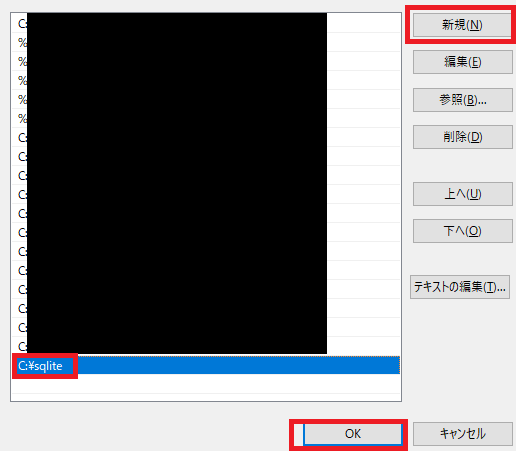

## 11 DB基礎

## 目次
+ [SQLとは](#SQLとは)

## SQLとは

### データベース（DB）とは
**データベース（DB）** とは、データを整理して保存し、効率的に管理するための仕組みです。
> **メモ**：詳しい解説は後ほど行います。

---

### SQLとデータベースの関係  
データベースは、単なるデータの入れ物ではなく、適切に操作できる仕組みが必要です。そこで使われるのが **SQL（Structured Query Language）** です。SQLは、データベースに対して「データを取り出したい」「新しいデータを追加したい」「データを更新したい」「不要なデータを削除したい」といった命令を伝えるための言語です。つまり、**データベースを管理・操作するための道具がSQL**だと考えると分かりやすいでしょう。

---

### SQLの特徴  

- **データベースの操作ができる**  
  SQLを使うことで、データを検索したり、追加・削除・更新が可能です。  

- **直感的な構文**  
  英語に近い記述ができるため、比較的学びやすい言語です。  .
  
- **さまざまなデータベースで利用可能**  
  MySQL、PostgreSQL、SQLite、Oracle、SQL Serverなど、多くのデータベースで使用できます。

---

## SQLiteを使用したSQL学習
本テキストでは、SQLを学習するために**SQLite**を使用します。SQLiteは、設定が簡単で扱いやすいため、学習に適したデータベース管理システムです。以下の手順で環境を構築し、実際にSQLを試していきましょう。

---

#### SQLiteの導入方法
SQLiteは、軽量で手軽に利用できるデータベース管理システムです。以下の手順で導入できます。

1. **SQLiteのインストール**
    + **Windowsの場合**  
        [SQLiteの公式サイト](https://www.sqlite.org/download.html)から **Precompiled Binaries for Windows** の`sqlite-tools-win-x64-*******.zip`をダウンロードし、`C:\sqlite`に展開します。  
        
          

        --- 

        次に、Windowsの環境変数設定画面を開きます。  

        + **Windows 10/11の場合**  
            画面左下の「スタートボタン」を**右クリック**して「システム」を選択します。  

              

            「システム情報」が表示されたら、「システムの詳細設定」をクリックします。  

              

            「システムのプロパティ」ダイアログが開いたら、「環境変数」をクリックします。  

              

            「環境変数」ウィンドウが開いたら、次の手順でSQLiteのパスを追加します。  

            1. 「システム環境変数」のセクションで「Path」を選択し、「編集」をクリックします。  
                  

            1. 「新規」をクリックして、SQLiteの実行ファイルがあるディレクトリのパス（例：`C:\sqlite`）を入力します。  

                  

            1. 「OK」をクリックしてウィンドウを閉じます。  

    + **macOSの場合**  
        Homebrewを使用してインストールできます。  

        ```sh
        brew install sqlite
        ```

    + **Linuxの場合**  
        多くのディストリビューションで、パッケージマネージャを利用してインストールできます。  

        ```sh
        sudo apt install sqlite3   # Debian/Ubuntu系
        sudo yum install sqlite    # RHEL/CentOS系
        ```

1. **SQLiteの起動**  
    インストール後、以下のコマンドでSQLiteを起動できます。
    ```sh
    sqlite3
    ```

1. **SQLiteのデータベース作成**  
    以下のコマンドで新しいデータベースファイルを作成できます。
    ```sh
    sqlite3 my_database.db
    ```

これで、SQLiteの環境が整いました。

---

### SQLの基本操作（CRUD）
SQLの基本的な操作は **CRUD（Create, Read, Update, Delete）** の4つに分類されます。これらの操作を使うことで、データベース内のデータを管理します。

1. データの取得（Read: SELECT）
    ```sql
    SELECT * FROM users;
    ```
    このSQLは、`users` テーブルのすべてのデータを取得します。

1. データの追加（Create: INSERT）
    ```sql
    INSERT INTO users (name, age) VALUES ('Taro', 25);
    ```
    このSQLは、`users` テーブルに`name`がTaro、`age`が25のデータを追加します。

1. データの更新（Update: UPDATE）
    ```sql
    UPDATE users SET age = 26 WHERE name = 'Taro';
    ```
    このSQLは、`users` テーブル内で`name`がTaroのデータの`age`を26に更新します。

1. データの削除（Delete: DELETE）
    ```sql
    DELETE FROM users WHERE name = 'Taro';
    ```
    このSQLは、`users` テーブル内で`name`がTaroのデータを削除します。

---

### SQLiteにおける注意点
SQLiteでは、以下の点に注意してください。
- `INTEGER PRIMARY KEY` を指定したカラムには、自動で一意のIDが振られます。
- `DELETE` 実行時に`VACUUM` を行わないと、削除された領域がすぐには解放されません。
- `ALTER TABLE` の機能が限定されているため、テーブルの構造変更時には工夫が必要です。

## まとめ
データベースはデータを保存・管理するための仕組みであり、それを操作するための言語がSQLです。SQLを使えば、データの取得・追加・更新・削除（CRUD操作）を簡単に行うことができます。基本的なSQLの使い方を理解すれば、さまざまなデータベースを扱えるようになります。

