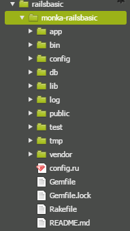

# Ruby on Rails：まとめ

## 目次
 - [Railsのコマンド](#ruby-on-railsのコマンド)
 - [Railsのプロジェクトのディレクトリ構成](#ruby-on-railsのプロジェクトのディレクトリ構成)
 - [ルーティングまとめ](#ルーティングまとめ)
 - [ActionControllerまとめ](#actioncontrollerまとめ)
 - [ActiveRecordまとめ](#activerecordまとめ)
 - [ビューまとめ](#ビューまとめ)

ここでは Ruby on Rails（以降 Rails）の基本的なについてまとめています。  
  
### Railsのコマンド
  
#### コマンドまとめ

|コマンド|説明
|:--|:--|
|rails new アプリ名|アプリ（プロジェクト）を新規作成します|
|rails generate scaffold モデル名|モデルやビュー、コントローラなど多くのリソースを一括で作成します|
|rails genereate model モデル名|モデルを作成|
|rails db:create|DBを作成します|
|rails db:migrate|migrationファイルを利用して、DBを操作します|
|rails server|Railsアプリを起動します|

>**generate** は **g** に省略することが可能です  
例：rails g scaffold モデル名

>**server** は **s** に省略することが可能です  
例：rails s

#### 補足説明

Rails のアプリを新規作成後、アプリを立ち上げるまでの手順は以下の通り。  

```sh
$ rails new アプリケーション名                     # アプリ新規作成
$ rails g scaffold User name:string email:string  # モデル、コントローラー、ビューの作成
$ rails db:create                                 # データベースの作成
$ rails db:migrate                                # データベースにテーブルを作成（マイグレーション）
$ rails s -b 0.0.0.0 -p 8080                      # アプリの起動
```

---

### Rails のプロジェクトのディレクトリ構成

#### ディレクトリ構成まとめ

 

#### 補足説明
  
  - __app__  
      アプリケーション本体が格納されます。  
  
  - __assets__  
      WEB ページ内で使用する image ファイルや、ページのレイアウトに使用する css 、ページの動きを制御する javascript 等が格納されます。  
  
  - __controllers__  
      ユーザアクションを基にアプリを制御する controller が格納されるディレクトリであり、MVC の "C" に相当します。  
  
  - __helpers__  
      「ヘルパーメソッド」と呼ばれるメソッドをまとめたファイルが格納されます。  
      >ヘルパーメソッド
      主に view を記述する際に役立てるメソッド。フォーム要素の生成、文字列や数値の整形するメソッド等、view でよく利用する操作がデフォルトで用意されています。  
      例えば、`link_to`メソッドでは、与えられた引数を元にハイパーリンクを生成することができます。  
      また、独自に使用するヘルパーメソッドを定義することも可能です。
  
  - __models__  
      データの処理全般を管理する model が格納されるディレクトリであり、MVC の "M" に相当します。  
  
  - __views__  
      画面に表示する部分の view が格納されるディレクトリであり、MVC の "V" に相当します。  
  
  - __config__  
      ルーティングを制御する routes.rb 等、Rails アプリの設定に関するファイルが格納されます。  
      >ルーティング
      ブラウザからのリクエスト（URL）をサーバ側の Rails と結びつける仕組み。
  
  - __db__    
      DataBase（DB） のテーブルをアプリ側から操作できるようにした migration（マイグレーション）ファイルや、DB の初期投入データを管理できる seeds.rb 等、DB 関係のファイルが格納されています。  
  
  - __test__  
      テスト関係のファイルが格納されます。  
  
  - __Gemfile__  
    アプリで使用する gem をまとめたファイルであり、gem の種類だけでなく、バージョンや使う環境を限定できます。  
  
---

### ルーティングまとめ

- `config/routes.rb`ファイルで、ルーティング（パス）の設定が可能  

#### 補足説明

`config/routes.rb`ファイルは以下の通り  

```rb
Rails.application.routes.draw do
  
  # resourcesだけで、`index` `show` `new` `create` `edit` `update` `destroy`の
  # 7つのルーティングが設定できるようになっています。

  resources :book

  resources :user do
    member do
      # `/users/(:id)/avatar`というURLが定義され
      # `UsersController#avatar`アクションが呼びだされます。
      get :avatar
    end
    collection do
      # `/users/search`というURLが定義され
      # `UsersController#search`アクションが呼びだされます。
      get :search
    end
  end
  
  # この場合、`index` `show` `new` `create` `confirm`の5つのルーティングを設定しています。
  resources :articles, only: [:index, :new, :create, :show] do
    collection do
      post :confirm
    end
  end
  
  # `/mypage`というURLが定義され
  # `MypageController#index`アクションが呼び出されます。
  get :mypage, to: 'mypage#index'
end
```

---

### ActionControllerまとめ

- `app/controllers/`の配下にあるファイル
- MVC の C（Controller）に相当

#### 補足説明

例として ActionController は以下のようになります。

```rb
class UsersController < ApplicationController
  # `show` `edit` `update` `destroy`の前に set_user を実行
  before_action :set_user, only: [:show, :edit, :update, :destroy]

  # GET /users
  # GET /users.json
  def index
    @users = User.all
  end

  # GET /users/1
  # GET /users/1.json
  def show
  end

  # GET /users/new
  def new
    @user = User.new
  end

  # GET /users/1/edit
  def edit
  end

  # POST /users
  # POST /users.json
  def create
    @user = User.new(user_params)

    respond_to do |format|
      if @user.save
        format.html { redirect_to @user,
        notice: 'User was successfully created.' }
        format.json { render :show, status: :created, location: @user }
      else
        format.html { render :new }
        format.json { render json: @user.errors, status: :unprocessable_entity }
      end
    end
  end

  # PATCH/PUT /users/1
  # PATCH/PUT /users/1.json
  def update
    respond_to do |format|
      if @user.update(user_params)
        format.html { redirect_to @user,
        notice: 'User was successfully updated.' }
        format.json { render :show, status: :ok, location: @user }
      else
        format.html { render :edit }
        format.json { render json: @user.errors, status: :unprocessable_entity }
      end
    end
  end

  # DELETE /users/1
  # DELETE /users/1.json
  def destroy
    @user.destroy
    respond_to do |format|
      format.html { redirect_to users_url,
      notice: 'User was successfully destroyed.' }
      format.json { head :no_content }
    end
  end

  private
    # id を基にユーザー情報を絞り込み、インスタンス変数に代入
    # Use callbacks to share common setup or constraints between actions.
    def set_user
      @user = User.find(params[:id])
    end

    #  User モデルに name カラムと email カラムが保存されるのを許可
    # Never trust parameters from the scary internet, only allow the white list through.
    def user_params
      params.require(:user).permit(:name, :email)
    end
end
```

---

### ActiveRecordまとめ

- Rails に付属する、重要なライブラリの1つ
- MVC の M（Model）に相当

#### 補足説明

代表的なメソッドとしては、以下のものが存在

- __all__
  - レコードを全件取得する  
- __select__
  - カラムを指定し、レコードを取得する
  - 引数の値がカラムとなる  
- __find__
  - 指定したidのレコードを取得する  
  - 引数の値が指定するidとなる  
  - find は該当するデータが見つからない場合、例外（RecordNotFound）が発生する  
- __find_by__
  - 特定のカラムの条件を指定し、該当する1件を取得する  
  - 引数の値が条件となる  
  - find_by は該当するデータが見つからない場合、nil を返す  
- __where__
  - 特定のカラムの条件を指定し、該当する全件を取得する  
  - 引数の値が条件となる  
  - where は該当するデータが見つからない場合、空の`ActiveRecord::Relation`を返す  
- __first__
  - レコードの最初の1件を取得する
  - 引数を渡すと最初の n 件と指定することも可能  
- __last__
  - レコードの最後の1件を取得する  
  - 引数を渡すと最後の n 件と指定することも可能  
- __order__
  - レコードを引数に指定したカラムで並び変える  
  - デフォルトの並び順は昇順（ASC）になっている  
  - 降順（DESC）で並び変える場合は以下の通り
    例：name カラムを基に User モデルを並び替え  
    ```bash
    User.order(name: :DESC)
    ```
- __limit__
  - 特定のレコード件数を取得する  
  - 引数の値が最大取得行数となる  

---

### ビューまとめ

- 画面を表示する際に使用
- MVC の V（View）に相当

#### 補足説明

例としてビューは以下のようになります。  
`<%= %>`や`<% %>`を使うことで HTML の中に Ruby のコードが書けるようになっています。

```html
<p id="notice"><%= notice %></p>

<h1>Users</h1>

<table>
  <thead>
    <tr>
      <th>Name</th>
      <th>Email</th>
      <th colspan="3"></th>
    </tr>
  </thead>

  <tbody>
    <% @users.each do |user| %>
      <tr>
        <td><%= user.name %></td>
        <td><%= user.email %></td>
        <td><%= link_to 'Show', user %></td>
        <td><%= link_to 'Edit', edit_user_path(user) %></td>
        <td><%= link_to 'Destroy', user, method: :delete, data: { confirm: 'Are you sure?' } %></td>
      </tr>
    <% end %>
  </tbody>
</table>

<br>

<%= link_to 'New User', new_user_path %>
```
