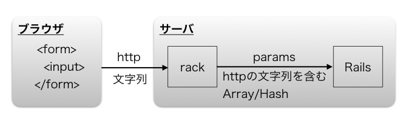

## Ruby on Rails：ECサイトの開発 画像アップロード1

## 目次
+ [画像アップロード機能の追加](#画像アップロード機能の追加)
  + [画像アップロードの流れ](#画像アップロードの流れ)
  + [Railsにおける画像アップロードの概要](#Railsにおける画像アップロードの概要)
  + [Active Storageを利用した画像アップロード](#active-storageを利用した画像アップロード)

<br>

---

## 画像アップロード機能の追加

商品ページに商品の写真を表示するため、画像アップロード機能を追加します。これを実現するために、アプリの管理者が画像をアップロードし、その画像をデザインテンプレートに表示できるようにします。  
ここでは、画像アップロードを簡単に実装できるgem（ライブラリ）を使用する方法で解説を進めていきます。

具体的な流れは以下の通りです。

### 画像アップロードの流れ
1. **画像データをアップロード**  
   管理者がブラウザから画像をアップロードします。このデータはHTTP(またはHTTPS)を通じて送られる

2. **Railsでの画像処理**  
   アップロードされた画像データは、Rails内で画像ファイルとして処理され、サーバーに保存される

3. **画像表示の設定**  
   画像がサーバーに保存された後、その画像をデザインテンプレートに表示できるように変更する。

---

### Railsにおける画像アップロードの概要



+ **ブラウザ 〜 サーバ**
  - ブラウザはHTMLの`form`タグと`input`タグ（`type="file"`）を使って、画像ファイルをサーバーに送信します。
  - `input type="file"`を使うと、ユーザーがファイルを選択できるようになり、そのファイルはバイナリデータとしてサーバーに送信されます。
  - サーバーに送られたファイルデータは、HTTPという形式で送信され、サーバー側では文字列データとして扱われます。

+ **サーバ 〜 Railsのコントローラ**
  - サーバーに到着したデータは、まず`rack`というミドルウェアを通過します。これが、HTTPデータを`Array`や`Hash`の形式に変換します。
  - ファイルデータは、`ActionDispatch::Http::UploadedFile`というオブジェクトに変換され、これによってファイル名、ファイル内容（バイナリデータ）、サイズなどが扱いやすくなります。
  - 最終的に、Railsのコントローラでは、`params`としてファイルデータを受け取り、これを使って画像ファイルを保存することができます。

つまり、ブラウザで選ばれた画像ファイルは、サーバーに送信され、`rack`ミドルウェアを通して整形され、Railsのコントローラで扱いやすい形に変換されます。その後、`params`を通じて画像データを受け取り、保存処理を行うことができます。

---

### Active Storageを利用した画像アップロード

**Active Storage**は**Rails5.2**から利用できる**gem**です。  
簡単に画像や動画などのファイルをアップロードし、クラウドストレージやローカルストレージなどに保存することができます。  

1. **新規プロジェクトの作成**  
    ```sh
    $ rails new storage
    $ cd storage
    ```
    Active Storageを導入するために、新しいRailsプロジェクトを作成します。

1. **マイグレーションファイルの作成**  
      ```sh
      $ rails active_storage:install
      ```
      このコマンドで、`active_storage_blobs` テーブルと `active_storage_attachments` テーブルのマイグレーションファイルが作成されます。

1. **データベースのマイグレーション**  
    ```sh
    $ rails db:migrate
    ```
    作成したマイグレーションファイルの内容をデータベースに反映させます。

1. **雛形の作成**  
    ```sh
    $ rails g scaffold User name:string
    ```
    Userモデルに`name`カラムを設定し、必要なコントローラやビューの雛形を作成します。

1. **モデルのマイグレーション**  
    ```sh
    $ rails db:migrate
    ```
    作成したUserモデルをデータベースに反映させます。

1. **テーブル間の関連付け**  
    ```rb
    # app/models/user.rb
    
    class User < ApplicationRecord
      has_one_attached :photo
    end
    ```
    Userモデルに画像を関連付けるため、`has_one_attached :photo`を追加します。

1. **Strong Parametersの設定**  
    ```rb
    # app/controllers/users_controller.rb
    ・
    ・
    private
    ・
    ・
    def user_params
      params.require(:user).permit(:name, :photo)
    end
    ```
    `photo`フィールドを許可するために、Strong Parametersを設定します。

1. **画像アップロード項目の追加**  
    ```html
    <!-- app/views/users/_form.html.erb -->

    <%= form_with(model: user, local: true) do |form| %>
    ・
    ・
    <div class="field">
        <%= form.label :name %>
        <%= form.text_field :name %>
    </div>

    <div class="field">
        <%= form.file_field :photo %>
    </div>

    <div class="actions">
        <%= form.submit %>
    </div>
    ・
    ・
    <% end %>
    ```
    フォームに画像アップロード用の`file_field`を追加します。

1. **画像の表示**  
    ```html
    <!-- app/views/users/show.html.erb -->
    ・
    ・
    <p>
        <strong>Name:</strong>
        <%= @user.name %>
    </p>

    <p>
        <strong>Photo:</strong>
        <% if @user.photo.attached? %>
        <%= image_tag @user.photo %>
        <% end %>
    </p>
    ・
    ・
    ```
    ユーザー詳細ページに、アップロードした画像を表示する設定を追加します。

※実際に画像をアップロードして確認してみましょう。


