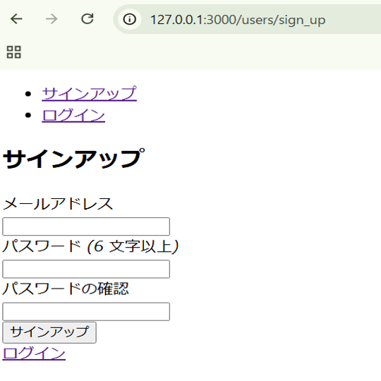
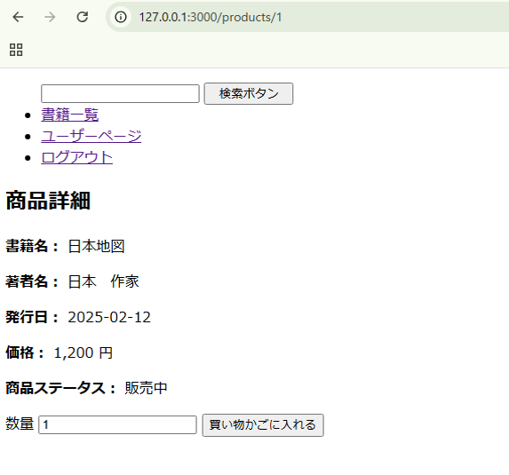
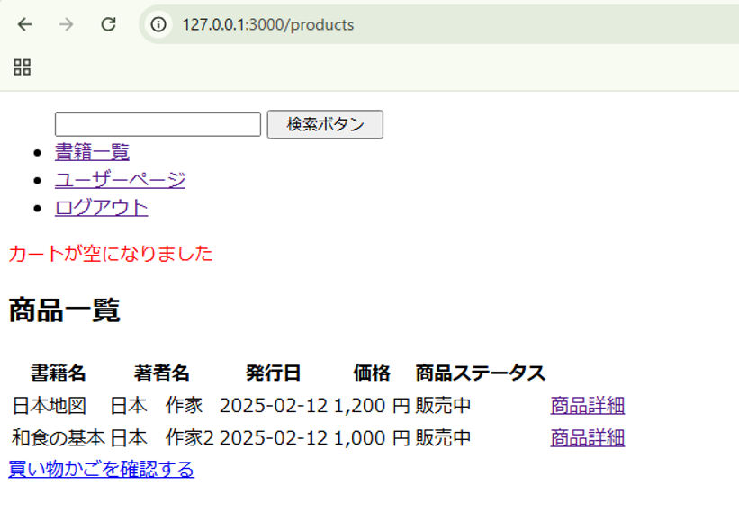

# Ruby on Rails：ECサイト　問題

### 目次
 - [要件](#要件)
 - [実装機能](#実装機能)
 - [実装機能一覧](#実装機能一覧)
 - [ER図](#er図)
 - [テーブル定義](#テーブル定義)
 - [画面イメージ](#画面イメージ)
 - [追加問題](#追加問題)

 

### 作成アプリ：書籍を取り扱うECサイト  

これから書籍を取り扱うECサイトを作成しましょう。  
まずは管理者側とユーザー側のページを作成していきます。  
  
管理者側：商品登録、商品閲覧等  
ユーザー側：ユーザー登録、商品閲覧、商品購入等  
  
詳細な要件は以下に記載しています。
ユーザーが直感的に使いやすく、管理者がスムーズに運用できるようなウェブアプリ開発を目指しましょう。  
  
### 要件  

1. 共通
   + 作成するアプリ名は`ec_site`としてください。  
   + タイムゾーンの設定は`Tokyo`としてください。  
   + ヘッダーにログイン、ログアウトのリンクを表示させてください。
   + ルートパスはユーザー側のログイン画面で設定してください。  

      

1. 管理者側  
   + ログインする場合はURLを直接打ち込んで、管理者用のログイン画面から行うよう設定してください。  
   + 商品の登録、詳細、更新、削除ができるようにしてください。また、商品の画像をアップロードできるようにしてください。  
   + 管理者のログイン認証ができるよう実装してください。  
   + ヘッダーに新規書籍、新規タグ、タグ一覧のリンクを表示させてください。

      
    
1. ユーザー側  
   + ログインしていない場合はログイン画面に遷移するようにしてください。  
   + 未登録の場合、サインアップできるようにしてください。  
   + ログイン、サインアップを行った場合、マイページ画面へ遷移するようにしてください。  
   + メールアドレス、パスワードでユーザーを判定してください。  
   + 商品の一覧、各商品の詳細が確認できるようにしてください。    
   + 商品詳細画面からカートに商品を入れることができるようにしてください。  
   + 商品の注文ができるようにしてください。  
   + カートに入れている商品を削除できるようにしてください。  
   + 商品が検索できるようにしてください。  

       
---

### 実装機能
実装要件を下記に提示されている通りです。  

__【管理者側】__
+ 管理者用メールアドレスとパスワードでログインできること。なお、メールアドレスおよびパスワードは他社に確認されても問題無いものを登録すること。  
（管理者用メールアドレスとパスワードは事前に `seeds.rb` でデータベースへ登録しておく。※1）
+ 書籍について、下記が行えること。
   + 新規追加、編集、閲覧、削除
+ 書籍情報は下記のものを持つこと。
   + 書籍名
   + 著者名
   + 発行日
   + タグ
   + 価格
   + 販売ステータス
+ 会員登録されているユーザ情報の閲覧が行えること。
+ ヘッダには検索窓を配置し、検索できる
+ タグごとに商品が表示できる
    
 

__【ユーザー側】__
+ 顧客はサインアップ、ログイン・ログアウトができること。
+ 会員のログインはメールアドレスとパスワードで行うこと。
+ サイトの閲覧はログインなしで行えないこと。
+ 書籍をカートに入れ、1度に複数書籍の購入ができること。また、カート内の書籍は削除ができること。
+ 会員はマイページでメールアドレスの閲覧が行えること。
+ ヘッダには検索窓を配置し、書籍名で検索できる。
  
 

※1：今回は `seeds.rb` で管理者の情報を登録しているが、`seeds.rb` はコミット、プッシュを行った際、GitHub上に上がる。そのため、独自にアプリ作成を行うなどの時は、環境変数に入れておくことをおすすめする。

---

### 実装機能一覧  

 __【管理者】__
 | No | 機能 | 機能内容 | 非ログイン時使用可否 |
 |:---:|:---|:---|:---:|
 | 1 | ログイン | メールアドレス、パスワードでログインできる。 ログイン時のみ利用できる機能が利用できるようになる。 | 〇 |
 | 2 | ログアウト | ログインしている状態からログアウト状態にする。 ログイン時のみ利用できる機能が利用できなくなる。 | × |
 | 3 | 書籍一覧表示 | 書籍を一覧表示する。 検索結果を表示する場合は、検索条件にあてはまる商品のみ一覧表示する。 | × |
 | 4 | 書籍詳細表示 | 書籍一覧画面で選択した書籍の詳細情報を表示する。 カート追加機能が表示されている。 | × |
 | 5 | 書籍情報編集 | 書籍の登録、更新、削除ができる。 | × |
 | 6 | タグ情報編集 | タグの登録、更新、削除ができる。 | × |

  

 __【ユーザー】__
 | No | 機能 | 機能内容 | 非ログイン時使用可否 |
 |:---:|:---|:---|:---:|
 | 1 | ログイン | メールアドレス、パスワードでログインできる。 ログイン時のみ利用できる機能が利用できるようになる。 | 〇 |
 | 2 | ログアウト | ログインしている状態からログアウト状態にする。 ログイン時のみ利用できる機能が利用できなくなる。 | × |
 | 3 | 書籍一覧表示 | 書籍を一覧表示する。 検索結果を表示する場合は、検索条件にあてはまる商品のみ一覧表示する。 | × |
 | 4 | 書籍詳細表示 | 書籍一覧画面で選択した書籍の詳細情報を表示する。 カート追加機能が表示されている。 | × |
 | 5 | カート追加 | カートに書籍を追加することができる。 | × |
 | 6 | カート一覧 | カートの中を一覧表示することができる。 | × |
 | 7 | カート削除 | カートの中を削除することができる。| × |
 | 8 | 注文 | カートの中を注文することができる。 | × |

 

---

### ER図  

  

 

---

### テーブル定義  

管理者(admin)  

   

ユーザー(users)

   

書籍(books)

   

カート(carts)

   

中間テーブル(書籍とカート)

   

注文(orders)

   

注文詳細(order_details)

    

タグ(tags)

   

中間テーブル(書籍とタグ)

---

### 画面イメージ

#### 管理者側

---

#### ユーザー側

---

### 追加問題
必要な機能が全て実装完了し、時間のある方を対象とした問題になります。  
実装できる機能から行っていきましょう。  

### 追加　実装機能
   + レイアウトを整えること。また、今回はデザインのフレームワークを使用せず、css を用いて整えること。  
   + ユーザー側のログインを名前でできるように変更する。（カラムの追加が必要）
   + ログインしている際、ヘッダーに名前またはメールアドレスを表示させる。  
   + 注文完了時、メールを送信できるようにする。
   + 検索条件にタグを追加して、書籍名と同様に商品が表示できる。
   + 管理者用のメールアドレスとパスワードの登録先をSeedsから環境変数に変更する。ヒント：「rails env」で検索。