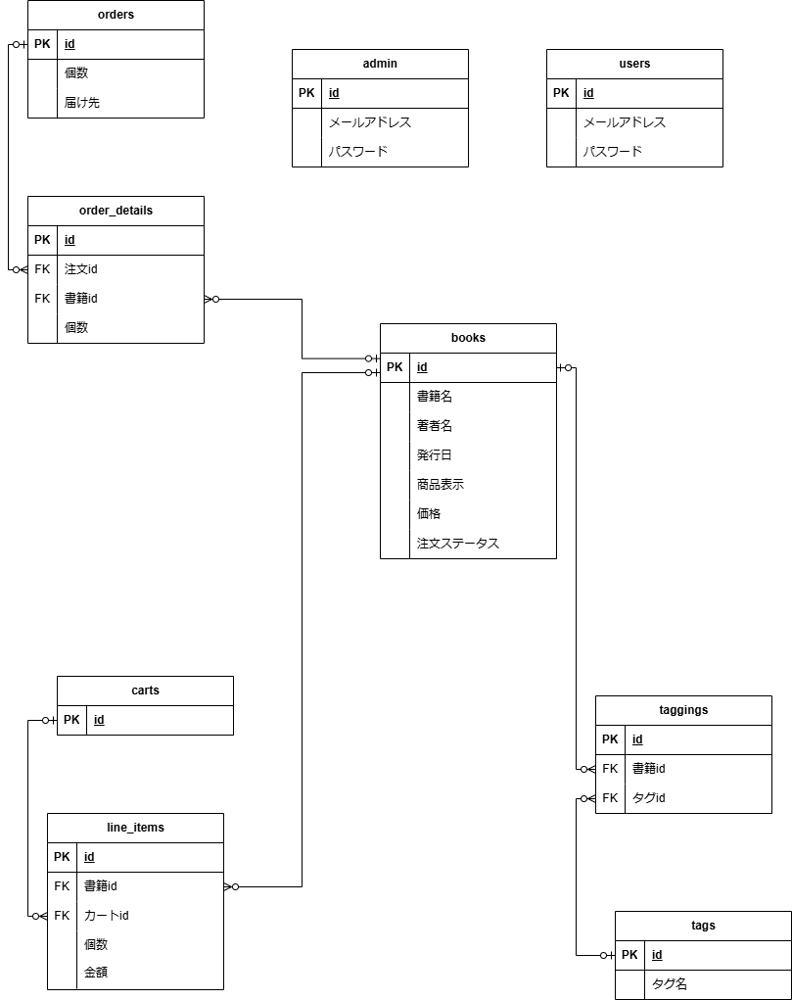

# Ruby on Rails：ECサイト　問題

### 目次
 - [要件](#要件)
 - [実装機能](#実装機能)
 - [実装機能一覧](#実装機能一覧)
 - [ER図](#er図)
 - [テーブル定義](#テーブル定義)

 

 ### 作成アプリ：書籍を取り扱うECサイト  

 管理者側とユーザー側でそれぞれ閲覧等できるよう作成しましょう。  
 作成するアプリ名は`ec_site`としてください。  
 
 
 ### 要件  
 
 1. 管理者側  
    + ログインする場合はURLを直接打ち込んで、管理者用のログイン画面から行うよう設定してください。  
    + 商品の登録、詳細、更新、削除ができるようにしてください。また、商品の画像をアップロードできるようにしてください。  
    + 管理者のログイン認証ができるよう実装してください。  
    + 全体の注文が確認できるようにしてください。  

       
    
 1. ユーザー側  
    + ログインしていない場合はログイン画面に遷移するようにしてください。  
    + 未登録の場合、新規で登録できるようにしてください。  
    + メールアドレス、パスワードをユーザーを判定してください。  
    + 商品の一覧、各商品の詳細が確認できるようにしてください。    
    + 商品の注文ができるようにしてください。  
    + カートに入れている商品を削除できるようにしてください。  
    + 商品が検索できるようにしてください。  

        

 1. 共通
    + タイムゾーンの設定は`Tokyo`としてください。  
    + レイアウトは必須ではありません。時間に余裕のある方のみ取り組んでください。
    + ヘッダーに新規登録、ログイン、ログアウト、

---

### 実装機能
実装要件を下記に提示されている通りです。  

__【管理者側実装機能】__
+ 管理者用メールアドレスとパスワードでログインできること。
（管理者用メールアドレスとパスワードは事前にSeedでデータベースへ登録しておく）
+ 書籍について、下記が行えること。
   + 新規追加、編集、閲覧
+ 書籍情報は下記のものを持つこと。
   + 書籍名
   + 著者名
   + 発行日
   + タグ
   + 価格
   + 販売ステータス
+ 会員登録されているユーザ情報の閲覧が行えること。
+ ユーザの注文履歴が一覧・詳細表示でき、下記の情報が表示されること。
   + 注文履歴一覧
     + 購入日時
     + 購入者
     + 注文個数
   + 注文履歴詳細
     + 購入者
     + 注文日
     + 請求金額
     + 各注文書籍詳細（書籍名、単価、数量、小計）
+ ヘッダには検索窓を配置し、検索できる
+ タグごとに商品が表示できる

 

__【会員側実装機能】__
+ 顧客は会員登録、ログイン・ログアウトができること。
+ 会員のログインはメールアドレスとパスワードで行うこと。
+ 会員がログインしている状態かどうか、ページのヘッダーにメールアドレスを表示して判断できるようにすること。
+ サイトの閲覧はログインなしで行えないこと。
+ 書籍をカートに入れ、1度に複数書籍の購入ができること。また、カート内の書籍は個数変更・削除ができること。
+ 会員はマイページから下記が行えること。
   + ユーザ情報の閲覧・編集
   + 注文履歴の閲覧
+ 注文履歴一覧には下記の情報が表示されること。
   + 注文日
   + 支払金額
+ 注文履歴詳細には下記の情報が表示されること。
   + 注文日
   + 商品の注文内容詳細（商品名、金額、個数、小計）
   + 請求情報（支払金額）
+ 会員登録時、下記の情報をユーザ情報として入力できること。
   + メールアドレス
   + パスワード
+ ヘッダには検索窓を配置し、検索できる。
+ タグごとに商品が表示できる。

---

### 実装機能一覧  

 __【管理者】__
 | No | 機能 | 機能内容 | 非ログイン時使用可否 |
 |:---:|:---|:---|:---:|
 | 1 | ログイン | メールアドレス、パスワードでログインできる。 ログイン時のみ利用できる機能が利用できるようになる。 | 〇 |
 | 2 | ログアウト | ログインしている状態からログアウト状態にする。 ログイン時のみ利用できる機能が利用できなくなる。 | × |
 | 3 | 書籍一覧表示 | 書籍を一覧表示する。 検索結果を表示する場合は、検索条件にあてはまる商品のみ一覧表示する。 | × |
 | 4 | 書籍詳細表示 | 書籍一覧画面で選択した書籍の詳細情報を表示する。 カート追加機能が表示されている。 | × |
 | 5 | 書籍情報編集 | 書籍の登録、更新、削除ができる。 | × |
 | 6 | タグ情報編集 | タグの登録、更新、削除ができる。 | × |

  

 __【ユーザー】__
 | No | 機能 | 機能内容 | 非ログイン時使用可否 |
 |:---:|:---|:---|:---:|
 | 1 | ログイン | メールアドレス、パスワードでログインできる。 ログイン時のみ利用できる機能が利用できるようになる。 | 〇 |
 | 2 | ログアウト | ログインしている状態からログアウト状態にする。 ログイン時のみ利用できる機能が利用できなくなる。 | × |
 | 3 | 書籍一覧表示 | 書籍を一覧表示する。 検索結果を表示する場合は、検索条件にあてはまる商品のみ一覧表示する。 | × |
 | 4 | 書籍詳細表示 | 書籍一覧画面で選択した書籍の詳細情報を表示する。 カート追加機能が表示されている。 | × |
 | 5 | カート追加 | カートに書籍を追加することができる。 | × |
 | 6 | カート一覧 | カートの中を一覧表示することができる。 | × |
 | 7 | カート編集 | カートの中を編集、削除することができる。| × |
 | 8 | 注文 | カートの中を注文することができる。 | × |
 | 9 | 注文完了メール送信 | 注文が完了した後にメールを送信できる。 | × |
 | 10 | 注文履歴一覧表示 | 過去の注文を一覧で確認できる。 | × |
 | 11 | 注文履歴詳細表示 | 注文の詳細を確認できる。 | × |

 

---

### ER図  

  

 

---

### テーブル定義  

管理者(admin)  

   

ユーザー(users)

   

書籍(books)

   

カート(carts)

   

中間テーブル(書籍とカート)

   

注文(orders)

   

注文詳細(order_details)

    

タグ(tags)

   

中間テーブル(書籍とタグ)
