## Ruby on Rails：練習問題

### (1) 新たにアプリを作成して、投稿機能を実装してみましょう。  
__【アプリ作成の条件は以下の通り】__
- アプリ名は`article_practice`で作成してください。

- データベースは下記の表を元に作成してください。

- `rails g model`を使って作成してください。
 
その際、`scaffold`は使用しないでください。

- 投稿一覧ページ、投稿詳細ページ、新規投稿ページ、投稿編集ページを実装してください。

- サーバーを起動後、最初の画面は投稿一覧画面が表示されるようにしてください。
 
困った時は<strong>rails トップページ 設定</strong>で調べてみましょう。

- 投稿一覧ページに投稿詳細ページへのリンクを実装してください。
 
その際、タイトルをクリックすると該当の投稿詳細ページへ遷移するように実装してください。

- 投稿詳細ページには投稿編集ページへのリンク、一覧ページへのリンク、削除ボタンを実装してください

- 削除ボタンは`button_to`メソッドで実装してください。

- 投稿、編集、削除が完了した場合、投稿一覧画面に遷移するように実装してください。

- 新規投稿、投稿編集を行った際は投稿一覧画面でメッセージを緑色で表示してください。
 
また、削除を行った際は投稿一覧画面でメッセージを赤色で表示してください。

- 今回レイアウト調整を行う際は`/app/assets/stylesheets/application.css`に記述してください。
 
class名に縛りはありませんが、現場での活動を想定して内容を把握しやすいclass名にしましょう。
 
例：`width: 90px`の場合、クラス名を`width-90`にする。

 

`Article : 記事テーブル`
| field名 | 名 称 | 型 |
|---|---|---|
| id | ID | integer |
| title | タイトル | string |
| content | 投稿内容 | text |

__【画面イメージ】__
 

#### 投稿一覧画面
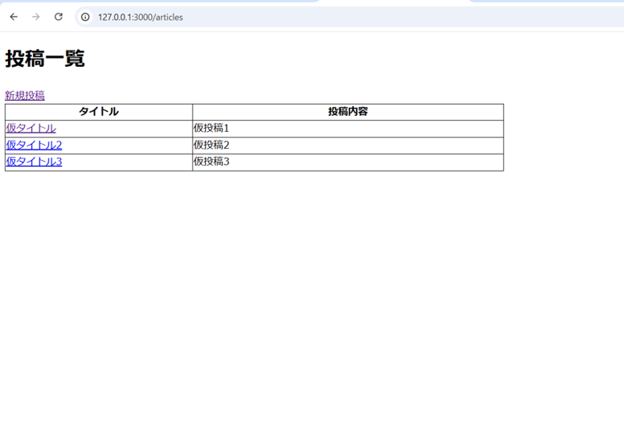
 

#### 新規投稿画面
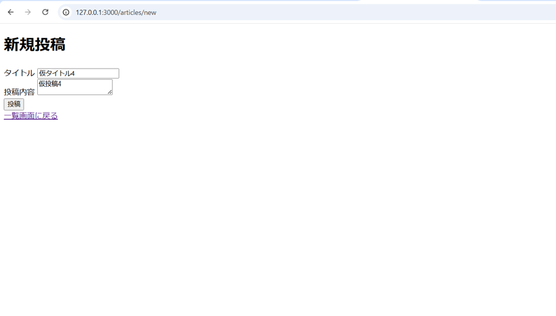
 

#### 投稿完了後
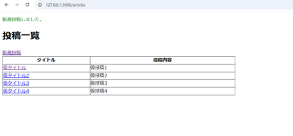
 

#### 投稿詳細画面
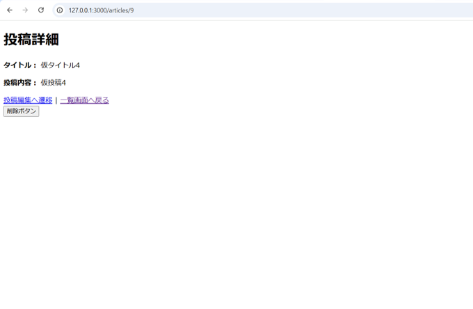
 

#### 投稿編集画面
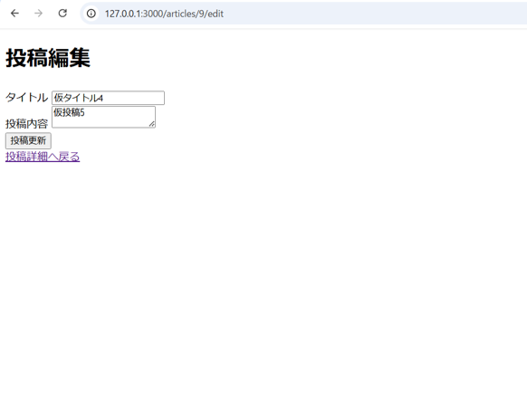
 

#### 編集完了後

 

#### 投稿削除後
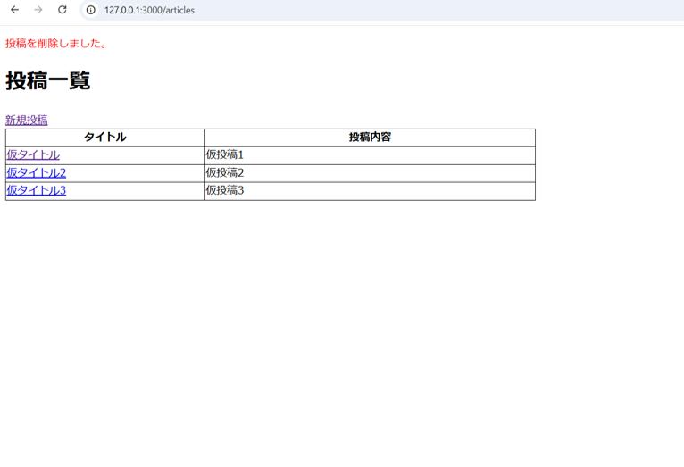

 

### (2) 新たにアプリを作成して、バリデーションを追加しましょう。そのとき、通常のバリデーションとカスタムバリデーションを両方使用してください。
__【アプリ作成の条件は以下の通り】__ 
- アプリ名は`people_lists`で作成してください。

- データベースは下記の表を元に作成してください。

- モデルは以下の表を元に`scaffold`を使用して作成してください。

- `height`と`weight`のエラーメッセージはカスタムメッセージで設定しましょう。
 
分からない時はテキスト`バリデーションとフォームヘルパー.md`を見直してみましょう。

 

`Member : 人物テーブル`
| field名 | 名 称 | 型 | バリデーション |
|---|---|---|---|
| id | ID | integer |  |
| name | 名前 | string | is not null、1文字以上20文字以内、ユニーク |
| height | 身長 | float | is not null、1以上の入力が必要 |
| weight | 体重 | float | is not null、1以上の入力が必要 |

__【画面イメージ】__
 

#### 一覧画面
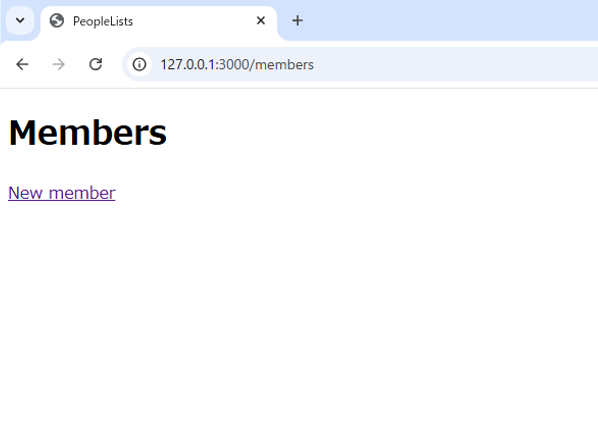
 

#### 登録完了後
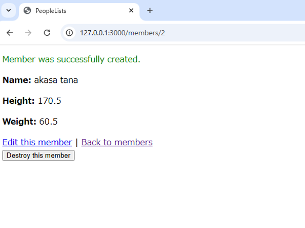
 

#### エラーメッセージ-1
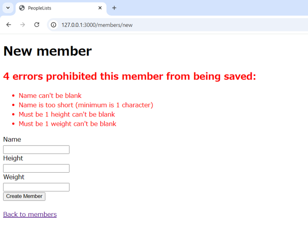
 

#### エラーメッセージ-2
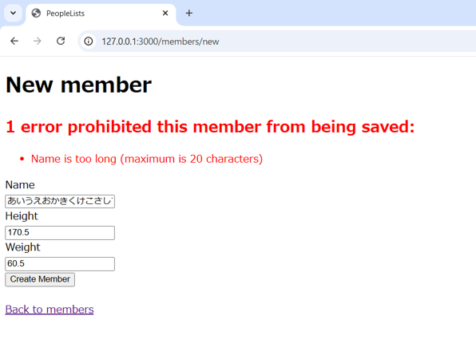

 

### (3) 新しくアプリを作成して`bcrypt`を使ってユーザー認証を行ってみましょう。  
__【アプリ作成の条件は以下の通り】__

- アプリ名は`bcrypt_practice`で作成してください。

- Userモデルを下記の表を元に作成してください。

- トップ画面、サインアップ画面、ログイン画面、マイページ画面の4画面を作成してください。

- サインアップ、ログイン後はmy_pageへ遷移するよう実装してください。

- ログインしているユーザーのみmy_page画面へ遷移できるよう実装してください。

- ログアウト後はtop画面へ遷移するよう実装してください。

- ログインしていないユーザーはtop画面へ遷移するよう実装してください。

 

`User : ユーザーテーブル`
| field名 | 名 称 | 型 |
|---|---|---|
| id | ID | integer |
| name | 名前 | string |
| password_digest | パスワード確認用 | string |

__【画面イメージ】__
 

#### トップ画面
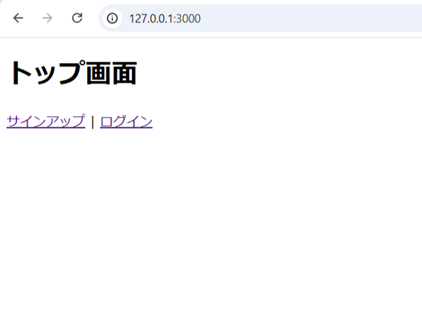

#### サインアップ画面
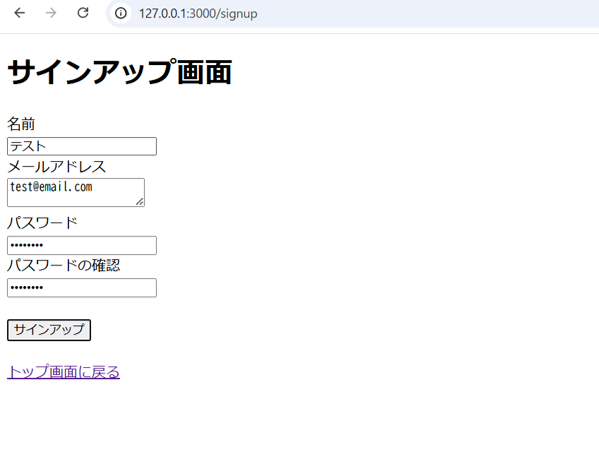

#### ログイン画面
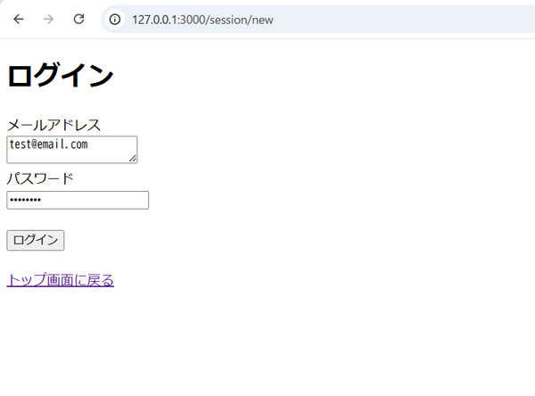

#### マイページ画面
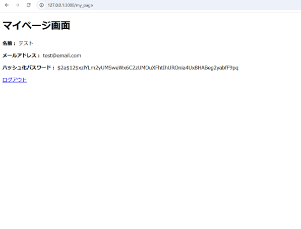

#### ログイン失敗時
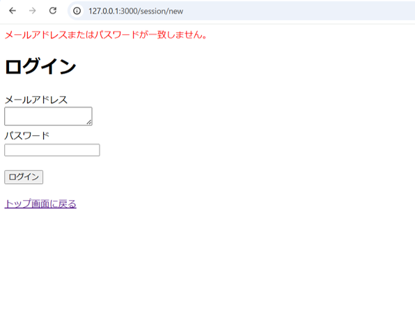

 