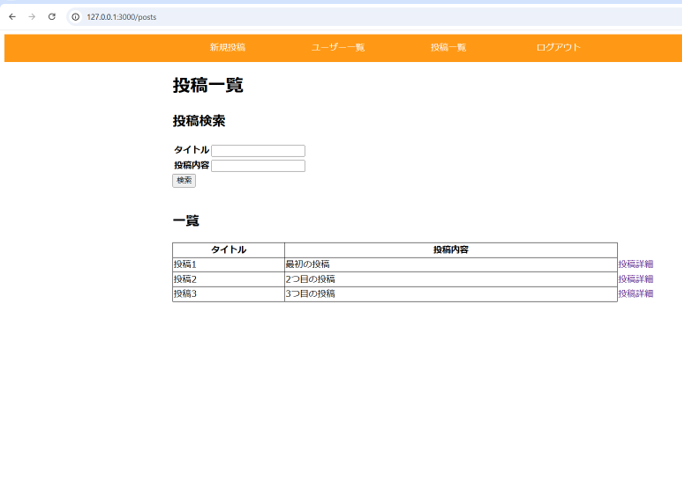
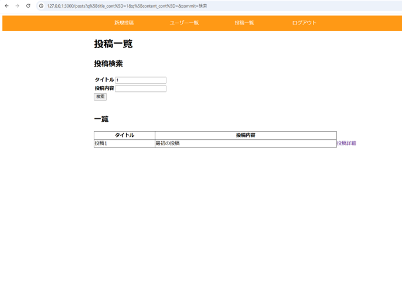
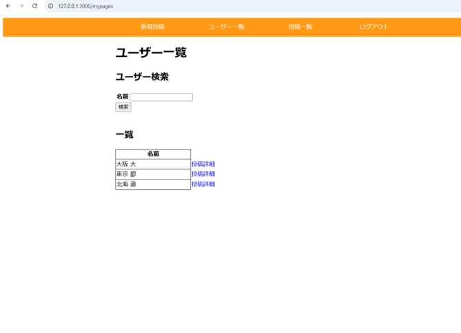
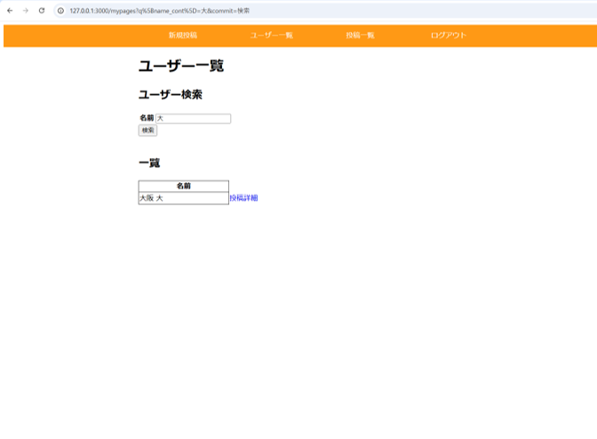
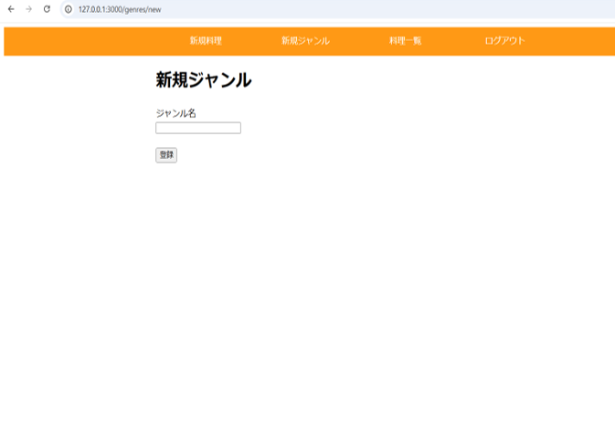
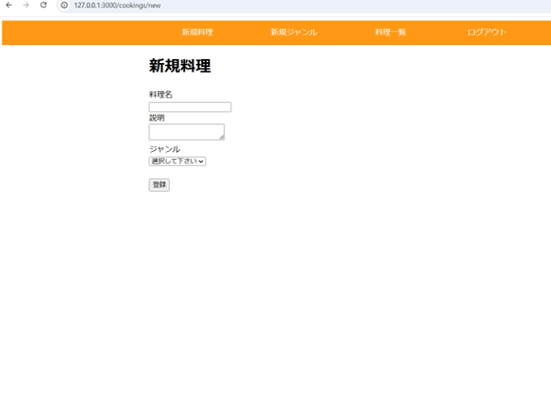
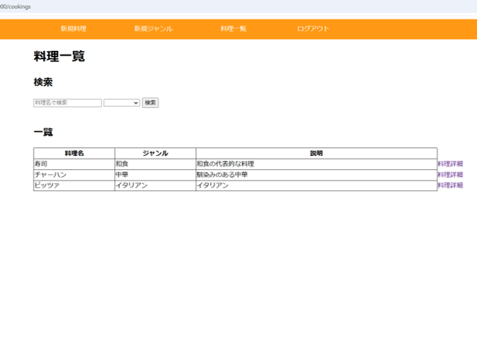
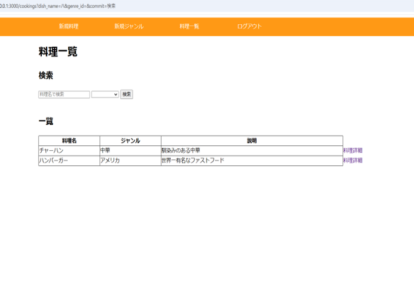
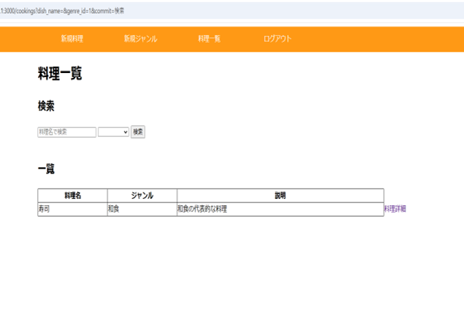
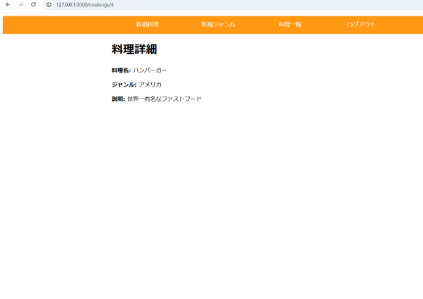

# Ruby on Rails：練習問題　基礎

## 目次

 [基礎問題1](#基礎問題1)　[基礎問題2](#基礎問題2)　[基礎問題3](#基礎問題3)　[基礎問題4](#基礎問題4)　[基礎問題5](#基礎問題5)  
 
 [基礎問題6](#基礎問題6)　[基礎問題7](#基礎問題7)　[基礎問題8](#基礎問題8)

 ※　[Ruby on Rails：練習問題　中級はこちら](#ruby-on-rails練習問題-応用)

### 基礎問題1 
### 新たにアプリを作成して投稿機能を実装してみましょう
__【アプリ作成の条件は以下の通り】__
- アプリ名は`article_practice`で作成してください。

- データベースは下記の表を元に作成してください。

- `rails g model`を使って作成してください。
  その際、`scaffold`は使用しないでください。

- 投稿一覧ページ、投稿詳細ページ、新規投稿ページ、投稿編集ページを実装してください。

- サーバーを起動後、最初の画面は投稿一覧画面が表示されるようにしてください。<br>
  困った時は<strong>rails トップページ 設定</strong>で調べてみましょう。

- 投稿一覧ページに投稿詳細ページへのリンクを実装してください。<br>
  その際、タイトルをクリックすると該当の投稿詳細ページへ遷移するように実装してください。

- 投稿詳細ページには投稿編集ページへのリンク、一覧ページへのリンク、削除ボタンを実装してください

- 削除ボタンは`button_to`メソッドで実装してください。

- 投稿、編集、削除が完了した場合、投稿一覧画面に遷移するように実装してください。

- 新規投稿、投稿編集を行った際は投稿一覧画面でメッセージを緑色で表示してください。<br>
  また、削除を行った際は投稿一覧画面でメッセージを赤色で表示してください。

- 今回レイアウト調整を行う際は`/app/assets/stylesheets/application.css`に記述してください。<br>
  class名に縛りはありませんが、現場での活動を想定して内容を把握しやすいclass名にしましょう。<br>
  例：`width: 90px`の場合、クラス名を`width-90`にする。

<br>

`Article : 記事テーブル`
| field名 | 名 称 | 型 |
|---|---|---|
| id | ID | integer |
| title | タイトル | string |
| content | 投稿内容 | text |

__【画面イメージ】__

#### 投稿一覧画面

<br>

#### 新規投稿画面

<br>

#### 投稿完了後

<br>

#### 投稿詳細画面

<br>

#### 投稿編集画面

<br>

#### 編集完了後

<br>

#### 投稿削除後


<br >

---

### 基礎問題2
### 新たにアプリを作成して、バリデーションを追加しましょう。<br>そのとき、通常のバリデーションとカスタムバリデーションを両方使用してください。
__【アプリ作成の条件は以下の通り】__ 
- アプリ名は`people_lists`で作成してください。

- データベースは下記の表を元に作成してください。

- モデルは以下の表を元に`scaffold`を使用して作成してください。

- `height`と`weight`のエラーメッセージはカスタムメッセージで設定しましょう。
<br>
分からない時はテキスト`バリデーションとフォームヘルパー.md`を見直してみましょう。

<br>

`Member : 人物テーブル`
| field名 | 名 称 | 型 | バリデーション |
|---|---|---|---|
| id | ID | integer |  |
| name | 名前 | string | is not null、1文字以上20文字以内、ユニーク |
| height | 身長 | float | is not null、1以上の入力が必要 |
| weight | 体重 | float | is not null、1以上の入力が必要 |

__【画面イメージ】__

#### 一覧画面

<br>

#### 登録完了後

<br>

#### エラーメッセージ-1

<br>

#### エラーメッセージ-2


<br >

---

### 基礎問題3
### 新しくアプリを作成して`bcrypt`を使ってユーザー認証を行ってみましょう。  
__【アプリ作成の条件は以下の通り】__

- アプリ名は`bcrypt_practice`で作成してください。

- Userモデルを下記の表を元に作成してください。

- トップ画面、サインアップ画面、ログイン画面、マイページ画面の4画面を作成してください。

- サインアップ、ログイン後はマイページ画面へ遷移するよう実装してください。

- ログインしているユーザーのみマイページ画面へ遷移できるよう実装してください。

- ログアウト後はトップ画面へ遷移するよう実装してください。

- ログインしていないユーザーはトップ画面へ遷移するよう実装してください。

<br>

`User : ユーザーテーブル`
| field名 | 名 称 | 型 |
|---|---|---|
| id | ID | integer |
| name | 名前 | string |
| password_digest | ハッシュ化パスワード | string |

__【画面イメージ】__

#### トップ画面


#### サインアップ画面


#### ログイン画面


#### マイページ画面


#### ログイン失敗時


<br >

---

### 基礎問題4
### 新しくアプリを作成しましょう。その際、`Devise`を使ってユーザー認証をしましょう。  
__【アプリ作成の条件は以下の通り】__
- アプリ名は`devise_practice`で作成してください。

- `devise`を使って`User`モデルを作成してください。

- `User`モデル作成時に`email`、`password`のほかにユーザー名(`name`カラム)も追加しましょう。

- トップ画面、サインアップ画面、ログイン画面、マイページ画面の4画面を作成してください。

- サインアップ、ログイン後はマイページ画面へ遷移するよう実装してください。

- ログインしているユーザーのみマイページ画面へ遷移できるよう実装してください。

- ログアウト後はトップ画面へ遷移するよう実装してください。

- ログインしていないユーザーはトップ画面へ遷移するよう実装してください。

`User : ユーザーテーブル`
| field名 | 名 称 | 型 |
|---|---|---|
| id | ID | integer |
| name | 名前 | string |
| email | メールアドレス | string |
| password | パスワード | string |

__【画面イメージ】__

#### トップ画面


#### サインアップ画面


#### ログイン画面


#### マイページ画面

  
<br >

---

### 基礎問題5 
### 投稿型SNSサイトアプリを作成しましょう。  
__【アプリ作成の条件は以下の通り】__
- アプリ名は`sns_site`で作成してください。

- `devise`を使って`User`モデルを作成してください。

- `Post`モデル、`Favorite`モデルは`scaffold`を使用して実装してください。

- ユーザー情報を編集できるようにするため、マイページコントローラーを実装してくだしあ。

- ログイン時は`email`ではなく`name`カラムと`password`を参照してログインできるよう実装してください。

- ログイン後はマイページ画面へ遷移するよう実装してください。

- 名前、自己紹介を編集できるように実装してください。

- ログアウト後はトップ画面へ遷移するよう実装してください。

- ログインしていないユーザーはトップ画面へ遷移するよう実装してください。

- ヘッダーはログインしているかを判定してイメージのように表示を切り替えてください。

- 今回レイアウト調整を行う際は`/app/assets/stylesheets/application.css`に記述してください。

`User : ユーザーテーブル`
| field名 | 名 称 | 型 |
|---|---|---|
| id | ID | integer |
| name | 名前 | string |
| email | メールアドレス | string |
| content | 自己紹介 | text |
| password | パスワード | string |

`Post : 投稿テーブル`
| field名 | 名 称 | 型 |
|---|---|---|
| id | ID | integer |
| title | タイトル | string |
| comment | コメント | text |

`Favorite : お気に入りテーブル`
| field名 | 名 称 | 型 |
|---|---|---|
| id | ID | integer |
| user_id | ユーザーID | integer |
| post_id | 投稿ID | integer |

__【画面イメージ】__

#### トップ画面


#### サインアップ画面


#### ログイン画面


#### マイページ画面


#### 新規投稿画面


#### 投稿一覧画面


#### 投稿詳細画面　お気に入り無し


#### 投稿詳細画面　お気に入り有り


<br >

---

### 基礎問題6
### 画像を投稿できるアプリを作成してみましょう。
__【アプリ作成の条件は以下の通り】__

- アプリ名は`photo_post`で作成してください。

- `User`モデルと`Post`モデルを実装してください。

- `User`モデルでは名前(20文字以内)、アイコン画像を設定できます。

- `Post`モデルではタイトル(20文字以内)、投稿内容(200文字以内)、画像の投稿ができます。

- 初期画面はログイン画面が表示されるよう設定してください。

- ユーザーを新規作成するときはアイコンを設定できます。

- ユーザーはログイン後にマイページへ遷移します。

- ユーザーはマイページでは以下画面へ遷移するボタンもしくはボタンがあります。
    - 投稿一覧画面
    - ユーザー編集画面
    - ログアウトボタン

- マイページではアイコンのサイズを600x600にしてください。

- ユーザー編集画面では以下の変更ができます。
    - 名前の変更
    - アイコンの変更


- 新規投稿ページはタイトル、投稿内容、画像が入力できます。(今回はユーザーと投稿を紐づける必要はありません)

- 新規投稿後は投稿一覧ページへ遷移します。

- 一覧ページの画像のサイズは300x300にしてください。

- 一覧ページから投稿のタイトルを押下すると該当の投稿詳細ページへ遷移します。

- 詳細ページの画像のサイズは600x600にしてください。

- アイコン画像を登録していない場合、マイページで以下の画像`NoImage.png`を表示するようにしてください。


`User : ユーザーテーブル`
| field名 | 名 称 | 型 | バリデーション |
|---|---|---|---|
| id | ID | integer | 無し |
| name | 名前 | string | is not null、20文字以内 |
| avatar | アイコン画像 | string | 無し |


`Post : 投稿テーブル`
| field名 | 名 称 | 型 | バリデーション |
|---|---|---|---|
| id | ID | integer | 無し |
| title | タイトル | string | is not null、20文字以内 |
| content | 投稿内容 | text | 200文字以内 |
| image | 画像 | string | 無し |

__【画面イメージ】__

#### サインアップ画面


#### ログイン画面


#### マイページ画面　画像無し


#### ユーザー編集画面


#### マイページ画面　画像有り


#### 新規投稿画面


#### 投稿一覧画面


#### 投稿詳細画面　画面無し


#### 投稿詳細画面　画面有り


<br >

---

### 基礎問題7 
### Gemを使った検索機能が実装された投稿アプリを作成しましょう。
__【アプリ作成の条件は以下の通り】__
- アプリ名は`search_practice`で作成してください。

- `User`モデルと`Post`モデルを作成してください。

- `User`モデルにはユーザー名とメールアドレス、パスワードを設定しログインできるようにしてください。

- `Post`モデルではタイトル、投稿内容を登録できるようにしてください。

- ユーザー検索のために`mypages_controller.rb`を作成しましょう。

- 画面はサインアップ画面、ログイン画面、ユーザー一覧画面、マイページ画面、新規投稿画面、投稿一覧画面、投稿詳細画面を実装してください。

- `User`モデルはユーザー一覧画面で、`Post`モデルは投稿一覧画面で検索できるようにしてください。

- `seed`内に下記の添付のデータを貼り付けておいてください。

```rb
user1 = User.create(name: '大阪 大', email: 'oosaka@email.com', password: 'password')
user2 = User.create(name: '東京 都', email: 'tokyo@email.com', password: 'password')
user2 = User.create(name: '北海 道', email: 'hokkaido@email.com', password: 'password')

post1 = Post.create(title: '投稿1', content: '最初の投稿', user_id: 1)
post2 = Post.create(title: '投稿2', content: '2つ目の投稿', user_id: 2)
post3 = Post.create(title: '投稿3', content: '3つ目の投稿', user_id: 1)
```

`User : ユーザーテーブル`
| field名 | 名 称 | 型 |
|---|---|---|
| id | ID | integer |
| name | 名前 | string |


`Post : 投稿テーブル`
| field名 | 名 称 | 型 |
|---|---|---|
| id | ID | integer |
| title | タイトル | string |
| content | 投稿内容 | text |

__【画面イメージ】__

#### 投稿一覧画面　検索無し


#### 投稿一覧画面　検索有り


#### ユーザー一覧画面　検索無し


#### ユーザー一覧画面　検索有り


<br>

---

### 基礎問題8
### Gemを使わない検索機能を実装したアプリを作成しましょう。
__【アプリ作成の条件は以下の通り】__
- アプリ名は`no_gem_search_practice`で作成してください。

- `User`モデル、`Cooking`モデル、`Genre`モデルを作成してください。

- `User`モデルはメールアドレス、パスワードを設定しログインできるようにしてください。

- `Cooking`モデルは料理名、説明を登録できるようにしてください。

- `Genre`モデルはジャンル名を登録できるようにしてください。

- 画面はサインアップ画面、ログイン画面、新規料理画面、料理一覧画面、料理詳細画面、新規ジャンル画面を実装してください。

- サインアップ後およびログイン後は料理一覧画面へ遷移してください。

- 新規料理を登録した際は料理詳細画面へ遷移してください。

- 新規ジャンルを登録した際は料理一覧画面へ遷移してください。

- 料理一覧画面で検索できるようにしてください。

- `Cooking`モデルと`Genre`モデルは多対1の関係です。

- 検索できる条件は以下の通りです。
  - 料理名：部分一致検索
  - タグ名：セレクト選択

- 入力なしの場合は全項目が表示されます。

- 新規料理を登録する際、ジャンルはプルダウンで選択できるよう実装してください。以下を必要な箇所にいれてください。
  ```html
  <%= form.collection_select(:genre_id, Genre.all, :id, :genre_name, include_blank: "選択して下さい" ) %>    
  ```

- ジャンルで検索する際はプルダウンで実装してください。以下を必要な箇所にいれてください。
  ```html
  <%= f.collection_select(:genre_id, Genre.all, :id, :genre_name, include_blank: "  " ) %>
  ```


`User : ユーザーテーブル`
| field名 | 名 称 | 型 |
|---|---|---|
| id | ID | integer |

`Cooking : 料理テーブル`
| field名 | 名 称 | 型 |
|---|---|---|
| id | ID | integer |
| title | 料理名 | string |
| content | 説明 | text |
| genre_id | ジャンルID | integer |

`Genre : ジャンルテーブル`
| field名 | 名 称 | 型 |
|---|---|---|
| id | ID | integer |
| genre_name | ジャンル名 | string |

__【画面イメージ】__

#### 新規ジャンル画面


#### 新規料理画面


#### 投稿一覧画面　検索無し


#### 投稿一覧画面　検索有り　料理名


#### 投稿一覧画面　検索有り　ジャンル


#### 料理詳細画面


<br>

---

# Ruby on Rails：練習問題　応用

## 目次

 - [応用問題1](#応用問題1)


### 応用問題1
### おすすめの書籍を共有するアプリを作成しましょう。
__【アプリ作成の条件は以下の通り】__
- アプリ名は`book_sharing`で作成してください。

- `User`モデルと`Book`モデル、`Mailer`を実装してください。

- `Book`モデルではタイトル、書籍内容が登録できます。

- ユーザーは書籍一覧からおすすめしたい書籍の詳細を見ることができます。

- 書籍詳細ページでは共有ボタンを押下し、メール作成ページへ押下します。メール作成ページでは以下が存在します。
  - 入力フォーム
  - 確認ボタン

- 共有ボタン押下後は送信入力ページに遷移して、下記の内容が入力できます。
  - 送信先
  - タイトル
  - 本文

- 件名は以下のように設定します。
  - 「`ログイン中のユーザー名`よりおすすめの書籍をご紹介します」

- 確認ボタン押下後プレビュー画面へ遷移します。プレビュー画面にはプレビューの他に送信ボタンがあります。

- 送信ボタン押下後にメールを送信できるよう実装してください。

<details>
<summary>解答例</summary>

ターミナル
```sh
rails new book_sharing

# Gemfileを編集後
rails g devise:install

# Deviseでモデルの作成
rails g devise User

# Bookモデル、BookRecommendationモデルの作成
rails g scaffold Book title:string content:text user:references
rails g scaffold BookRecommendation book:references sender:references title:string description:text alert_mail_address:string

# Mailerの作成
rails generate mailer BookRecommendationMailer book_email

# マイグレーションファイルを編集してから
rails db:migrate

# コントローラーの作成
rails g devise:controllers Users

# ビューの作成
rails g devise:views
```

---

`/Gemfile`
```gemfile
# 省略

# 追加　ここから
gem 'devise'    

group :development, :test do
  gem 'dotenv-rails'
end
# 追加　ここまで
```

---

`/db/migrate/xxxxxxxxxxxxxx_devise_create_users.rb`
```rb
# frozen_string_literal: true

class DeviseCreateUsers < ActiveRecord::Migration[7.1]
  def change
    create_table :users do |t|
      ## Database authenticatable
      t.string :email,              null: false, default: ""
      t.string :encrypted_password, null: false, default: ""

      t.string :name # 追加

      # 省略

      ## Trackable
      # #を外す　ここから
      t.integer  :sign_in_count, default: 0, null: false
      t.datetime :current_sign_in_at
      t.datetime :last_sign_in_at
      t.string   :current_sign_in_ip
      t.string   :last_sign_in_ip
      # #を外す　ここまで

      # 省略
  end
end
```

---

`/app/models/user.rb`
```rb
class User < ApplicationRecord
  # Include default devise modules. Others available are:
  # :confirmable, :lockable, :timeoutable, :trackable and :omniauthable
  devise :database_authenticatable, :registerable,
         :recoverable, :rememberable, :validatable

  has_many :books # 追加
  has_many :book_recommendations # 追加
end
```

---

`/app/models/book.rb`
```rb
class Book < ApplicationRecord
    belongs_to: user # 追加
    has_many :book_recommendations # 追加
end
```

---

`/app/models/book_recommendation.rb`
```rb
class BookRecommendation < ApplicationRecord
    belongs_to :book 
    belongs_to :user

    validates :description, presence: true # 追加
    validates :alert_mail_address, presence: true # 追加
end
```

---

`/app/mailers/application_mailer.rb`
```rb
class ApplicationMailer < ActionMailer::Base
  layout "mailer"
end
```

---

`/app/mailers/book_recommendation_mailer.rb`
```rb
class BookRecommendationMailer < ApplicationRecord
  # 追加　ここから
  default from: '自分のGmail'

  def book_recommendation(book_recommendation)
    @book = book_recommendation.book
    @user = book_recommendation.user
    @alert_mail_address = book_recommendation.alert_mail_address
    @description = book_recommendation.description
    @subject = "#{@user.name}よりおすすめの書籍をご紹介します"
    
    mail to: @alert_mail_address, subject: @subject
  end
  # 追加　ここまで
end
```

---

`/config/routes.rb`
```rb
Rails.application.routes.draw do
  resources :book_recommendations
  devise_for :users
  
  resources :books do # 追加
    member do # 追加
      get 'share' # 追加
      get 'confirm'  # 追加
      post 'send_mail' # 追加
    end # 追加
  end   # 追加

  root to: 'user'

  # Define your application routes per the DSL in https://guides.rubyonrails.org/routing.html

  # 省略
end

```

---

`/app/controllers/application_controller.rb`
```rb
class ApplicationController < ActionController::Base
  # 追加　ここから
  before_action :configure_permitted_parameters, if: :devise_controller?

  def after_sign_in_path_for(resource)
      books_path
  end

  def after_sign_out_path_for(resource)
      new_user_session_path
  end

  protected

  def configure_permitted_parameters
    devise_parameter_sanitizer.permit(:sign_up, keys: [:email])
  end
  # 追加　ここまで
end
```

---

`/app/views/controllers/books_controllers.rb`
```rb
class BooksController < ApplicationController
  before_action :authenticate_user!, only: [:index, :show, :share, :confirm, :send_mail] # 追加
  before_action :set_book, only: [:show, :share, :confirm, :send_mail] # 変更
  
  # GET /books or /books.json
  def index
    @books = Book.all
  end

  # GET /books/1 or /books/1.json
  def show
  end

  # GET /books/new
  def new
    @book = Book.new
  end

  # POST /books or /books.json
  def create
    @book = Book.new(book_params)
    @book.user_id = current_user.id

    respond_to do |format|
      if @book.save
        format.html { redirect_to @book, notice: "Book was successfully created." }
        format.json { render :show, status: :created, location: @book }
      else
        format.html { render :new, status: :unprocessable_entity }
        format.json { render json: @book.errors, status: :unprocessable_entity }
      end
    end
  end

  # 追加　ここから
  def share
    @book = Book.find(params[:id])
    @book_recommendation = BookRecommendation.new(book: @book)
  end

  def confirm
    @book = Book.find(params[:id])
    @book_recommendation = BookRecommendation.new(book_recommendation_params)
    @book_recommendation.user = current_user

    @alert_mail_address = @book_recommendation.alert_mail_address
    @description = @book_recommendation.description
    @subject = "#{current_user.name}よりおすすめの書籍をご紹介します"
  end


  def send_mail
    @book = Book.find(params[:id])
    @book_recommendation = BookRecommendation.new(book_recommendation_params)
    @book_recommendation.user = current_user
    @book_recommendation.book = @book

    if @book_recommendation.save
      BookRecommendationMailer.book_recommendation(@book_recommendation).deliver
      redirect_to books_path, notice: "メールを送信しました"
    else
      render :share
    end
  end

  # 追加　ここまで

  private
    # Use callbacks to share common setup or constraints between actions.
    def set_book
      @book = Book.find(params[:id])
    end

    # Only allow a list of trusted parameters through.
    def book_params
      params.require(:book).permit(:title, :content)
    end

    # 追加　ここから
    def book_recommendation_params
      params.require(:book_recommendation).permit(:alert_mail_address, :description)
    end
    # 追加　ここまで
end
```
---

`/app/views/book_recommendations_mailer/book_recommendation.html.erb`
```html
<!DOCTYPE html>
<html>
  <head>
    <meta content='text/html; charset=UTF-8' http-equiv='Content-Type' />
  </head>
  <body>
    <h1><%= @subject %></h1>
      <p>
        <%= @description %>
      </p>
  </body>
</html>
```

---

`/app/views/book_recommendations_mailer/book_recommendation_email.text.erb`
```html
<%= @subject %>
===============================================
<%= @description %>
```

---

`/app/views/layouts/application.html.erb`
<!DOCTYPE html>
<html>
  <head>
    <title>BookSharing</title>
    <meta name="viewport" content="width=device-width,initial-scale=1">
    <%= csrf_meta_tags %>
    <%= csp_meta_tag %>

    <%= stylesheet_link_tag "application", "data-turbo-track": "reload" %>
    <%= javascript_importmap_tags %>
  </head>

  <body>
    <!-- 追加　ここから -->
    <header class="header display-f">
      <% if user_signed_in? %>
        <div class="width-200 text-align-c padding-l-15p">
          <%= link_to "新規投稿", new_book_path, class: "color-white" %>
        </div>
        <div class="width-200 text-align-c">
          <%= link_to "書籍一覧", books_path, class: "color-white" %>
        </div>
        <div class="width-200 text-align-c">
          <%= link_to 'ログアウト', destroy_user_session_path, data: { turbo_method: :delete }, class: "color-white" %>
        </div>
      <% else %>
        <div class="width-200 text-align-c padding-l-15p">
          <%= link_to "サインアップ", new_user_registration_path, class: "color-white" %>
        </div>
        <div class="width-200 text-align-c">
          <%= link_to "ログイン", new_user_session_path, class: "color-white" %>
        </div>
      <% end %>
    </header>
    <!-- 追加　ここまで -->
    <%= yield %>
  </body>
</html>
---

`/app/views/devise/registrations/new.html.erb`
```html
<h2>サインアップ</h2> <!-- 編集 -->

<%= form_with model: @user, url: registration_path(resource_name) do |f| %> <!-- 編集 -->
  <%= render "devise/shared/error_messages", resource: resource %>
  
  <!-- 追加　ここから -->
  <div class="field">
    <%= f.label :名前 %><br />
    <%= f.text_field :name, autocomplete: "name" %>
  </div>
  <!-- 追加　ここまで -->

  <div class="field">
    <%= f.label :メールアドレス %><br /> <!-- 編集 -->
    <%= f.email_field :email, autocomplete: "email" %> <!-- 編集 -->
  </div>

  <div class="field">
    <%= f.label :パスワード %> <!-- 編集 -->
    <%= f.password_field :password, autocomplete: "new-password" %>
  </div>

  <div class="field">
    <%= f.label :パスワードの確認 %><br /> <!-- 編集 -->
    <%= f.password_field :password_confirmation, autocomplete: "new-password" %>
  </div>

  <div class="actions">
    <%= f.submit "サインアップ" %> <!-- 編集 -->
  </div>
<% end %>

<%= render "devise/shared/links" %>
```

---

`/app/views/devise/sessions/new.html.erb`
```html
<h2>ログイン</h2> <!-- 編集 -->

<%= form_with model: @user, url: session_path(resource_name) do |f| %>  <!-- 編集 -->
  <div class="field">
    <%= f.label :メールアドレス %><br /> <!-- 編集 -->
    <%= f.email_field :email, autofocus: true, autocomplete: "email" %>
  </div>

  <div class="field">
    <%= f.label :パスワード %><br /> <!-- 編集 -->
    <%= f.password_field :password, autocomplete: "current-password" %>
  </div>

  <% if devise_mapping.rememberable? %>
    <div class="field">
      <%= f.check_box :remember_me %>
      <%= f.label :ログイン状態を保持 %> <!-- 編集 -->
    </div>
  <% end %>

  <div class="actions">
    <%= f.submit "ログイン" %> <!-- 編集 -->
  </div>
<% end %>

<%= render "devise/shared/links" %>
```

---

`/app/views/books/new.html.erb`
```html
<h1>新規書籍</h1> <!-- 変更 -->

<%= render "form", book: @book %>

<br>

<div>
  <%= link_to "書籍一覧へ戻る", books_path %> <!-- 変更 -->
</div>

```

---

`/app/views/books/_form.html.erb`
```html
<%= form_with(model: book) do |form| %>
  <% if book.errors.any? %>
    <div style="color: red">
      <h2><%= pluralize(book.errors.count, "error") %> prohibited this book from being saved:</h2>

      <ul>
        <% book.errors.each do |error| %>
          <li><%= error.full_message %></li>
        <% end %>
      </ul>
    </div>
  <% end %>

  <div>
    <%= form.label :書籍名, style: "display: block" %> <!-- 変更 -->
    <%= form.text_field :title %>
  </div>

  <div>
    <%= form.label :説明, style: "display: block" %> <!-- 変更 -->
    <%= form.text_area :content %>
  </div>

  <div>
    <%= form.submit '登録/更新' %> <!-- 追加 -->
  </div>
<% end %>
```

---

`/app/views/books/index.html.erb`
```html
<p style="color: green"><%= notice %></p>

<h1>書籍一覧</h1> <!-- 変更 -->

<div id="books">
  <% @books.each do |book| %>
    <%= render book %>
    <p>
      <%= link_to "詳細画面", book %> <!-- 変更 -->
    </p>
  <% end %>
</div>

<%= link_to "新規登録", new_book_path %> <!-- 変更 -->
```

---

`/app/views/books/show.html.erb`
```html

<p style="color: green"><%= notice %></p>

<%= render @book %>

<div>
  <%= link_to "Edit this book", edit_book_path(@book) %> | <!-- 削除 -->
  <%= link_to "共有", share_book_path(@book) %> | <!-- 追加 -->
  <%= link_to "書籍一覧へ戻る", books_path %> <!-- 変更 -->

  <%= button_to "Destroy this book", @book, method: :delete %> <!-- 削除 -->
</div>
```

---

`/app/views/_book.html.erb`
```html
<div id="<%= dom_id book %>">
  <p>
    <strong>書籍名:</strong> <!-- 変更 -->
    <%= book.title %>
  </p>

  <p>
    <strong>説明:</strong> <!-- 変更 -->
    <%= book.content %>
  </p>

</div>
```

---

`/app/views/share.html.erb`
```html
<h1><%= @book.title %> をおすすめします</h1>

<%= form_with model: @book_recommendation, url: confirm_book_path(@book), method: :get do |f| %>
  <div>
    <%= f.label :alert_mail_address, '送信先メールアドレス' %>
    <%= f.email_field :alert_mail_address %>
  </div>

  <div>
    <%= f.label :description, 'メッセージ' %>
    <%= f.text_area :description %>
  </div>

  <div>
    <%= f.submit '確認' %>
  </div>
<% end %>
```

---

`/app/views/books/confirm.html.erb`
```html
<h1>メール送信確認</h1>

<p><strong>送信先:</strong> <%= @alert_mail_address %></p>
<p><strong>件名:</strong> <%= @subject %></p>
<p><strong>本文:</strong></p>
<p><%= @description %></p>


<%= form_with model: @book_recommendation, url: send_mail_book_path(@book), method: :post do |f| %>

   <div>
    <%= f.email_field :alert_mail_address %>
  </div>

  <div>
    <%= f.text_area :description %>
  </div>

  <%= f.submit '送信' %>
<% end %>
```

---

`/.env`
```rb
MAIL_USER_NAME="自分のGmail"
MAIL_PASSWORD="自分のパスワード"
```

---

`/config/environment.rb/development.rb`
```rb
require "active_support/core_ext/integer/time"

Rails.application.configure do
  # 省略

  # Don't care if the mailer can't send.
  config.action_mailer.raise_delivery_errors = false
  
  # 追加　ここから
  config.action_mailer.delivery_method = :smtp
  config.action_mailer.smtp_settings = {
    address: 'smtp.gmail.com',
    port: 587,
    domain: 'gmail.com',
    user_name: ENV['MAIL_USER_NAME'],
    password: ENV['MAIL_PASSWORD'],
    authentication: 'plain',
    openssl_verify_mode: 'none',
    enable_starttls_auto: true
  }
  # 追加　ここまで

  # 省略
end

```

</ditails>

<br>

<br>