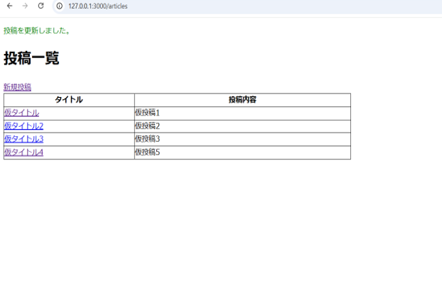
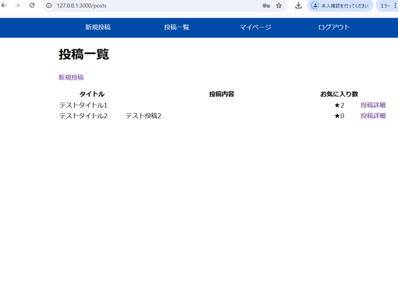

## Ruby on Rails：練習問題

### 目次

 - [問題1](#問題1)
 - [問題2](#問題2)
 - [問題3](#問題3)
 - [問題4](#問題4)
 - [問題5](#問題5)
 - [問題6](#問題6)

### 問題1 
### 新たにアプリを作成して投稿機能を実装してみましょう
__【アプリ作成の条件は以下の通り】__
- アプリ名は`article_practice`で作成してください。

- データベースは下記の表を元に作成してください。

- `rails g model`を使って作成してください。
  その際、`scaffold`は使用しないでください。

- 投稿一覧ページ、投稿詳細ページ、新規投稿ページ、投稿編集ページを実装してください。

- サーバーを起動後、最初の画面は投稿一覧画面が表示されるようにしてください。 
  困った時は<strong>rails トップページ 設定</strong>で調べてみましょう。

- 投稿一覧ページに投稿詳細ページへのリンクを実装してください。 
  その際、タイトルをクリックすると該当の投稿詳細ページへ遷移するように実装してください。

- 投稿詳細ページには投稿編集ページへのリンク、一覧ページへのリンク、削除ボタンを実装してください

- 削除ボタンは`button_to`メソッドで実装してください。

- 投稿、編集、削除が完了した場合、投稿一覧画面に遷移するように実装してください。

- 新規投稿、投稿編集を行った際は投稿一覧画面でメッセージを緑色で表示してください。 
  また、削除を行った際は投稿一覧画面でメッセージを赤色で表示してください。

- 今回レイアウト調整を行う際は`/app/assets/stylesheets/application.css`に記述してください。 
  class名に縛りはありませんが、現場での活動を想定して内容を把握しやすいclass名にしましょう。 
  例：`width: 90px`の場合、クラス名を`width-90`にする。

 

`Article : 記事テーブル`
| field名 | 名 称 | 型 |
|---|---|---|
| id | ID | integer |
| title | タイトル | string |
| content | 投稿内容 | text |

__【画面イメージ】__

#### 投稿一覧画面

 

#### 新規投稿画面

 

#### 投稿完了後

 

#### 投稿詳細画面

 

#### 投稿編集画面

 

#### 編集完了後

 

#### 投稿削除後

 

---

### 問題2
### 新たにアプリを作成して、バリデーションを追加しましょう。 そのとき、通常のバリデーションとカスタムバリデーションを両方使用してください。
__【アプリ作成の条件は以下の通り】__ 
- アプリ名は`people_lists`で作成してください。

- データベースは下記の表を元に作成してください。

- モデルは以下の表を元に`scaffold`を使用して作成してください。

- `height`と`weight`のエラーメッセージはカスタムメッセージで設定しましょう。
 
分からない時はテキスト`バリデーションとフォームヘルパー.md`を見直してみましょう。

 

`Member : 人物テーブル`
| field名 | 名 称 | 型 | バリデーション |
|---|---|---|---|
| id | ID | integer |  |
| name | 名前 | string | is not null、1文字以上20文字以内、ユニーク |
| height | 身長 | float | is not null、1以上の入力が必要 |
| weight | 体重 | float | is not null、1以上の入力が必要 |

__【画面イメージ】__

#### 一覧画面

 

#### 登録完了後

 

#### エラーメッセージ-1

 

#### エラーメッセージ-2

 

---

### 問題3
### 新しくアプリを作成して`bcrypt`を使ってユーザー認証を行ってみましょう。  
__【アプリ作成の条件は以下の通り】__

- アプリ名は`bcrypt_practice`で作成してください。

- Userモデルを下記の表を元に作成してください。

- トップ画面、サインアップ画面、ログイン画面、マイページ画面の4画面を作成してください。

- サインアップ、ログイン後はマイページ画面へ遷移するよう実装してください。

- ログインしているユーザーのみマイページ画面へ遷移できるよう実装してください。

- ログアウト後はトップ画面へ遷移するよう実装してください。

- ログインしていないユーザーはトップ画面へ遷移するよう実装してください。

 

`User : ユーザーテーブル`
| field名 | 名 称 | 型 |
|---|---|---|
| id | ID | integer |
| name | 名前 | string |
| password_digest | ハッシュ化パスワード | string |

__【画面イメージ】__

#### トップ画面

#### サインアップ画面

#### ログイン画面

#### マイページ画面

#### ログイン失敗時

 

---

### 問題4
### 新しくアプリを作成しましょう。その際、`Devise`を使ってユーザー認証をしましょう。  
__【アプリ作成の条件は以下の通り】__
- アプリ名は`devise_practice`で作成してください。

- `devise`を使って`User`モデルを作成してください。

- `User`モデル作成時に`email`、`password`のほかにユーザー名(`name`カラム)も追加しましょう。

- トップ画面、サインアップ画面、ログイン画面、マイページ画面の4画面を作成してください。

- サインアップ、ログイン後はマイページ画面へ遷移するよう実装してください。

- ログインしているユーザーのみマイページ画面へ遷移できるよう実装してください。

- ログアウト後はトップ画面へ遷移するよう実装してください。

- ログインしていないユーザーはトップ画面へ遷移するよう実装してください。

`User : ユーザーテーブル`
| field名 | 名 称 | 型 |
|---|---|---|
| id | ID | integer |
| name | 名前 | string |
| email | メールアドレス | string |
| password | パスワード | string |

__【画面イメージ】__

#### トップ画面

#### サインアップ画面

#### ログイン画面

#### マイページ画面

  
 

---

### 問題5 
### 投稿型SNSサイトアプリを作成しましょう。  
__【アプリ作成の条件は以下の通り】__
- アプリ名は`sns_site`で作成してください。

- `devise`を使って`User`モデルを作成してください。

- `Post`モデル、`Favorite`モデルは`scaffold`を使用して実装してください。

- ユーザー情報を編集できるようにするため、マイページコントローラーを実装してくだしあ。

- ログイン時は`email`ではなく`name`カラムと`password`を参照してログインできるよう実装してください。

- ログイン後はマイページ画面へ遷移するよう実装してください。

- 名前、自己紹介を編集できるように実装してください。

- ログアウト後はトップ画面へ遷移するよう実装してください。

- ログインしていないユーザーはトップ画面へ遷移するよう実装してください。

- ヘッダーはログインしているかを判定してイメージのように表示を切り替えてください。

- 今回レイアウト調整を行う際は`/app/assets/stylesheets/application.css`に記述してください。

`User : ユーザーテーブル`
| field名 | 名 称 | 型 |
|---|---|---|
| id | ID | integer |
| name | 名前 | string |
| email | メールアドレス | string |
| content | 自己紹介 | text |
| password | パスワード | string |

`Post : 投稿テーブル`
| field名 | 名 称 | 型 |
|---|---|---|
| id | ID | integer |
| title | タイトル | string |
| comment | コメント | text |

`Favorite : お気に入りテーブル`
| field名 | 名 称 | 型 |
|---|---|---|
| id | ID | integer |
| user_id | ユーザーID | integer |
| post_id | 投稿ID | integer |

__【画面イメージ】__

#### トップ画面

#### サインアップ画面

#### ログイン画面

#### マイページ画面

#### 新規投稿画面

#### 投稿一覧画面

#### 投稿詳細画面　お気に入り無し

#### 投稿詳細画面　お気に入り有り

 

---

### 問題6
### 画像を投稿できるアプリを作成してみましょう。
__【アプリ作成の条件は以下の通り】__

- アプリ名は`photo_post`で作成してください。

- `User`モデルと`Post`モデルを実装してください。

- `User`モデルでは名前(20文字以内)、アイコン画像を設定できます。

- `Post`モデルではタイトル(20文字以内)、投稿内容(200文字以内)、画像の投稿ができます。

- 初期画面はログイン画面が表示されるよう設定してください。

- ユーザーを新規作成するときはアイコンを設定できます。

- ユーザーはログイン後にマイページへ遷移します。

- ユーザーはマイページでは以下画面へ遷移するボタンもしくはボタンがあります。
    - 投稿一覧画面
    - ユーザー編集画面
    - ログアウトボタン

- マイページではアイコンのサイズを600x600にしてください。

- ユーザー編集画面では以下の変更ができます。
    - 名前の変更
    - アイコンの変更

- 新規投稿ページはタイトル、投稿内容、画像が入力できます。(今回はユーザーと投稿を紐づける必要はありません)

- 新規投稿後は投稿一覧ページへ遷移します。

- 一覧ページの画像のサイズは300x300にしてください。

- 一覧ページから投稿のタイトルを押下すると該当の投稿詳細ページへ遷移します。

- 詳細ページの画像のサイズは600x600にしてください。

- アイコン画像を登録していない場合、マイページで以下の画像`NoImage.png`を表示するようにしてください。

`User : ユーザーテーブル`
| field名 | 名 称 | 型 | バリデーション |
|---|---|---|---|
| id | ID | integer | 無し |
| name | 名前 | string | is not null、20文字以内 |
| avatar | アイコン画像 | string | 無し |

`Post : 投稿テーブル`
| field名 | 名 称 | 型 | バリデーション |
|---|---|---|---|
| id | ID | integer | 無し |
| title | タイトル | string | is not null、20文字以内 |
| content | 投稿内容 | text | 200文字以内 |
| image | 画像 | string | 無し |

__【画面イメージ】__

#### サインアップ画面

#### ログイン画面

#### マイページ画面　画像無し

#### ユーザー編集画面

#### マイページ画面　画像有り

#### 新規投稿画面

#### 投稿一覧画面

#### 投稿詳細画面　画面無し

#### 投稿詳細画面　画面有り

 

---