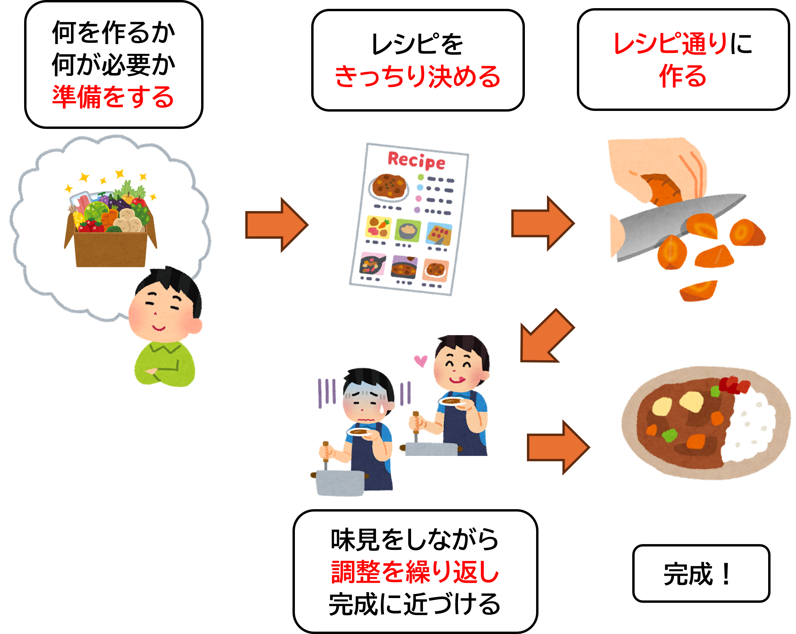
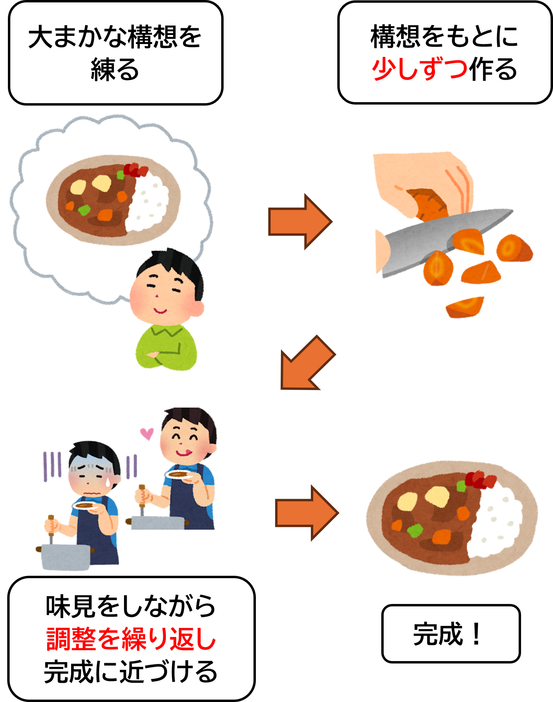
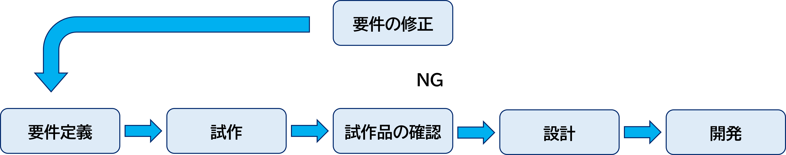
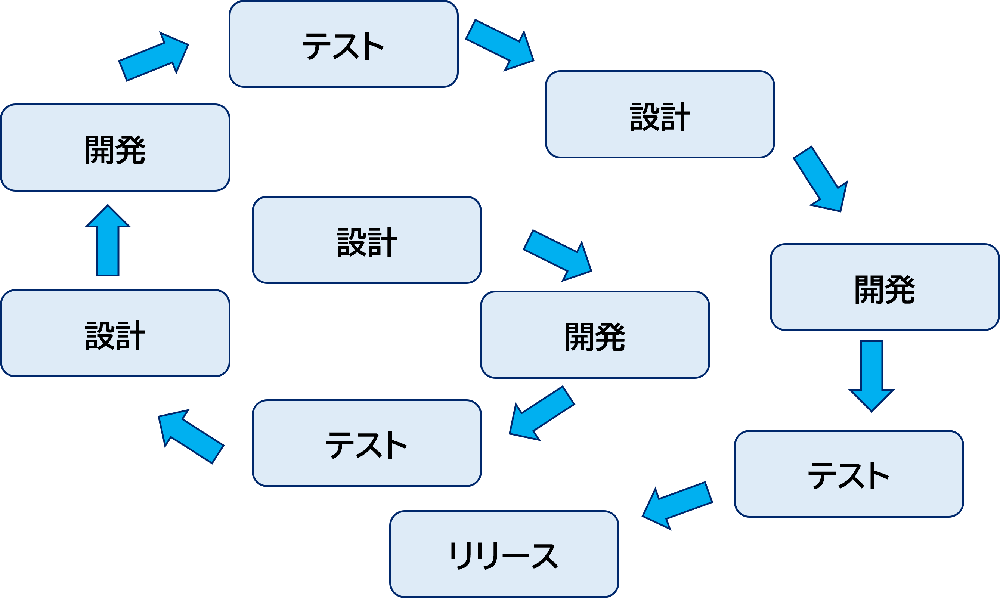
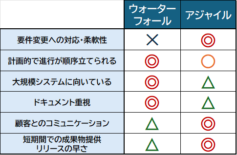

# 1 アジャイル開発基礎
## 目次
+ [システム開発手法](#システム開発手法)
    + [システム開発の目的](#システム開発の目的)
    + [開発手法の種類](#開発手法の種類)
    + [プロジェクトに適した開発手法の選び方](#プロジェクトに適した開発手法の選び方)
+ [上流工程](#上流工程)
    + [企画](#企画)
    + [要件定義](#要件定義)
    + [基本設計](#基本設計)
    + [詳細設計](#詳細設計)
+ [下流工程](#下流工程)
    + [実装](#実装)
    + [テスト](#テスト)
    + [リリース](#リリース)
    + [保守](#保守)

 

---

## システム開発手法

### システム開発の目的

システム開発の目的は、 **「問題を解決するための仕組みを作ること」** です。  
これをもう少し具体的に説明すると、次のような内容と例が含まれます。

1. **問題を解決する**   
    システム開発は、私たちが抱える問題や課題を解決するためのツールを作ることです。

    - **勤怠管理システム**  
    「社員の出勤・退勤時間を紙で管理するのが面倒」という課題を解決するため、出勤時間をデジタルで記録するシステムを作る。
    - **在庫管理システム**  
    「どの商品がどれくらい残っているかがわからない」という問題を解消するため、在庫をリアルタイムで確認できる仕組みを提供する。

1. **作業の効率化**  
    人間が手作業で行っていたことを、システムに任せることで効率化します。  

    - **自動化**  
    繰り返し行う作業（例：データの計算やチェック）を自動で行い、作業時間を短縮。
    - **スピードアップ**  
    必要な情報を瞬時に検索・取得するシステムを作成。

1. **データを管理する**  
    システムを使うことで、データを整理し、必要なときに簡単に取り出せるようになります。
    
    - **書籍管理システム**  
    図書館の本の情報を一元管理して、どの本が貸し出し中かすぐに確認できる。

1. **人や組織をサポートする**  
    システム開発は、人や組織がスムーズに仕事を進めるためのサポートツールを作ることも目指します。  

    - **顧客管理システム**  
    お客様とのやり取りを記録し、より良いサービスを提供できるようにする。

これらを通じて、 **「より便利で快適な生活や仕事の環境を作る」** ことがシステム開発のゴールです。

---

### 開発手法の種類

システム開発にはいくつかの手法がありますが、このテキストでは「**ウォーターフォール開発**」と「**アジャイル開発**」の2つの代表的な手法に焦点を当てます。まずは、アジャイル開発に入る前に、両者の特徴を簡単におさらいしてみましょう。

+ **ウォーターフォール開発**  
    **ウォーターフォール開発**は、各工程（企画、設計、実装、テストなど）を**順番に進めていく方法**です。これはレシピをしっかり固めて料理を作る過程に似ています。

    

    前の工程が完了してから次に進むため、進行中に戻ることが難しく、**初期段階での計画や仕様が非常に重要になります。**

+ **アジャイル開発**

    **アジャイル開発**は、短い期間（スプリント）で**機能を少しずつ作りながら進める方法**です。これは味見をしながら料理を作る過程に似ています。
    
    
    
    要件や仕様は柔軟に変更でき、頻繁に顧客とコミュニケーションをとりながら開発を進めます。これにより、**変化に対応しやすく、早期に価値のある成果物を提供できるのが特徴**です。

#### 【補足】 その他の手法

+ **プロトタイプ開発**  
  初期の試作品を作り、それを元にクライアントからの意見をもらいながら開発を進める方法。  
  

+ **スパイラル開発**  
  各機能を少しずつ作りながら、その都度設計とテストを繰り返す方法。  
  

---

### プロジェクトに適した開発手法の選び方

では、どちらの開発手法を取るのが望ましいのでしょうか。それぞれの手法が推奨される場合を挙げてみます。

+ **ウォーターフォールが推奨される場合**

  | ケース | 例 |
  |------|----|
  | **要件が明確**で、**変更の可能性が低い** | 政府のシステムやインフラ系の開発 |
  | **規模が大きく**、**厳格な管理が必要** | 大企業の大規模システム構築 |
  | **納期やコストが厳密に管理**される必要がある | 契約ベースのプロジェクト |
  | **ドキュメントが重視**される | 引き継ぎが必要な長期運用プロジェクト |

+ **アジャイルが推奨される場合**

  | ケース | 例 |
  |------|----|
  | **要件や仕様が変わる可能性が高い** | スタートアップの新サービス開発 |
  | **顧客と頻繁にコミュニケーション**が取れる | エンドユーザーが近い小規模開発 |
  | **早いリリース**が求められる | 市場投入が重要な競争の激しい分野 |
  | **チームが自主的**で**柔軟に動ける** | 小規模なチームでのプロジェクト |

近年では、初期段階でウォーターフォールを採用して全体の要件を固めた後、各機能の開発にアジャイルを取り入れる「**ハイブリッド開発**」を採用するプロジェクトが増えています。この手法は、両者の利点を組み合わせ、柔軟性と計画性を両立させた開発を可能にします。

--- 

#### ポイント  
+ **要件が明確**で**変化が少ない場合** → **ウォーターフォール**
+ **柔軟に対応しながら進めたい場合**  → **アジャイル**

 

---

## 上流工程

システムを作るにはいくつかのステップがあり、これらの工程は**建築**に似ています。  
システム開発では、**上流工程**と**下流工程**に分けられます。

上流工程は、システムの企画や設計といった、**システム全体の大枠を決める部分**です。  
実際にシステムを作り始める前に、どのように動作させるか、どんな機能が必要かを決めます。

---

### 企画

システム開発の最初のステップが「企画」です。  
ここでは「どんなシステムを作るのか」「なぜ作るのか」を決めます。

#### 企画で考えること

- **誰が使うのか**（ターゲット）
- **どんな課題を解決するのか**
- **最低限どんな機能が必要か**

例えば、「飲食店向けの予約システム」なら以下のようなことを考えます。

| 項目 | 内容 |
|---|---|
| **ターゲット** | 小規模な飲食店のオーナー |
| **課題** | 電話予約の対応が大変 |
| **解決策** | スマホから簡単に予約できるシステム |

---

#### ポイント
- **細かく決めすぎない**（アジャイルでは作りながら調整する）
- **関係者と話し合いながら進める**
- **最低限の機能からスタートする**

 

---

### 要件定義

要件定義とは、「どんなシステムを作るのか」を具体的に決める作業です。  
企画で決めた内容をもとに、クライアント(お客様)と話し合いながら**機能**や**システムの条件**を整理します。  
要件定義をしっかり行うことで、開発の進行がスムーズになります。

---

#### 要件定義の2つの分類

要件定義には、大きく分けて「**機能要件**」と「**非機能要件**」の2種類があります。

1. **機能要件（システムが持つべき機能）**

    システムに必要な機能を具体的に決める部分です。  
    クライアントの要望を**ヒアリング**(聞き取り)し、それを**機能として整理**します。  

    - **例**  
      | 要件カテゴリ | クライアントの要望 |
      |--|---|
      | **検索機能** | 「商品を検索する機能がほしい」 |
      | **認証機能** | 「ログイン機能がほしい」 |
      | **データ自動削除機能** | 「自動で削除する機能がほしい」 |

    これらの機能を定義し、開発の基準にします。

     

1. **非機能要件（システムの機能以外に求める要件）**

    システムの**動作の速さ**や**安全性**など、使い勝手や品質に関する要件を決めます。  

    - **例**  
      | 要件カテゴリ | クライアントの要望　|
      |---|---|
      | **復旧時間**  | 「復旧は当日中にしてほしい」|
      | **速度**     | 「このページは3秒以内に表示するようにしてほしい」 |
      | **対応デバイス** | 「スマホとPCの両方で使えるようにしたい」|
      | **負荷対策**  | 「1万人の同時アクセスに耐えられるようにしたい」  |

    **非機能要件は、システムの使いやすさや安定性に関わる重要なポイントです。**

---

#### 要件定義の進め方

1. クライアントの要望を**ヒアリング**する  

1. 必要な機能を整理し、**「機能要件」としてまとめる**  

1. システムの動作や品質に関する条件を **「非機能要件」として定義する**    

1. 開発チームと確認し、**要件を確定する**  

---

#### ポイント

- 要件定義は、システムを作るための**基本の作業**です。  
  **プロジェクトがうまくいくために、とても大切な部分**です。

- 要件定義をしっかり行うことで、**開発中に誤解や問題が減り、スムーズに進める**ようになります。

- **機能要件**と**非機能要件**の両方を整理し、クライアントと開発チームの考えを**合わせること**が大切です。

- **クライアントの希望をよく聞いて**、それを正しい形でシステムに反映できるようにすることが必要です。

- 要件が決まった後も、開発中に**変更があるかもしれません**。  
  **変更があった場合には、きちんと管理して柔軟に対応すること**が大事です。

 

---

### 基本設計

基本設計は、システム全体の**構造を決める**作業です。この段階では、システムがどのように動作するかを大まかに決め、設計の方向性を定めます。

#### 基本設計のステップ

1. **システム全体の構成を決める**
   - システムがどのように組み合わさって動作するか、全体の設計を考えます。

1. **機能要件をベースに設計**
   - クライアントが求める機能がどのようにシステムで動くかを考えます。

1. **データフローとインターフェースの設計**
   - システム内でデータがどのように流れ、異なる部分がどう連携するかを決めます。

1. **セキュリティ要件を盛り込む**
   - システムの**安全性**を考慮し、どのようにデータを守るかを設計します。

---

#### ポイント

- **全体の構成を明確にする**ことで、システムがどのように動くのかがわかりやすくなります。

- **機能要件を反映させる**ことで、ユーザーが望む動作がしっかり実現できるようになります。

- **データフローやインターフェースの設計**を通じて、システムの中でデータがスムーズにやり取りされるようにします。

- **セキュリティ対策を組み込む**ことで、システムの安全性と信頼性が高まります。

 

---

### 詳細設計

詳細設計は、基本設計で決まった内容をさらに具体的に、**細かく設計する**作業です。実際に開発を始める前に、技術的な部分をはっきりさせて、開発チームが実装できるようにします。

#### 詳細設計のステップ

1. **データベース設計の詳細化**
   - データをどのように保存するかを決めるために、テーブル設計やER図を作成します。

1. **インターフェース設計の詳細化**
   - システム同士がどう連携するかを決めるため、API仕様やデータのフォーマットを明確にします。

1. **画面設計（UI/UX設計）**
   - ユーザーがシステムをどう操作するかを考えて、使いやすい画面を設計します。

1. **処理の詳細設計**
   - 各機能がどんな動きになるのかを具体的に決めて、どんなアルゴリズムや処理の流れにするかを設計します。

1. **テスト設計**
   - システムが正しく動くかを確認するために、テストの内容や方法を設計します。

---

#### ポイント

- **データベース設計を詳細に行う**ことで、データが正しく整理され、効率よく管理できるようになります。

- **インターフェース設計を明確にする**ことで、システム同士がスムーズに連携できるようになります。

- **UI/UX設計を丁寧に行う**ことで、ユーザーが気持ちよく使えるシステムが作れます。

- **処理の詳細設計をしっかり行う**ことで、システムが予想通りに安定して動作します。

- **テストケースを作成して確認する**ことで、システムがきちんと動いているかを確かめることができます。

 

---

## 下流工程

上流工程が終わると、実際に**システムを作り始める下流工程**に進みます。

---

### 実装

実装は、設計に基づいて実際にシステムを作り上げる作業です。コードを書いてシステムを形にしていきます。

#### 実装のステップ

1. **設計書に基づいてコードを書く**  
   - 詳細設計を元に、システムを動作させるためのコードを記述します。

1. **モジュールごとに開発を進める**  
   - 大きなシステムの場合、分割して小さなモジュールごとに開発を進めます。

1. **コードのレビューを実施**  
   - 他の開発者とコードを確認し合い、品質を保ちます。

 

---

### テスト

テストは、システムが要件通りに動作するかを確認するための作業です。バグや不具合を見つけて修正し、システムの品質を保証します。

#### テストのステップ

1. **単体テスト（ユニットテスト）**  
  個々のモジュールや機能が正しく動作するかを確認します。

1. **結合テスト（インテグレーションテスト）**  
  システムの各部分が連携して動作するかを確認します。

1. **総合テスト（E2Eテスト）**  
  システム全体が正しく動作するか、全ての機能が要件通りに動作するかを確認します。

1. **受け入れテスト（UAT）**  
  クライアントがシステムを使用してみて、要件通りに動作しているかを確認します。

 

---

### リリース

リリースは、システムを本番環境に移して、実際にユーザーに使ってもらう段階です。

#### リリースのステップ

1. **本番環境にデプロイ**  
  開発したシステムを本番環境にインストールし、運用を開始します。

1. **リリース後のモニタリング**  
  システムが正常に動作しているか、問題が発生していないかを監視します。

1. **ユーザーサポート**  
  ユーザーからのフィードバックを受けて、必要なサポートや改善を行います。

 

---

### 保守

保守は、システムが運用される中で、**問題の修正**や**機能改善**を行う作業です。システムは使いながら育てていくものであり、システムが長期的に使われ続けるために必要な作業です。運用開始後も改善を重ね、ユーザーのニーズや状況に合わせて進化していきます。

#### 保守のステップ

1. **バグ修正**  
  運用中に発生した問題や不具合を修正します。

1. **機能追加・改善**  
  ユーザーのフィードバックを元に、新しい機能を追加したり、既存の機能を改善します。

1. **セキュリティのアップデート**  
  セキュリティリスクを避けるため、定期的なセキュリティ更新を行います。

 