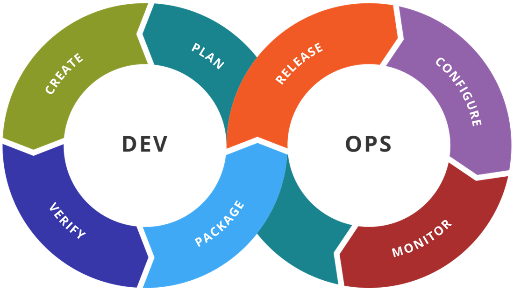

# 1 アジャイル開発基礎
## 目次
+ [DevOps](#devops)
    + [DevOpsの特徴](#DevOpsの特徴)
    + [DevOpsのフェーズ](#DevOpsのフェーズ)
    + [DevOpsを導入するには？](#DevOpsを導入するには)
    + [アジャイル開発とDevOpsの共通点](#アジャイル開発とDevOpsの共通点)
    
 

---

## DevOps

**DevOps（デブオプス）** とは、 **開発（Development）** と **運用（Operations）** を連携させる考え方です。  
従来の開発チームと運用チームが分かれて動くことで発生する、コミュニケーションのギャップや作業の遅延といった問題を解消するために、開発から運用までの一貫したプロセスを重視します。  
DevOpsでは、**チーム全体で継続的に改善を進めること**を目指し、システムをより迅速かつ高品質に提供するための文化や仕組みを作り上げます。

厳密には開発手法ではなく、**開発から運用までのプロセスを効率化するための文化や仕組みの総称**です。  
**自動化ツール** や **継続的インテグレーション（CI）/継続的デリバリー（CD）** などを活用し、**素早く高品質なシステムを提供できる** ようにします。

---

### DevOpsの特徴

- **開発と運用が協力し合う**  
  開発者と運用担当者が**しっかりと協力**して、システムをスムーズにリリースできるようにします。  

- **コードの自動テストとリリース**  
  **コードの変更を自動でテスト**し、問題がないかをチェック。その後、**すぐに新しいバージョンをリリース**できます。  

- **作業の自動化**  
  手作業を減らし、**システム運用をより安定**させることができます。  

- **すぐにフィードバックを得る**  
  システムの動きを**監視したり、ログを分析したりして**、問題があれば早めに修正できます。  

---

### DevOpsのフェーズ

DevOpsは、システムを開発し、運用し続けるための一連の流れを整理したものです。これから紹介するフェーズは、開発から運用までをスムーズに進めるための大切なステップです。

#### （1）**PLAN（計画）**  
この段階では、プロジェクトの全体像を明確にし、どんなシステムを作るのかを計画します。  
- **目標**や**要件**をしっかり決め、チームの役割分担をします。  

- システムを作るための**スケジュール**を立て、必要な**リソース**（予算、時間、人員など）を計画します。  

- 顧客や関係者と意見を交換し、**彼らの要望を反映**させることで、ビジネスニーズを適切に満たすシステムを作成します。  
  → この段階でのコミュニケーションが、その後の開発の品質に大きく影響します。

---

#### （2）**CREATE（作成）**
実際にシステムを開発するフェーズです。
- **コーディング**を行い、システムを作り上げていきます。

- 必要な**機能**を実装し、アプリケーションを設計していきます。

---

#### （3）**VERIFY（検証）**
作成したコードが正しく動くかどうかを確認する段階です。

- **自動テスト**や**手動テスト**を使って、コードがきちんと動くかをチェックします。

- バグがあれば修正し、システムの**品質**を保ちます。

- **テスト環境**で動作確認をして、問題がないか最終チェックをします。

---

#### （4）**PACKAGE（パッケージ）**
コードが正しく動作することが確認できたら、リリースできる形にまとめます。

- アプリケーションを**インストール可能な形**にパッケージ化して、バージョン管理をします。

- これにより、システムの一貫性を保ち、後からの管理がしやすくなります。

---

#### （5）**RELEASE（リリース）**
パッケージ化したシステムを、実際の**本番環境**にリリースします。

- リリースのタイミングを決め、システムを本番環境に**デプロイ**します。

- リリース作業を安全に行うため、**自動化ツール**を使って手順を整えます。

- ユーザーに影響を与えないよう、リリース作業を慎重に行います。

---

#### （6）**CONFIGURE（構成管理）**
システムやインフラの設定や構成を管理するフェーズです。

- **インフラの自動化**を行い、コードや環境設定を一貫して管理します。

- サーバーの設定や**環境変数**を管理し、システム全体の一貫性を保ちます。

- **構成管理ツール**（例：Ansible, Chef, Puppet）を使って、自動化を進めます。

---

#### （7）**MONITOR（監視）**
システムが運用環境で正常に動いているかを監視するフェーズです。

- システムの動きを監視し、**ログ**や**メトリクス**を集めて、異常がないかをチェックします。

- **アラート**を設定して、問題が発生した場合に素早く対応します。

- ユーザーからのフィードバックを収集し、必要に応じてシステムを改善します。

---

#### DevOpsのメリットとデメリット

- **メリット**  
  - **開発、テスト、デプロイメントのスピード向上**  
    システムを**より早くリリース**できるようになります。  

  - **品質の向上**  
    **バグを早く見つけて修正**しやすくなり、システムの安定性が向上します。  

  - **継続的な改善が可能**  
    **ユーザーやシステムからのフィードバック**を素早く反映させ、システムをより良く改善できます。  

- **デメリット**  
  - **導入にコストがかかる**  
    初期の導入にかかるコストや時間が発生します。自動化ツールやインフラ整備のために、一定の投資が必要です。  

  - **組織文化の変革が必要** 
    開発チームと運用チームが密に連携する文化を築く必要があり、従業員が新しい作業スタイルに適応するまで時間がかかる場合があります。  
    特に、チーム間のコミュニケーションの改善や、失敗を受け入れ改善する姿勢が求められます。

---

### DevOpsを導入するには？

1. **プロセスの見直し**  
   - 開発と運用のチームを分けずに、**協力して作業**を進める  
   - システムを**スムーズにリリース**できる流れを作る  

1. **自動化の活用**  
   - **CI/CDパイプライン**を導入して、テストやデプロイを自動化する  
   - インフラの管理も**自動化**し、環境構築の手間を減らす  

1. **組織文化の変革**  
   - チーム同士で**情報共有**を強化し、コミュニケーションを活発にする  
   - 失敗を恐れず、**改善し続ける**姿勢を持つ  

---

### アジャイル開発とDevOpsの共通点

アジャイル開発とDevOpsは、どちらも**ソフトウェア開発プロセスの改善**を目指し、**迅速な価値提供**と**顧客満足度の向上**を重視しています。

- **迅速なリリースと改善**  
  **短期間でのイテレーション**と**効率的なプロセス**を通じて、**迅速にリリース**し、即時の改善を実現する。

- **継続的なフィードバック**  
  **フィードバック**を素早く収集し、次の開発や運用に反映して、システムを改善していく。

- **協力とコミュニケーション**  
  **チーム内**や**開発・運用チーム間**で密な**協力**と**コミュニケーション**を推進し、プロジェクトを円滑に進める。

- **自動化の活用**  
  **自動化テスト**や**CI/CDパイプライン**を活用して、開発・運用プロセスの**効率化**と**品質向上**を図る。

- **価値の最大化**  
  **顧客のニーズ**に基づいて優先順位をつけ、システムの**パフォーマンス**や**機能**を最適化して、**顧客満足**を向上させる。

アジャイル開発とDevOpsを組み合わせることで、**より迅速かつ効率的なソフトウェア開発**が実現され、開発から運用までの流れが一貫してスムーズになります。

---

#### ポイント

- DevOpsは**開発と運用を連携させる考え方**であり、開発手法ではない    

- 自動化や**継続的インテグレーション**により、迅速で高品質な開発が可能    

- 導入には**プロセスの見直し**、自動化、**組織文化の変革**が必要   

- スピードと品質を向上させるため、**継続的な改善**が重要  

#### **用語解説**

- **継続的インテグレーション（CI：Continuous Integration）**  
  開発者が書いたコードを**頻繁に統合**し、自動でテストを行う仕組み。これにより、**バグの早期発見**が可能になり、問題を早い段階で修正できるため、品質が向上する。  
  → **コードの頻繁な統合**は、開発チーム全体で協力しやすくなるため、継続的な改善にもつながる。

- **継続的デリバリー（CD：Continuous Delivery）**  
  CIの結果を受け、**テスト済みのコードを本番環境にリリースできる状態にする**仕組み。  

- **デプロイメント（Deployment）**  
  開発したプログラムを、実際に動作させる環境（本番環境）に**適用する作業**。  

- **CI/CDパイプライン**  
  **CI（継続的インテグレーション）とCD（継続的デリバリー）を自動化する一連の仕組み**。開発からリリースまでのプロセスを効率化する。  

- **インフラの自動化**  
  サーバーやネットワークの設定など、従来手作業で行っていた作業を**コード化して自動管理**すること。  
